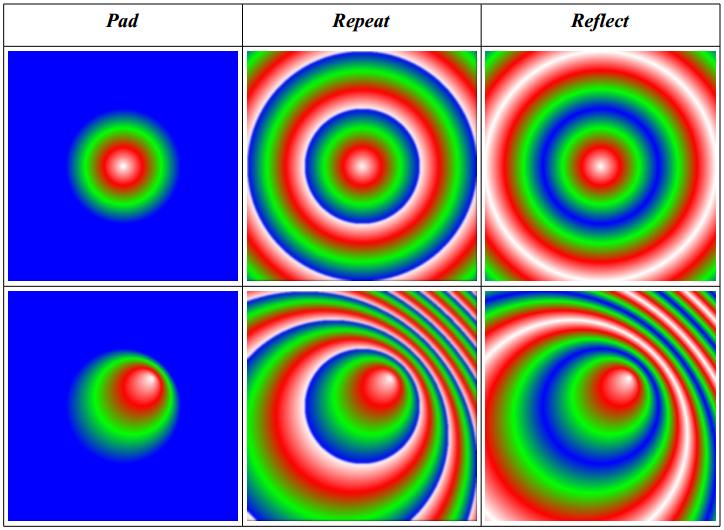
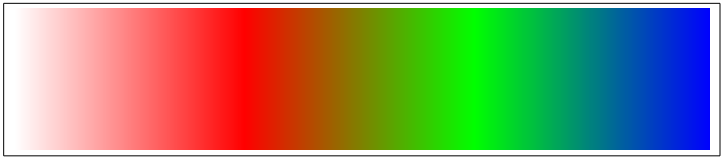
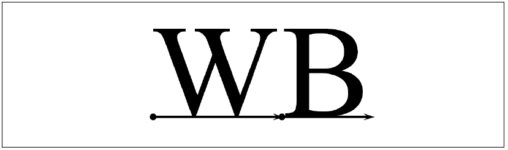
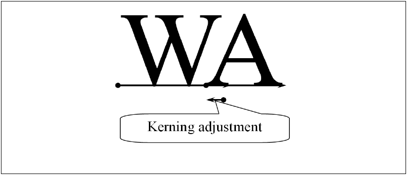
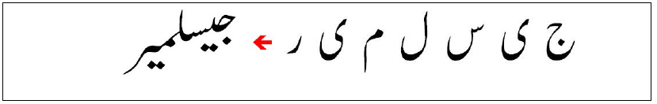
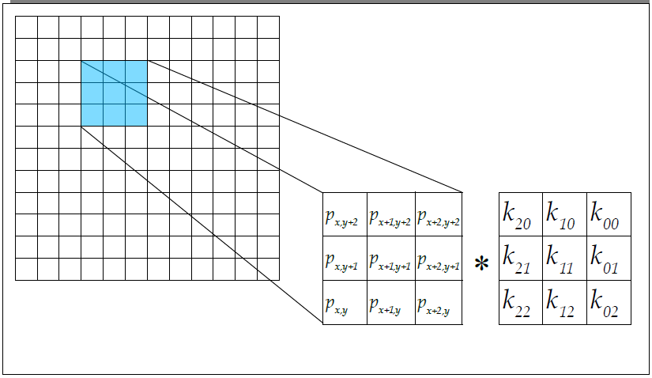
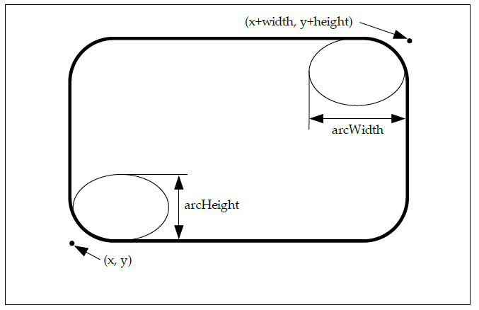
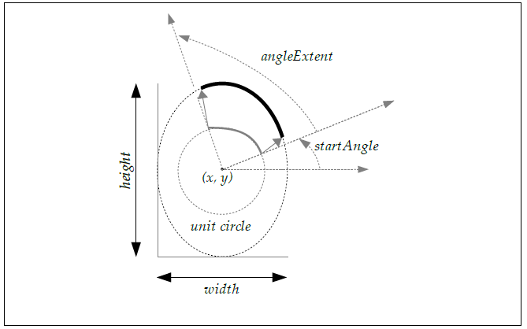

$$v'_{repeat} = v−|v|$$

In reflect mode, the offset value v is mapped to a new value v´ that is guaranteed to liebetween 0 and 1. Following this mapping, the color is defined as for pad mode:

$$
v'_{reflect} =
\begin{cases}
 & v-|v| \text{, if |v| is even }  \\
 & 1-(v-|v|) \text{, if |v| is odd }
\end{cases}
$$

### 9.3.4 Gradient Examples
<a name="Gradient_Examples"></a>

Figure 20 shows a square from (0, 0) to (400, 400) painted with a set of linear gradientswith (x0, y0) = (100, 100), (x1, y1) = (300, 300).

Figure 21 shows the same square painted with radial gradients with centered and noncentered focal points. The centered gradient, shown in the top row, has its center (cx, cy)and focal point (fx, fy) both at (200, 200). The non-centered gradient, shown in thebottom row, has its center (cx, cy) at (200, 200) and its focal point (fx, fy) at (250, 250).The radius r for both gradients is equal to 100.

All the gradients shown in this section utilize a color ramp with stops at offsets 0.0,0.33, 0.66, and 1.0 colored white, red, green, and blue, respectively, as shown in Figure22.


Figure 20: Linear Gradients



Figure 21: Centered and Non-Centered Radial Gradients



Figure 22: Color Ramp used for Gradient Examples

## 9.4 Pattern Paint
<a name="Pattern_Paint"></a>

Pattern paint defines a rectangular pattern of colors based on the pixel values of an image. Images are described below in Section 10. Each pixel (x, y) of the pattern imagedefines a point of color at the pixel center (x + ½, y + ½).

Filtering may be used to construct an interpolated pattern value at the sample point,based on the pattern image pixel values. The pattern tiling mode is used to define valuesfor pixel centers in the pattern space that lie outside of the bounds of the pattern.

Interpolation may be performed between multiple pixels of the pattern image to producean antialiased pattern value. The image quality setting at the time of drawing (determinedby the `VG_IMAGE_QUALITY` parameter) is used to control the quality of patterninterpolation. If the image quality is set `toVG_IMAGE_QUALITY_NONANTIALIASED`, nearest-neighbor interpolation (pointsampling) is used. If the image quality is set to `VG_IMAGE_QUALITY_FASTER` or `VG_IMAGE_QUALITY_BETTER`, higher-quality interpolation will b...(line truncated)...

#### vgPaintPattern
<a name="vgPaintPattern"></a>

The `vgPaintPattern` function replaces any previous pattern image defined on thegiven paint object for the given set of paint modes with a new pattern image. Avalue of `VG_INVALID_HANDLE` for the pattern parameter removes the currentpattern image from the paint object.

If the current paint object has its `VG_PAINT_TYPE` parameter set to `VG_PAINT_TYPE_PATTERN`, but no pattern image is set, the paint object behaves as if `VG_PAINT_TYPE` were set to `VG_PAINT_TYPE_COLOR`.

While an image is set as the paint pattern for any paint object, it may not be used as arendering target. Conversely, an image that is currently a rendering target may not be setas a paint pattern.

```c
void vgPaintPattern(VGPaint paint, VGImage pattern)
```

> **_ERRORS_**
>
> `VG_BAD_HANDLE_ERROR`
> * if paint is not a valid paint handle, or is not shared with the current context
> * if pattern is neither a valid image handle nor equal to `VG_INVALID_HANDLE`, or is not shared with the current context
>
> `VG_IMAGE_IN_USE_ERROR`
> * if pattern is currently a rendering targe

### 9.4.1 Pattern Tiling
<a name="Pattern_Tiling"></a>

Patterns may be extended (tiled) using one of four possible tiling modes, defined by the `VGTilingMode` enumeration.

#### VGTilingMode
<a name="VGTilingMode"></a>

The `VGTilingMode` enumeration defines possible methods for defining colors forsource pixels that lie outside the bounds of the source image.

The `VG_TILE_FILL` condition specifies that pixels outside the bounds of the sourceimage should be taken as the color `VG_TILE_FILL_COLOR`. The color is expressed asa non-premultiplied sRGBA color and alpha value. Values outside the [0, 1] range areinterpreted as the nearest endpoint of the range.

The `VG_TILE_PAD` condition specifies that pixels outside the bounds of the sourceimage should be taken as having the same color as the closest edge pixel of the sourceimage. That is, a pixel (x, y) has the same value as the image pixel (max(0, min(x, width– 1)), max(0, min(y, height – 1))).

The `VG_TILE_REPEAT` condition specifies that the source image should be repeatedindefinitely in all directions. That is, a pixel (x, y) has the same value as the image pixel(x mod width, y mod height) where the operator ‘a mod b’ returns a value between 0 and(b – 1) such that a = k*b + (a mod b) for some integer k.

The `VG_TILE_REFLECT` condition specifies that the source image should be reflectedindefinitely in all directions. That is, a pixel (x, y) has the same value as the image pixel(x’, y’) where:

$$
x' =
\begin{cases}
  & \text{x mod width, if floor(x/width) is even} \\
  & \text{width - 1 - x mod width, otherwise}
\end{cases}
$$

$$
y' =
\begin{cases}
  & \text{y mod height, if floor(y/height) is even} \\
  & \text{height - 1 - y mod height, otherwise}
\end{cases}
$$

```c
typedef enum {
  VG_TILE_FILL = 0x1D00,
  VG_TILE_PAD = 0x1D01,
  VG_TILE_REPEAT = 0x1D02,
  VG_TILE_REFLECT = 0x1D03,
} VGTilingMode;
```

#### Setting the Pattern Tiling Mode

The pattern tiling mode is set using vgSetParameteri with a paramType argument of `VG_PAINT_PATTERN_TILING_MODE`.

```c
VGPaint myFillPaint, myStrokePaint;
VGImage myFillPaintPatternImage, myStrokePaintPatternImage;
VGTilingMode fill_tilingMode, stroke_tilingMode;
vgSetParameteri(myFillPaint, VG_PAINT_TYPE,
VG_PAINT_TYPE_PATTERN);
vgSetParameteri(myFillPaint, VG_PAINT_PATTERN_TILING_MODE,
fill_tilingMode);
vgPaintPattern(myFillPaint, myFillPaintPatternImage);
vgSetParameteri(myStrokePaint, VG_PAINT_TYPE,
VG_PAINT_TYPE_PATTERN);
vgSetParameteri(myStrokePaint, VG_PAINT_PATTERN_TILING_MODE,
stroke_tilingMode);
vgPaintPattern(myStrokePaint, myStrokePaintPatternImage);
```

# 10 Images
<a name="Chapter10"></a>
<a name="Images"></a>

Images are rectangular collections of pixels. Image data may be inserted or extracted in avariety of formats with varying bit depths, color spaces, and alpha channel types. Theactual storage format of an image is implementation-dependent, and may be optimizedfor a given device, but must allow pixels to be read and written losslessly. Images may bedrawn to a drawing surface, used to define paint patterns, or operated on directly byimage filter operations.

## 10.1 Image Coordinate Systems
<a name="Image_Coordinate_Systems"></a>

An image defines a coordinate system in which pixels are indexed using integercoordinates, with each integer corresponding to a distinct pixel. The lower-left pixel hasa coordinate of (0, 0), the x coordinate increases horizontally from left to right, and the ycoordinate increases vertically from bottom to top. Note that this orientation is consistentwith the other coordinate systems used in the OpenVG API, but differs from the top-tobottom orientation used by many other imaging systems.

The “energy” of a pixel is located at the pixel center; that is, the pixel with coordinate (x,y) has its energy at the point (x + ½, y + ½). The color at a point not located at a pixelcenter may be defined by applying a suitable filter to the colors defined at a set of nearbypixel centers.

## 10.2 Image Formats
<a name="Image_Formats"></a>

#### VGImageFormat
<a name="VGImageFormat"></a>

The VGImageFormat enumeration defines the set of supported pixel formats and colorspaces for images:

```c
typedef enum {
	/* RGB{A,X} channel ordering */
	VG_sRGBX_8888 = 0,
	VG_sRGBA_8888 = 1,
	VG_sRGBA_8888_PRE = 2,
	VG_sRGB_565 = 3,
	VG_sRGBA_5551 = 4,
	VG_sRGBA_4444 = 5,
	VG_sL_8 = 6,
	VG_lRGBX_8888 = 7,
	VG_lRGBA_8888 = 8,
	VG_lRGBA_8888_PRE = 9,
	VG_lL_8 = 10,
	VG_A_8 = 11,
	VG_BW_1 = 12,
	VG_A_1 = 13,
	VG_A_4 = 14,
	/* {A,X}RGB channel ordering */
	VG_sXRGB_8888 = 0 | (1 << 6),
	VG_sARGB_8888 = 1 | (1 << 6),
	VG_sARGB_8888_PRE = 2 | (1 << 6),
	VG_sARGB_1555 = 4 | (1 << 6),
	VG_sARGB_4444 = 5 | (1 << 6),
	VG_lXRGB_8888 = 7 | (1 << 6),
	VG_lARGB_8888 = 8 | (1 << 6),
	VG_lARGB_8888_PRE = 9 | (1 << 6),
	/* BGR{A,X} channel ordering */
	VG_sBGRX_8888 = 0 | (1 << 7),
	VG_sBGRA_8888 = 1 | (1 << 7),
	VG_sBGRA_8888_PRE = 2 | (1 << 7),
	VG_sBGR_565 = 3 | (1 << 7),
	VG_sBGRA_5551 = 4 | (1 << 7),
	VG_sBGRA_4444 = 5 | (1 << 7),
	VG_lBGRX_8888 = 7 | (1 << 7),
	VG_lBGRA_8888 = 8 | (1 << 7),
	VG_lBGRA_8888_PRE = 9 | (1 << 7),
	/* {A,X}BGR channel ordering */
	VG_sXBGR_8888 = 0 | (1 << 6) | (1 << 7),
	VG_sABGR_8888 = 1 | (1 << 6) | (1 << 7),
	VG_sABGR_8888_PRE = 2 | (1 << 6) | (1 << 7),
	VG_sABGR_1555 = 4 | (1 << 6) | (1 << 7),
	VG_sABGR_4444 = 5 | (1 << 6) | (1 << 7),
	VG_lXBGR_8888 = 7 | (1 << 6) | (1 << 7),
	VG_lABGR_8888 = 8 | (1 << 6) | (1 << 7),
	VG_lABGR_8888_PRE = 9 | (1 << 6) | (1 << 7)
} VGImageFormat;
```

The letter A denotes an alpha (α) channel , R denotes red, G denotes green, and Bdenotes blue. X denotes a padding byte that is ignored. L denotes grayscale, and BWdenotes (linear) bi-level grayscale (black-and-white), with 0 representing black and 1representing white in either case. A lower-case letter s represents a non-linear,perceptually-uniform color space, as in sRGB and sL; a lower-case letter l represents alinear color space using the sRGB primaries. Formats with a suffix of _PRE store pixelvalues i...(line truncated)...

Bit 6 of the numeric values of the enumeration indicates the position of the alpha channel(or unused byte for formats that do not include alpha). If bit 6 is disabled, the alpha orunused channel appears as the last channel, otherwise it appears as the first channel. Bit 7indicates the ordering of the RGB color channels. If bit 7 is disabled, the color channelsappear in RGB order, otherwise they appear in BGR order.

The VG_A_8 format is treated as though it were VG_lRGBA_8888, withR=G=B=1. Color information is discarded when placing an RGBA value into aVG_A_8 pixel.

Abbreviated names such as lL or sRGBA_PRE are used in this document where theexact number of bits per channel is not relevant, such as when pixel values areconsidered to have been remapped to a [0, 1] range. Such abbreviated names are not anofficial part of the API.

The bits for each color channel are stored within a machine word representing a singlepixel from left to right (MSB to LSB) in the order indicated by the pixel format name.For example, in a pixel with a format of VG_sRGB_565, the bits representing the redchannel may be obtained by shifting right by 11 bits (to remove 6 bits of green and 5 bitsof blue) and masking with the 5-bit wide mask value 0x1f. Note that this definition isindependent of the endianness of the underlying platform as sub-word memory addre...(line truncated)...

Table 11 summarizes the symbols used in image format names.

Table 12 lists the size of a single pixel for each image format, in terms of bytes and bits.Note that all formats other than VG_BW_1, VG_A_1, and VG_A_4 use a whole numberof bytes per pixel.

Formats having linear-light coding (`VG_lRGBX_8888`, `VG_lRGBA_8888`,`VG_lRGBA_8888_PRE`, and `VG_lL8`) are liable to exhibit banding (or contouring)artifacts when viewed with a contrast ratio greater than about 10:1 [POYN03] and areintended mainly for inputting existing linearly-coded imagery. For high-quality imaging,consider using one of the non-linear, perceptually uniform image formats such asVG_sRGBX_8888, VG_sRGBA_8888, VG_sRGBA_8888_PRE, and VG_sL_8.

|Symbol|Interperetation|
|-----|-----|
|A|Alpha channel|
|R|Red color channel|
|G|Green color channel|
|B|Blue color channel|
|X|Uninterpreted padding byte|
|L|Grayscale|
|BW|1-bit Black and White|
|l|Linear color space|
|s|Non-linear (sRGB) color space|
|PRE|Alpha values are premultiplied|

|Format|Bytes Per Pixel|Bits Per Pixel|
|-----|-----|----|
|VG_sRGBX_8888|4|32|
|VG_sRGBA_8888|4|32|
|VG_sRGBA_8888_PRE|4|32|
|VG_sRGB_565|2|16|
|VG_sRGBA_5551|2|16|
|VG_sRGBA_4444|2|16|
|VG_sL_8|1|8|
|VG_lRGBX_8888|4|32|
|VG_lRGBA_8888|4|32|

|Format|Bytes Per Pixel|Bits Per Pixel|
|-----|-----|-----|
|VG_lRGBA_8888_PRE|4|32|
|VG_lL_8|1|8|
|VG_A_1|n/a|1|
|VG_A_4|n/a|4|
|VG_A_8|1|8|
|VG_BW_1|n/a|1|

## 10.3 Creating and Destroying Images
<a name="Creating_and_Destroying_Images"></a>

#### VGImage
<a name="VGImage"></a>

Images are accessed using opaque handles of type VGImage.

```c
typedef VGHandle VGImage;
```

#### VGImageQuality
<a name="VGImageQuality"></a>

The `VGImageQuality` enumeration defines varying levels of resamplingquality to be used when drawing images.

The `VG_IMAGE_QUALITY_NONANTIALIASED` setting disables resampling;images are drawn using point sampling (also known as nearest-neighborinterpolation) only. `VG_IMAGE_QUALITY_FASTER` enables low-to-mediumquality resampling that does not require extensive additional resource allocation. `VG_IMAGE_QUALITY_BETTER` enables high-quality resampling that may allocateadditional memory for pre-filtering, tables, and the like. Implementations are notrequired to provide three distinct resampling algorithms, but the non...(line truncated)...

```c
typedef enum {
	VG_IMAGE_QUALITY_NONANTIALIASED = (1 << 0),
	VG_IMAGE_QUALITY_FASTER = (1 << 1),
	VG_IMAGE_QUALITY_BETTER = (1 << 2)
} VGImageQuality;
```

Use vgSeti with a parameter type of `VG_IMAGE_QUALITY` to set the filter type to beused for image drawing:

```c
VGImageQuality quality;
vgSeti(VG_IMAGE_QUALITY, quality);
```

#### VG_MAX_IMAGE_WIDTH
<a name="VG_MAX_IMAGE_WIDTH"></a>

The `VG_MAX_IMAGE_WIDTH` read-only parameter contains the largest legal valueof the width parameter to the vgCreateImage and vgCreateMask functions. Allimplementations must define `VG_MAX_IMAGE_WIDTH` to be an integer no smallerthan 256. If there is no implementation-defined limit, a value of `VG_MAXINT` may bereturned. The value may be retrieved by calling vgGeti:

```c
VGint imageMaxWidth = vgGeti(VG_MAX_IMAGE_WIDTH);
```

#### VG_MAX_IMAGE_HEIGHT
<a name="VG_MAX_IMAGE_HEIGHT"></a>

The `VG_MAX_IMAGE_HEIGHT` read-only parameter contains the largest legal valueof the height parameter to the vgCreateImage and vgCreateMask functions. Allimplementations must define `VG_MAX_IMAGE_HEIGHT` to be an integer no smallerthan 256. If there is no implementation-defined limit, a value of `VG_MAXINT` may bereturned. The value may be retrieved by calling vgGeti:

```c
VGint imageMaxHeight = vgGeti(VG_MAX_IMAGE_HEIGHT);
````

#### VG_MAX_IMAGE_PIXELS
<a name="VG_MAX_IMAGE_PIXELS"></a>

The `VG_MAX_IMAGE_PIXELS` read-only parameter contains the largest legal valueof the product of the width and height parameters to the vgCreateImage andvgCreateMask functions. All implementations must define `VG_MAX_IMAGE_PIXELS` to be an integer no smaller than 65536. If there is no implementation-defined limit, avalue of VG_MAXINT may be returned. The value may be retrieved by calling vgGeti:

```c
VGint imageMaxPixels = vgGeti(VG_MAX_IMAGE_PIXELS);
```

#### VG_MAX_IMAGE_BYTES
<a name="VG_MAX_IMAGE_BYTES"></a>

The `VG_MAX_IMAGE_BYTES` read-only parameter contains the largest number of bytes that may make up the image data passed to the vgCreateImage function. Allimplementations must define `VG_MAX_IMAGE_BYTES` to be an integer no smaller than65536. If there is no implementation-defined limit, a value of `VG_MAXINT` may bereturned. The value may be retrieved by calling vgGeti:

```c
VGint imageMaxBytes = vgGeti(VG_MAX_IMAGE_BYTES);
```

#### vgCreateImage
<a name="vgCreateImage"></a>

vgCreateImage creates an image with the given width, height, and pixel formatand returns a `VGImage` handle to it. If an error occurs, `VG_INVALID_HANDLE` isreturned. All color and alpha channel values are initially set to zero. The formatparameter must contain a value from the `VGImageFormat` enumeration.

The allowed Quality parameter is a bitwise OR of values from the `VGImageQuality` enumeration, indicating which levels of resampling quality may beused to draw the image. It is always possible to draw an image using the `VG_IMAGE_QUALITY_NONANTIALIASED` quality setting even if it is not explicitlyspecified.

```c
VGImage vgCreateImage(VGImageFormat format,
      VGint width, VGint height,
      VGbitfield allowedQuality)
```

> **_ERRORS_**
>
> `VG_UNSUPPORTED_IMAGE_FORMAT_ERROR`
> * if format is not a valid value from the `VGImageFormat` enumeration
>
> `VG_ILLEGAL_ARGUMENT_ERROR`
> * if width or height are less than or equal to 0
> * if width is greater than `VG_MAX_IMAGE_WIDTH`
> * if height is greater than `VG_MAX_IMAGE_HEIGHT`
> * if width*height is greater than `VG_MAX_IMAGE_PIXELS`
> * if width\*height\*(pixel size of format) is greater than
>
> `VG_MAX_IMAGE_BYTES`
> * if `allowedQuality` is not a bitwise OR of values from the `VGImageQuality` enumeration

#### vgDestroyImage
<a name="vgDestoryImage"></a>

The resources associated with an image may be deallocated by callin `vgDestroyImage`. Following the call, the image handle is no longer valid in anycontext that shared it. If the image is currently in use as a rendering target, is theancestor of another image (see `vgChildImage`), is set as a paint pattern image ona VGPaint object, or is set as a glyph an a VGFont object, its definition remainsavailable to those consumers as long as they remain valid, but the handle may nolonger be used. When those uses cea...(line truncated)...

```c
void vgDestroyImage(VGImage image);
```

> **_ERRORS_**
>
> `VG_BAD_HANDLE_ERROR`
> * if image is not a valid image handle, or is not shared with the current context

## 10.4 Querying Images
<a name="Querying_Images"></a>

#### VGImageParamType
<a name="VGImageParamType"></a>

Values from the `VGImageParamType` enumeration may be used as the paramTypeargument to `vgGetParameter` to query various features of an image. All of theparameters defined by `VGImageParamType` have integer values and are read-only.

```c
typedef enum {
  VG_IMAGE_FORMAT = 0x1E00,
  VG_IMAGE_WIDTH = 0x1E01,
  VG_IMAGE_HEIGHT = 0x1E02
} VGImageParamType;
```

#### Image Format
<a name="Image_Formats"></a>

The value of the format parameter that was used to define the image may be queriedusing the VG_IMAGE_FORMAT parameter. The returned integral value should becast to the VGImageFormat enumeration:

```c
VGImage image;
VGImageFormat imageFormat =
  (VGImageFormat)vgGetParameteri(image, VG_IMAGE_FORMAT);
```

#### Image Width
<a name="Image_Width"></a>

The value of the width parameter that was used to define the image may be queriedusing the `VG_IMAGE_WIDTH` parameter:

```c
VGImage image;
VGint imageWidth = vgGetParameteri(image, VG_IMAGE_WIDTH);
```

#### Image Height
<a name="Image_Height"></a>

The value of the height parameter that was used to define the image may be queriedusing the `VG_IMAGE_HEIGHT` parameter:

```c
VGImage image;
VGint imageHeight = vgGetParameteri(image, VG_IMAGE_HEIGHT);
```

## 10.5 Reading and Writing Image Pixels
<a name="Reading_and_Writing_Image_Pixels"></a>

#### vgClearImage
<a name="vgClearImage"></a>

The `vgClearImage` function fills a given rectangle of an image with the color specifiedby the `VG_CLEAR_COLOR` parameter. The rectangle to be cleared is given by x, y,width, and height, which must define a positive region. The rectangle isclipped to the bounds of the image.

```c
void vgClearImage(VGImage image,
VGint x, VGint y, VGint width, VGint height)
```

> **_ERRORS_**
>
> `VG_BAD_HANDLE_ERROR`
> * if image is not a valid image handle, or is not shared with the current
>
> context
> `VG_IMAGE_IN_USE_ERROR`
> * if image is currently a rendering target
>
> `VG_ILLEGAL_ARGUMENT_ERROR`
> * if width or height is less than or equal to 0

#### vgImageSubData
<a name="vgImageSubData"></a>

The `vgImageSubData` function reads pixel values from memory, performs formatconversion if necessary, and stores the resulting pixels into a rectangular portion of animage.

Pixel values are read starting at the address given by the pointer data; adjacentscanlines are separated by dataStride bytes. Negative or zero values ofdataStride are allowed. The region to be written is given by x, y, width, andheight, which must define a positive region. Pixels that fall outside the boundsof the image are ignored.

Pixel values in memory are formatted according to the dataFormat parameter, whichmust contain a value from the `VGImageFormat` enumeration. The data pointer mustbe aligned according to the number of bytes of the pixel format specified bydataFormat, unless dataFormat is equal to VG_BW_1, VG_A_1, or VG_A_4, in which case 1 byte alignment is sufficient. Each pixel is converted into the format ofthe destination image as it is written.

If dataFormat is not equal to `VG_BW_1`, `VG_A_1`, or `VG_A_4`, the destination imagepixel (x + i, y + j) for 0 ≤ i < width and 0 ≤ j < height is taken from the N bytes ofmemory starting at data + j*dataStride + i*N, where N is the number of bytes per pixelgiven in Table 12. For multi-byte pixels, the bits are arranged in the same order used tostore native multi-byte primitive datatypes. For example, a 16-bit pixel would be writtento memory in the same format as when writing through a pointer with a native ...(line truncated)...

If dataFormat is equal to VG_BW_1 or VG_A_1, pixel (x + i, y + j) of thedestination image is taken from the bit at position (i % 8) within the byte at data +j *dataStride + floor(i/8) where the least significant bit (LSB) of a byte is considered tobe at position 0 and the most significant bit (MSB) is at position 7. Each scanline mustbe padded to a multiple of 8 bits. Note that dataStride is always given in terms ofbytes, not bits.

If dataFormat is equal to VG_A_4, pixel (x + i, y + j) of the destination image istaken from the 4 bits from position (4*(i % 2)) to (4*(i % 2) + 3) within the byte at data+ j*dataStride + floor(i/2). Each scanline must be padded to a multiple of 8 bits.

If dataFormat specifies a premultiplied format (`VG_sRGBA_8888_PRE` or `VG_lRGBA_8888_PRE`), color channel values of a pixel greater than theircorresponding alpha value are clamped to the range [0, alpha].

```c
void vgImageSubData(VGImage image,
    const void * data, VGint dataStride,
    VGImageFormat dataFormat,
    VGint x, VGint y, VGint width, VGint height)
```

> **_ERRORS_**
>
> `VG_BAD_HANDLE_ERROR`
> * if image is not a valid image handle, or is not shared with the current
> context
>
> `VG_IMAGE_IN_USE_ERROR`
> * if image is currently a rendering target
>
> `VG_UNSUPPORTED_IMAGE_FORMAT_ERROR`
> * if dataFormat is not a valid value from the VGImageFormat enumeration
>
> `VG_ILLEGAL_ARGUMENT_ERROR`
> * if width or height is less than or equal to 0
> * if data is NULL
> * if data is not properly aligned

#### vgGetImageSubData
<a name="vgGetImageSubData"></a>

The `vgGetImageSubData` function reads pixel values from a rectangular portion of animage, performs format conversion if necessary, and stores the resulting pixels intomemory.

Pixel values are written starting at the address given by the pointer data; adjacentscanlines are separated by dataStride bytes. Negative or zero values ofdataStride are allowed. The region to be read is given by x, y, width, andheight, which must define a positive region. Pixels that fall outside the boundsof the image are ignored.

Pixel values in memory are formatted according to the dataFormat parameter, whichmust contain a value from the `VGImageFormat` enumeration. If dataFormatspecifies a premultiplied format (`VG_sRGBA_8888_PRE` or `VG_lRGBA_8888_PRE`),color channel values of a pixel that are greater than their corresponding alpha value areclamped to the range [0, alpha]. The data pointer alignment and the pixel layout inmemory are as described in the **vgImageSubData** section.

```c
void vgGetImageSubData(VGImage image,
    void * data, VGint dataStride,
    VGImageFormat dataFormat,
    VGint x, VGint y, VGint width, VGint height)
```

> **_ERRORS_**
>
> `VG_BAD_HANDLE_ERROR`
> * if image is not a valid image handle, or is not shared with the current
>
> `VG_IMAGE_IN_USE_ERROR`
> * if image is currently a rendering target
>
> `VG_UNSUPPORTED_IMAGE_FORMAT_ERROR`
> * if dataFormat is not a valid value from the VGImageFormat enumeration
>
> `VG_ILLEGAL_ARGUMENT_ERROR`
> * if width or height is less than or equal to 0
> * if data is NULL
> * if data is not properly aligned

## 10.6 Child Images
<a name="Child_Images"></a>

A child image is an image that shares physical storage with a portion of an existingimage, known as its parent. An image may have any number of children, but each imagehas only one parent (that may be itself). An ancestor of an image is defined as the imageitself, its parent, its parent’s parent, etc. By definition, a pair of images are said to be related if and only if they have a common ancestor. Specifically, two images that are children of a common parent are considered to be related even if their respe...(line truncated)...

A child image remains valid even following a call to `vgDestroyImage` on one of its ancestors (other than itself). When the last image of a set of related images is destroyed,the entire storage will be reclaimed. Implementations may use a reference count todetermine when image storage may be reclaimed.

A child image may not be used as a rendering target. A parent image may not be used asa rendering target until all the child images derived from it have been destroyed.


```c
VGImage A = vgCreateImage(...); // Create a new image A
VGImage B = vgChildImage(A, ...); // Make B a child of A
VGImage C = vgChildImage(B, ...); // Make C a child of B
VGImage parentA = vgGetParent(A); // A has no ancestors, parentA == A
VGImage parentB = vgGetParent(B); // A is B's parent, parentB == A
VGImage parentC1 = vgGetParent(C); // B is C's parent, parentC1 == B
vgDestroyImage(B); // Destroy B
VGImage parentC2 = vgGetParent(C); // B is not valid, parentC2 == A
vgDestroyImage(A); // Destroy A
VGImage parentC3 = vgGetParent(C); // A, B are not valid, parentC3 == C
```

```c
VGImage vgGetParent(VGImage image)
```

> **_ERRORS_**
> `VG_BAD_HANDLE_ERROR`
> * if image is not a valid image handle, or is not shared with the current context
>
> `VG_IMAGE_IN_USE_ERROR`
> * if image is currently a rendering target

## 10.7 Copying Pixels Between Images
<a name="Copying_Pixels_Between_Images"></a>

#### vgCopyImage
<a name="vgCopyImage"></a>

Pixels may be copied between images using the `vgCopyImage` function. The sourceimage pixel (sx + i, sy + j) is copied to the destination image pixel(dx + i, dy + j), for 0 ≤ i < width and 0 ≤ j < height. Pixels whose source ordestination lie outside of the bounds of the respective image are ignored. Pixelformat conversion is applied as needed.

If the dither flag is equal to `VG_TRUE`, an implementation-dependent ditheringalgorithm may be applied. This may be useful when copying into a destinationimage with a smaller color bit depth than that of the source image. Implementations should choose an algorithm that will provide good resultswhen the output images are displayed as successive frames in an animation.

If src and dst are the same image, or are related, the copy will occur in aconsistent fashion as though the source pixels were first copied into a temporarybuffer and then copied from the temporary buffer to the destination.

```c
void vgCopyImage(VGImage dst, VGint dx, VGint dy,
    VGImage src, VGint sx, VGint sy,
    VGint width, VGint height,
    VGboolean dither)
```

> **_ERRORS_**
> `VG_BAD_HANDLE_ERROR`
> * if either dst or src is not a valid image handle, or is not shared with the current context
>
> `VG_IMAGE_IN_USE_ERROR`
> * if either dst or src is currently a rendering target
>
> `VG_ILLEGAL_ARGUMENT_ERROR`
> * if width or height is less than or equal to 0

## 10.8 Drawing Images to the Drawing Surface
<a name="Drawing_Images_to_the_Drawing_Surface"></a>

Images may be drawn onto a drawing surface. An affine or projective transformationmay be applied while drawing. The current image and blending modes are used tocontrol how image pixels are combined with the current paint and blended into thedestination. Conversion between the image and destination pixel formats is appliedautomatically.

#### VGImageMode
<a name="VGImageMode"></a>

The `VGImageMode` enumeration is used to select between several styles of imagedrawing, described in the vgDrawImage section below.

```c
typedef enum {
  VG_DRAW_IMAGE_NORMAL = 0x1F00,
  VG_DRAW_IMAGE_MULTIPLY = 0x1F01,
  VG_DRAW_IMAGE_STENCIL = 0x1F02
} VGImageMode;
```

To set the mode, use `vgSeti` with a paramType value of `VG_IMAGE_MODE`:

```c
VGImageMode drawImageMode;
vgSeti(VG_IMAGE_MODE, drawImageMode);
```

#### vgDrawImage
<a name="vgDrawImage"></a>

An image may be drawn to the current drawing surface using the `vgDrawImage` function. The current image-user-to-surface transformation Ti is applied to the image, sothat the image pixel centered at (px + ½, py + ½) is mapped to the point (Ti)(px + ½, py+ ½). In practice, backwards mapping may be used. That is, a sample located at (x, y) inthe surface coordinate system is colored according to an interpolated image pixel valueat the point (Ti)-1(x, y) in the image coordinate system. If Ti is non-invertible (or nearlyso, within the limits of numerical accuracy), no drawing occurs.

Interpolation is done in the color space of the image. Image color values are processed inpremultiplied alpha format during interpolation. Color channel values are clamped to therange [0, alpha] before interpolation.

When a projective transformation is used (i.e., the bottom row of the image-user-tosurface transformation contains values [ w0 w1 w2 ] different from [ 0 0 1 ]), each cornerpoint (x, y) of the image must result in a positive value of d = (x*w0 + y*w1 + w2), or elsenothing is drawn. This rule prevents degeneracies due to transformed image pointspassing through infinity, which occurs when d passes through 0. By requiring d to bepositive at the corners, it is guaranteed to be positive at all interior points as well.

When a projective transformation is used, the value of the `VG_IMAGE_MODE` parameteris ignored and the behavior of `VG_DRAW_IMAGE_NORMAL` is substituted. This avoidsthe need to generate paint pixels in perspective.

The set of pixels affected consists of the quadrilateral with vertices (Ti)(0, 0), (Ti)(w, 0),(Ti)(w, h), and (Ti)(0, h) (where w and h are respectively the width and height of theimage), plus a boundary of up to 1½ pixels for filtering purposes.

Clipping, masking, and scissoring are applied in the same manner as with `vgDrawPath`.To limit drawing to a subregion of the image, create a child image using `vgChildImage`.

The image quality will be the maximum quality allowed by the image (as determined by the allowedQuality parameter to `vgCreateImage`) that is not higher than the currentsetting of `VG_IMAGE_QUALITY`.

```c
void vgDrawImage(VGImage image)
```

> **_ERRORS_**
>
> `VG_BAD_HANDLE_ERROR`
> * if image is not a valid image handle, or is not shared with the current context
>
> `VG_IMAGE_IN_USE_ERROR`
> * if image is currently a rendering target

The effects of `vgDrawImage` depend on the current setting of the `VG_IMAGE_MODE` parameter:

#### VG_DRAW_IMAGE_NORMAL
<a name="VG_DRAW_IMAGE_NORMAL"></a>

When the `VG_IMAGE_MODE` parameter is set to `VG_DRAW_IMAGE_NORMAL`, theimage is drawn. If the image contains an alpha channel, the alpha values associated witheach pixel are used as the source alpha values. Otherwise, the source alpha is taken to be1 at each pixel. No paint generation takes place. When a projective transformation isused, this mode is used regardless of the setting of the `VG_IMAGE_MODE` parameter.

#### VG_DRAW_IMAGE_MULTIPLY
<a name="VG_DRAW_IMAGE_MULTIPLY"></a>

When the `VG_IMAGE_MODE` parameter is set to `VG_DRAW_IMAGE_MULTIPLY`, theimage being drawn is multiplied by the paint color and alpha values. This allows theimage to be drawn translucently (by setting the paint color to R=G=B=1 and A=opacity),or to be modulated in other ways. For example, a gradient paint could be used to create afading effect, or a pattern paint could be used to vary the opacity on a pixel-by-pixelbasis. If the paint color is opaque white (R=G=B=A=1) everywhere, the results areequivalent to those of `VG_DRAW_IMAGE_NORMAL`.

Paint generation (using the `VGPaint` object defined for the `VG_FILL_PATH` paintmode) occurs at each pixel, and the interpolated image and paint color and alpha valuesare multiplied channel-by-channel. The result (considered to be in the same color spaceas the image) is used as the input to the color transform stage, the output of which is usedas the input to the current blend function, and normal blending takes place. Luminanceformats are expanded to RGB using formula (4) of section 3.4.2

Note that the use of a source image having a linear pixel format (e.g., lRGB_888) will result in a brightened output due to the fact that the paint values are not converted froms RGB to linear, yet the results are treated as linear. Therefore the use of a linear sourceimage in this mode is recommended only for special effects.

#### VG_DRAW_IMAGE_STENCIL

When the `VG_IMAGE_MODE` parameter is set to `VG_DRAW_IMAGE_STENCIL`, theimage being drawn acts as a stencil through which the current paint is applied. Thisallows an image to take the place of a geometric path definition in some cases, such asdrawing text glyphs. A special set of blending equations allows the red, green, and bluechannels to be blended using distinct alpha values taken from the image. This featureallows stencils to take advantage of sub-pixel effects on LCD displays.

Paint generation (using the `VGPaint` object defined for the `VG_FILL_PATH` paintmode) occurs at each pixel. The interpolated image and paint color and alpha values arecombined at each pixel as follows. Each image color channel value is multiplied by itscorresponding alpha value (if the image has an alpha channel) and by the paint alphavalue to produce an alpha value associated with that color channel. The current blending equation (see Section 13) is applied separately for each destination color channel, usingthe alpha value computed above as the source alpha value for the blend; the paint colorvalue is used as input to the color transform stage, the output of which is used as thesource color value for blending

In terms of the blending functions α(αsrc, αdst) and c(csrc, cdst, αsrc, αdst) defined inSection 13.2, the stenciled output color and alpha values for an RGB destination are:

$$
a_{tmp} = a*(a_{image}*a_{paint},a_{dst})
$$$$
R_{dst} \leftarrow c*(R_{paint},R_{dst},R_{image}*a_{image}*a_{paint}*a_{dst})/a_{tmp}
$$$$
G_{dst} \leftarrow c*(G_{paint},G_{dst},G_{image}*a_{image}*a_{paint}*a_{dst})/a_{tmp}
$$$$
B_{dst} \leftarrow c*(B_{paint},B_{dst},B_{image}*a_{image}*a_{paint}*a_{dst})/a_{tmp}
$$$$
a_{dst} \leftarrow a_{tmp}
$$

For example, if Porter-Duff “Src **over** Dst” blending is enabled (see Section 13.3), the destination alpha and color values are computed as:

$$
a_{tmp} = a_{image}*a_{paint}+a_{dst}*(1-a_{image}*a_{paint})
$$$$
R_{dst} \leftarrow (a_{image}*a_{paint}*R_{image}*R_{paint}+a_{dst}*R_{dst}*(1-a_{image}*a_{paint}*R_{image}))/a_{tmp}
$$$$
G_{dst} \leftarrow (a_{image}*a_{paint}*G_{image}*G_{paint}+a_{dst}*G_{dst}*(1-a_{image}*a_{paint}*G_{image}))/a_{tmp}
$$$$
B_{dst} \leftarrow (a_{image}*a_{paint}*B_{image}*B_{paint}+a_{dst}*B_{dst}*(1-a_{image}*a_{paint}*B_{image}))/a_{tmp}
$$

If the drawing surface has a luminance-only format, the pixels of the image being drawn are each converted to luminance format using formula (3) of section 3.4.2 prior to applying the stencil equations. In terms of the blending functions α(αsrc, αdst) andc(csrc, cdst, αsrc, αdst) defined in Section 13.2, the stenciled output luminance and alpha values for an luminance-only destination are:

수식

10.9 Reading and Writing Drawing Surface Pixels
<a name="Reading_and_Writing_Drawing_Surface_Pixels"></a>

Several functions are provided to read and write pixels on the drawing surface directly,without applying transformations, masking, or blending. Table 13 below summarizes the `OpenVG` functions that copy between sources and destinations in application memory,`VGImage` handles, and the drawing surface.

When the source of a pixel copy operation is multisampled, and the destination is eithersingle sampled or multisampled with a different sample layout, each source pixel isresolved to a single average value prior to being written to the destination.

If the destination of a pixel copy operation is multisampled, and the source is eithersingle-sampled or multisampled with a different sample layout, the source value is eithercopied to each sample within the destination pixel, or the implementation may performdithering, i.e., write different values to each destination sample in order to ensure that theaverage value within the destination is as close as possible to the incoming value.

|Source/Dest|Memory|VGImage|Surface|
|---|---|---|---|
|Memory|n/a|vgImageSubData|vgWritePixels|
|VGImage|vgGetImageSubData|vgCopyImage|vgSetPixels|
|Surface|vgReadPixels|vgGetPixels|vgCopyPixels|
Table 13: Pixel Copy Functions

### 10.9.1 Writing Drawing Surface Pixels
<a name="Writing_Drawing_Surface_Pixels"></a>

#### vgSetPixels
<a name="vgSetPixels"></a>

The `vgSetPixels` function copies pixel data from the image src onto the drawingsurface. The image pixel (sx + i, sy + j) is copied to the drawing surface pixel (dx + i,dy + j), for 0 ≤ i < width and 0 ≤ j < height. Pixels whose source lies outside ofthe bounds of src or whose destination lies outside the bounds of the drawing surfaceare ignored. Pixel format conversion is applied as needed. Scissoring takes placenormally. Transformations, masking, and blending are not applied.

```c
void vgSetPixels(VGint dx, VGint dy,
    VGImage src, VGint sx, VGint sy,
    VGint width, VGint height)
```

> **_ERRORS_**
> `VG_BAD_HANDLE_ERROR`
> * if src is not a valid image handle, or is not shared with the current context
>
> `VG_IMAGE_IN_USE_ERROR`
> * if src is currently a rendering target
>
> `VG_ILLEGAL_ARGUMENT_ERROR`
> * if width or height is less than or equal to 0

#### vgWritePixels
<a name="vgWritePixels"></a>

The vgWritePixels function allows pixel data to be copied to the drawing surfacewithout the creation of a VGImage object. The pixel values to be drawn are taken fromthe data pointer at the time of the vgWritePixels call, so future changes to the data haveno effect. The effects of changes to the data by another thread at the time of the call tovgWritePixels are undefined.

The dataFormat parameter must contain a value from the `VGImage` Format enumeration. The alignment and layout of pixels is the same as for `vgImageSubData`.

If dataFormat specifies a premultiplied format (VG_sRGBA_8888_PRE orVG_lRGBA_8888_PRE), color channel values of a pixel greater than theircorresponding alpha value are clamped to the range [0, alpha].

Pixels whose destination coordinate lies outside the bounds of the drawingsurface are ignored. Pixel format conversion is applied as needed. Scissoringtakes place normally. Transformations, masking, and blending are not applied.

```c
void vgWritePixels(const void * data, VGint dataStride,
    VGImageFormat dataFormat,
    VGint dx, VGint dy,
    VGint width, VGint height)
```

> **_ERRORS_**
>
> `VG_UNSUPPORTED_IMAGE_FORMAT_ERROR`
> * if dataFormat is not a valid value from the `VGImageFormat` enumeration
>
> `VG_ILLEGAL_ARGUMENT_ERROR`
> * if width or height is less than or equal to 0
> * if data is NULL
> * if data is not properly aligned

The code:

```c
void * data;
VGImageFormat dataFormat;
VGint dataStride;
VGint dx, dy, width, height;
vgWritePixels(data, dataStride, dataFormat, dx, dy, width, height);
```

is equivalent to the code:

```c
VGImage image;
void * data;
VGImageFormat dataFormat;
VGint dataStride;
VGint dx, dy, width, height;

image = vgCreateImage(dataFormat, width, height, 0);
vgImageSubData(image, data, dataStride, dataFormat,
    0, 0, width, height);

vgSetPixels(dx, dy, image, width, height);
vgDestroyImage(image);
```

### 10.9.2 Reading Drawing Surface Pixels
<a name="Reading_Drawing_Surface_Pixels"></a>

#### vgGetPixels
<a name="vgGetPixels"></a>

The vgGetPixels function retrieves pixel data from the drawing surface into the imagedst. The drawing surface pixel (sx + i, sy + j) is copied to pixel (dx + i, dy + j) ofthe image dst, for 0 ≤ i < width and 0 ≤ j < height. Pixels whose source liesoutside of the bounds of the drawing surface or whose destination lies outside the boundsof dst are ignored. Pixel format conversion is applied as needed. The scissoring regiondoes not affect the reading of pixels.

```c
void vgGetPixels(VGImage dst, VGint dx, VGint dy,
VGint sx, VGint sy,
VGint width, VGint height)
```

> **_ERRORS_**
>
> `VG_BAD_HANDLE_ERROR`
> * if dst is not a valid image handle, or is not shared with the current context
>
> `VG_IMAGE_IN_USE_ERROR`
> * if dst is currently a rendering target
>
> `VG_ILLEGAL_ARGUMENT_ERROR`
> * if width or height is less than or equal to 0

#### vgReadPixels
<a name="vgREadPixels"></a>

The `vgReadPixels` function allows pixel data to be copied from the drawing surface without the creation of a `VGImage` object.

Pixel values are written starting at the address given by the pointer data; adjacentscanlines are separated by dataStride bytes. Negative or zero values ofdataStride are allowed. The region to be read is given by x, y, width, andheight, which must define a positive region.

Pixel values in memory are formatted according to the dataFormat parameter, whichmust contain a value from the `VGImageFormat` enumeration. The data pointeralignment and the pixel layout in memory is as described in the vgImageSubDatasection.

Pixels whose source lies outside of the bounds of the drawing surface areignored. Pixel format conversion is applied as needed. The scissoring regiondoes not affect the reading of pixels.

```c
void vgReadPixels(void * data, VGint dataStride,
    VGImageFormat dataFormat,
    VGint sx, VGint sy,
    VGint width, VGint height)
```

> **_ERRORS_**
>
> `VG_UNSUPPORTED_IMAGE_FORMAT_ERROR`
> * if dataFormat is not a valid value from the `VGImageFormat` enumeration
>
> `VG_ILLEGAL_ARGUMENT_ERROR`
> * if width or height is less than or equal to 0
> * if data is NULL
> * if data is not properly aligned

The code:

```c
void * data;
VGImageFormat dataFormat;
VGint dataStride;
VGint sx, sy, width, height;

vgReadPixels(data, dataStride, dataFormat, sx, sy, width, height);
```

is equivalent to the following code, assuming the specified rectangle lies completely
within the drawing surface bounds :

```c
VGImage image;
void * data;
VGint dataStride;
VGImageFormat dataFormat;
VGint sx, sy, width, height;

image = vgCreateImage(dataFormat, width, height, 0);
vgGetPixels(image, 0, 0, sx, sy, width, height);
vgGetImageSubData(image, data, dataStride, dataFormat, width, height);
vgDestroyImage(image);
```

## 10.10 Copying Portions of the Drawing Surface
<a name="Copying_Portions_of_the_Drawing_Surface"></a>

#### vgCopyPixels
<a name="vgCopyPixels"></a>

The `vgCopyPixels` function copies pixels from one region of the drawing surface toanother. Copies between overlapping regions are allowed and always produce consistentresults identical to copying the entire source region to a scratch buffer followed bycopying the scratch buffer into the destination region.

The drawing surface pixel $(sx + i, sy + j)$ is copied to pixel $(dx + i, dy + j)$ for $0 ≤ i < width$ and $0 ≤ j < height$. Pixels whose source or destination lies outside of thebounds of the drawing surface are ignored. Transformations, masking, and blending arenot applied. Scissoring is applied to the destination, but does not affect the reading of pixels.

```c
void vgCopyPixels(VGint dx, VGint dy,
    VGint sx, VGint sy,
    VGint width, VGint height)
```

> **_ERRORS_**
>
> `VG_ILLEGAL_ARGUMENT_ERROR`
> * if width or height is less than or equal to 0


# <a name="Chapter11"></a><a name="Text"></a> 11 Text

Several classes of applications were considered in order to determining the set of features supported by the OpenVG text rendering API. E-book readers, scalable user interfaces with text-driven menus, and SVG viewers used to display textintensive content rely on high-quality text rendering using well-hinted fonts. For these applications, the use of unhinted outlines, or the use of hardwareaccelerated glyph scaling that does not support hints, would be detrimental to application rendering quality. Gaming applications that use special custom fonts, applications where text is rotated or placed along a path, or SVG viewers where unhinted SVG fonts are specified are less sensitive to the use of unhinted fonts for text rendering and may benefit from hardware-accelerated glyph scaling. These application requirements made it clear that OpenVG must provide a fast, low-level hardware-accelerated API that is capable of supporting both hinted and unhinted vector glyph outlines, as well as glyphs represented as bitmaps.

## <a name="Chapter11.1"></a><a name="Text_Rendering"></a> _11.1 Text Rendering_

The process of text rendering involves the following steps:

- selection of a font, font style and size;
- scaling of glyphs used in a text fragment, including hint processing;
- composing the text on a page or within a text box;
- rendering of glyph outlines into bitmap images; and
- blitting of bitmap images to a frame buffer or a screen.

Font and glyph scaling is usually done once for each selected text size; however, the rendering of glyph outlines and blitting of bitmaps is repeated routinely. While caching of rendered bitmaps may improve performance of software rendering solutions, hardware acceleration of routine and repetitive tasks may significantly improve the overall performance of applications.

OpenVG provides a mechanism to allow applications to define a `VGFont` object as a collection of glyphs, where each glyph can be represented as either a `VGPath` representing either an original unhinted outline that can be scaled and rendered, or a scaled and hinted outline; or a `VGImage` representing a scaled, optionally hinted, and rendered image of a glyph. Use of a `VGImage` provides the opportunity to use hardware acceleration with bitmap fonts, or when a font size or rendering quality requirement cannot be satisfied by generic outline rendering. No further hinting is applied to image glyphs.

OpenVG can assist applications in text composition by hardware-accelerating glyph positioning calculations; however, the text layout and positioning are the responsibilities of the application.

## <a name="Chapter11.2"></a><a name="Font_Terminology"></a> _11.2 Font Terminology_

In typesetting literature, and throughout this chapter, the terms _character_ and _glyph_ are sometimes used interchangeably to refer to a single letter, number, punctuation mark, accent, or symbol in a string of text, or in a font or a typeface. In strict terms, the term “character” refers to a computer code representing the unit of text content (_e.g._, a symbol from a particular alphabet – a Latin character, Chinese character, etc.) while the term “glyph” refers to the unit of text display defining an image of a character or group of characters (ligature). Each character may be represented by many different glyphs from multiple typefaces having different styles. In complex scripts, a character can change its appearance depending on its position in a word and on adjacent characters, and can be associated with more than one glyph of the same font.

When fonts are scaled to a small size, there may not be enough pixels to display all the subtleties of the typeface design. Some features of the glyphs may be severely distorted, or may even completely disappear at small sizes. In order to make sure that the original design and legibility of a typeface is preserved, fonts typically contain additional data – a set of special instructions that are executed when a font is scaled to a particular size, known as _hints_. In TrueType and OpenType font formats, the hints are special byte-code instructions that are interpreted and executed by the rasterizer. Hints allow font developers to control the alignment of the outline data points with the pixel grid of the output device to ensure that glyph outlines are always rendered faithfully to the original design.

## <a name="Chapter11.3"></a><a name="Glyph_Positioning_and_Text_Layout"></a> _11.3 Glyph Positioning and Text Layout_

Scalable fonts define glyphs using vector outlines and additional set of data, such as hinting instructions, font and glyph metrics, etc. A typical glyph would be defined as presented in Figure 23 below:


The glyph origin is not always located at the glyph boundary. Glyphs from various custom or script fonts may have swashes and ornamental design with the glyph origin located inside the bounding box, as can be seen (see letter 'p') in the following


The complexity of text rendering and composition depends on language scripts. In many simple scripts (such as western and eastern European languages) text is composed by simply planking glyphs next to each other along the horizontal baseline. Each scaled and rendered glyph is positioned in such a way that the current glyph origin is located at the same point that is defined by the “advance width”, or _escapement_ of the previous character (see Figure 24 below).



The next glyph origin must be calculated using the escapement for the current glyph. Note that vector defined by two points [glyph_origin, escapement] must be subjected to the same matrix transformation that is applied to a glyph outline when the glyph is scaled. This operation is equivalent to calling the function:

```c
vgTranslate(escapement.x, escapement.y);
```

The glyph origin is stored in the `VG_GLYPH_ORIGIN` parameter of the OpenVG state, and is updated after drawing each glyph of sequence of glyphs.

In some cases, the text composition requires that glyph layout and positioning be adjusted along the baseline (using kerning) to account for the difference in appearance of different glyphs and to achieve uniform typographic color (optical density) of the text (see Figure 25 below).



When two or more language scripts are used in the same text fragment, multiple adjustments for glyph positioning may be required. For example, Latin scripts have lowercase characters that have features descending below the text baseline, while Asian scripts typically have glyphs positioned on the baseline. When combining characters from these two scripts the position of the baseline for Asian characters should be adjusted.

Some complex scripts require glyph positioning be adjusted in both directions. Figure 26 below demonstrates text layout in a complex (Arabic) script, involving diagonal writing, ligatures and glyph substitutions. A sequence of characters (right, reading right to left) is combined to form a resulting Urdu word (left) which is displayed in the “Nastaliq” style.



Therefore, when a text composition involves support for complex scripts, the inter-character spacing between each pair of glyphs in a text string may have to be defined using the _escapement_ for the current glyph [i], and the additional _adjustment_ vector for the pair of glyphs [i, i+1]. The new glyph origin calculation for the glyph [i+1] is equivalent to performing the following operation:

```c
vgTranslate((escapement.x[i] + adjustment.x[i]),
            (escapement.y[i] + adjustment.y[i]));
```

## <a name="Chapter11.4"></a><a name="Fonts_in_OpenVG"></a> _11.4 Fonts in OpenVG_

### <a name="Chapter11.4.1"></a><a name="VGFont_Objects_and_Glyph_Mapping"></a> _11.4.1 VGFont Objects and Glyph Mapping_

OpenVG provides `VGFont` objects to assist applications with text rendering. Each VGFont object defines a collection of glyphs. Glyphs in OpenVG can be represented either using `VGPath` or `VGImage` data. `VGFont` objects are created by an application, and can contain either a full set of glyphs or a subset of glyphs of an original font. `VGFont` objects do not contain any metric or layout information; instead, applications are responsible for all text layout operations using the information provided by the original fonts.

#### <a name="VGFont"></a> _VGFont_

A `VGFont` is an opaque handle to a font object.

```c
typedef VGHandle VGFont;
```

#### <a name="Glyph_Mapping"></a> _Glyph Mapping_

Glyphs in a VGFont are identified by a glyph index, which is an arbitrary number assigned to a glyph when it is created. This mapping mechanism is similar to the glyph mapping used in standard font formats, such as TrueType or OpenType fonts, where each glyph is assigned an index that is mapped to a particular character code using a separate mapping table. The semantics of the mapping are application-dependent. Possible mappings include:

- _Unicode character codes_

When a `VGFont` is created as a subset that supports only simple language scripts (_e.g._, Latin, with simple one-to-one character-toglyph mapping), the character code values may be used as glyph indices. This eliminates the need for an additional mapping table and simplifies text rendering – a text string may be passed directly as an argument (as an array of glyph indices) to OpenVG API call
for text rendering.

- _Native font glyph indices_

OpenVG applications may re-use native glyph indices from an original TrueType or OpenType font when `VGFont` object is created – this simplifies text composition and layout decisions by re-using OpenType/TrueType layout and character-to-glyph mapping tables (and any platform-supplied text composition engine).

- _Application-defined (custom) glyph indices_

OpenVG applications may assign arbitrary numbers as glyph indices. This may be beneficial for special purpose fonts that have a limited number of glyphs (_e.g._, SVG fonts).

### <a name="Chapter11.4.2"></a><a name="Managing_VGFont_Objects"></a> _11.4.2 Managing VGFont Objects_

`VGFont` objects are created and destroyed using the **vgCreateFont** and **vgDestroyFont** functions. Font glyphs may be added, deleted, or replaced after the font has been created.

#### <a name="vgCreateFont"></a> _vgCreateFont_

**vgCreateFont** creates a new font object and returns a `VGFont` handle to it. The `glyphCapacityHint` argument provides a hint as to the capacity of a `VGFont`, _i.e._, the total number of glyphs that this `VGFont` object will be required to accept. A value of 0 indicates that the value is unknown. If an error occurs during execution, `VG_INVALID_HANDLE` is returned.

```c
VGFont vgCreateFont (VGint glyphCapacityHint);
```


#### <a name="vgDestroyFont"></a> _vgDestroyFont_

**vgDestroyFont** destroys the VGFont object pointed to by the font argument.

Note that **vgDestroyFont** will not destroy underlying objects that were used to define glyphs in the font. It is the responsibility of an application to destroy all `VGPath` or `VGImage` objects that were used in a VGFont, if they are no longer in use.

```c
void vgDestroyFont (VGFont font);
```


### <a name="Chapter11.4.3"></a><a name="Querying_VGFont_Objects"></a> _11.4.3 Querying VGFont Objects_

#### <a name="VGFontParamType"></a> _VGFontParamType_

Values from the `VGFontParamType` enumeration can be used as the `paramType` argument to **vgGetParameter** to query font features. All of the parameters defined by `VGFontParamType` are read-only. In the current specification, the single value `VG_FONT_NUM_GLYPHS` is defined.

```c
typedef enum {
VG_FONT_NUM_GLYPHS = 0x2F00
} VGFontParamType;
```

Parameter                   | Datatype
----------------------------|-----------------------------
`VG_FONT_NUM_GLYPHS`        | `VGint`
_Table 14: `VGFontParamType` Datatypes_

#### <a name="Number_of_Glyphs"></a> _Number of Glyphs_

The actual number of glyphs in a font (not the hinted capacity) is queried using the `VG_FONT_NUM_GLYPHS` parameter.

```c
VGFont font;
VGint numGlyphs = vgGetParameteri(font, VG_FONT_NUM_GLYPHS);
```

### <a name="Chapter11.4.4"></a><a name="Adding_and_Modifying_Glyphs_in_VGFonts"></a> _11.4.4 Adding and Modifying Glyphs in VGFonts_

`VGFonts` are collections of glyph data and may have glyphs represented using `VGPath` objects (for vector outline fonts) or `VGImage` objects (for bitmap fonts). `VGFont` may be created for a particular target text size, where the glyphs can be defined using either scaled and hinted outlines or embedded bitmaps. The **vgSetGlyphToPath**, **vgSetGlyphToImage**, and **vgClearGlyph** functions are provided to add and/or modify glyphs in a `VGFont`.

A call to **vgSetGlyphToPath** or **vgSetGlyphToImage** increases the reference count of the provided `VGPath` or `VGImage` if the function call completes without producing an error. A call to **vgClearGlyph**, setting an existing glyph to a different `VGPath` or `VGImage`, or destroying the `VGFont` decreases the reference count for the referenced object. When the reference count of an object falls to 0, the resources of the object are released.

Applications are responsible for destroying path or image objects they have assigned as font glyphs. It is recommended that applications destroy the path or image using **vgDestroyPath** or **vgDestroyImage** immediately after setting the object as a glyph. Since path and image objects are reference counted, destroying the object will mark its handle as invalid while leaving the resource available to the `VGFont` object. This usage model will prevent inadvertent modification of path and image objects, and may allow implementations to optimize the storage and rendering of the referenced data. Applications can re-assign a new path object to the same `glyphIndex` in a font by simply calling **vgSetGlyphToPath** with the new path argument, in which case the number of glyphs remains the same.

A `VGFont` may have glyphs defined as a mix of vector outlines and bitmaps. The `VG_MATRIX_GLYPH_USER_TO_SURFACE` matrix controls the mapping from glyph coordinates to drawing surface coordinates.

Implementations may improve the quality of text rendering by applying optional auto-hinting of unhinted glyph outlines. Glyph outlines that are scaled and hinted at very small sizes may exhibit missing pixels (dropouts) when rendered in B/W mode without antialiasing. OpenVG implementations may attempt to improve the quality of B/W glyph rendering at small sizes by identifying and drawing such pixels.

It is recommended that when a path object defines the original unhinted glyph outline, the `scale` parameter of the path object should be set to a value of 1/units-per-EM to achieve the effective size of 1 pixel per EM. This allows path data to be independent of the design unit metrics and original font format, and simplifies affine transformations applied to a glyph. For example, applying an affine transform with the matrix elements $sx = sy = 12$ would result in scaling the glyph to 12 pixels (or 12 units in the surface coordinate system). Both the `glyphOrigin` and `escapement` values are scaled identically.

Original font glyphs that are vector outlines are designed in a deviceindependent coordinate system (design units). The scale of the design coordinates is determined by the EM size (defined as “units-per-EM”) – a number that represents the distance between two adjacent, non-adjusted
baselines of text.

If a path object defines a scaled and hinted glyph outline, its `scale` parameter should be set to 1. Since the process of scaling and hinting of original glyph outlines is based on fitting the outline contour's control points to the pixel grid of the destination surface, applying affine transformations to a path (other than translations mapped to the pixel grid in surface coordinate system) may reduce glyph legibility and should be avoided as much as possible.

#### <a name="vgSetGlyphToPath"></a> _vgSetGlyphToPath_

**vgSetGlyphToPath** creates a new glyph and assigns the given `path` to a glyph associated with the `glyphIndex` in a font object. The `glyphOrigin` argument defines the coordinates of the glyph origin within the path, and the `escapement` parameter determines the advance width for this glyph (see Figure 24). Both `glyphOrigin` and `escapement` coordinates are defined in the same coordinate system as the path. For glyphs that have no visual representation (_e.g._, the <space> character), a value of `VG_INVALID_HANDLE` is used for path. The reference count for the path is incremented.

The `path` object may define either an original glyph outline, or an outline that has been scaled and hinted to a particular size (in surface coordinate units); this is defined by the `isHinted` parameter, which can be used by implementation for text-specific optimizations (_e.g._, heuristic auto-hinting of unhinted outlines). When `isHinted` is equal to `VG_TRUE`, the implementation will never apply auto-hinting; otherwise, auto hinting will be applied at the implementation's discretion.

```c
void vgSetGlyphToPath(VGFont font,
                      VGuint glyphIndex,
                      VGPath path,
                      VGboolean isHinted,
                      const VGfloat glyphOrigin[2],
                      const VGfloat escapement[2]);
```

> ERRORS
>
> `VG_BAD_HANDLE_ERROR`
>
> – if `font` is not a valid font handle, or is not shared with the current context
>
> – if `path` is not a valid font handle or `VG_INVALID_HANDLE`, or is not shared
with the current context
>
> `VG_ILLEGAL_ARGUMENT_ERROR`
>
> – if the pointer to `glyphOrigin` or `escapement` is NULL or is not properly
aligned

#### <a name="vgSetGlyphToImage"></a> _vgSetGlyphToImage_

**vgSetGlyphToImage** creates a new glyph and assigns the given `image` into a glyph associated with the `glyphIndex` in a font object. The `glyphOrigin` argument defines the coordinates of the glyph origin within the image, and the `escapement` parameter determines the advance width for this glyph (see Figure 24). Both `glyphOrigin` and `escapement` coordinates are defined in the image coordinate system. Applying transformations to an image (other than translations mapped to pixel grid in surface coordinate system) should be avoided as much as possible. For glyphs that have no visual representation (_e.g._, the <space> character), a value of `VG_INVALID_HANDLE` is used for image. The reference count for the `image` is incremented.

```c
void vgSetGlyphToImage(VGFont font,
                       VGuint glyphIndex,
                       VGImage image,
                       const VGfloat glyphOrigin[2],
                       const VGfloat escapement[2]);
```

> ERRORS
>
> `VG_BAD_HANDLE_ERROR`
> – if `font` is not a valid font handle, or is not shared with the current context
>
> – if `image` is not a valid font handle or `VG_INVALID_HANDLE`, or is not
shared with the current context
>
> `VG_ILLEGAL_ARGUMENT_ERROR`
> – if the pointer to `glyphOrigin` or `escapement` is NULL or is not properly
aligned
>
> `VG_IMAGE_IN_USE_ERROR`
>
> – if `image` is currently a rendering target

#### <a name="vgClearGlyph"></a> _vgClearGlyph_

**vgClearGlyph** deletes the glyph defined by a `glyphIndex` parameter from a font. The reference count for the `VGPath` or `VGImage` object to which the glyph was previously set is decremented, and the object's resources are released if the count has fallen to 0.

```c
void vgClearGlyph (VGFont font, VGuint glyphIndex);
```

> ERRORS
>
> `VG_BAD_HANDLE_ERROR`
>
> – if `font` is not a valid font handle, or is not shared with the current context
`VG_ILLEGAL_ARGUMENT_ERROR`
>
> – if `glyphIndex` is not defined for the `font`

### <a name="Chapter11.4.5"></a><a name="Font_Sharing"></a> _11.4.5 Font Sharing_

Mobile platforms usually provide a limited number of resident fonts. These fonts are available for use by any application that is running on a device, and the same font could be used by more than one application utilizing OpenVG. The sharing of `VGFont` objects may increase the efficiency of using OpenVG memory and other resources.

In order for `VGFont` objects to be shared, the `VGFont` (and underlying `VGPath` and `VGImage` objects) must be bound to a shared context. In addition, applications that create a font must share the following additional information about the font object:

- the relationship between original fonts and `VGFont` objects
created by the application;
- the character subset for which a particular `VGFont` object was
created (if applicable);
- the point or "pixels per EM" size (if applicable), for which a
`VGFont` object was created; and
- the custom mapping between character codes and glyph indices
in the `VGFont` object.

In order to avoid additional complexity associated with character-to-glyph mapping, it is recommended that shared `VGFont` objects utilize character-toglyph mappings based on either Unicode or native OpenType/TrueType glyph indices., as the use of custom glyph indices requires maintaining a standalone character-to glyph mapping table for each `VGFont` object.

## <a name="Chapter11.5"></a><a name="Text_Layout_and_Rendering"></a> _11.5 Text Layout and Rendering_

OpenVG provides a dedicated glyph rendering API to assist applications in compositing, layout, and rendering of text. Implementations may apply specific optimizations for rendering of glyphs. For example, auto-hinting algorithms that attempt to “snap” glyph outlines to the pixel grid may be used to improve the quality of text rendering for `VGFont` objects that contain unhinted glyph outlines. Autohinting may not be appropriate for animated text or when precise glyph placement is required.

#### <a name="vgDrawGlyph"></a> _vgDrawGlyph_

**vgDrawGlyph** renders a glyph defined by the `glyphIndex` using the given `font` object. The user space position of the glyph (the point where the glyph origin will be placed) is determined by value of `VG_GLYPH_ORIGIN`.

**vgDrawGlyph** calculates the new text origin by translating the glyph origin by the escapement vector of the glyph defined by `glyphIndex`. Following the call, the `VG_GLYPH_ORIGIN` parameter will be updated with the new origin.

The `paintModes` parameter controls how glyphs are rendered. If `paintModes` is 0, neither `VGImage-`based nor `VGPath-`based glyphs are drawn. This mode is useful for determining the metrics of the glyph sequence. If `paintModes` is equal to one of `VG_FILL_PATH`, `VG_STROKE_PATH`, or (`VG_FILL_PATH` | `VG_STROKE_PATH`), path-based glyphs are filled, stroked (outlined), or both, respectively, and image-based glyphs are drawn.

When the `allowAutoHinting` flag is set to `VG_FALSE`, rendering occurs without hinting. If `allowAutoHinting` is equal to `VG_TRUE`, autohinting may be optionally applied to alter the glyph outlines slightly for better rendering quality. In this case, the escapement values will be adjusted to match the effects of hinting. Autohinting is not applied to image-based glyphs or path-based glyphs marked as `isHinted` in **vgSetGlyphToPath**.

```c
void vgDrawGlyph(VGFont font, VGuint glyphIndex,
                 VGbitfield paintModes,
                 VGboolean allowAutoHinting);
```

> ERRORS
>
> `VG_BAD_HANDLE_ERROR`
>
> – if font is not a valid font handle, or is not shared with the current context
`VG_ILLEGAL_ARGUMENT_ERROR`
>
> – if `glyphIndex` has not been defined for a given font object
>
> – if `paintModes` is not a valid bitwise OR of values from the `VGPaintMode`
enumeration, or 0

#### <a name="vgDrawGlyphs"></a> _vgDrawGlyphs_

**vgDrawGlyphs** renders a sequence of glyphs defined by the array pointed to by `glyphIndices` using the given `font` object. The values in the `adjustments_x` and `adjustments_y` arrays define positional adjustment values for each pair of glyphs defined by the `glyphIndices` array. The `glyphCount` parameter defines the number of elements in the `glyphIndices` and `adjustments_x` and `adjustments_y` arrays. The adjustment values defined in these arrays may represent kerning or other positional adjustments required for each pair of glyphs. If no adjustments for glyph positioning in a particular axis are required (all horizontal and/or vertical adjustments are zero), `NULL` pointers may be passed for either or both of `adjustment_x` and `adjustment_y`. The adjustments values should be defined in the same coordinate system as the font glyphs; if the glyphs are defined by path objects with path data scaled (_e.g._, by a factor of 1/units-per-EM), the values in the `adjustment_x` and `adjustment_y` arrays are scaled using the same scale factor.

The user space position of the first glyph (the point where the glyph origin will be placed) is determined by the value of `VG_GLYPH_ORIGIN`.

**vgDrawGlyphs** calculates a new glyph origin for every glyph in the `glyphIndices` array by translating the glyph origin by the `escapement` vector of the current glyph, and applying the necessary positional adjustments (see Section 11.3), taking into account both the escapement values associated with the glyphs as well as the `adjustments_x` and `adjustments_y` parameters. Following the call, the `VG_GLYPH_ORIGIN` parameter will be updated with the new origin.

The `paintModes` parameter controls how glyphs are rendered. If `paintModes` is 0, neither `VGImage-`based nor `VGPath-`based glyphs are drawn. This mode is useful for determining the metrics of the glyph sequence. If `paintModes` equals `VG_FILL_PATH`, `VG_STROKE_PATH`, or `VG_FILL_PATH` | VG_STROKE_PATH, path-based glyphs are filled, stroked (outlined), or both, respectively, and image-based glyphs are drawn.

When the `allowAutoHinting` flag is set to `VG_FALSE`, rendering occurs without hinting. If `allowAutoHinting` is equal to `VG_TRUE`, autohinting may be optionally applied to alter the glyph outlines slightly for better rendering quality. In this case, the escapement values will be adjusted to match the effects of hinting.

```c
void vgDrawGlyphs(VGFont font,
                  VGint glyphCount,
                  const VGuint * glyphIndices,
                  const VGfloat * adjustments_x,
                  const VGfloat * adjustments_y,
                  VGbitfield paintModes,
                  VGboolean allowAutoHinting);
```

> ERRORS
>
> `VG_BAD_HANDLE_ERROR`
>
> – if font is not a valid font handle, or is not shared with the current context
VG_ILLEGAL_ARGUMENT_ERROR
>
> – if glyphCount is zero or a negative value
>
> – if the pointer to the glyphIndices array is NULL or is not properly
aligned
>
> – if a pointer to either of the adjustments_x or adjustments_y arrays are
non-NULL and are not properly aligned
>
> – if any of the glyphIndices has not been defined in a given font object
>
> – if paintModes is not a valid bitwise OR of values from the VGPaintMode
enumeration, or 0

# <a name="Chapter12"></a><a name="Image Filters"></a> 12 Image Filters

Image filters allow images to be modified and/or combined using a variety of imaging operations. Operations are carried out using a bit depth greater than or equal to the largest bit depth of the supplied images. The lower-left corners of all source and destination images are aligned. The destination area to be written is the intersection of the source and destination image areas. The entire source image area is used as the filter input. The source and destination images involved in the filter operation must not overlap (i.e., have any pixels in common within any common ancestor image). Source and destination images may have a common ancestor as long as they occupy disjoint areas within that area.

## <a name="Chapter2.1"></a><a name="Format_hormalization"></a> 12.1 _Format Normalization_

A series of steps are carried out on application-supplied source images in order to produce normalized source images for filtering. In practice, these normalizations may be combined with the filter operations themselves for efficiency.

The source pixels are converted to one of `sRGBA`, `sRGBA_PRE`, `lRGBA`, or `lRGBA_PRE` formats, as determined by the current values of the `VG_FILTER_FORMAT_PREMULTIPLIED` and `VG_FILTER_FORMAT_LINEAR` parameters. The conversions take place in the following order (equivalent to the conversion rules defined in Section 3.4):

1. Source color and alpha values are scaled linearly to lie in a [0, 1] range. The exact precision of the internal representation is implementation-dependent.
2. If the source image has premultiplied alpha, the alpha values are divided out of each source color channel, and stored for later use. If the source image has no alpha channel, an alpha value of 1 is added to each pixel.
3. If the source pixel is in a grayscale format (`lL` or `sL`), it is converted to an RGB format (`lRGB` or `sRGB`, respectively) by replication.
4. If the `VG_FILTER_FORMAT_LINEAR` parameter is set to `VG_TRUE`, and the source pixel is in non-linear format, it is converted into the corresponding linear format (`sRGBA`→`lRGBA`). If the `VG_FILTER_FORMAT_LINEAR` parameter is set to `VG_FALSE`, and the source pixel is in linear format, it is converted into the corresponding non-linear format (`lRGBA`→`sRGBA`).
5. If the `VG_FILTER_FORMAT_PREMULTIPLIED` parameter is equal to `VG_TRUE`, each source color channel is multiplied by the corresponding alpha value. Otherwise, the color channels are left undisturbed.

An implementation may collapse steps algebraically; for example, if no conversion is to take place in step 4, the division and multiplication by alpha in steps 2 and 5 may be implemented as a no-op.

The resulting pixel will be in `sRGBA`, `sRGBA_PRE`, `lRGBA`, or `lRGBA_PRE` format. The image filter then processes each of the four source channels in an identical manner, resulting in a set of filtered pixels in the same pixel format as the incoming pixels.

Finally, the filtered pixels are converted into the destination format using the normal pixel format conversion rules, as described in section 3.4. Premultiplied alpha values are divided out prior to color-space conversion, and restored afterwards if necessary. The destination channels specified by the `VG_FILTER_CHANNEL_MASK` parameter (see below) are written into the destination image.

## <a name="Chapter12.2"></a><a name="Channel_Masks"></a> _12.2 Channel Masks_

#### <a name="VGImageChannel"></a> _VGImageChannel_

All image filter functions make use of the `VG_FILTER_CHANNEL_MASK` parameter that specifies which destination channels are to be written. The parameter is supplied as a bitwise OR of values from the `VGImageChannel` enumeration. If the destination pixel format is one of `VG_sL_8`, `VG_lL_8` or `VG_BW_1` pixel format, the parameter is ignored. If the destination pixel format does not contain an alpha channel, the `VG_ALPHA` bit is ignored. Bits other than those defined by the `VGImageChannel` enumeration are ignored.

`VG_FILTER_CHANNEL_MASK` controls which color channels of the filtered image are written into the destination image. In the case where the destination image is premultiplied, and `VG_FILTER_CHANNEL_MASK` does not specify that all channels are to be written, the following steps are taken to ensure consistency:

1. If `VG_FILTER_FORMAT_PREMULTIPLIED` is enabled, the filtered color channels are clamped to the range [0, alpha], and converted into nonpremultiplied form (as described in Section 3.4)
2. The resulting color is converted into the destination color space
3. The destination is read and converted into non-premultiplied form
4. The destination channels specified by `VG_FILTER_CHANNEL_MASK` are replaced by the corresponding filtered values
5. The results are converted into premultiplied form and written to the destination image

```c
typedef enum {
  VG_RED   = (1 << 3),
  VG_GREEN = (1 << 2),
  VG_BLUE  = (1 << 1),
  VG_ALPHA = (1 << 0)
} VGImageChannel;
```

## <a name="Chapter12.3"></a><a name="Color_Combination"></a> _12.3 Color Combination_

Color channel values may be combined using the **vgColorMatrix** function, which computes output colors as linear combinations of input colors.

#### <a name="vgColorMatrix"></a> _vgColorMatrix_

The **vgColorMatrix** function computes a linear combination of color and alpha values $(R_{src}, G_{src}, B_{src}, \alpha_{src})$ from the normalized source image `src` at each pixel:

or:

$$
\left[
  \begin{matrix}
  R_{dst} \newline
  G_{dst} \newline
  B_{dst} \newline
  \alpha_{dst}
  \end{matrix}
\right] =
\left[
  \begin{matrix}
  m_{00} & m_{01} & m_{02} & m_{03} \newline
  m_{10} & m_{11} & m_{12} & m_{13} \newline
  m_{20} & m_{21} & m_{22} & m_{23} \newline
  m_{30} & m_{31} & m_{32} & m_{33}
  \end{matrix}
\right] \cdot
\left[
  \begin{matrix}
  R_{src} \newline
  G_{src} \newline
  B_{src} \newline
  \alpha_{src}
  \end{matrix}
\right] +
\left[
  \begin{matrix}
  m_{04} \newline
  m_{14} \newline
  m_{24} \newline
  m_{34}
  \end{matrix}
\right]
$$$$
R_{dst} =
m_{00}R_{src} +
m_{01}G_{src} +
m_{02}B_{src} +
m_{03}\alpha_{src} +
m_{04}
$$$$
G_{dst} =
m_{10}R_{src} +
m_{11}G_{src} +
m_{12}B_{src} +
m_{13}\alpha_{src} +
m_{14}
$$$$
B_{dst} =
m_{20}R_{src} +
m_{21}G_{src} +
m_{22}B_{src} +
m_{23}\alpha_{src} +
m_{24}
$$$$
\alpha_{dst} =
m_{30}R_{src} +
m_{31}G_{src} +
m_{32}B_{src} +
m_{33}\alpha_{src} +
m_{34}
$$

The matrix entries are supplied in the `matrix` argument in the order ${ m_{00}, m_{10}, m_{20}, m_{30}, m_{01}, m_{11}, m_{21}, m_{31}, m_{02}, m_{12}, m_{22}, m_{32}, m_{03}, m_{13}, m_{23}, m_{33}, m_{04}, m_{14}, m_{24}, m_{34} }$.

```c
void vgColorMatrix(VGImage dst, VGImage src,
                   const VGfloat * matrix)
```

> ERRORS
>
> `VG_BAD_HANDLE_ERROR`
>
– if either `dst` or `src` is not a valid image handle, or is not shared with the
current context
>
> `VG_IMAGE_IN_USE_ERROR`
>
> – if either dst or src is currently a rendering target
>
> `VG_ILLEGAL_ARGUMENT_ERROR`
>
> – if `src` and `dst` overlap
>
> – if `matrix` is NULL
>
> – if `matrix` is not properly aligned

## <a name="Chapter12.4"></a><a name="Convolution"></a> _12.4 Convolution_

The **vgConvolve**, **vgSeparableConvolve**, and vgGaussianBlur functions define destination pixels based on a weighted average of neighboring source pixels, a process known as `convolution`. The set of weights, along with their relative locations, is known as the `convolution kernel`. In the discussion below, width and `height` refer to the dimensions of the source image.

#### <a name="VG_MAX_KERNEL_SIZE"></a> _VG_MAX_KERNEL_SIZE_

The `VG_MAX_KERNEL_SIZE` parameter contains the largest legal value of the `width` and `height` parameters to the **vgConvolve** function. All implementations must define `VG_MAX_KERNEL_SIZE` to be an integer no smaller than 7. If there is no implementation-defined limit, a value of `VG_MAXINT` may be returned. The value may be retrieved by calling **vgGeti**:

```c
VGint maxKernelSize = vgGeti(VG_MAX_KERNEL_SIZE);
```

#### <a name="VG_MAX_SEPARABLE_KERNEL_SIZE"></a> _VG_MAX_SEPARABLE_KERNEL_SIZE_

The `VG_MAX_SEPARABLE_KERNEL_SIZE` parameter contains the largest legal value of the `size` parameter to the **vgSeparableConvolve** function. All implementations must define `VG_MAX_SEPARABLE_KERNEL_SIZE` to be an integer no smaller than 15. If there is no implementation-defined limit, a value of `VG_MAXINT` may be returned. The value may be retrieved by calling **vgGeti**:

```c
VGint maxSeparableKernelSize = vgGeti(VG_MAX_SEPARABLE_KERNEL_SIZE);
```

#### <a name="VG_MAX_GAUSSIAN_STD_DEVIATION"></a> _VG_MAX_GAUSSIAN_STD_DEVIATION_

The `VG_MAX_GAUSSIAN_STD_DEVIATION` parameter contains the largest legal value of the `stdDeviationX` and `stdDeviationY` parameters to the **vgGaussianBlur** function. All implementations must define `VG_MAX_GAUSSIAN_STD_DEVIATION` to be an integer no smaller than 16. If there is no implementation-defined limit, a value of `VG_MAXINT` may be returned. The value may be retrieved by calling **vgGeti**:

```c
VGint maxGaussianStdDeviation = vgGeti(VG_MAX_GAUSSIAN_STD_DEVIATION);
```

#### <a name="vgConvolve"></a> _vgConvolve_

The **vgConvolve** function applies a user-supplied convolution kernel to a normalized source image `src`. The dimensions of the kernel are given by `kernelWidth` and `kernelHeight`; the kernel values are specified as `kernelWidth*kernelHeight` `VGshorts` in column-major order. That is, the kernel entry $(i, j)$ is located at position $i*kernelHeight + j$ in the input sequence. The `shiftX` and `shiftY` parameters specify a translation between the source and destination images. The result of the convolution is multiplied by a `scale` factor, and a `bias` is added.

The output pixel $(x, y)$ is defined as:

$$
s(\sum_{0\le i\lt w}\sum_{0\le j\lt h} k_{(w-i-1),(h-j-1)}p(x+i-shiftX,y+j-shiftY))+b,
$$

where w = `kernelWidth`, h = `kernelHeight`, ki,j is the kernel element at position $(i, j), s$ is the `scale`, b is the bias, and $p(x, y)$ is the source pixel at $(x, y)$, or the result of source edge extension defined by `tilingMode`, which takes a value from the `VGTilingMode` enumeration (see Section 9.4.1). Note that the use of the kernel index $(w–i–1, h–j–1)$ implies that the kernel is rotated 180 degrees relative to the source image in order to conform to the mathematical definition of convolution when `shiftX` = w – 1 and `shiftY` = h - 1. Figure 27 depicts the flipping of the kernel relative to the image pixels for a 3x3 kernel.

The operation is applied to all channels (color and alpha) independently. Version 1.1

```c
void vgConvolve(VGImage dst, VGImage src,
                VGint kernelWidth, VGint kernelHeight,
                VGint shiftX, VGint shiftY,
                const VGshort * kernel,
                VGfloat scale,
                VGfloat bias,
                VGTilingMode tilingMode)
```



> ERRORS
>
> `VG_BAD_HANDLE_ERROR`
>
> – if either `dst` or `src` is not a valid image handle, or is not shared with the
current context
>
> `VG_IMAGE_IN_USE_ERROR`
>
> – if either `dst` or `src` is currently a rendering target
>
> `VG_ILLEGAL_ARGUMENT_ERROR`
>
> – if `src` and `dst` overlap
>
> – if `kernelWidth` or `kernelHeight` is less than or equal to 0 or greater than
>
> `VG_MAX_KERNEL_SIZE`
>
> – if `kernel` is NULL
>
> – if `kernel` is not properly aligned
>
> – if `tilingMode` is not one of the values from the `VGTilingMode`
enumeration

#### <a name="vgSeparableConvolve"></a> _vgSeparableConvolve_

The **vgSeparableConvolve** function applies a user-supplied separable convolution kernel to a normalized source image `src`. A separable kernel is a two-dimensional kernel in which each entry $kij$ is equal to a product $kxi * kyj$ of elements from two onedimensional kernels, one horizontal and one vertical.

The lengths of the one-dimensional arrays `kernelX` and `kernelY` are given by `kernelWidth` and `kernelHeight`, respectively; the kernel values are specified as arrays of `VGshorts`. The `shiftX` and `shiftY` parameters specify a translation between the source and destination images. The result of the convolution is multiplied by a `scale` factor, and a `bias` is added.

The output pixel $(x, y)$ is defined as:


where w = `kernelWidth`, h = `kernelHeight`, $kxi$ is the one-dimensional horizontal kernel element at position $i$, $kyj$ is the one-dimensional vertical kernel element at position $j$, $s$ is the `scale`, b is the bias, and $p(x, y)$ is the source pixel at $(x, y)$, or the result of source edge extension defined by `tilingMode`, which takes a value from the `VGTilingMode` enumeration (see Section 9.4.1). Note that the use of the kernel indices $(w–i–1)$ and $(h–j–1)$ implies that the kernel is rotated 180 degrees relative to the source image in order to conform to the mathematical definition of convolution.

```c
void vgSeparableConvolve(VGImage dst, VGImage src,
                         VGint kernelWidth, VGint kernelHeight,
                         VGint shiftX, VGint shiftY,
                         const VGshort * kernelX,
                         const VGshort * kernelY,
                         VGfloat scale,
                         VGfloat bias,
                         VGTilingMode tilingMode)
```

> ERRORS
>
> `VG_BAD_HANDLE_ERROR`
>
> – if either `dst` or `src` is not a valid image handle, or is not shared with the
current context
>
> `VG_IMAGE_IN_USE_ERROR`
>
> – if either `dst` or `src` is currently a rendering target
>
> `VG_ILLEGAL_ARGUMENT_ERROR`
>
> – if `src` and `dst` overlap
>
> – if `kernelWidth` or `kernelHeight` is less than or equal to 0 or greater than
>
> `VG_MAX_SEPARABLE_KERNEL_SIZE`
>
> – if `kernelX` or `kernelY` is NULL
>
> – if `kernelX` or `kernelY` is not properly aligned
>
> – if `tilingMode` is not one of the values from the `VGTilingMode`
enumeration

#### <a name="vgGaussianBlur"></a> _vgGaussianBlur_

The **vgGaussianBlur** function computes the convolution of a normalized source image `src` with a separable kernel defined in each dimension by the Gaussian function $G(x, s)$:

$$G(x,s)=\frac{1}{\sqrt{2\pi s^2}}e^{-\frac{x^2}{2s^2}}$$

where $s$ is the _standard deviation_.

The two-dimensional kernel is defined by multiplying together two one-dimensional kernels, one for each axis:

$$k(x,y)=G(x,s_x)*G(y,s_y)=\frac{1}{2\pi s_xs_y}e^{-(\frac{x^2}{2s_x^2}+\frac{y^2}{2s_y^2})}$$

where $sx$ and $sy$ are the (positive) standard deviations in the horizontal and vertical directions, given by the `stdDeviationX` and `stdDeviationY` parameters respectively. This kernel has special properties that allow for very efficient implementation; for example, the implementation may use multiple passes with simple kernels to obtain the same overall result with higher performance than direct convolution. If `stdDeviationX` and `stdDeviationY` are equal, the kernel is rotationally symmetric.

Source pixels outside the source image bounds are defined by `tilingMode`, which takes a value from the `VGTilingMode` enumeration (see Section 9.4.1)

The operation is applied to all channels (color and alpha) independently.

```c
void vgGaussianBlur(VGImage dst, VGImage src,
                    VGfloat stdDeviationX,
                    VGfloat stdDeviationY,
                    VGTilingMode tilingMode)
```

> ERRORS
>
> `VG_BAD_HANDLE_ERROR`
>
> – if either `dst` or `src` is not a valid image handle, or is not shared with the
current context
>
> `VG_IMAGE_IN_USE_ERROR`
>
> – if either `dst` or `src` is currently a rendering target
>
> `VG_ILLEGAL_ARGUMENT_ERROR`
>
> – if `src` and `dst` overlap
>
> – if `stdDeviationX` or `stdDeviationY` is less than or equal to 0 or greater
>
> than `VG_MAX_GAUSSIAN_STD_DEVIATION`
>
> – if `tilingMode` is not one of the values from the `VGTilingMode`
enumeration

## <a name="Chapter12.5"></a><a name="Lookup Tables"></a> _12.5 Lookup Tables_

#### <a name="vgLookup"></a> _vgLookup_

The **vgLookup** function passes each image channel of the normalized source image `src` through a separate lookup table.

Each channel of the normalized source pixel is used as an index into the lookup table for that channel by multiplying the normalized value by 255 and rounding to obtain an 8-bit integral value. Each `LUT` parameter should contain 256 `VGubyte` entries. The outputs of the lookup tables are concatenated to form an `RGBA_8888` pixel value, which is interpreted as `lRGBA_8888`, `lRGBA_8888_PRE`, `sRGBA_8888`, or `sRGBA_8888_PRE`, depending on the values of `outputLinear` and `outputPremultiplied`.

The resulting pixels are converted into the destination format using the normal pixel format conversion rules.

```c
void vgLookup(VGImage dst, VGImage src,
              const VGubyte * redLUT,
              const VGubyte * greenLUT,
              const VGubyte * blueLUT,
              const VGubyte * alphaLUT,
              VGboolean outputLinear,
              VGboolean outputPremultiplied)
```

> ERRORS
>
> `VG_BAD_HANDLE_ERROR`
>
> – if either `dst` or `src` is not a valid image handle, or is not shared with the
current context
>
> `VG_IMAGE_IN_USE_ERROR`
>
> – if either `dst` or `src` is currently a rendering target
>
> `VG_ILLEGAL_ARGUMENT_ERROR`
>
> – if `src` and `dst` overlap
>
> – if any pointer parameter is NULL

#### <a name="vgLookupSingle"></a> _vgLookupSingle_

The **vgLookupSingle** function passes a single image channel of the normalized source image `src`, selected by the `sourceChannel` parameter, through a combined lookup table that produces whole pixel values. Each normalized source channel value is multiplied by 255 and rounded to obtain an 8 bit integral value.

The specified `sourceChannel` of the normalized source pixel is used as an index into the lookup table. If the source image is in a single-channel grayscale (`VG_lL_8`, `VG_sL_8`, or `VG_BW_1`) or alpha-only (`VG_A_1`, `VG_A_4`, or `VG_A_8`) format, the `sourceChannel` parameter is ignored and the single channel is used. The `lookupTable` parameter should contain 256 4-byte aligned entries in an `RGBA_8888` pixel value, which is interpreted as `lRGBA_8888`, `lRGBA_8888_PRE`, `sRGBA_8888`, or `sRGBA_8888_PRE`, depending on the values of `outputLinear` and `outputPremultiplied`.

The resulting pixels are converted into the destination format using the normal pixel format conversion rules.

```c
void vgLookupSingle(VGImage dst, VGImage src,
                    const VGuint * lookupTable,
                    VGImageChannel sourceChannel,
                    VGboolean outputLinear,
                    VGboolean outputPremultiplied)
```

> ERRORS
>
> `VG_BAD_HANDLE_ERROR`
>
> – if either `dst` or `src` is not a valid image handle, or is not shared with the
current context
>
> `VG_IMAGE_IN_USE_ERROR`
>
> – if either `dst` or `src` is currently a rendering target
>
> `VG_ILLEGAL_ARGUMENT_ERROR`
>
> – if `src` and `dst` overlap
>
> – if `src` is in an RGB pixel format and `sourceChannel` is not one of `VG_RED`,
`VG_GREEN`, `VG_BLUE` or `VG_ALPHA` from the `VGImageChannel`
enumeration
>
> – if `lookupTable` is NULL
>
> – if `lookupTable` is not properly aligned

# <a name="13_Color_Transformation_and_Blending"></a> 13 Color Transformation and Blending

In the final pipeline stage, the pixels from the previous pipeline stage (paint generation or image interpolation) are optionally transformed by a color transformation matrix. If image drawing is taking place using the `VG_DRAW_IMAGE_STENCIL` mode, the color transformation is applied to the incoming paint pixels.

The resulting pixels are converted into the destination color space, and blending is performed using a subset of the standard Porter-Duff blending rules [PORT84] along with several additional rules.

## <a name="Chapter13.1"></a><a name="Color_Transformation"></a> _13.1 Color Transformation_

If the `VG_COLOR_TRANSFORM` parameter is enabled, each color from the preceding pipeline stage (or the incoming paint color for the `VG_DRAW_IMAGE_STENCIL` computation) is converted to non-premultiplied form. If the color is in a luminance format, it is converted to a corresponding RGBA format. Each channel is multiplied by a per-channel scale factor, and a per-channel bias is added:

$$A^{'}=A\times S_a+B_a$$$$
R^{'}=R\times S_r+B_r$$$$
G^{'}=A\times S_g+B_g$$$$
B^{'}=A\times S_b+B_b$$


Scale and bias values are input in floating point format but are then modified as follows:

- Scale parameters are clamped to the range [-127.0, +127.0]. The precision may be reduced but it must be at least the equivalent of signed 8.8 fixed point (1 sign bit, 7 integer bits and 8 fractional bits).
- Bias parameters are clamped to the range [-1.0, +1.0]. The precision may be reduced but must be at least the equivalent of 1.8 fixed point (1 sign bit and 8 fractional bits).

The precision of the color transform computations must be at least the equivalent of 8.8 fixed point (1 sign bit, 7 integer bits and 8 fractional bits).

The results for each channel are clamped to the range [0, 1].

#### <a name="Setting_the_Color_Transformation"></a> _Setting the Color Transformation_

The color transformation is set as a vector of 8 floats, consisting of the R, G, B, and A scale factors followed by the R, G, B, and A biases:

```c
/* Sr, Sg, Sb, Sa, Br, Bg, Bb, Ba */
VGfloat values[] = { 1.0, 1.0, 1.0, 1.0, 0.0, 0.0, 0.0, 0.0 };
vgSetfv(VG_COLOR_TRANSFORM_VALUES, 8, values);
vgSeti(VG_COLOR_TRANSFORM, VG_TRUE);
```

## <a name="Chapter13.2"></a><a name="Blending_Equations"></a> _13.2 Blending Equations_

A blending mode defines an alpha blending function $\alpha (\alpha_{src}, \alpha_{dst})$ and a color blending function $c(c_{src}, c_{dst}, \alpha_{src}, \alpha_{dst})$. Given a non-premultiplied source alpha and color tuple $(R_{src}, G_{src}, B_{src}, \alpha_{src})$ and a non-premultiplied destination alpha and color tuple $(R_{dst}, G_{dst}, B_{dst}, \alpha_{dst})$, blending replaces the destination with the blended tuple $(c(R_{src}, R_{dst}, \alpha_{src}, \alpha_{dst}), c(G_{src},G_{dst},\alpha_{src},\alpha_{dst}),c(B_{src},B_{dst},\alpha_{src},\alpha_{dst}),\alpha(\alpha_{src},\alpha_{dst}))$.

If either the source or destination is stored in a premultiplied format (_i.e._, pixels are stored as tuples of the form $(\alpha *R, \alpha *G, \alpha *B, \alpha))$, the alpha value is conceptually divided out prior to applying the blending equations described above. If the destination is premultiplied, the destination color values are clamped to the range [0, alpha] when read, and the destination alpha value is multiplied into each color channel prior to storage. If the destination format does not store alpha values, an alpha value of 1 is used in place of $\alpha_{dst}$.

## <a name="Chapter13.3"></a><a name="Porter-Duff_Blending"></a> _13.3 Porter-Duff Blending_

Porter-Duff blending defines an alpha value $\alpha (\alpha_{src}, \alpha_{dst}) = \alpha_{src} * F_{src} + \alpha_{dst} * F_{dst}$ and color $c^{'}(c_{src}^{'}, c_{dst}^{'}, \alpha_{src}, \alpha_{dst}) = c_{src}^{'} * F_{src} + c_{dst}^{'} * F_{dst}$, where $F_{src}$ and $F_{dst}$ are defined by the blend mode and the source and destination alpha values according to Table 15 below and $c^{'} = \alpha*c$ is a premultiplied color value. For non-premultiplied colors, we define the equivalent formula $c(c_{src}, c_{dst}, \alpha_{src}, \alpha_{dst}) = (\alpha_{src} * c_{src} * F_{src} + \alpha_{dst} * c_{dst} * F_{dst}) / \alpha (\alpha_{src}, \alpha_{dst})$ (taking the value to be 0 where division by 0 would occur).

Porter-Duff blending modes are derived from the assumption that each additional primitive being drawn is uncorrelated with previous ones. That is, if a previously drawn primitive $p$ occupies a fraction $f_p$ of a pixel, and a new primitive $q$ occupies a fraction $f_q$, Porter-Duff blending assumes that a fraction $f_p * f_q$ of the pixel will be occupied by both primitives, a fraction $f_p - f_p * f_q = f_p(1 - f_q)$ will be occupied by $p$ only, and a fraction $f_q - f_p * f_q = f_q(1 - f_p)$ will be occupied by $q$ only. A total fraction of $f_p + f_q - f_p * f_q$ of the pixel is occupied by the union of the primitives.

**_Blend Mode_**    | $F_{src}$          |  $F_{dst}$
  :-------------:   |  :-------------:   |  :-------------:
Src                 | $1$                |  $0$
Src **over** Dst    | $1$                |  $1 - \alpha_{src}$
Dst **over** Src    | $1 - \alpha_{dst}$ |  $1$
Src **in** Dst      | $\alpha_{dst}$     |  $0$
Dst **in** Src      | $0$                |  $\alpha_{src}$
_Table 15: Porter-Duff Blending Modes_

## <a name="Chapter13.4"></a><a name="Additional_Blending_Modes"></a> _13.4 Additional Blending Modes_

A number of additional blending modes are available. These modes are a subset of the SVG image blending modes. Note that the SVG "Normal" blending mode is equivalent to the Porter-Duff "Src **over** Dst" mode described above. The additional blend modes have the following effects:

- `VG_BLEND_MULTIPLY` – Multiply the source and destination colors together, producing the effect of placing a transparent filter over a background. A black source pixel forces the destination to black, while a white source pixel leaves the destination unchanged. If all alpha values are 1, this reduces to multiplying the source and destination color values.
- `VG_BLEND_SCREEN` – The opposite of multiplication, producing the effect of projecting a slide over a background. A black source pixel leaves the destination unchanged, while a white source pixel forces the destination to white. If all alpha values are 1, this reduces to adding the source and destination color values, and subtracting their product.
- `VG_BLEND_DARKEN` – Compute (Src **over** Dst) and (Dst **over** Src) and take the smaller (darker) value for each channel. If all alpha values are 1, this reduces to choosing the smaller value for each color channel.
- `VG_BLEND_LIGHTEN` – Compute (Src **over** Dst) and (Dst **over** Src) and take the larger (lighter) value for each channel. If all alpha values are 1, this reduces to choosing the larger value for each color channel.

The new destination alpha value for the blending modes defined in this section is always equal to $\alpha (\alpha_{src}, \alpha_{dst})=\alpha_{src}+\alpha_{dst}*(1-\alpha_{src})$, as for Porter-Duff "Src **over** Dst" blending. The formulas for each additional blending mode are shown in Table 16. The right-hand column contains the pre-multiplied output values, that is, the products of the new color value $c(c_{src}, c_{dst}, \alpha_{src}, \alpha_{dst})$ and alpha value $\alpha(\alpha_{src}, \alpha_{dst})$. The source and destination color values $c_{src}$ and $c_{dst}$ are given in non-premultiplied form.

**Blend Type**          | $c'(c_{src}, c_{dst}, \alpha_{src}, \alpha_{dst})$
 :--------------------- | :--------------------------------------
 `VG_BLEND_MULTIPLY`    | $\alpha_{src} * c_{src} * (1 -\ alpha_{dst}) + \alpha_{dst} * c_{dst} * (1 - \alpha_{src}) + \alpha_{src} * c_{src} * \alpha_{dst} * c_{dst}$
 `VG_BLEND_SCREEN`      | $\alpha_{src} * c_{src} + \alpha_{dst} * c_{dst} - \alpha_{src} * c_{src} * \alpha_{dst} * c_{dst}$
 `VG_BLEND_DARKEN`      | $min(\alpha_{src} * c_{src} + \alpha_{dst} * c_{dst}  * (1 - \alpha_{src}), \alpha_{dst} * c_{dst} + \alpha_{src} * c_{src} * (1 - \alpha_{dst}))$
 `VG_BLEND_LIGHTEN`      | $max(\alpha_{src} * c_{src} + \alpha_{dst} * c_{dst} * (1 - \alpha_{src}), \alpha_{dst} * c_{dst} + \alpha_{src} * c_{src} * (1 - \alpha_{dst}))$
_Table 16: Additional Blending Equations_

## <a name="Chapter13.5"></a><a name="Additive_Blending"></a> _13.5 Additive Blending_

The Porter-Duff assumption of uncorrelated alpha described above does not hold for primitives that are known to be disjoint (for example, a set of triangles with shared vertices and edges forming a mesh, or a series of text glyphs that have been spaced according to known metrics). In these cases, we expect no portion of the pixel to be occupied by both primitives and a total fraction of $fp + fq$ to be occupied by the union of the primitives. The _additive_ blending rule may be used in this case. It sets the final alpha value of the blended pixel to the clamped sum $\alpha(\alpha_{src},\alpha_{dst})=min(\alpha_{src}+\alpha_{dst},1)$ and the color to $c(c_{src}, c_{dst})=min((\alpha_{src}*c_{src}+\alpha_{dst}*c_{dst})/min(\alpha_{src}+\alpha_{dst},1),1)$. If all alpha values are 1, this reduces to adding the values of each source color channel and clamping the result.

## <a name="Chapter13.6"></a><a name="Setting_the_Blend_Mode"></a> _13.6 Setting the Blend Mode_

#### <a name="VGBlendMode"></a> _VGBlendMode_

The `VGBlendMode` enumeration defines the possible blending modes:

```c
typedef enum {
  VG_BLEND_SRC = 0x2000,
  VG_BLEND_SRC_OVER = 0x2001,
  VG_BLEND_DST_OVER = 0x2002,
  VG_BLEND_SRC_IN = 0x2003,
  VG_BLEND_DST_IN = 0x2004,
  VG_BLEND_MULTIPLY = 0x2005,
  VG_BLEND_SCREEN = 0x2006,
  VG_BLEND_DARKEN = 0x2007,
  VG_BLEND_LIGHTEN = 0x2008,
  VG_BLEND_ADDITIVE = 0x2009
} VGBlendMode;
```
Use **vgSeti** with a parameter type of `VG_BLEND_MODE` to set the blend mode:

```c
VGBlendMode mode;
vgSeti(VG_BLEND_MODE, mode);
```

# 14 Querying Hardware Capabilities
<a name="Chapter14"></a> <a name="Querying_Hardware_Capabilities"></a>
OpenVG implementations may vary considerably in their performance characteristics. A simple hardware query mechanism is provided to allow applications to make informed choices regarding data representations, in order to maximize their chances of obtaining hardware-accelerated performance. Currently, OpenVG provides hardware queries for image formats and path datatypes.

### _VGHardwareQueryType_
<a name="VGHardwareQueryType"></a>
The `VGHardwareQueryType` enumeration defines the set of possible hardware
 queries. Currently these are restricted to queries regarding image formats and path datatypes.
```C
typedef enum {
 VG_IMAGE_FORMAT_QUERY = 0x2100,
 VG_PATH_DATATYPE_QUERY = 0x2101
} VGHardwareQueryType;
```
maximize their chances of obtaining hardware accelerated performance. Currently, OpenVG provides hardware queries for image formats and path datatypes.
### _VGHardwareQueryResult_
<a name="VGHardwareQueryResult"></a>
The VGHardwareQueryResult enumeration defines the return values from a hardware query, indicating whether or not the item being queried is hardware accelerated.

```C
typedef enum {
 VG_HARDWARE_ACCELERATED = 0x2200,
 VG_HARDWARE_UNACCELERATED = 0x2201
} VGHardwareQueryResult;
```

### _vgHardwareQuery_
The `vgHardwareQuery` function returns a value indicating whether a given setting of a property of a type given by key is generally accelerated in hardware on the currently running OpenVG implementation.
The return value will be one of the values `VG_HARDWARE_ACCELERATED` or `VG_HARDWARE_UNACCELERATED`, taken from the `VGHardwareQueryResult` enumeration. The legal values for the setting parameter depend on the value of the key parameter, as indicated by Table 17.

| _Value of_ `key` | _Allowable values for_ `setting` |
| --- | --- |
| `VG_IMAGE_FORMAT_QUERY` |  `VGImageFormat` (???p135: [VGImageFormat](#VGImage)) |
| `VG_PATH_DATATYPE_QUERY` | `VGPathDatatype` (???p. 74: [VGPathDatatype](#VGPathDataType)) |
_Table 17 : Query Key Enumeration Types_

> **Errors**
>
> `VG_ILLEGAL_ARGUMENT_ERROR`
> * if `key` is not one of the values from the `VGHardwareQueryType`
enumeration
> * if `setting` is not one of the values from the enumeration associated with key

#  15 Extending the API
OpenVG is designed to be extended using an extension mechanism modeled after that of OpenGL and OpenGL ES. An extension may define new state elements, new datatypes, new values for existing parameter types, and new functions. Use of these features may alter the operation of the rendering pipeline. However, an extension must have no effect on programs that do not enable any of its features.
## 15.1 Extension Naming Conventions
An OpenVG extension is named by a string of the form `OVG`_\_type_name_, where _type_ is either the string `EXT` or a vendor-specific string and _name_ is a name assigned by the extension author. A letter `X` added to the end of type indicates that the extension is experimental.
Values (e.g., enumerated values or preprocessor `#defines`) defined by an extension carry the suffix _\_type_. Functions and datatypes carry the suffix _type_ without a separating underscore.
The `openvg.h` header file will define a preprocessor macro with the name `OVG`_\_type_name_ and a value of 1 for each supported extension.
## 15.2 The Extension Registry
Khronos, or its designee, will maintain a publicly-accessible registry of extensions. This registry will contain, for each extension, at least the following information:
* The name of the extension in the form `OVG`_\_type_name_
* An email address of a contact person
* A list of dependencies on other extensions
* A statement on the IP status of the extension
* An overview of the scope and semantics of the extension
* New functions defined by the extension
* New datatypes defined by the extension
* New values to be added to existing enumerated datatypes
* Additions and changes to the OpenVG specification
* New errors generated by functions affected by the extension
* New state defined by the extension
* Authorship information and revision history

## 15.3 Using Extensions
Extensions may be detected statically, by means of preprocessor symbols, or dynamically, by means of the **vgGetString** function. Extension functions may be included in application code statically by placing appropriate “#ifdef” directives around functions that require the presence of a particular extension, and may also be accessed dynamically through function pointers returned by **eglGetProcAddress** or by other platform-specific means.

### 15.3.1 Accessing Extensions Statically
The extensions defined by a given platform are defined in the `openvg.h` header file, or in header files automatically included by `openvg.h`. In order to write applications that run on platforms with and without a given extension, conditional compilation based on the presence of the extension’s preprocessor macro may be used:
``````C
#ifdef OVG_EXT_my_extension
  vgMyExtensionFuncEXT(...);
#endif
``````

### 15.3.2 Accessing Extensions Dynamically
OpenVG contains a mechanism for applications to access information about the runtime platform, and to access extensions that may not have been present when the application was compiled.

#### VGStringID
``````
typedef enum {
  VG_VENDOR = 0x2300,
  VG_RENDERER = 0x2301,
  VG_VERSION = 0x2302,
  VG_EXTENSIONS = 0x2303
} VGStringID;
``````

#### vgGetString

The **vgGetString** function returns information about the OpenVG implementation, including extension information. The values returned may vary according to the display (e.g., the `EGLDisplay` when using EGL) associated with the current context. If no context is current, **vgGetString** returns NULL.
The combination of `VG_VENDOR` and `VG_RENDERER` may be used together as a platform identifier by applications that wish to recognize a particular platform and adjust their algorithms based on prior knowledge of platform bugs and performance characteristics .
If `name` is `VG_VENDOR`, the name of company responsible for this OpenVG implementation is returned. This name does not change from release to release.
If `name` is `VG_RENDERER`, the name of the renderer is returned. This name is typically specific to a particular configuration of a hardware platform, and does not change from release to release.
If `name` is `VG_VERSION`, the version number of the specification implemented by the renderer is returned as a string in the form _major_number.minor_number_. For this specification, “1.1” is returned.
If `name` is `VG_EXTENSIONS`, a space-separated list of supported extensions to OpenVG is returned.
For other values of name, `NULL` is returned.
``````
const VGubyte * vgGetString(VGStringID name)
``````

#### eglGetProcAddress
Functions defined by an extension may be accessed by means of a function pointer obtained from the EGL function `eglGetProcAddress`. If EGL is not present, the platform may define an alternate method of obtaining extension function pointers.

## 15.4 Creating Extensions
Any vendor may define a vendor-specific extension. Each vendor should apply to Khronos to obtain a vendor string and any numerical token values required by the extension.
An OpenVG extension may be deemed a shared extension if two or more vendors agree in good faith to ship an extension, or the Khronos OpenVG working group determines that it is in the best interest of its members that the extension be shared. A shared extension may be adopted (with appropriate naming changes) into a subsequent release of the OpenVG specification.

# 16 API Conformance
All OpenVG implementations are required to pass a conformance test suite. The exact details of the conformance testing process are available in a separate document. This chapter outlines the OpenVG conformance test philosophy and provides information that may be useful in order to ensure conformant implementations.

## 16.1 Conformance Test Principles
The OpenVG specification attempts to strike a balance between the needs of implementers and application developers. While application developers desire a stable platform that delivers predictable results, they also wish to avoid reduced performance due to an excessively strict API definition. By allowing some flexibility in how the API is implemented, implementations may be optimized for a wide variety of platforms with varying price, performance, and power characteristics. The purpose of conformance testing is to ensure that implementations with different internal approaches produce similar results.

### 16.1.1 Window System Independence
Because OpenVG does not mandate a specific window system or display management API, the conformance test suite will isolate all display dependencies in a module that may be customized for each platform. An EGL-based implementation of this module will be provided, but implementers are free to replace this implementation with one that is specific to their platform.

### 16.1.2 Antialiasing Algorithm Independence
It is anticipated that a wide variety of antialiasing approaches will be used in the marketplace. Low-cost antialiasing remains a research topic, and new algorithms continue to emerge. The conformance suite must allow for this variation, while not allowing differences in antialiasing to cover up inadequacies in other portions of the implementation such as matrix transformation or curve subdivision.

### 16.1.3 On-Device and Off-Device Testing
Certain conformance tests require only a small memory footprint, and may be run directly on the target device. Other tests operate by generating an image, which must be copied off-device. A desktop tool is used to compare the generated images against a set of reference images.

## 16.2 Types of Conformance Tests
Conformance tests fall into several classes, outlined below.

### 16.2.1 Pipeline Tests
A set of tests will be provided that attempt to isolate each pipeline stage by means of suitable parameter settings. These tests will provide assurance that each stage is functioning correctly.

### 16.2.2 Self-Consistency Tests
Certain portions of the API are required to produce exact results. For example, setting and retrieving API state, image, paint, and path parameters, setting and retrieving matrix values; error generation; and pixel copies are defined to have exact results. The conformance suite will provide strict checking for these behaviors.

### 16.2.3 Matrix Tests
The conformance suite will exercise various matrix operations and compare the results against double-precision values. The comparison threshold will be set to exclude implementations with insufficient internal precision.

### 16.2.4 Interior/Exterior Tests
Although antialiasing may have varying effects on shape boundaries, the portions of the interior and exterior of shapes that are more than 1 ½ pixels from a geometric boundary should not be affected by that boundary. If a shape is drawn using color paint, a set of known interior and exterior pixels may be tested for equality with the paint color.

### 16.2.5 Positional Invariance
Drawing should not depend on absolute screen coordinates, except for minor differences due to spatially-variant sampling and dither patterns when copying to the screen. The conformance suite will include tests that verify the positional independence of drawing.

### 16.2.6 Image Comparison Tests
To allow for controlled variation, the conformance suite will provide a set of rendering code fragments, along with reference images that have been generated using a highquality implementation. Implementation-generated images will be compared to these reference images using a fuzzy comparison system. This approach is intended to allow for small differences in the accuracy of geometry and color processing and antialiasing, while rejecting larger differences that are considered visually unacceptable. The comparison threshold will be determined by generating images with a variety of acceptable and unacceptable differences and comparing them against the reference image.

# 17 The VGU Utility Library
For convenience, OpenVG provides an optional utility library known as VGU. Applications may choose whether to link to VGU at compile time; the library is not guaranteed to be present on the run-time platform. VGU is designed so it may be implemented in a portable manner using only the public functionality provided by the OpenVG library. VGU functions may alter the error state of the OpenVG context in which they run (i.e., the value returned by **vgGetError**), but do not otherwise alter the OpenVG state when they complete without generating a `VGU_OUT_OF_MEMORY_ERROR`. VGU functions are defined in a `vgu.h` header file.

#### VGU_VERSION_1_1
Each version of the VGU library will define constants indicating the set of supported library versions. For the current version, the constant `VGU_VERSION_1_1` is defined. The older version `VGU_VERSION_1_0` continues to be defined for backwards compatibility. Future versions will continue to define the constants for all previous versions with which they are backward compatible.

``````
#define VGU_VERSION_1_0 1
#define VGU_VERSION_1_1 2
``````

#### VGUErrorCode
The `VGUErrorCode` enumeration contains constants specifying possible errors
generated by VGU functions. Any VGU function may return
`VGU_OUT_OF_MEMORY_ERROR`, in which case the function may have caused
changes to the state of OpenVG or to drawing surface pixels prior to failure.

``````
typedef enum {
  VGU_NO_ERROR                = 0,
  VGU_BAD_HANDLE_ERROR        = 0xF000,
  VGU_ILLEGAL_ARGUMENT_ERROR  = 0xF001,
  VGU_OUT_OF_MEMORY_ERROR     = 0xF002,
  VGU_PATH_CAPABILITY_ERROR   = 0xF003,
  VGU_BAD_WARP_ERROR          = 0xF004
} VGUErrorCode;
``````

## 17.1 Higher-level Geometric Primitives

The `VGU` library contains functions that allow applications to specify a number of higherlevel geometric primitives to be appended to a path. Each primitive is immediately reduced to a series of line segments, Bézier curves, and arcs. Input coordinates are mapped to input values for the **vgAppendPathData** command by subtracting the path's bias and dividing by its scale value. Coordinates may overflow silently if the resulting values fall outside the range defined by the path datatype.

### 17.1.1 Lines

#### vguLine
**vguLine** appends a line segment to a path. This is equivalent to the following pseudocode:

``````
LINE(x0, y0, x1, y1):

MOVE_TO_ABS x0, y0
LINE_TO_ABS x1, y1
``````

``````
VGUErrorCode vguLine(VGPath path,
    VGfloat x0, VGfloat y0,
    VGfloat x1, VGfloat y1)
``````

> _**ERRORS**_
> `VGU_BAD_HANDLE_ERROR`
> - if `path` is not a valid path handle, or is not shared with the current context
> `VGU_PATH_CAPABILITY_ERROR`
> - if `VG_PATH_CAPABILITY_APPEND_TO` is not enabled for `path`

### 17.1.2 Polylines and Polygons

#### vguPolygon

vguPolygon appends a polyline (connected sequence of line segments) or polygon to a path. This is equivalent to the following pseudo-code:

``````
POLYGON(points, count):
MOVE_TO_ABS points[0], points[1]
for (i = 1; i < count; i++) {
	LINE_TO_ABS points[2*i], points[2*i + 1]
}
if (closed) CLOSE_PATH
``````

There are `2*count` coordinates in `points`.

``````
VGUErrorCode vguPolygon(VGPath path,
	const VGfloat * points, VGint count, VGboolean closed)
``````

> **ERRORS**
> `VGU_BAD_HANDLE_ERROR`
> - if path is not a valid path handle, or is not shared with the current context `VGU_PATH_CAPABILITY_ERROR`
> - if `VG_PATH_CAPABILITY_APPEND_TO` is not enabled for `path VGU_ILLEGAL_ARGUMENT_ERROR`
> - if `points` is `NULL`
> - if points is not properly aligned
> - if `count` is less than or equal to 0

### 17.1.3 Rectangles

#### vguRect
The vguRect function appends an axis-aligned rectangle with its lower-left corner at `(x, y)` and a given `width` and `height` to a path. This is equivalent to the following pseudo-code:

``````
RECT(x, y, width, height):

MOVE_TO_ABS x, y
HLINE_TO_REL width
VLINE_TO_REL height
HLINE_TO_REL -width
CLOSE_PATH
``````

``````
VGUErrorCode vguRect(VGPath path, VGfloat x, VGfloat y,
	VGfloat width, VGfloat height)
``````

> ERRORS
> `VGU_BAD_HANDLE_ERROR`
> - if path is not a valid path handle, or is not shared with the current context
> `VGU_PATH_CAPABILITY_ERROR`
> - if VG_PATH_CAPABILITY_APPEND_TO is not enabled for path
> `VGU_ILLEGAL_ARGUMENT_ERROR`
> if width or height are less than or equal to 0

### 17.1.4 Round-Cornered Rectangles

#### vguRoundRect

The **vguRoundRect** function appends an axis-aligned round-cornered rectangle with the lower-left corner of its rectangular bounding box at `(x, y)` and a given `width`, `height`, `arcWidth`, and `arcHeight` to a path. This is equivalent to the following pseudo-code:

``````
ROUNDRECT(x, y, w, h, arcWidth, arcHeight):

MOVE_TO_ABS (x + arcWidth/2), y
HLINE_TO_REL width – arcWidth
SCCWARC_TO_REL arcWidth/2, arcHeight/2, 0, arcWidth/2, arcHeight/2
VLINE_TO_REL height – arcHeight
SCCWARC_TO_REL arcWidth/2, arcHeight/2, 0, -arcWidth/2, arcHeight/2
HLINE_TO_REL -(width – arcWidth)
SCCWARC_TO_REL arcWidth/2, arcHeight/2, 0, -arcWidth/2, -arcHeight/2
VLINE_TO_REL -(height – arcHeight)
SCCWARC_TO_REL arcWidth/2, arcHeight/2, 0, arcWidth/2, -arcHeight/2
CLOSE_PATH
``````

If `arcWidth` is less than 0, it is clamped to 0. If `arcWidth` is greater than width, its value is clamped to that of `width`. Similarly, `arcHeight` is clamped to a value between 0 and `height`. The arcs are included even when `arcWidth` and/or `arcHeight` is 0.

> **ERRORS**
> `VGU_BAD_HANDLE_ERROR`
> – if `path` is not a valid path handle, or is not shared with the current context
> `VGU_PATH_CAPABILITY_ERROR`
> – if `VG_PATH_CAPABILITY_APPEND_TO` is not enabled for `path`
> `VGU_ILLEGAL_ARGUMENT_ERROR`
> – if `width` or `height` is less than or equal to 0



_Figure 28: Round Rectangle parameters_

### 17.1.5 Ellipses

#### vguEllipse

**vguEllipse** appends an axis-aligned ellipse to a path. The center of the ellipse is given by `(cx, cy)` and the dimensions of the axis-aligned rectangle enclosing the ellipse are given by width and height. The ellipse begins at `(cx + width/2, cy)` and is stroked as two equal counter-clockwise arcs. This is equivalent to the following pseudo-code:

``````
ELLIPSE(cx, cy, width, height):

MOVE_TO_ABS cx + width/2, cy
SCCWARC_TO_REL width/2, height/2, 0, -width, 0
SCCWARC_TO_REL width/2, height/2, 0, width, 0
CLOSE_PATH
``````

``````
VGUErrorCode vguEllipse(VGPath path, VGfloat cx, VGfloat cy,
        VGfloat width, VGfloat height)
``````

> **ERRORS**
> `VGU_BAD_HANDLE_ERROR`
> – if `path` is not a valid path handle, or is not shared with the current context
> `VGU_PATH_CAPABILITY_ERROR`
> – if `VG_PATH_CAPABILITY_APPEND_TO` is not enabled for `path`
> `VGU_ILLEGAL_ARGUMENT_ERROR`
> – if `width` or `height` is less than or equal to 0

### 17.1.6 Arcs

#### VGUArcType

The `VGUArcType` enumeration defines three values to control the style of arcs drawn by the **vguArc** function:
`VGU_ARC_OPEN` – arc segment only
`VGU_ARC_CHORD` – arc, plus line between arc endpoints
`VGU_ARC_PIE` – arc, plus lines from each endpoint to the ellipse center.


_Figure 29: `VGUArcType` Value_

#### vguArc
**vguArc** appends an elliptical arc to a path, possibly along with one or two line segments, according to the `arcType` parameter. The `startAngle` and `angleExtent` parameters are given in degrees, proceeding counter-clockwise from the positive X axis. The arc is defined on the unit circle, then scaled by the width and height of the ellipse; thus, the starting point of the arc has coordinates `(x + cos(startAngle)*w/2, y + sin(startAngle)*h/2)` and the ending point has coordinates `(x + cos(startAngle + angleExtent)*w/2, y + sin(startAngle + angleExtent)*h/2)`.
If `angleExtent` is negative, the arc will proceed clockwise; if it is larger than 360 or smaller than -360, the arc will wrap around itself. The following pseudocode illustrates the arc path generation:

``````
ARC(x, y, w, h, startAngle, angleExtent, arcType):

last = startAngle + angleExtent
MOVE_TO_ABS x+cos(startAngle)*w/2, y+sin(startAngle)*h/2
if (angleExtent > 0) {
  angle = startAngle + 180
  while (angle < last) {
    SCCWARC_TO_ABS w/2, h/2, 0, x+cos(angle)*w/2, y+sin(angle)*h/2
    angle += 180
    }
  SCCWARC_TO_ABS w/2, h/2, 0, x+cos(last)*w/2, y+sin(last)*h/2
}
else {
  angle = startAngle – 180
  while (angle > last) {
    SCWARC_TO_ABS w/2, h/2, 0, x+cos(angle)*w/2, y+sin(angle)*h/2
    angle -= 180
  }
  SCWARC_TO_ABS w/2, h/2, 0, x+cos(last)*w/2, y+sin(last)*h/2
}
if arcType == VGU_ARC_PIE
  LINE_TO_ABS x, y
if arcType == VGU_ARC_PIE || arcType == VGU_ARC_CHORD
  CLOSE_PATH
``````

``````
VGUErrorCode vguArc(VGPath path, VGfloat x, VGfloat y, VGfloat width, VGfloat height,
    VGfloat startAngle, VGfloat angleExtent, VGUArcType arcType)
``````

> **ERRORS**
> `VGU_BAD_HANDLE_ERROR`
> – if `path` is not a valid path handle, or is not shared with the current context  `VGU_PATH_CAPABILITY_ERROR`
> – if `VG_PATH_CAPABILITY_APPEND_TO` is not enabled for `path`
> `VGU_ILLEGAL_ARGUMENT_ERROR`
> – if `width` or `height` is less than or equal to 0
> – if `arcType` is not one of the values from the `VGUArcType` enumeration



_Figure 30: **VGUArcType** Paramters_  

## 17.2 Image Warping
VGU provides three utility functions to compute 3x3 projective transform matrices. The first two compute the transformation from an arbitrary quadrilateral onto the unit square, and vice versa. The third computes the transformation from an arbitrary quadrilateral to an arbitrary quadrilateral. The output transformation is stored into `matrix` as 9 elements in the order _{ sx, shy, w0, shx, sy, w1, tx, ty, w2 }_ (using the nomenclature of Section 6.3).
In all cases, if there is no projective mapping that satisfies the given constraints, or the mapping would be degenerate (i.e., non-invertible), `VGU_BAD_WARP_ERROR` is returned and `matrix` is unchanged.
Formulas for computing projective warps may be found in [HECK89] and [WOLB90].

#### vguComputeWarpQuadToSquare

The **vguComputeWarpQuadToSquare** function sets the entries of matrix to a
projective transformation that maps the point _(sx0, sy0)_ to _(0, 0)_; _(sx1, sy1)_ to _(1, 0)_;
_(sx2, sy2)_ to _(0, 1)_; and _(sx3, sy3)_ to _(1, 1)_. If no non-degenerate matrix satisfies the
constraints, `VGU_BAD_WARP_ERROR` is returned and `matrix` is unchanged.

``````
VGUErrorCode vguComputeWarpQuadToSquare(VGfloat sx0, VGfloat sy0,
      VGfloat sx1, VGfloat sy1,
      VGfloat sx2, VGfloat sy2,
      VGfloat sx3, VGfloat sy3,
      VGfloat * matrix)
``````

> **ERRORS**
> `VGU_ILLEGAL_ARGUMENT_ERROR`
> – if `matrix` is NULL
> – if `matrix` is not properly aligned
> `VGU_BAD_WARP_ERROR`
> – if no non-degenerate transformation satisfies the constraints

#### vguComputeWarpSquareToQuad
The **vguComputeWarpSquareToQuad** function sets the entries of matrix to a
projective transformation that maps the point _(0, 0)_ to _(dx0, dy0)_; _(1, 0)_ to _(dx1, dy1)_;
_(0, 1)_ to _(dx2, dy2)_; and _(1, 1)_ to _(dx3, dy3)_. If no non-degenerate matrix satisfies the
constraints, VGU_BAD_WARP_ERROR is returned and `matrix` is unchanged.

``````
VGUErrorCode vguComputeWarpSquareToQuad(VGfloat dx0, VGfloat dy0,
        VGfloat dx1, VGfloat dy1,
        VGfloat dx2, VGfloat dy2,
        VGfloat dx3, VGfloat dy3,
        VGfloat * matrix)
``````


#### vguComputeWarpQuadToQuad
The vguComputeWarpQuadToQuad function sets the entries of matrix to a projective transformation that maps the point _(sx0, sy0)_ to _(dx0, dy0)_; _(sx1, sy1)_ to _(dx1, dy1)_; _(sx2, sy2)_ to _(dx2, dy2)_; and _(sx3, sy3)_ to _(dx3, dy3)_. If no non-degenerate matrix satisfies the constraints, VGU_BAD_WARP_ERROR is returned and matrix is unchanged.

``````
VGUErrorCode vguComputeWarpQuadToQuad(VGfloat dx0, VGfloat dy0,
        VGfloat dx1, VGfloat dy1,
        VGfloat dx2, VGfloat dy2,
        VGfloat dx3, VGfloat dy3,
        VGfloat sx0, VGfloat sy0,
        VGfloat sx1, VGfloat sy1,
        VGfloat sx2, VGfloat sy2,
        VGfloat sx3, VGfloat sy3,
        VGfloat * matrix)
``````

> **ERRORS**
> `VGU_ILLEGAL_ARGUMENT_ERROR`
> – if `matrix` is NULL
> – if `matrix` is not properly aligned
> `VGU_BAD_WARP_ERROR`
> – if no non-degenerate transformation satisfies the constraints

# Appendix A MATRIX math
??? TO DO EDIT


# Appendix B: Header files

This section defines minimal C language header files for the type definitions and functions of OpenVG and the VGU utility library. The actual header files provided by a platform vendor may differ from those shown here.

#### openvg.h

``````
/**************************************************************************
* *
* Sample implementation of openvg.h, version 1.1 *
* *
* Copyright © 2008 The Khronos Group Inc. *
* *
* Permission is hereby granted, free of charge, to any person obtaining *
* a copy of this software and associated documentation files (the *
* "Software"), to deal in the Software without restriction, including *
* without limitation the rights to use, copy, modify, merge, publish, *
* distribute, sublicense, and/or sell copies of the Software, and to *
* permit persons to whom the Software is furnished to do so, subject *
* to the following conditions: *
* The above copyright notice and this permission notice shall be *
* included in all copies or substantial portions of the Software. *
* *
* THE SOFTWARE IS PROVIDED "AS IS", WITHOUT WARRANTY OF ANY KIND, *
* EXPRESS OR IMPLIED, INCLUDING BUT NOT LIMITED TO THE WARRANTIES OF *
* MERCHANTABILITY, FITNESS FOR A PARTICULAR PURPOSE AND NONINFRINGEMENT. *
* IN NO EVENT SHALL THE AUTHORS OR COPYRIGHT HOLDERS BE LIABLE FOR ANY *
* CLAIM, DAMAGES OR OTHER LIABILITY, WHETHER IN AN ACTION OF CONTRACT, *
* TORT OR OTHERWISE, ARISING FROM, OUT OF OR IN CONNECTION WITH THE *
* SOFTWARE OR THE USE OR OTHER DEALINGS IN THE SOFTWARE. *
* *
**************************************************************************/

#ifndef _OPENVG_H
#define _OPENVG_H

#ifdef __cplusplus
extern "C" {
#endif

#include <khronos_types.h>

#define OPENVG_VERSION_1_0 1
#define OPENVG_VERSION_1_1 2

typedef khronos_float_t VGfloat;
typedef khronos_int8_t VGbyte;
typedef khronos_uint8_t VGubyte;
typedef khronos_int16_t VGshort;
typedef khronos_int32_t VGint;
typedef khronos_uint32_t VGuint;
typedef khronos_uint32_t VGbitfield;
typedef VGuint VGHandle;
#define VG_INVALID_HANDLE ((VGHandle)0)

typedef enum {
  VG_NO_ERROR                                 = 0,
  VG_BAD_HANDLE_ERROR                         = 0x1000,
  VG_ILLEGAL_ARGUMENT_ERROR                   = 0x1001,
  VG_OUT_OF_MEMORY_ERROR                      = 0x1002,
  VG_PATH_CAPABILITY_ERROR                    = 0x1003,
  VG_UNSUPPORTED_IMAGE_FORMAT_ERROR           = 0x1004,
  VG_UNSUPPORTED_PATH_FORMAT_ERROR            = 0x1005,
  VG_IMAGE_IN_USE_ERROR                       = 0x1006,
  VG_NO_CONTEXT_ERROR                         = 0x1007
} VGErrorCode;

typedef enum {
  /* Mode settings */
  VG_MATRIX_MODE                              = 0x1100,
  VG_FILL_RULE                                = 0x1101,
  VG_IMAGE_QUALITY                            = 0x1102,
  VG_RENDERING_QUALITY                        = 0x1103,
  VG_BLEND_MODE                               = 0x1104,
  VG_IMAGE_MODE                               = 0x1105,

  /* Scissoring rectangles */
  VG_SCISSOR_RECTS                            = 0x1106,

  /* Color Transformation */
  VG_COLOR_TRANSFORM                          = 0x1170,
  VG_COLOR_TRANSFORM_VALUES                   = 0x1171,

  /* Stroke parameters */
  VG_STROKE_LINE_WIDTH                        = 0x1110,
  VG_STROKE_CAP_STYLE                         = 0x1111,
  VG_STROKE_JOIN_STYLE                        = 0x1112,
  VG_STROKE_MITER_LIMIT                       = 0x1113,
  VG_STROKE_DASH_PATTERN                      = 0x1114,
  VG_STROKE_DASH_PHASE                        = 0x1115,
  VG_STROKE_DASH_PHASE_RESET                  = 0x1116,

  /* Edge fill color for VG_TILE_FILL tiling mode */ VG_TILE_FILL_COLOR                          =
  0x1120,

  /* Color for vgClear */
  VG_CLEAR_COLOR                              = 0x1121,
  /* Glyph origin */
  VG_GLYPH_ORIGIN                             = 0x1122,

  /* Enable/disable alpha masking and scissoring */ VG_MASKING                                  =
  0x1130,
  VG_SCISSORING                               = 0x1131,

  /* Pixel layout information */
  VG_PIXEL_LAYOUT                             = 0x1140,
  VG_SCREEN_LAYOUT                            = 0x1141,

  /* Source format selection for image filters */ VG_FILTER_FORMAT_LINEAR                     =
  0x1150,
  VG_FILTER_FORMAT_PREMULTIPLIED              = 0x1151,

  /* Destination write enable mask for image filters */ VG_FILTER_CHANNEL_MASK                      =
  0x1152,

  /* Implementation limits (read-only) */ VG_MAX_SCISSOR_RECTS                        = 0x1160,
  VG_MAX_DASH_COUNT                           = 0x1161,
  VG_MAX_KERNEL_SIZE                          = 0x1162,
  VG_MAX_SEPARABLE_KERNEL_SIZE                = 0x1163,
  VG_MAX_COLOR_RAMP_STOPS                     = 0x1164,
  VG_MAX_IMAGE_WIDTH                          = 0x1165,
  VG_MAX_IMAGE_HEIGHT                         = 0x1166,
  VG_MAX_IMAGE_PIXELS                         = 0x1167,
  VG_MAX_IMAGE_BYTES                          = 0x1168,
  VG_MAX_FLOAT                                = 0x1169,
  VG_MAX_GAUSSIAN_STD_DEVIATION               = 0x116A
} VGParamType;

typedef enum {
  VG_RENDERING_QUALITY_NONANTIALIASED = 0x1200, VG_RENDERING_QUALITY_FASTER                 = 0x1201,
  VG_RENDERING_QUALITY_BETTER                 = 0x1202  /* Default */
} VGRenderingQuality;

typedef enum {
  VG_PIXEL_LAYOUT_UNKNOWN                     = 0x1300,
  VG_PIXEL_LAYOUT_RGB_VERTICAL                = 0x1301,
  VG_PIXEL_LAYOUT_BGR_VERTICAL                = 0x1302,
  VG_PIXEL_LAYOUT_RGB_HORIZONTAL              = 0x1303,
  VG_PIXEL_LAYOUT_BGR_HORIZONTAL              = 0x1304
} VGPixelLayout;

  typedef enum {
  VG_MATRIX_PATH_USER_TO_SURFACE              = 0x1400,
  VG_MATRIX_IMAGE_USER_TO_SURFACE             = 0x1401,
  VG_MATRIX_FILL_PAINT_TO_USER                = 0x1402,
  VG_MATRIX_STROKE_PAINT_TO_USER              = 0x1403,
  VG_MATRIX_GLYPH_USER_TO_SURFACE             = 0x1404
} VGMatrixMode;

  typedef enum {
  VG_CLEAR_MASK                               = 0x1500,
  VG_FILL_MASK                                = 0x1501,
  VG_SET_MASK                                 = 0x1502,
  VG_UNION_MASK                               = 0x1503,
  VG_INTERSECT_MASK                           = 0x1504,
  VG_SUBTRACT_MASK                            = 0x1505
} VGMaskOperation;

#define VG_PATH_FORMAT_STANDARD 0

typedef enum {
  VG_PATH_DATATYPE_S_8                        = 0,
  VG_PATH_DATATYPE_S_16                       = 1,
  VG_PATH_DATATYPE_S_32                       = 2,
  VG_PATH_DATATYPE_F                          = 3
} VGPathDatatype;

  typedef enum {
  VG_ABSOLUTE                                 = 0,
  VG_RELATIVE                                 = 1
} VGPathAbsRel;

typedef enum {
  VG_CLOSE_PATH                               = ( 0 << 1),
  VG_MOVE_TO                                  = ( 1 << 1),
  VG_LINE_TO                                  = ( 2 << 1),
  VG_HLINE_TO                                 = ( 3 << 1),
  VG_VLINE_TO                                 = ( 4 << 1),
  VG_QUAD_TO                                  = ( 5 << 1),
  VG_CUBIC_TO                                 = ( 6 << 1),
  VG_SQUAD_TO                                 = ( 7 << 1),
  VG_SCUBIC_TO                                = ( 8 << 1),
  VG_SCCWARC_TO                               = ( 9 << 1),
  VG_SCWARC_TO                                = (10 << 1),
  VG_LCCWARC_TO                               = (11 << 1),
  VG_LCWARC_TO                                = (12 << 1)
} VGPathSegment;

typedef enum {
  VG_MOVE_TO_ABS                              = VG_MOVE_TO    | VG_ABSOLUTE,
  VG_MOVE_TO_REL                              = VG_MOVE_TO    | VG_RELATIVE,
  VG_LINE_TO_ABS                              = VG_LINE_TO    | VG_ABSOLUTE,
  VG_LINE_TO_REL                              = VG_LINE_TO    | VG_RELATIVE,
  VG_HLINE_TO_ABS                             = VG_HLINE_TO   | VG_ABSOLUTE,
  VG_HLINE_TO_REL                             = VG_HLINE_TO   | VG_RELATIVE,
  VG_VLINE_TO_ABS                             = VG_VLINE_TO   | VG_ABSOLUTE,
  VG_VLINE_TO_REL                             = VG_VLINE_TO   | VG_RELATIVE,
  VG_QUAD_TO_ABS                              = VG_QUAD_TO    | VG_ABSOLUTE,
  VG_QUAD_TO_REL                              = VG_QUAD_TO    | VG_RELATIVE,
  VG_CUBIC_TO_ABS                             = VG_CUBIC_TO   | VG_ABSOLUTE,
  VG_CUBIC_TO_REL                             = VG_CUBIC_TO   | VG_RELATIVE,
  VG_SQUAD_TO_ABS                             = VG_SQUAD_TO   | VG_ABSOLUTE,
  VG_SQUAD_TO_REL                             = VG_SQUAD_TO   | VG_RELATIVE,
  VG_SCUBIC_TO_ABS                            = VG_SCUBIC_TO  | VG_ABSOLUTE,
  VG_SCUBIC_TO_REL                            = VG_SCUBIC_TO  | VG_RELATIVE,
  VG_SCCWARC_TO_ABS                           = VG_SCCWARC_TO | VG_ABSOLUTE,
  VG_SCCWARC_TO_REL                           = VG_SCCWARC_TO | VG_RELATIVE,
  VG_SCWARC_TO_ABS                            = VG_SCWARC_TO  | VG_ABSOLUTE,
  VG_SCWARC_TO_REL                            = VG_SCWARC_TO  | VG_RELATIVE,
  VG_LCCWARC_TO_ABS                           = VG_LCCWARC_TO | VG_ABSOLUTE,
  VG_LCCWARC_TO_REL                           = VG_LCCWARC_TO | VG_RELATIVE,
  VG_LCWARC_TO_ABS                            = VG_LCWARC_TO  | VG_ABSOLUTE,
  VG_LCWARC_TO_REL                            = VG_LCWARC_TO  | VG_RELATIVE
} VGPathCommand;

typedef VGHandle VGPath;

typedef enum {
  VG_PATH_CAPABILITY_APPEND_FROM              = (1 << 0),
  VG_PATH_CAPABILITY_APPEND_TO                = (1 << 1),
  VG_PATH_CAPABILITY_MODIFY                   = (1 << 2),
  VG_PATH_CAPABILITY_TRANSFORM_FROM           = (1 << 3),
  VG_PATH_CAPABILITY_TRANSFORM_TO             = (1 << 4),
  VG_PATH_CAPABILITY_INTERPOLATE_FROM         = (1 << 5),
  VG_PATH_CAPABILITY_INTERPOLATE_TO           = (1 << 6),
  VG_PATH_CAPABILITY_PATH_LENGTH              = (1 << 7),
  VG_PATH_CAPABILITY_POINT_ALONG_PATH         = (1 << 8),
  VG_PATH_CAPABILITY_TANGENT_ALONG_PATH       = (1 << 9),
  VG_PATH_CAPABILITY_PATH_BOUNDS              = (1 << 10),
  VG_PATH_CAPABILITY_PATH_TRANSFORMED_BOUNDS  = (1 << 11),
  VG_PATH_CAPABILITY_ALL                      = (1 << 12) - 1
} VGPathCapabilities;

typedef enum {
  VG_PATH_FORMAT                              = 0x1600,
  VG_PATH_DATATYPE                            = 0x1601,
  VG_PATH_SCALE                               = 0x1602,
  VG_PATH_BIAS                                = 0x1603,
  VG_PATH_NUM_SEGMENTS                        = 0x1604,
  VG_PATH_NUM_COORDS                          = 0x1605
} VGPathParamType;

typedef enum {
  VG_CAP_BUTT                                 = 0x1700,
  VG_CAP_ROUND                                = 0x1701,
  VG_CAP_SQUARE                               = 0x1702
} VGCapStyle;

typedef enum {
  VG_JOIN_MITER                               = 0x1800,
  VG_JOIN_ROUND                               = 0x1801,
  VG_JOIN_BEVEL                               = 0x1802
} VGJoinStyle;

typedef enum {
  VG_EVEN_ODD                                 = 0x1900,
  VG_NON_ZERO                                 = 0x1901
} VGFillRule;

typedef enum {
  VG_STROKE_PATH                              = (1 << 0),
  VG_FILL_PATH                                = (1 << 1)
} VGPaintMode;

typedef VGHandle VGPaint;

typedef enum {
  /* Color paint parameters */
  VG_PAINT_TYPE                               = 0x1A00,
  VG_PAINT_COLOR                              = 0x1A01,
  VG_PAINT_COLOR_RAMP_SPREAD_MODE             = 0x1A02,
  VG_PAINT_COLOR_RAMP_PREMULTIPLIED           = 0x1A07,
  VG_PAINT_COLOR_RAMP_STOPS                   = 0x1A03,

  /* Linear gradient paint parameters */ VG_PAINT_LINEAR_GRADIENT                    = 0x1A04,

  /* Radial gradient paint parameters */ VG_PAINT_RADIAL_GRADIENT                    = 0x1A05,

  /* Pattern paint parameters */ VG_PAINT_PATTERN_TILING_MODE                = 0x1A06
} VGPaintParamType;

typedef enum {
  VG_PAINT_TYPE_COLOR                         = 0x1B00,
  VG_PAINT_TYPE_LINEAR_GRADIENT               = 0x1B01,
  VG_PAINT_TYPE_RADIAL_GRADIENT               = 0x1B02,
  VG_PAINT_TYPE_PATTERN                       = 0x1B03
} VGPaintType;

typedef enum {
  VG_COLOR_RAMP_SPREAD_PAD                    = 0x1C00,
  VG_COLOR_RAMP_SPREAD_REPEAT                 = 0x1C01,
  VG_COLOR_RAMP_SPREAD_REFLECT                = 0x1C02
} VGColorRampSpreadMode;

typedef enum {
  VG_TILE_FILL                                = 0x1D00,
  VG_TILE_PAD                                 = 0x1D01,
  VG_TILE_REPEAT                              = 0x1D02,
  VG_TILE_REFLECT                             = 0x1D03
} VGTilingMode;

typedef enum {
  /* RGB{A,X} channel ordering */
  VG_sRGBX_8888                               = 0,
  VG_sRGBA_8888                               = 1,
  VG_sRGBA_8888_PRE                           = 2,
  VG_sRGB_565                                 = 3,
  VG_sRGBA_5551                               = 4,
  VG_sRGBA_4444                               = 5,
  VG_sL_8                                     = 6,
  VG_lRGBX_8888                               = 7,
  VG_lRGBA_8888                               = 8,
  VG_lRGBA_8888_PRE                           = 9,
  VG_lL_8                                     = 10,
  VG_A_8                                      = 11,
  VG_BW_1                                     = 12,
  VG_A_1                                      = 13,
  VG_A_4                                      = 14

  /* {A,X}RGB channel ordering */
  VG_sXRGB_8888                               =  0 | (1 << 6),
  VG_sARGB_8888                               =  1 | (1 << 6),
  VG_sARGB_8888_PRE                           =  2 | (1 << 6),
  VG_sARGB_1555                               =  4 | (1 << 6),
  VG_sARGB_4444                               =  5 | (1 << 6),
  VG_lXRGB_8888                               =  7 | (1 << 6),
  VG_lARGB_8888                               =  8 | (1 << 6),
  VG_lARGB_8888_PRE                           =  9 | (1 << 6),

  /* BGR{A,X} channel ordering */
  VG_sBGRX_8888                               =  0 | (1 << 7),
  VG_sBGRA_8888                               =  1 | (1 << 7),
  VG_sBGRA_8888_PRE                           =  2 | (1 << 7),
  VG_sBGR_565                                 =  3 | (1 << 7),
  VG_sBGRA_5551                               =  4 | (1 << 7),
  VG_sBGRA_4444                               =  5 | (1 << 7),
  VG_lBGRX_8888                               =  7 | (1 << 7),
  VG_lBGRA_8888                               =  8 | (1 << 7),
  VG_lBGRA_8888_PRE                           =  9 | (1 << 7),

  /* {A,X}BGR channel ordering */
  VG_sXBGR_8888                               =  0 | (1 << 6) | (1 << 7),
  VG_sABGR_8888                               =  1 | (1 << 6) | (1 << 7),
  VG_sABGR_8888_PRE                           =  2 | (1 << 6) | (1 << 7),
  VG_sABGR_1555                               =  4 | (1 << 6) | (1 << 7),
  VG_sABGR_4444                               =  5 | (1 << 6) | (1 << 7),
  VG_lXBGR_8888                               =  7 | (1 << 6) | (1 << 7),
  VG_lABGR_8888                               =  8 | (1 << 6) | (1 << 7),
  VG_lABGR_8888_PRE                           =  9 | (1 << 6) | (1 << 7)
} VGImageFormat;

typedef VGHandle VGImage;

typedef enum {
  VG_IMAGE_QUALITY_NONANTIALIASED             = (1 << 0),
  VG_IMAGE_QUALITY_FASTER                     = (1 << 1),
  VG_IMAGE_QUALITY_BETTER                     = (1 << 2)
} VGImageQuality;

typedef enum {
  VG_IMAGE_FORMAT                             = 0x1E00,
  VG_IMAGE_WIDTH                              = 0x1E01,
  VG_IMAGE_HEIGHT                             = 0x1E02
} VGImageParamType;

typedef enum {
  VG_DRAW_IMAGE_NORMAL                        = 0x1F00,
  VG_DRAW_IMAGE_MULTIPLY                      = 0x1F01,
  VG_DRAW_IMAGE_STENCIL                       = 0x1F02
} VGImageMode;

typedef enum {
  VG_RED                                      = (1 << 3),
  VG_GREEN                                    = (1 << 2),
  VG_BLUE                                     = (1 << 1),
  VG_ALPHA                                    = (1 << 0)
mageChannel;

typedef enum {
  VG_BLEND_SRC                                = 0x2000,
  VG_BLEND_SRC_OVER                           = 0x2001,
  VG_BLEND_DST_OVER                           = 0x2002,
  VG_BLEND_SRC_IN                             = 0x2003,
  VG_BLEND_DST_IN                             = 0x2004,
  VG_BLEND_MULTIPLY                           = 0x2005,
  VG_BLEND_SCREEN                             = 0x2006,
  VG_BLEND_DARKEN                             = 0x2007,
  VG_BLEND_LIGHTEN                            = 0x2008,
  VG_BLEND_ADDITIVE                           = 0x2009
} VGBlendMode;

typedef enum {
  VG_IMAGE_FORMAT_QUERY                       = 0x2100,
  VG_PATH_DATATYPE_QUERY                      = 0x2101
} VGHardwareQueryType;

typedef enum {
  VG_HARDWARE_ACCELERATED                     = 0x2200,
  VG_HARDWARE_UNACCELERATED                   = 0x2201
} VGHardwareQueryResult;

typedef enum {
  VG_VENDOR                                   = 0x2300,
  VG_RENDERER                                 = 0x2301,
  VG_VERSION                                  = 0x2302,
  VG_EXTENSIONS                               = 0x2303
} VGStringID;

typedef enum {
  VG_FONT_NUM_GLYPHS                          = 0x2F00
} VGFontParamType;


/* Function Prototypes */
#ifndef VG_API_CALL
#define VG_API_CALL extern
#endif
#ifndef VG_APIENTRY
#define VG_APIENTRY /* nothing */
#endif
#ifndef VG_APIEXIT
#define VG_APIEXIT /* nothing */
#endif

VG_API_CALL VGErrorCode VG_APIENTRY vgGetError(void) VG_APIEXIT;

VG_API_CALL void VG_APIENTRY
    vgFlush(void) VG_APIEXIT;
VG_API_CALL void VG_APIENTRY
    vgFinish(void) VG_APIEXIT;

/* Getters and Setters */
VG_API_CALL void VG_APIENTRY
    vgSetf (VGParamType type, VGfloat value) VG_APIEXIT;
VG_API_CALL void VG_APIENTRY
    vgSeti (VGParamType type, VGint value) VG_APIEXIT;
VG_API_CALL void VG_APIENTRY
    vgSetfv(VGParamType type, VGint count, const VGfloat * values) VG_APIEXIT;
VG_API_CALL void VG_APIENTRY
    vgSetiv(VGParamType type, VGint count, const VGint * values) VG_APIEXIT;
VG_API_CALL VGfloat VG_APIENTRY
    vgGetf(VGParamType type) VG_APIEXIT;
VG_API_CALL VGint  VG_APIENTRY
    vgGeti(VGParamType type) VG_APIEXIT;
VG_API_CALL VGint  VG_APIENTRY
    vgGetVectorSize(VGParamType type) VG_APIEXIT;
VG_API_CALL void   VG_APIENTRY
    vgGetfv(VGParamType type, VGint count, VGfloat * values) VG_APIEXIT;
VG_API_CALL void   VG_APIENTRY
    vgGetiv(VGParamType type, VGint count, VGint * values) VG_APIEXIT;
VG_API_CALL void VG_APIENTRY
    vgSetParameterf(VGHandle object, VGint paramType, VGfloat value) VG_APIEXIT;
VG_API_CALL void VG_APIENTRY
    vgSetParameteri(VGHandle object, VGint paramType, VGint value) VG_APIEXIT;
VG_API_CALL void VG_APIENTRY
    vgSetParameterfv(VGHandle object, VGint paramType, VGint count,
    const VGfloat * values) VG_APIEXIT;
VG_API_CALL void VG_APIENTRY
    vgSetParameteriv(VGHandle object, VGint paramType, VGint count,
    const VGint * values) VG_APIEXIT;

VG_API_CALL VGfloat VG_APIENTRY
    vgGetParameterf(VGHandle object, VGint paramType) VG_APIEXIT;
VG_API_CALL VGint VG_APIENTRY
    vgGetParameteri(VGHandle object, VGint paramType) VG_APIEXIT;
VG_API_CALL VGint VG_APIENTRY
    vgGetParameterVectorSize(VGHandle object, VGint paramType) VG_APIEXIT;
VG_API_CALL void VG_APIENTRY
    vgGetParameterfv(VGHandle object, VGint paramType, VGint count,
    VGfloat * values) VG_APIEXIT;
VG_API_CALL void VG_APIENTRY
    vgGetParameteriv(VGHandle object, VGint paramType,
    VGint count, VGint * values) VG_APIEXIT;

/* Matrix Manipulation */
VG_API_CALL void VG_APIENTRY
    vgLoadIdentity(void) VG_APIEXIT;
VG_API_CALL void VG_APIENTRY
    vgLoadMatrix(const VGfloat * m) VG_APIEXIT;
VG_API_CALL void VG_APIENTRY
    vgGetMatrix(VGfloat * m) VG_APIEXIT;
VG_API_CALL void VG_APIENTRY
    vgMultMatrix(const VGfloat * m) VG_APIEXIT;
VG_API_CALL void VG_APIENTRY
    vgTranslate(VGfloat tx, VGfloat ty) VG_APIEXIT;
VG_API_CALL void VG_APIENTRY
    vgScale(VGfloat sx, VGfloat sy) VG_APIEXIT;
VG_API_CALL void VG_APIENTRY
    vgShear(VGfloat shx, VGfloat shy) VG_APIEXIT;
VG_API_CALL void VG_APIENTRY
    vgRotate(VGfloat angle) VG_APIEXIT;

/* Masking and Clearing */
typedef VGHandle VGMaskLayer;

VG_API_CALL void VG_APIENTRY
    vgMask(VGHandle mask, VGMaskOperation operation, VGint x, VGint y,
        VGint width, VGint height) VG_APIEXIT;
VG_API_CALL void VG_APIENTRY
    vgRenderToMask(VGPath path, VGbitfield paintModes,
        VGMaskOperation operation) VG_APIEXIT;
VG_API_CALL VGMask VG_APIENTRY
    vgCreateMaskLayer(VGint width, VGint height) VG_APIEXIT;
VG_API_CALL void VG_APIENTRY
    vgDestroyMaskLayer(VGMaskLayer maskLayer) VG_APIEXIT;
VG_API_CALL void VG_APIENTRY
    vgFillMaskLayer(VGMaskLayer maskLayer, VGint x, VGint y,
      VGint width, VGint height, VGfloat value) VG_APIEXIT;
VG_API_CALL void VG_APIENTRY
    vgCopyMask(VGMaskLayer maskLayer, VGint dx, VGint dy,
      VGint sx, VGint sy,
      VGint width, VGint height) VG_APIEXIT;
VG_API_CALL void VG_APIENTRY
    vgClear(VGint x, VGint y,
      VGint width, VGint height) VG_APIEXIT;

/* Paths */
VG_API_CALL VGPath VG_APIENTRY
    vgCreatePath(VGint pathFormat, VGPathDatatype datatype, VGfloat scale, VGfloat bias, VGint
      segmentCapacityHint, VGint coordCapacityHint, VGbitfield capabilities) VG_APIEXIT;
VG_API_CALL void VG_APIENTRY
    vgClearPath(VGPath path, VGbitfield capabilities) VG_APIEXIT;
VG_API_CALL void VG_APIENTRY
    vgDestroyPath(VGPath path) VG_APIEXIT;
VG_API_CALL void VG_APIENTRY
    vgRemovePathCapabilities(VGPath path, VGbitfield capabilities) VG_APIEXIT;
VG_API_CALL VGbitfield VG_APIENTRY vgGetPathCapabilities(VGPath path) VG_APIEXIT;
VG_API_CALL void VG_APIENTRY
    vgAppendPath(VGPath dstPath, VGPath srcPath) VG_APIEXIT;
VG_API_CALL void VG_APIENTRY
    vgAppendPathData(VGPath dstPath, VGint numSegments,
      const VGubyte * pathSegments, const void * pathData) VG_APIEXIT;
VG_API_CALL void VG_APIENTRY
    vgModifyPathCoords(VGPath dstPath, VGint startIndex, VGint numSegments,
      const void * pathData) VG_APIEXIT;
VG_API_CALL void VG_APIENTRY
    vgTransformPath(VGPath dstPath, VGPath srcPath) VG_APIEXIT;
VG_API_CALL VGboolean VG_APIENTRY
    vgInterpolatePath(VGPath dstPath, VGPath startPath, VGPath endPath,
      VGfloat amount) VG_APIEXIT;
VG_API_CALL VGfloat VG_APIENTRY
    vgPathLength(VGPath path, VGint startSegment, VGint numSegments) VG_APIEXIT;
VG_API_CALL void VG_APIENTRY
    vgPointAlongPath(VGPath path, VGint startSegment, VGint numSegments, VGfloat distance,
      VGfloat * x, VGfloat * y, VGfloat * tangentX, VGfloat * tangentY) VG_APIEXIT;
VG_API_CALL void VG_APIENTRY
    vgPathBounds(VGPath path, VGfloat * minX, VGfloat * minY, VGfloat * width,
      VGfloat * height) VG_APIEXIT;
VG_API_CALL void VG_APIENTRY
    vgPathTransformedBounds(VGPath path, VGfloat * minX, VGfloat * minY, VGfloat * width,
      VGfloat * height) VG_APIEXIT;
VG_API_CALL void VG_APIENTRY
    vgDrawPath(VGPath path, VGbitfield paintModes) VG_APIEXIT;

/* Paint */
VG_API_CALL VGPaint VG_APIENTRY
    vgCreatePaint(void) VG_APIEXIT;
VG_API_CALL void VG_APIENTRY
    vgDestroyPaint(VGPaint paint) VG_APIEXIT;
VG_API_CALL void VG_APIENTRY
    vgSetPaint(VGPaint paint, VGbitfield paintModes) VG_APIEXIT;
VG_API_CALL VGPaint VG_APIENTRY
    vgGetPaint(VGPaintMode paintMode) VG_APIEXIT;
VG_API_CALL void VG_APIENTRY
    vgSetColor(VGPaint paint, VGuint rgba) VG_APIEXIT;
VG_API_CALL VGuint VG_APIENTRY
    vgGetColor(VGPaint paint) VG_APIEXIT;
VG_API_CALL void VG_APIENTRY
    vgPaintPattern(VGPaint paint, VGImage pattern) VG_APIEXIT;

/* Images */
VG_API_CALL VGImage VG_APIENTRY
    vgCreateImage(VGImageFormat format, VGint width, VGint height,
      VGbitfield allowedQuality) VG_APIEXIT;
VG_API_CALL void VG_APIENTRY
    vgDestroyImage(VGImage image) VG_APIEXIT;
VG_API_CALL void VG_APIENTRY
    vgClearImage(VGImage image, VGint x, VGint y,
      VGint width, VGint height) VG_APIEXIT;
VG_API_CALL void VG_APIENTRY
    vgImageSubData(VGImage image, const void * data,
      VGint dataStride, VGImageFormat dataFormat, VGint x, VGint y,
      VGint width, VGint height) VG_APIEXIT;
VG_API_CALL void VG_APIENTRY
    vgGetImageSubData(VGImage image, void * data,
      VGint dataStride, VGImageFormat dataFormat, VGint x, VGint y,
      VGint width, VGint height) VG_APIEXIT;
VG_API_CALL VGImage VG_APIENTRY
    vgChildImage(VGImage parent, VGint x, VGint y,
      VGint width, VGint height) VG_APIEXIT;
VG_API_CALL VGImage VG_APIENTRY
    vgGetParent(VGImage image) VG_APIEXIT;
VG_API_CALL void VG_APIENTRY
    vgCopyImage(VGImage dst, VGint dx, VGint dy, VGImage src, VGint sx, VGint sy,
      VGint width, VGint height, VGboolean dither) VG_APIEXIT;
VG_API_CALL void VG_APIENTRY
    vgDrawImage(VGImage image) VG_APIEXIT;
VG_API_CALL void VG_APIENTRY
    vgSetPixels(VGint dx, VGint dy, VGImage src, VGint sx, VGint sy,
      VGint width, VGint height) VG_APIEXIT;
VG_API_CALL void VG_APIENTRY
    vgWritePixels(const void * data, VGint dataStride,
        VGImageFormat dataFormat, VGint dx, VGint dy,
        VGint width, VGint height) VG_APIEXIT;
VG_API_CALL void VG_APIENTRY
    vgGetPixels(VGImage dst, VGint dx, VGint dy,
      VGint sx, VGint sy, VGint width, VGint height) VG_APIEXIT;
VG_API_CALL void VG_APIENTRY
    vgReadPixels(void * data, VGint dataStride,
      VGImageFormat dataFormat, VGint sx, VGint sy,
      VGint width, VGint height) VG_APIEXIT;
VG_API_CALL void VG_APIENTRY
    vgCopyPixels(VGint dx, VGint dy, VGint sx, VGint sy,
      VGint width, VGint height) VG_APIEXIT;

/* Text */
typedef VGHandle VGFont;

VG_API_CALL VGFont VG_APIENTRY
    vgCreateFont(VGint glyphCapacityHint) VG_APIEXIT;
VG_API_CALL void VG_APIENTRY
    vgDestroyFont(VGFont font) VG_APIEXIT;
VG_API_CALL void VG_APIENTRY
    vgSetGlyphToPath(VGFont font, VGuint glyphIndex, VGPath path,
      VGboolean isHinted, const VGfloat glyphOrigin [2],
      const VGfloat escapement[2]) VG_APIEXIT;
VG_API_CALL void VG_APIENTRY
    vgSetGlyphToImage(VGFont font, VGuint glyphIndex, VGImage image,
      const VGfloat glyphOrigin [2], const VGfloat escapement[2]) VG_APIEXIT;
VG_API_CALL void VG_APIENTRY
    vgClearGlyph(VGFont font, VGuint glyphIndex) VG_APIEXIT;
VG_API_CALL void VG_APIENTRY
    vgDrawGlyph(VGFont font, VGuint glyphIndex, VGbitfield paintModes,
      VGboolean allowAutoHinting) VG_APIEXIT;
VG_API_CALL void VG_APIENTRY
    vgDrawGlyphs(VGFont font, VGint glyphCount, const VGuint * glyphIndices,
      const VGfloat * adjustments_x, const VGfloat * adjustments_y,
      VGbitfield paintModes, VGboolean allowAutoHinting) VG_APIEXIT;

/* Image Filters */
VG_API_CALL void VG_APIENTRY
    vgColorMatrix(VGImage dst, VGImage src,
      const VGfloat * matrix) VG_APIEXIT;
VG_API_CALL void VG_APIENTRY
    vgConvolve(VGImage dst, VGImage src,
      VGint kernelWidth, VGint kernelHeight,
      VGint shiftX, VGint shiftY,
      const VGshort * kernel,
      VGfloat scale, VGfloat bias,
      VGTilingMode tilingMode) VG_APIEXIT;
VG_API_CALL void VG_APIENTRY
    vgSeparableConvolve(VGImage dst, VGImage src,
      VGint kernelWidth, VGint kernelHeight,
      VGint shiftX, VGint shiftY,
      const VGshort * kernelX, const VGshort * kernelY,
      VGfloat scale, VGfloat bias,
      VGTilingMode tilingMode) VG_APIEXIT;
VG_API_CALL void VG_APIENTRY
    vgGaussianBlur(VGImage dst, VGImage src,
        VGfloat stdDeviationX, VGfloat stdDeviationY,
        VGTilingMode tilingMode) VG_APIEXIT;
VG_API_CALL void VG_APIENTRY
    vgLookup(VGImage dst, VGImage src,
      const VGubyte * redLUT, const VGubyte * greenLUT,
      const VGubyte * blueLUT, const VGubyte * alphaLUT,
      VGboolean outputLinear, VGboolean outputPremultiplied) VG_APIEXIT;
VG_API_CALL void VG_APIENTRY
    vgLookupSingle(VGImage dst, VGImage src,
      const VGuint * lookupTable,
      VGImageChannel sourceChannel,
      VGboolean outputLinear,
      VGboolean outputPremultiplied) VG_APIEXIT;

/* Hardware Queries */
VG_API_CALL VGHardwareQueryResult VG_APIENTRY
    vgHardwareQuery (VGHardwareQueryType key,
      VGint setting) VG_APIEXIT;

/* Renderer and Extension Information */
VG_API_CALL const VGubyte * VG_APIENTRY
    vgGetString(VGStringID name) VG_APIEXIT;

#ifdef __cplusplus
} /* extern "C" */
#endif
#endif /* _OPENVG_H */
``````

#### vgu.h

``````
/**************************************************************************
* *
* Sample implementation of vgu.h, version 1.1 *
* *
* Copyright © 2008 The Khronos Group Inc. *
* *
* Permission is hereby granted, free of charge, to any person obtaining *
* a copy of this software and associated documentation files (the *
* "Software"), to deal in the Software without restriction, including *
* without limitation the rights to use, copy, modify, merge, publish, *
* distribute, sublicense, and/or sell copies of the Software, and to *
* permit persons to whom the Software is furnished to do so, subject *
* to the following conditions: *
* The above copyright notice and this permission notice shall be *
* included in all copies or substantial portions of the Software.
*                                                                       *
* THE SOFTWARE IS PROVIDED "AS IS", WITHOUT WARRANTY OF ANY KIND,       *
* EXPRESS OR IMPLIED, INCLUDING BUT NOT LIMITED TO THE WARRANTIES OF    *
* MERCHANTABILITY, FITNESS FOR A PARTICULAR PURPOSE AND NONINFRINGEMENT. *
* IN NO EVENT SHALL THE AUTHORS OR COPYRIGHT HOLDERS BE LIABLE FOR ANY  *
* CLAIM, DAMAGES OR OTHER LIABILITY, WHETHER IN AN ACTION OF CONTRACT,  *
* TORT OR OTHERWISE, ARISING FROM, OUT OF OR IN CONNECTION WITH THE     *
* SOFTWARE OR THE USE OR OTHER DEALINGS IN THE SOFTWARE.                *
*                                                                       *
**************************************************************************/
#ifndef _VGU_H
#define _VGU_H

#ifdef cplusplus extern "C" {
#endif

#include <VG/openvg.h>

#define VGU_VERSION_1_0 1
#define VGU_VERSION_1_1 2

#ifndef VGU_API_CALL
#define VGU_API_CALL extern
#endif

#ifndef VGU_APIENTRY
#define VGU_APIENTRY /* nothing */
#endif
#ifndef VGU_APIEXIT
#define VGU_APIEXIT /* nothing */
#endif

typedef enum {
  VGU_NO_ERROR                                 = 0,
  VGU_BAD_HANDLE_ERROR                         = 0xF000,
  VGU_ILLEGAL_ARGUMENT_ERROR                   = 0xF001,
  VGU_OUT_OF_MEMORY_ERROR                      = 0xF002,
  VGU_PATH_CAPABILITY_ERROR                    = 0xF003,
  VGU_BAD_WARP_ERROR                           = 0xF004
} VGUErrorCode;

typedef enum {
  VGU_ARC_OPEN = 0xF100,
  VGU_ARC_CHORD = 0xF101,
  VGU_ARC_PIE = 0xF102
} VGUArcType;

VGU_API_CALL VGUErrorCode VGU_APIENTRY
    vguLine(VGPath path, VGfloat x0, VGfloat y0,
      VGfloat x1, VGfloat y1) VGU_APIEXIT;

VGU_API_CALL VGUErrorCode VGU_APIENTRY
    vguPolygon(VGPath path, const VGfloat * points, VGint count,
      VGboolean closed) VGU_APIEXIT;

VGU_API_CALL VGUErrorCode VGU_APIENTRY
    vguRect(VGPath path, VGfloat x, VGfloat y,
      VGfloat width, VGfloat height) VG_APIEXIT;

VGU_API_CALL VGUErrorCode VGU_APIENTRY
    vguRoundRect(VGPath path, VGfloat x, VGfloat y,
      VGfloat width, VGfloat height,
      VGfloat arcWidth, VGfloat arcHeight) VGU_APIEXIT;

VGU_API_CALL VGUErrorCode VGU_APIENTRY
    vguEllipse(VGPath path, VGfloat cx, VGfloat cy,
      VGfloat width, VGfloat height) VGU_APIEXIT;

VGU_API_CALL VGUErrorCode VGU_APIENTRY
    vguArc(VGPath path, VGfloat x, VGfloat y,
      VGfloat width, VGfloat height, VGfloat startAngle,
      VGfloat angleExtent, VGUArcType arcType) VGU_APIEXIT;

VGU_API_CALL VGUErrorCode VGU_APIENTRY
    vguComputeWarpQuadToSquare(VGfloat sx0, VGfloat sy0,
      VGfloat sx1, VGfloat sy1,
      VGfloat sx2, VGfloat sy2,
      VGfloat sx3, VGfloat sy3,
      VGfloat * matrix) VGU_APIEXIT;

VGU_API_CALL VGUErrorCode VGU_APIENTRY
    vguComputeWarpSquareToQuad(VGfloat dx0, VGfloat dy0,
      VGfloat dx1, VGfloat dy1, VGfloat dx2, VGfloat dy2,
      VGfloat dx3, VGfloat dy3, VGfloat * matrix) VGU_APIEXIT;

VGU_API_CALL VGUErrorCode VGU_APIENTRY
    vguComputeWarpQuadToQuad(VGfloat dx0, VGfloat dy0, VGfloat dx1, VGfloat dy1,
      VGfloat dx2, VGfloat dy2, VGfloat dx3, VGfloat dy3,
      VGfloat sx0, VGfloat sy0, VGfloat sx1, VGfloat sy1,
      VGfloat sx2, VGfloat sy2, VGfloat sx3, VGfloat sy3, VGfloat * matrix) VGU_APIEXIT;

#ifdef  cplusplus
} /* extern "C" */
#endif
#endif /* #ifndef _VGU_H */
Version
``````

# 20 Bibliography

**ADOB99** Adobe Systems Incorporated: PostScript Language Reference Manual (third edition), Addison-Wesley, Reading, MA, 1999.
**ADOB06a** Adobe Systems Incorporated: PDF Reference (sixth edition): http://www.adobe.com/devnet/acrobat/pdfs/pdf_reference.pdf
**ADOB06b** Adobe Systems Incorporated, Flash Developer Center: http://www.adobe.com/devnet/flash
**FvDFH95** Foley J., A. van Dam, S. Feiner and J. Hughes, Computer Graphics: Principles and Practice (second edition), Addison-Wesley, Reading, MA, 1995.
**HECK89** Heckbert, Paul, Fundamentals of Texture Mapping and Image Warping, Master’s thesis, UCB/CSD 89/516, CS Division, U.C. Berkeley, June 1989.
**ITU90** Recommendation ITU-R BT.709, Basic Parameter Values for the HDTV Standard for the Studio and for International Programme Exchange (1990), ITU, Geneva, Switzerland.
**PORT84** Porter, T. and T. Duff, “Compositing Digital Images,” Computer Graphics 18(3):253-259 (proc. SIGGRAPH 1984), July 1984.
**POYN03** Poynton, Charles, Digital Video and HDTV Algorithms and Interfaces, Morgan Kaufmann, San Francisco, 2003.
**sRGB99** IEC 61966-2-1, Multimedia systems and equipment — Colour measurement and management — Part 2-1: Default RGB colour space — sRGB: http://www.w3.org/Graphics/Color/sRGB.html
**SUN04** Sun Microsystems, Inc., Java 2D API Home Page: http://java.sun.com/products/java-media/2D
**SVGF05** W3C Recommendation, Scalable Vector Graphics (SVG) Full 1.2 Specification: http://www.w3.org/TR/SVG12
**SVGT06** W3C Recommendation, Scalable Vector Graphics (SVG) Tiny 1.2 Specification: http://www.w3.org/TR/SVGMobile12
**WOLB90** Wolberg, G., Digital Image Warping, IEEE Computer Society Press, Washington, D.C., 1990.
**WYSZ00** Wyszecki, G. and W. S. Stiles, Color Science: Concepts and Methods, Quantitative Data and Formulae, Wiley-Interscience, New York, 2000.

# 21 Document History

Version 1.1 ratified December 2008

Changes from version 1.0.1 to version 1.1 (by section number):
* 3.4 – intermediate pipeline values are clamped
* 3.5 – add `VGFontParamType` types
* 3.6 – add `VGFont` handle type
* 5.2.1 – add `VG_GLYPH_ORIGIN` and `VG_MATRIX_GLYPH_USER_TO_SURFACE`
* 6.6 – add `VG_MATRIX_GLYPH_USER_TO_SURFACE` to `VGMatrixMode`
* 7.2 – add Mask and Mask Layer functions and datatypes
* 9 – glyphs use the glyph-user-to-surface transformation
* 10.2 – add `VG_A_1` and `VG_A_4` image formats
* 11 – add Text chapter, renumber following chapters
* 12.4 – lower minimum value for `VG_MAX_GAUSSIAN_ST_DEVIATION`
* 2.8, 13.1 add Color Transformation pipeline stage

Version 1.0.1 ratified January 2007

Changes from version 1.0 to version 1.0.1 (by section number):
* 3.2 – clarification: `VGboolean` is an enumeration
* 3.4.1 – provide further explanation of linear pixel formats
* 5.2 – new behavior: restrict values of count parameter in vgGet/Set*v, vgGet/SetParameter*v; describe error behavior of getters
* 5.2.1 – change default value of `VG_FILTER_FORMAT_LINEAR` and `VG_RENDERING_QUALITY`; add `VG_SCREEN_LAYOUT` parameter; add `VG_STROKE_DASH_PHASE_RESET` parameter
* 6.2 – define behavior of `VG_SCREEN_LAYOUT` parameter
* 8.3.4-5 clarify join behavior for smooth segments following line segments
* 8.4 – change behavior of elliptical arcs with one radius equal to 0
* 8.5 – typo: `VG_PATH_FORMAT_STANDARD` is passed to vgCreatePath, not vgAppendPathData
* 8.5.2 – clarification: conversion of path segments from relative to absolute form takes place during rendering
* 8.6.7-8– new behavior: vgTransformPath and vgInterpolatePath promote HLINE and VLINE segments to general (2- coordinate) form; the parameterization of transformed elliptical arc segments is undefined
* 8.6.11 – clarification: normalization of tangents; approximate computation of path length
* 8.7.1 – clarification: implicit closure takes place during rendering
* 8.7.3 – clarification: definition and illustration of the miter length
* 8.7.4 – clarification: stroke generation takes place in user coordinates.
* 8.7.4-5– Add new behavior controlled by `VG_STROKE_DASH_PHASE_RESET`
* 9 – paint coordinates must be evaluated within 1/8 of a pixel; clarify source of user transform Tu
* 9.3.3 – add `VG_PAINT_COLOR_RAMP_PREMULTIPLIED` flag to control whether gradient colors are interpolated in premultiplied form
* 9.3.3 – new behavior: count must be a multiple of 5 in vgSetParameter for color ramp stops (see 5.2); simplify description of rules for repeat and reflect pad modes
* 10.2 – add new values to `VGImageFormat` enumeration
* 10.5 – clarification: vgImageSubData clamps premultiplied color values to their corresponding alpha values
* 10.8 – clarify behavior of `VG_DRAW_IMAGE_NORMAL` when the source has an alpha channel; new behavior: when a projective transformation is enabled, vgDrawImage always uses `VG_DRAW_IMAGE_NORMAL` mode; clarify behavior when a linear source image is used in `VG_DRAW_IMAGE_MULTIPLY` mode
* 10.9.1 – clarification: vgWritePixels clamps premultiplied color values to their corresponding alpha values
* 12.4 – clarification: input color values are clamped at 1
* 14.3.2 – clarify display dependency of vgGetString
* 14.3.2 – vgGetString(`VG_VERSION`) returns the specification version.
* 16.1.6 – typo: error in vguArc pseudo-code
* 18 – remove enumerated values `VG_PATH_DATATYPE_INVALID` and `VG_IMAGE_FORMAT_INVALID` Version 1.0 ratified August 2005

# 22 Acknowledgments

This specification and the accompanying conformance test suite were developed by the
Khronos OpenVG working group:
* Andrzej Mamona, AMD, Chair
* Daniel Rice, Google, Specification Editor
* Koichi Mori (森 浩一), Nokia, Past Chair
* Neil Trevett, NVIDIA, Past Chair
* Tomi Aarnio, Nokia
* Jay Abbott, Tao Group
* Mike Agar, ALT Software
* Mathias Agopian, PalmSource
* Christofer Åkersten, Ikivo
* Espen Åmodt, ARM
* Ola Andersson, Ikivo
* Michael Antonov, Scaleform
* Rémi Arnaud, SONY
* Ben Bowman, Imagination Technologies
* Mark Callow, HI Corporation
* Chris Campbell, Sun Microsystems
* Tolga Çapın, Nokia
* TK Chan (陳鼎鍵), AMD
* Suresh Chitturi, Nokia
* Hang-Shin Cho (조 항신), LG Electronics
* Angus Dorbie, Qualcomm
* Sean Ellis, Superscape
* Jerry Evans, Sun Microsystems
* Simon Fenney, Imagination Technologies
* Chris Grimm, AMD
* Masaki Hamada (濱田 雅樹), Mitsubishi Electric
* Antti Hätälä, NVIDIA
* Frode Heggelund, ARM
* Toshiki Hijjri (樋尻 利紀), Panasonic
* Harri Holopainen, NVIDIA
* Brendan Iribe, Scaleform
* Rakesh Jain, NVIDIA
* Bryce Johnstone, Texas Instruments
* Kiia Kallio, AMD
* Miikka Kangasluoma, AMD
* Tero Karras, NVIDIA
* Sila Kayo, Nokia
* Petri Kero, NVIDIA
* San-Soo Kim (김 산수), Wow4M
* Sung-Jae Kim (김 성재), Wow4M
* Woo-Seon Kim (김 우섭), LG Electronics
* Yong-Moo Kim (김 용무), LG Electronics
* Keisuke Kiri (桐井 敬祐), DMP
* Kimball, ETRI
* Claude Knaus, Esmertec
* Marko Laiho, AMD
* Hwanyong Lee (이 환용), HUONE
* Junyoung Lee (이 준영), HUONE
* Keechang Lee (이 기창), Samsung
* Jon Leech, EGL Specification Editor
* Vladimir Levantovsky, Monotype Imaging
* Jitaek Lim (임 지택), Samsung
* Borgar Ljosland, ARM
* Axel Mamode, SONY
* Tom McReynolds, NVIDIA
* Mohit Mehta, Imagination Technologies
* Andy Methley
* Ville Miettinen, NVIDIA
* Clay Montgomery, Nokia
* Brian Murray, Freescale
* Hiroyasu Negishi (根岸 博康), Mitsubishi Electric
* Toshio Nishidai, TAKUMI
* Petri Nordlund, AMD
* Eisaku Oobuchi (大渕 栄作), DMP
* Tom Olson, Texas Instruments
* Gary Pallett, NVIDIA
* Robert Palmer, Symbian
* Danilo Pau, STMicro
* Tero Pihlajakoski, Nokia
* Bill Pinnell, Symbian
* Ed Plowman, ARM
* Kari Pulli, Nokia
* Christophe Quarre, STMicroelectronics
* Kalle Raita, NVIDIA
* Jussi Räsänen, NVIDIA
* Allan Ristow, Monotype Imaging
* Lane Roberts, Symbian
* Tero Sarkkinen, Futuremark
* Yoshikazu Saka (坂 義和), Fujitsu
* Kimihiko Sato, AMD
* Thor Arne Gald Semb, ARM
* Maxim Shemanarev, Scaleform
* Robert Simpson, AMD, Specification Editor
* Jacob Ström, Ericsson
* Hyunchan Sung(성 현찬), HUONE
* Thomas Tannert, SGI
* Ray Taylor, NDS
* Chris Tremblay, Motorola
* Mika Tuomi, AMD
* Jani Vaarala, Nokia
* James Walker, NDS
* Alex Walters, Imagination Technologies
* Leon Weng, STMicro
* Chris Wynn, NVIDIA
* Randy Xu, Intel
* Naoya Yamamoto (山本 直也), HI Corporation
* Kwang-Ho Yang (양 광호), ETRI

Special thanks to Vladimir Levantovsky of Monotype Imaging for the design and specification of the Text API.
Special thanks to Tero Karras and Jussi Räsänen of NVIDIA; Petri Nordlund, Robert Simpson, and Mika Tuomi of AMD (formerly Bitboys); and Tuomas Lukka, Jarno Paananen, and Sami Tammilehto of the former Bitboys Technology Research Group for creating the reference implementations; and to those who contributed to the conformance test suite: Hwanyong Lee, Junyoung Lee, and Hyunchan Sung of HUONE; TK Chan, Robert Simpson, Valtteri Rantala, Sami Tammilehto, Mika Tuomi, and Miikka Kangasluoma of AMD; Tero Karras, Jussi Räsänen and Kalle Raita of NVIDIA, Vladimir Levantovsky of Monotype Imaging and Toshio Nishidai of TAKUMI

Thanks are also due to the external reviewers who helped to improve the specification.

# 23

### Index of Tables
Table 1: Naming and Typographical Conventions....................................................12
Table 2: Pixel Format
Conversions...............................................................................23
Table 3: State Elements of a
Context............................................................................29
Table 4: Default Parameter Values for a
Context.......................................................39
Table 5: VGMaskOperation
Equations........................................................................58
Table 6: Path Segment
Commands...............................................................................73
Table 7: Path Coordinate
Datatypes.............................................................................74
Table 8: VGPathParamType
Datatypes.......................................................................83
Table 9: Corresponding Angles and Miter
Limits...................................................104
Table 10: VGPaintParamType
Defaults.....................................................................119
Table 11: Symbols Used in Image Format Names...................................................138
Table 12: Image Format Pixel
Sizes............................................................................139
Table 13: Pixel Copy
Functions...................................................................................153
Table 14: VGFontParamType
Datatypes...................................................................166
Table 15: Porter-Duff Blending
Modes......................................................................187
Table 16: Additional Blending
Equations.................................................................189
Table 17: Query Key Enumeration
Types.................................................................192
Table 18: Center Ellipse
Parameters...........................................................................211
Table 19: Endpoint Ellipse
Parameters......................................................................211
Index of Figures
Figure 1: The OpenVG
Pipeline...................................................................................13
Figure 2: VGPixelLayout
Values..................................................................................47
Figure 3: Coordinates, Transformation, Clipping, and Scissoring..........................48
Figure 4: Smooth Curve
Construction.........................................................................67
Figure 5: Elliptical
Arcs................................................................................................
.69
Figure 6: Segment Reference Points.............................................................................71
Figure 7: Segment Type Marker Layout......................................................................74
Figure 8: Even/Odd Fill Rule........................................................................................98
Figure 9: Creating Holes with Subpaths.....................................................................99
Figure 10: Implicit Closure of Filled Paths...............................................................100
Figure 11: Stroked Paths Have No Implicit Closure...............................................100
Figure 12: Each Stroke Applies a Single Layer of Paint..........................................101
Figure 13: End Cap Styles...........................................................................................102
Figure 14: End Cap Styles with Additional Geometry Highlighted.....................103
Figure 15: Line Join Styles...........................................................................................103
Figure 16: Line Join Styles with Additional Geometry Highlighted....................104
Figure 17: Dash Pattern and Phase Example............................................................106
Figure 18: Radial Gradient Function.........................................................................125
Figure 19: Color Ramp Pad Modes............................................................................128
Figure 20: Linear Gradients........................................................................................130
Figure 21: Centered and Non-Centered Radial Gradients.....................................131
Figure 22: Color Ramp used for Gradient Examples..............................................131
Figure 23: Implicit Closure of Filled Paths...............................................................162
Figure 24: Glyph Positioning......................................................................................162

Figure 25: Glyph Positioning With Kerning.............................................................163
Figure 26: Text Layout in a Complex Script.............................................................164
Figure 27: Convolution With a Flipped Kernel........................................................179
Figure 28: Round Rectangle Parameters...................................................................204
Figure 29: VGUArcType Values.................................................................................205
Figure 30: vguArc Parameters....................................................................................207
=======
$$v'_{repeat} = v−|v|$$

In reflect mode, the offset value v is mapped to a new value v´ that is guaranteed to liebetween 0 and 1. Following this mapping, the color is defined as for pad mode:

$$
v'_{reflect} =
\begin{cases}
 & v-|v| \text{, if |v| is even }  \\
 & 1-(v-|v|) \text{, if |v| is odd }
\end{cases}
$$

### 9.3.4 Gradient Examples
<a name="Gradient_Examples"></a>

Figure 20 shows a square from (0, 0) to (400, 400) painted with a set of linear gradientswith (x0, y0) = (100, 100), (x1, y1) = (300, 300).

Figure 21 shows the same square painted with radial gradients with centered and noncentered focal points. The centered gradient, shown in the top row, has its center (cx, cy)and focal point (fx, fy) both at (200, 200). The non-centered gradient, shown in thebottom row, has its center (cx, cy) at (200, 200) and its focal point (fx, fy) at (250, 250).The radius r for both gradients is equal to 100.

All the gradients shown in this section utilize a color ramp with stops at offsets 0.0,0.33, 0.66, and 1.0 colored white, red, green, and blue, respectively, as shown in Figure22.


Figure 20: Linear Gradients


Figure 21: Centered and Non-Centered Radial Gradients


Figure 22: Color Ramp used for Gradient Examples

## 9.4 Pattern Paint
<a name="Pattern_Paint"></a>

Pattern paint defines a rectangular pattern of colors based on the pixel values of an image. Images are described below in Section 10. Each pixel (x, y) of the pattern imagedefines a point of color at the pixel center (x + ½, y + ½).

Filtering may be used to construct an interpolated pattern value at the sample point,based on the pattern image pixel values. The pattern tiling mode is used to define valuesfor pixel centers in the pattern space that lie outside of the bounds of the pattern.

Interpolation may be performed between multiple pixels of the pattern image to producean antialiased pattern value. The image quality setting at the time of drawing (determinedby the `VG_IMAGE_QUALITY` parameter) is used to control the quality of patterninterpolation. If the image quality is set `toVG_IMAGE_QUALITY_NONANTIALIASED`, nearest-neighbor interpolation (pointsampling) is used. If the image quality is set to `VG_IMAGE_QUALITY_FASTER` or `VG_IMAGE_QUALITY_BETTER`, higher-quality interpolation will be used if available.Interpolation is done in the color space of the image using a premultiplied representation.

#### vgPaintPattern
<a name="vgPaintPattern"></a>

The `vgPaintPattern` function replaces any previous pattern image defined on thegiven paint object for the given set of paint modes with a new pattern image. Avalue of `VG_INVALID_HANDLE` for the pattern parameter removes the currentpattern image from the paint object.

If the current paint object has its `VG_PAINT_TYPE` parameter set to `VG_PAINT_TYPE_PATTERN`, but no pattern image is set, the paint object behaves as if `VG_PAINT_TYPE` were set to `VG_PAINT_TYPE_COLOR`.

While an image is set as the paint pattern for any paint object, it may not be used as arendering target. Conversely, an image that is currently a rendering target may not be setas a paint pattern.

```c
void vgPaintPattern(VGPaint paint, VGImage pattern)
```

> **_ERRORS_**
>
> `VG_BAD_HANDLE_ERROR`
> * if paint is not a valid paint handle, or is not shared with the current context
> * if pattern is neither a valid image handle nor equal to `VG_INVALID_HANDLE`, or is not shared with the current context
>
> `VG_IMAGE_IN_USE_ERROR`
> * if pattern is currently a rendering targe

### 9.4.1 Pattern Tiling
<a name="Pattern_Tiling"></a>

Patterns may be extended (tiled) using one of four possible tiling modes, defined by the `VGTilingMode` enumeration.

#### VGTilingMode
<a name="VGTilingMode"></a>

The `VGTilingMode` enumeration defines possible methods for defining colors forsource pixels that lie outside the bounds of the source image.

The `VG_TILE_FILL` condition specifies that pixels outside the bounds of the sourceimage should be taken as the color `VG_TILE_FILL_COLOR`. The color is expressed asa non-premultiplied sRGBA color and alpha value. Values outside the [0, 1] range areinterpreted as the nearest endpoint of the range.

The `VG_TILE_PAD` condition specifies that pixels outside the bounds of the sourceimage should be taken as having the same color as the closest edge pixel of the sourceimage. That is, a pixel (x, y) has the same value as the image pixel (max(0, min(x, width– 1)), max(0, min(y, height – 1))).

The `VG_TILE_REPEAT` condition specifies that the source image should be repeatedindefinitely in all directions. That is, a pixel (x, y) has the same value as the image pixel(x mod width, y mod height) where the operator ‘a mod b’ returns a value between 0 and(b – 1) such that a = k*b + (a mod b) for some integer k.

The `VG_TILE_REFLECT` condition specifies that the source image should be reflectedindefinitely in all directions. That is, a pixel (x, y) has the same value as the image pixel(x’, y’) where:

$$
x' =
\begin{cases}
  & \text{x mod width, if floor(x/width) is even} \\
  & \text{width - 1 - x mod width, otherwise}
\end{cases}
$$

$$
y' =
\begin{cases}
  & \text{y mod height, if floor(y/height) is even} \\
  & \text{height - 1 - y mod height, otherwise}
\end{cases}
$$

```c
typedef enum {
  VG_TILE_FILL = 0x1D00,
  VG_TILE_PAD = 0x1D01,
  VG_TILE_REPEAT = 0x1D02,
  VG_TILE_REFLECT = 0x1D03,
} VGTilingMode;
```

#### Setting the Pattern Tiling Mode

The pattern tiling mode is set using vgSetParameteri with a paramType argument of `VG_PAINT_PATTERN_TILING_MODE`.

```c
VGPaint myFillPaint, myStrokePaint;
VGImage myFillPaintPatternImage, myStrokePaintPatternImage;
VGTilingMode fill_tilingMode, stroke_tilingMode;
vgSetParameteri(myFillPaint, VG_PAINT_TYPE,
VG_PAINT_TYPE_PATTERN);
vgSetParameteri(myFillPaint, VG_PAINT_PATTERN_TILING_MODE,
fill_tilingMode);
vgPaintPattern(myFillPaint, myFillPaintPatternImage);
vgSetParameteri(myStrokePaint, VG_PAINT_TYPE,
VG_PAINT_TYPE_PATTERN);
vgSetParameteri(myStrokePaint, VG_PAINT_PATTERN_TILING_MODE,
stroke_tilingMode);
vgPaintPattern(myStrokePaint, myStrokePaintPatternImage);
```

# 10 Images
<a name="Chapter10"></a>
<a name="Images"></a>

Images are rectangular collections of pixels. Image data may be inserted or extracted in avariety of formats with varying bit depths, color spaces, and alpha channel types. Theactual storage format of an image is implementation-dependent, and may be optimizedfor a given device, but must allow pixels to be read and written losslessly. Images may bedrawn to a drawing surface, used to define paint patterns, or operated on directly byimage filter operations.

## 10.1 Image Coordinate Systems
<a name="Image_Coordinate_Systems"></a>

An image defines a coordinate system in which pixels are indexed using integercoordinates, with each integer corresponding to a distinct pixel. The lower-left pixel hasa coordinate of (0, 0), the x coordinate increases horizontally from left to right, and the ycoordinate increases vertically from bottom to top. Note that this orientation is consistentwith the other coordinate systems used in the OpenVG API, but differs from the top-tobottom orientation used by many other imaging systems.

The “energy” of a pixel is located at the pixel center; that is, the pixel with coordinate (x,y) has its energy at the point (x + ½, y + ½). The color at a point not located at a pixelcenter may be defined by applying a suitable filter to the colors defined at a set of nearbypixel centers.

## 10.2 Image Formats
<a name="Image_Formats"></a>

#### VGImageFormat
<a name="VGImageFormat"></a>

The VGImageFormat enumeration defines the set of supported pixel formats and colorspaces for images:

```c
typedef enum {
	/* RGB{A,X} channel ordering */
	VG_sRGBX_8888 = 0,
	VG_sRGBA_8888 = 1,
	VG_sRGBA_8888_PRE = 2,
	VG_sRGB_565 = 3,
	VG_sRGBA_5551 = 4,
	VG_sRGBA_4444 = 5,
	VG_sL_8 = 6,
	VG_lRGBX_8888 = 7,
	VG_lRGBA_8888 = 8,
	VG_lRGBA_8888_PRE = 9,
	VG_lL_8 = 10,
	VG_A_8 = 11,
	VG_BW_1 = 12,
	VG_A_1 = 13,
	VG_A_4 = 14,
	/* {A,X}RGB channel ordering */
	VG_sXRGB_8888 = 0 | (1 << 6),
	VG_sARGB_8888 = 1 | (1 << 6),
	VG_sARGB_8888_PRE = 2 | (1 << 6),
	VG_sARGB_1555 = 4 | (1 << 6),
	VG_sARGB_4444 = 5 | (1 << 6),
	VG_lXRGB_8888 = 7 | (1 << 6),
	VG_lARGB_8888 = 8 | (1 << 6),
	VG_lARGB_8888_PRE = 9 | (1 << 6),
	/* BGR{A,X} channel ordering */
	VG_sBGRX_8888 = 0 | (1 << 7),
	VG_sBGRA_8888 = 1 | (1 << 7),
	VG_sBGRA_8888_PRE = 2 | (1 << 7),
	VG_sBGR_565 = 3 | (1 << 7),
	VG_sBGRA_5551 = 4 | (1 << 7),
	VG_sBGRA_4444 = 5 | (1 << 7),
	VG_lBGRX_8888 = 7 | (1 << 7),
	VG_lBGRA_8888 = 8 | (1 << 7),
	VG_lBGRA_8888_PRE = 9 | (1 << 7),
	/* {A,X}BGR channel ordering */
	VG_sXBGR_8888 = 0 | (1 << 6) | (1 << 7),
	VG_sABGR_8888 = 1 | (1 << 6) | (1 << 7),
	VG_sABGR_8888_PRE = 2 | (1 << 6) | (1 << 7),
	VG_sABGR_1555 = 4 | (1 << 6) | (1 << 7),
	VG_sABGR_4444 = 5 | (1 << 6) | (1 << 7),
	VG_lXBGR_8888 = 7 | (1 << 6) | (1 << 7),
	VG_lABGR_8888 = 8 | (1 << 6) | (1 << 7),
	VG_lABGR_8888_PRE = 9 | (1 << 6) | (1 << 7)
} VGImageFormat;
```

The letter A denotes an alpha (α) channel , R denotes red, G denotes green, and Bdenotes blue. X denotes a padding byte that is ignored. L denotes grayscale, and BWdenotes (linear) bi-level grayscale (black-and-white), with 0 representing black and 1representing white in either case. A lower-case letter s represents a non-linear,perceptually-uniform color space, as in sRGB and sL; a lower-case letter l represents alinear color space using the sRGB primaries. Formats with a suffix of _PRE store pixelvalues in premultiplied format.

Bit 6 of the numeric values of the enumeration indicates the position of the alpha channel(or unused byte for formats that do not include alpha). If bit 6 is disabled, the alpha orunused channel appears as the last channel, otherwise it appears as the first channel. Bit 7indicates the ordering of the RGB color channels. If bit 7 is disabled, the color channelsappear in RGB order, otherwise they appear in BGR order.

The VG_A_8 format is treated as though it were VG_lRGBA_8888, withR=G=B=1. Color information is discarded when placing an RGBA value into aVG_A_8 pixel.

Abbreviated names such as lL or sRGBA_PRE are used in this document where theexact number of bits per channel is not relevant, such as when pixel values areconsidered to have been remapped to a [0, 1] range. Such abbreviated names are not anofficial part of the API.

The bits for each color channel are stored within a machine word representing a singlepixel from left to right (MSB to LSB) in the order indicated by the pixel format name.For example, in a pixel with a format of VG_sRGB_565, the bits representing the redchannel may be obtained by shifting right by 11 bits (to remove 6 bits of green and 5 bitsof blue) and masking with the 5-bit wide mask value 0x1f. Note that this definition isindependent of the endianness of the underlying platform as sub-word memory addressesare not involved.

Table 11 summarizes the symbols used in image format names.

Table 12 lists the size of a single pixel for each image format, in terms of bytes and bits.Note that all formats other than VG_BW_1, VG_A_1, and VG_A_4 use a whole numberof bytes per pixel.

Formats having linear-light coding (`VG_lRGBX_8888`, `VG_lRGBA_8888`,`VG_lRGBA_8888_PRE`, and `VG_lL8`) are liable to exhibit banding (or contouring)artifacts when viewed with a contrast ratio greater than about 10:1 [POYN03] and areintended mainly for inputting existing linearly-coded imagery. For high-quality imaging,consider using one of the non-linear, perceptually uniform image formats such asVG_sRGBX_8888, VG_sRGBA_8888, VG_sRGBA_8888_PRE, and VG_sL_8.

|Symbol|Interperetation|
|-----|-----|
|A|Alpha channel|
|R|Red color channel|
|G|Green color channel|
|B|Blue color channel|
|X|Uninterpreted padding byte|
|L|Grayscale|
|BW|1-bit Black and White|
|l|Linear color space|
|s|Non-linear (sRGB) color space|
|PRE|Alpha values are premultiplied|

|Format|Bytes Per Pixel|Bits Per Pixel|
|-----|-----|----|
|VG_sRGBX_8888|4|32|
|VG_sRGBA_8888|4|32|
|VG_sRGBA_8888_PRE|4|32|
|VG_sRGB_565|2|16|
|VG_sRGBA_5551|2|16|
|VG_sRGBA_4444|2|16|
|VG_sL_8|1|8|
|VG_lRGBX_8888|4|32|
|VG_lRGBA_8888|4|32|

|Format|Bytes Per Pixel|Bits Per Pixel|
|-----|-----|-----|
|VG_lRGBA_8888_PRE|4|32|
|VG_lL_8|1|8|
|VG_A_1|n/a|1|
|VG_A_4|n/a|4|
|VG_A_8|1|8|
|VG_BW_1|n/a|1|

## 10.3 Creating and Destroying Images
<a name="Creating_and_Destroying_Images"></a>

#### VGImage
<a name="VGImage"></a>

Images are accessed using opaque handles of type VGImage.

```c
typedef VGHandle VGImage;
```

#### VGImageQuality
<a name="VGImageQuality"></a>

The `VGImageQuality` enumeration defines varying levels of resamplingquality to be used when drawing images.

The `VG_IMAGE_QUALITY_NONANTIALIASED` setting disables resampling;images are drawn using point sampling (also known as nearest-neighborinterpolation) only. `VG_IMAGE_QUALITY_FASTER` enables low-to-mediumquality resampling that does not require extensive additional resource allocation. `VG_IMAGE_QUALITY_BETTER` enables high-quality resampling that may allocateadditional memory for pre-filtering, tables, and the like. Implementations are notrequired to provide three distinct resampling algorithms, but the non-antialiased (pointsampling) mode must be supported.

```c
typedef enum {
	VG_IMAGE_QUALITY_NONANTIALIASED = (1 << 0),
	VG_IMAGE_QUALITY_FASTER = (1 << 1),
	VG_IMAGE_QUALITY_BETTER = (1 << 2)
} VGImageQuality;
```

Use vgSeti with a parameter type of `VG_IMAGE_QUALITY` to set the filter type to beused for image drawing:

```c
VGImageQuality quality;
vgSeti(VG_IMAGE_QUALITY, quality);
```

#### VG_MAX_IMAGE_WIDTH
<a name="VG_MAX_IMAGE_WIDTH"></a>

The `VG_MAX_IMAGE_WIDTH` read-only parameter contains the largest legal valueof the width parameter to the vgCreateImage and vgCreateMask functions. Allimplementations must define `VG_MAX_IMAGE_WIDTH` to be an integer no smallerthan 256. If there is no implementation-defined limit, a value of `VG_MAXINT` may bereturned. The value may be retrieved by calling vgGeti:

```c
VGint imageMaxWidth = vgGeti(VG_MAX_IMAGE_WIDTH);
```

#### VG_MAX_IMAGE_HEIGHT
<a name="VG_MAX_IMAGE_HEIGHT"></a>

The `VG_MAX_IMAGE_HEIGHT` read-only parameter contains the largest legal valueof the height parameter to the vgCreateImage and vgCreateMask functions. Allimplementations must define `VG_MAX_IMAGE_HEIGHT` to be an integer no smallerthan 256. If there is no implementation-defined limit, a value of `VG_MAXINT` may bereturned. The value may be retrieved by calling vgGeti:

```c
VGint imageMaxHeight = vgGeti(VG_MAX_IMAGE_HEIGHT);
````

#### VG_MAX_IMAGE_PIXELS
<a name="VG_MAX_IMAGE_PIXELS"></a>

The `VG_MAX_IMAGE_PIXELS` read-only parameter contains the largest legal valueof the product of the width and height parameters to the vgCreateImage andvgCreateMask functions. All implementations must define `VG_MAX_IMAGE_PIXELS` to be an integer no smaller than 65536. If there is no implementation-defined limit, avalue of VG_MAXINT may be returned. The value may be retrieved by calling vgGeti:

```c
VGint imageMaxPixels = vgGeti(VG_MAX_IMAGE_PIXELS);
```

#### VG_MAX_IMAGE_BYTES
<a name="VG_MAX_IMAGE_BYTES"></a>

The `VG_MAX_IMAGE_BYTES` read-only parameter contains the largest number of bytes that may make up the image data passed to the vgCreateImage function. Allimplementations must define `VG_MAX_IMAGE_BYTES` to be an integer no smaller than65536. If there is no implementation-defined limit, a value of `VG_MAXINT` may bereturned. The value may be retrieved by calling vgGeti:

```c
VGint imageMaxBytes = vgGeti(VG_MAX_IMAGE_BYTES);
```

#### vgCreateImage
<a name="vgCreateImage"></a>

vgCreateImage creates an image with the given width, height, and pixel formatand returns a `VGImage` handle to it. If an error occurs, `VG_INVALID_HANDLE` isreturned. All color and alpha channel values are initially set to zero. The formatparameter must contain a value from the `VGImageFormat` enumeration.

The allowed Quality parameter is a bitwise OR of values from the `VGImageQuality` enumeration, indicating which levels of resampling quality may beused to draw the image. It is always possible to draw an image using the `VG_IMAGE_QUALITY_NONANTIALIASED` quality setting even if it is not explicitlyspecified.

```c
VGImage vgCreateImage(VGImageFormat format,
      VGint width, VGint height,
      VGbitfield allowedQuality)
```

> **_ERRORS_**
>
> `VG_UNSUPPORTED_IMAGE_FORMAT_ERROR`
> * if format is not a valid value from the `VGImageFormat` enumeration
>
> `VG_ILLEGAL_ARGUMENT_ERROR`
> * if width or height are less than or equal to 0
> * if width is greater than `VG_MAX_IMAGE_WIDTH`
> * if height is greater than `VG_MAX_IMAGE_HEIGHT`
> * if width*height is greater than `VG_MAX_IMAGE_PIXELS`
> * if width\*height\*(pixel size of format) is greater than
>
> `VG_MAX_IMAGE_BYTES`
> * if `allowedQuality` is not a bitwise OR of values from the `VGImageQuality` enumeration

#### vgDestroyImage
<a name="vgDestoryImage"></a>

The resources associated with an image may be deallocated by callin `vgDestroyImage`. Following the call, the image handle is no longer valid in anycontext that shared it. If the image is currently in use as a rendering target, is theancestor of another image (see `vgChildImage`), is set as a paint pattern image ona VGPaint object, or is set as a glyph an a VGFont object, its definition remainsavailable to those consumers as long as they remain valid, but the handle may nolonger be used. When those uses cease, the image’s resources will automaticallybe deallocated.

```c
void vgDestroyImage(VGImage image);
```

> **_ERRORS_**
>
> `VG_BAD_HANDLE_ERROR`
> * if image is not a valid image handle, or is not shared with the current context

## 10.4 Querying Images
<a name="Querying_Images"></a>

#### VGImageParamType
<a name="VGImageParamType"></a>

Values from the `VGImageParamType` enumeration may be used as the paramTypeargument to `vgGetParameter` to query various features of an image. All of theparameters defined by `VGImageParamType` have integer values and are read-only.

```c
typedef enum {
  VG_IMAGE_FORMAT = 0x1E00,
  VG_IMAGE_WIDTH = 0x1E01,
  VG_IMAGE_HEIGHT = 0x1E02
} VGImageParamType;
```

#### Image Format
<a name="Image_Formats"></a>

The value of the format parameter that was used to define the image may be queriedusing the VG_IMAGE_FORMAT parameter. The returned integral value should becast to the VGImageFormat enumeration:

```c
VGImage image;
VGImageFormat imageFormat =
  (VGImageFormat)vgGetParameteri(image, VG_IMAGE_FORMAT);
```

#### Image Width
<a name="Image_Width"></a>

The value of the width parameter that was used to define the image may be queriedusing the `VG_IMAGE_WIDTH` parameter:

```c
VGImage image;
VGint imageWidth = vgGetParameteri(image, VG_IMAGE_WIDTH);
```

#### Image Height
<a name="Image_Height"></a>

The value of the height parameter that was used to define the image may be queriedusing the `VG_IMAGE_HEIGHT` parameter:

```c
VGImage image;
VGint imageHeight = vgGetParameteri(image, VG_IMAGE_HEIGHT);
```

## 10.5 Reading and Writing Image Pixels
<a name="Reading_and_Writing_Image_Pixels"></a>

#### vgClearImage
<a name="vgClearImage"></a>

The `vgClearImage` function fills a given rectangle of an image with the color specifiedby the `VG_CLEAR_COLOR` parameter. The rectangle to be cleared is given by x, y,width, and height, which must define a positive region. The rectangle isclipped to the bounds of the image.

```c
void vgClearImage(VGImage image,
VGint x, VGint y, VGint width, VGint height)
```

> **_ERRORS_**
>
> `VG_BAD_HANDLE_ERROR`
> * if image is not a valid image handle, or is not shared with the current
>
> context
> `VG_IMAGE_IN_USE_ERROR`
> * if image is currently a rendering target
>
> `VG_ILLEGAL_ARGUMENT_ERROR`
> * if width or height is less than or equal to 0

#### vgImageSubData
<a name="vgImageSubData"></a>

The `vgImageSubData` function reads pixel values from memory, performs formatconversion if necessary, and stores the resulting pixels into a rectangular portion of animage.

Pixel values are read starting at the address given by the pointer data; adjacentscanlines are separated by dataStride bytes. Negative or zero values ofdataStride are allowed. The region to be written is given by x, y, width, andheight, which must define a positive region. Pixels that fall outside the boundsof the image are ignored.

Pixel values in memory are formatted according to the dataFormat parameter, whichmust contain a value from the `VGImageFormat` enumeration. The data pointer mustbe aligned according to the number of bytes of the pixel format specified bydataFormat, unless dataFormat is equal to VG_BW_1, VG_A_1, or VG_A_4, in which case 1 byte alignment is sufficient. Each pixel is converted into the format ofthe destination image as it is written.

If dataFormat is not equal to `VG_BW_1`, `VG_A_1`, or `VG_A_4`, the destination imagepixel (x + i, y + j) for 0 ≤ i < width and 0 ≤ j < height is taken from the N bytes ofmemory starting at data + j*dataStride + i*N, where N is the number of bytes per pixelgiven in Table 12. For multi-byte pixels, the bits are arranged in the same order used tostore native multi-byte primitive datatypes. For example, a 16-bit pixel would be writtento memory in the same format as when writing through a pointer with a native 16-bitintegral datatype.

If dataFormat is equal to VG_BW_1 or VG_A_1, pixel (x + i, y + j) of thedestination image is taken from the bit at position (i % 8) within the byte at data +j *dataStride + floor(i/8) where the least significant bit (LSB) of a byte is considered tobe at position 0 and the most significant bit (MSB) is at position 7. Each scanline mustbe padded to a multiple of 8 bits. Note that dataStride is always given in terms ofbytes, not bits.

If dataFormat is equal to VG_A_4, pixel (x + i, y + j) of the destination image istaken from the 4 bits from position (4*(i % 2)) to (4*(i % 2) + 3) within the byte at data+ j*dataStride + floor(i/2). Each scanline must be padded to a multiple of 8 bits.

If dataFormat specifies a premultiplied format (`VG_sRGBA_8888_PRE` or `VG_lRGBA_8888_PRE`), color channel values of a pixel greater than theircorresponding alpha value are clamped to the range [0, alpha].

```c
void vgImageSubData(VGImage image,
    const void * data, VGint dataStride,
    VGImageFormat dataFormat,
    VGint x, VGint y, VGint width, VGint height)
```

> **_ERRORS_**
>
> `VG_BAD_HANDLE_ERROR`
> * if image is not a valid image handle, or is not shared with the current
> context
>
> `VG_IMAGE_IN_USE_ERROR`
> * if image is currently a rendering target
>
> `VG_UNSUPPORTED_IMAGE_FORMAT_ERROR`
> * if dataFormat is not a valid value from the VGImageFormat enumeration
>
> `VG_ILLEGAL_ARGUMENT_ERROR`
> * if width or height is less than or equal to 0
> * if data is NULL
> * if data is not properly aligned

#### vgGetImageSubData
<a name="vgGetImageSubData"></a>

The `vgGetImageSubData` function reads pixel values from a rectangular portion of animage, performs format conversion if necessary, and stores the resulting pixels intomemory.

Pixel values are written starting at the address given by the pointer data; adjacentscanlines are separated by dataStride bytes. Negative or zero values ofdataStride are allowed. The region to be read is given by x, y, width, andheight, which must define a positive region. Pixels that fall outside the boundsof the image are ignored.

Pixel values in memory are formatted according to the dataFormat parameter, whichmust contain a value from the `VGImageFormat` enumeration. If dataFormatspecifies a premultiplied format (`VG_sRGBA_8888_PRE` or `VG_lRGBA_8888_PRE`),color channel values of a pixel that are greater than their corresponding alpha value areclamped to the range [0, alpha]. The data pointer alignment and the pixel layout inmemory are as described in the **vgImageSubData** section.

```c
void vgGetImageSubData(VGImage image,
    void * data, VGint dataStride,
    VGImageFormat dataFormat,
    VGint x, VGint y, VGint width, VGint height)
```

> **_ERRORS_**
>
> `VG_BAD_HANDLE_ERROR`
> * if image is not a valid image handle, or is not shared with the current
>
> `VG_IMAGE_IN_USE_ERROR`
> * if image is currently a rendering target
>
> `VG_UNSUPPORTED_IMAGE_FORMAT_ERROR`
> * if dataFormat is not a valid value from the VGImageFormat enumeration
>
> `VG_ILLEGAL_ARGUMENT_ERROR`
> * if width or height is less than or equal to 0
> * if data is NULL
> * if data is not properly aligned

## 10.6 Child Images
<a name="Child_Images"></a>

A child image is an image that shares physical storage with a portion of an existingimage, known as its parent. An image may have any number of children, but each imagehas only one parent (that may be itself). An ancestor of an image is defined as the imageitself, its parent, its parent’s parent, etc. By definition, a pair of images are said to be related if and only if they have a common ancestor. Specifically, two images that are children of a common parent are considered to be related even if their respective pixel areas within the parent do not overlap. Changes to an image are immediately reflected inall other images to which it is related.

A child image remains valid even following a call to `vgDestroyImage` on one of its ancestors (other than itself). When the last image of a set of related images is destroyed,the entire storage will be reclaimed. Implementations may use a reference count todetermine when image storage may be reclaimed.

A child image may not be used as a rendering target. A parent image may not be used asa rendering target until all the child images derived from it have been destroyed.

#### vgChildImage
<a name="vgChildImage"></a>

The `vgChildImage` function returns a new `VGImage` handle that refers to a portion ofthe parent image. The region is given by the intersection of the bounds of the parentimage with the rectangle beginning at pixel (x, y) with dimensions `width` and `height`, which must define a positive region contained entirely within `parent`.

```c
VGImage vgChildImage(VGImage parent,
VGint x, VGint y, VGint width, VGint height)
```

> **_ERRORS_**
>
> `VG_BAD_HANDLE_ERROR`
> * if parent is not a valid image handle, or is not shared with the current context
>
> `VG_IMAGE_IN_USE_ERROR`
> * if parent is currently a rendering target
>
> `VG_ILLEGAL_ARGUMENT_ERROR`
> * if x is less than 0 or greater than or equal to the parent width
> * if y is less than 0 or greater than or equal to the parent height
> * if width or height is less than or equal to 0
> * if x + width is greater than the parent width
> * if y + height is greater than the parent height

`vgGetParent` The vgGetParent function returns the closest valid ancestor (i.e., one that has not beenthe target of a `vgDestroyImage` call) of the given image. If image has no ancestors,image is returned. The following pseudocode sequence illustrates this behavior.

```c
VGImage A = vgCreateImage(...); // Create a new image A
VGImage B = vgChildImage(A, ...); // Make B a child of A
VGImage C = vgChildImage(B, ...); // Make C a child of B
VGImage parentA = vgGetParent(A); // A has no ancestors, parentA == A
VGImage parentB = vgGetParent(B); // A is B's parent, parentB == A
VGImage parentC1 = vgGetParent(C); // B is C's parent, parentC1 == B
vgDestroyImage(B); // Destroy B
VGImage parentC2 = vgGetParent(C); // B is not valid, parentC2 == A
vgDestroyImage(A); // Destroy A
VGImage parentC3 = vgGetParent(C); // A, B are not valid, parentC3 == C
```

```c
VGImage vgGetParent(VGImage image)
```

> **_ERRORS_**
> `VG_BAD_HANDLE_ERROR`
> * if image is not a valid image handle, or is not shared with the current context
>
> `VG_IMAGE_IN_USE_ERROR`
> * if image is currently a rendering target

10.7 Copying Pixels Between Images
<a name="Copying_Pixels_Between_Images"></a>

#### vgCopyImage
<a name="vgCopyImage"></a>

Pixels may be copied between images using the `vgCopyImage` function. The sourceimage pixel (sx + i, sy + j) is copied to the destination image pixel(dx + i, dy + j), for 0 ≤ i < width and 0 ≤ j < height. Pixels whose source ordestination lie outside of the bounds of the respective image are ignored. Pixelformat conversion is applied as needed.

If the dither flag is equal to `VG_TRUE`, an implementation-dependent ditheringalgorithm may be applied. This may be useful when copying into a destinationimage with a smaller color bit depth than that of the source image. Implementations should choose an algorithm that will provide good resultswhen the output images are displayed as successive frames in an animation.

If src and dst are the same image, or are related, the copy will occur in aconsistent fashion as though the source pixels were first copied into a temporarybuffer and then copied from the temporary buffer to the destination.

```c
void vgCopyImage(VGImage dst, VGint dx, VGint dy,
    VGImage src, VGint sx, VGint sy,
    VGint width, VGint height,
    VGboolean dither)
```

> **_ERRORS_**
> `VG_BAD_HANDLE_ERROR`
> * if either dst or src is not a valid image handle, or is not shared with the current context
>
> `VG_IMAGE_IN_USE_ERROR`
> * if either dst or src is currently a rendering target
>
> `VG_ILLEGAL_ARGUMENT_ERROR`
> * if width or height is less than or equal to 0

## 10.8 Drawing Images to the Drawing Surface
<a name="Drawing_Images_to_the_Drawing_Surface"></a>

Images may be drawn onto a drawing surface. An affine or projective transformationmay be applied while drawing. The current image and blending modes are used tocontrol how image pixels are combined with the current paint and blended into thedestination. Conversion between the image and destination pixel formats is appliedautomatically.

#### VGImageMode
<a name="VGImageMode"></a>

The `VGImageMode` enumeration is used to select between several styles of imagedrawing, described in the vgDrawImage section below.

```c
typedef enum {
  VG_DRAW_IMAGE_NORMAL = 0x1F00,
  VG_DRAW_IMAGE_MULTIPLY = 0x1F01,
  VG_DRAW_IMAGE_STENCIL = 0x1F02
} VGImageMode;
```

To set the mode, use `vgSeti` with a paramType value of `VG_IMAGE_MODE`:

```c
VGImageMode drawImageMode;
vgSeti(VG_IMAGE_MODE, drawImageMode);
```

#### vgDrawImage
<a name="vgDrawImage"></a>

An image may be drawn to the current drawing surface using the `vgDrawImage` function. The current image-user-to-surface transformation Ti is applied to the image, sothat the image pixel centered at (px + ½, py + ½) is mapped to the point (Ti)(px + ½, py+ ½). In practice, backwards mapping may be used. That is, a sample located at (x, y) inthe surface coordinate system is colored according to an interpolated image pixel valueat the point (Ti)-1(x, y) in the image coordinate system. If Ti is non-invertible (or nearlyso, within the limits of numerical accuracy), no drawing occurs.

Interpolation is done in the color space of the image. Image color values are processed inpremultiplied alpha format during interpolation. Color channel values are clamped to therange [0, alpha] before interpolation.

When a projective transformation is used (i.e., the bottom row of the image-user-tosurface transformation contains values [ w0 w1 w2 ] different from [ 0 0 1 ]), each cornerpoint (x, y) of the image must result in a positive value of d = (x*w0 + y*w1 + w2), or elsenothing is drawn. This rule prevents degeneracies due to transformed image pointspassing through infinity, which occurs when d passes through 0. By requiring d to bepositive at the corners, it is guaranteed to be positive at all interior points as well.

When a projective transformation is used, the value of the `VG_IMAGE_MODE` parameteris ignored and the behavior of `VG_DRAW_IMAGE_NORMAL` is substituted. This avoidsthe need to generate paint pixels in perspective.

The set of pixels affected consists of the quadrilateral with vertices (Ti)(0, 0), (Ti)(w, 0),(Ti)(w, h), and (Ti)(0, h) (where w and h are respectively the width and height of theimage), plus a boundary of up to 1½ pixels for filtering purposes.

Clipping, masking, and scissoring are applied in the same manner as with `vgDrawPath`.To limit drawing to a subregion of the image, create a child image using `vgChildImage`.

The image quality will be the maximum quality allowed by the image (as determined by the allowedQuality parameter to `vgCreateImage`) that is not higher than the currentsetting of `VG_IMAGE_QUALITY`.

```c
void vgDrawImage(VGImage image)
```

> **_ERRORS_**
>
> `VG_BAD_HANDLE_ERROR`
> * if image is not a valid image handle, or is not shared with the current context
>
> `VG_IMAGE_IN_USE_ERROR`
> * if image is currently a rendering target

The effects of `vgDrawImage` depend on the current setting of the `VG_IMAGE_MODE` parameter:

#### VG_DRAW_IMAGE_NORMAL
<a name="VG_DRAW_IMAGE_NORMAL"></a>

When the `VG_IMAGE_MODE` parameter is set to `VG_DRAW_IMAGE_NORMAL`, theimage is drawn. If the image contains an alpha channel, the alpha values associated witheach pixel are used as the source alpha values. Otherwise, the source alpha is taken to be1 at each pixel. No paint generation takes place. When a projective transformation isused, this mode is used regardless of the setting of the `VG_IMAGE_MODE` parameter.

#### VG_DRAW_IMAGE_MULTIPLY
<a name="VG_DRAW_IMAGE_MULTIPLY"></a>

When the `VG_IMAGE_MODE` parameter is set to `VG_DRAW_IMAGE_MULTIPLY`, theimage being drawn is multiplied by the paint color and alpha values. This allows theimage to be drawn translucently (by setting the paint color to R=G=B=1 and A=opacity),or to be modulated in other ways. For example, a gradient paint could be used to create afading effect, or a pattern paint could be used to vary the opacity on a pixel-by-pixelbasis. If the paint color is opaque white (R=G=B=A=1) everywhere, the results areequivalent to those of `VG_DRAW_IMAGE_NORMAL`.

Paint generation (using the `VGPaint` object defined for the `VG_FILL_PATH` paintmode) occurs at each pixel, and the interpolated image and paint color and alpha valuesare multiplied channel-by-channel. The result (considered to be in the same color spaceas the image) is used as the input to the color transform stage, the output of which is usedas the input to the current blend function, and normal blending takes place. Luminanceformats are expanded to RGB using formula (4) of section 3.4.2

Note that the use of a source image having a linear pixel format (e.g., lRGB_888) will result in a brightened output due to the fact that the paint values are not converted froms RGB to linear, yet the results are treated as linear. Therefore the use of a linear sourceimage in this mode is recommended only for special effects.

#### VG_DRAW_IMAGE_STENCIL

When the `VG_IMAGE_MODE` parameter is set to `VG_DRAW_IMAGE_STENCIL`, theimage being drawn acts as a stencil through which the current paint is applied. Thisallows an image to take the place of a geometric path definition in some cases, such asdrawing text glyphs. A special set of blending equations allows the red, green, and bluechannels to be blended using distinct alpha values taken from the image. This featureallows stencils to take advantage of sub-pixel effects on LCD displays.

Paint generation (using the `VGPaint` object defined for the `VG_FILL_PATH` paintmode) occurs at each pixel. The interpolated image and paint color and alpha values arecombined at each pixel as follows. Each image color channel value is multiplied by itscorresponding alpha value (if the image has an alpha channel) and by the paint alphavalue to produce an alpha value associated with that color channel. The current blending equation (see Section 13) is applied separately for each destination color channel, usingthe alpha value computed above as the source alpha value for the blend; the paint colorvalue is used as input to the color transform stage, the output of which is used as thesource color value for blending

In terms of the blending functions α(αsrc, αdst) and c(csrc, cdst, αsrc, αdst) defined inSection 13.2, the stenciled output color and alpha values for an RGB destination are:

$$
a_{tmp} = a*(a_{image}*a_{paint},a_{dst})
$$$$
R_{dst} \leftarrow c*(R_{paint},R_{dst},R_{image}*a_{image}*a_{paint}*a_{dst})/a_{tmp}
$$$$
G_{dst} \leftarrow c*(G_{paint},G_{dst},G_{image}*a_{image}*a_{paint}*a_{dst})/a_{tmp}
$$$$
B_{dst} \leftarrow c*(B_{paint},B_{dst},B_{image}*a_{image}*a_{paint}*a_{dst})/a_{tmp}
$$$$
a_{dst} \leftarrow a_{tmp}
$$

For example, if Porter-Duff “Src **over** Dst” blending is enabled (see Section 13.3), the destination alpha and color values are computed as:

$$
a_{tmp} = a_{image}*a_{paint}+a_{dst}*(1-a_{image}*a_{paint})
$$$$
R_{dst} \leftarrow (a_{image}*a_{paint}*R_{image}*R_{paint}+a_{dst}*R_{dst}*(1-a_{image}*a_{paint}*R_{image}))/a_{tmp}
$$$$
G_{dst} \leftarrow (a_{image}*a_{paint}*G_{image}*G_{paint}+a_{dst}*G_{dst}*(1-a_{image}*a_{paint}*G_{image}))/a_{tmp}
$$$$
B_{dst} \leftarrow (a_{image}*a_{paint}*B_{image}*B_{paint}+a_{dst}*B_{dst}*(1-a_{image}*a_{paint}*B_{image}))/a_{tmp}
$$

If the drawing surface has a luminance-only format, the pixels of the image being drawn are each converted to luminance format using formula (3) of section 3.4.2 prior to applying the stencil equations. In terms of the blending functions α(αsrc, αdst) andc(csrc, cdst, αsrc, αdst) defined in Section 13.2, the stenciled output luminance and alpha values for an luminance-only destination are:

수식

10.9 Reading and Writing Drawing Surface Pixels
<a name="Reading_and_Writing_Drawing_Surface_Pixels"></a>

Several functions are provided to read and write pixels on the drawing surface directly,without applying transformations, masking, or blending. Table 13 below summarizes the `OpenVG` functions that copy between sources and destinations in application memory,`VGImage` handles, and the drawing surface.

When the source of a pixel copy operation is multisampled, and the destination is eithersingle sampled or multisampled with a different sample layout, each source pixel isresolved to a single average value prior to being written to the destination.

If the destination of a pixel copy operation is multisampled, and the source is eithersingle-sampled or multisampled with a different sample layout, the source value is eithercopied to each sample within the destination pixel, or the implementation may performdithering, i.e., write different values to each destination sample in order to ensure that theaverage value within the destination is as close as possible to the incoming value.

|Source/Dest|Memory|VGImage|Surface|
|---|---|---|---|
|Memory|n/a|vgImageSubData|vgWritePixels|
|VGImage|vgGetImageSubData|vgCopyImage|vgSetPixels|
|Surface|vgReadPixels|vgGetPixels|vgCopyPixels|
Table 13: Pixel Copy Functions

### 10.9.1 Writing Drawing Surface Pixels
<a name="Writing_Drawing_Surface_Pixels"></a>

#### vgSetPixels
<a name="vgSetPixels"></a>

The `vgSetPixels` function copies pixel data from the image src onto the drawingsurface. The image pixel (sx + i, sy + j) is copied to the drawing surface pixel (dx + i,dy + j), for 0 ≤ i < width and 0 ≤ j < height. Pixels whose source lies outside ofthe bounds of src or whose destination lies outside the bounds of the drawing surfaceare ignored. Pixel format conversion is applied as needed. Scissoring takes placenormally. Transformations, masking, and blending are not applied.

```c
void vgSetPixels(VGint dx, VGint dy,
    VGImage src, VGint sx, VGint sy,
    VGint width, VGint height)
```

> **_ERRORS_**
> `VG_BAD_HANDLE_ERROR`
> * if src is not a valid image handle, or is not shared with the current context
>
> `VG_IMAGE_IN_USE_ERROR`
> * if src is currently a rendering target
>
> `VG_ILLEGAL_ARGUMENT_ERROR`
> * if width or height is less than or equal to 0

#### vgWritePixels
<a name="vgWritePixels"></a>

The vgWritePixels function allows pixel data to be copied to the drawing surfacewithout the creation of a VGImage object. The pixel values to be drawn are taken fromthe data pointer at the time of the vgWritePixels call, so future changes to the data haveno effect. The effects of changes to the data by another thread at the time of the call tovgWritePixels are undefined.

The dataFormat parameter must contain a value from the `VGImage` Format enumeration. The alignment and layout of pixels is the same as for `vgImageSubData`.

If dataFormat specifies a premultiplied format (VG_sRGBA_8888_PRE orVG_lRGBA_8888_PRE), color channel values of a pixel greater than theircorresponding alpha value are clamped to the range [0, alpha].

Pixels whose destination coordinate lies outside the bounds of the drawingsurface are ignored. Pixel format conversion is applied as needed. Scissoringtakes place normally. Transformations, masking, and blending are not applied.

```c
void vgWritePixels(const void * data, VGint dataStride,
    VGImageFormat dataFormat,
    VGint dx, VGint dy,
    VGint width, VGint height)
```

> **_ERRORS_**
>
> `VG_UNSUPPORTED_IMAGE_FORMAT_ERROR`
> * if dataFormat is not a valid value from the `VGImageFormat` enumeration
>
> `VG_ILLEGAL_ARGUMENT_ERROR`
> * if width or height is less than or equal to 0
> * if data is NULL
> * if data is not properly aligned

The code:

```c
void * data;
VGImageFormat dataFormat;
VGint dataStride;
VGint dx, dy, width, height;
vgWritePixels(data, dataStride, dataFormat, dx, dy, width, height);
```

is equivalent to the code:

```c
VGImage image;
void * data;
VGImageFormat dataFormat;
VGint dataStride;
VGint dx, dy, width, height;

image = vgCreateImage(dataFormat, width, height, 0);
vgImageSubData(image, data, dataStride, dataFormat,
    0, 0, width, height);

vgSetPixels(dx, dy, image, width, height);
vgDestroyImage(image);
```

### 10.9.2 Reading Drawing Surface Pixels
<a name="Reading_Drawing_Surface_Pixels"></a>

#### vgGetPixels
<a name="vgGetPixels"></a>

The vgGetPixels function retrieves pixel data from the drawing surface into the imagedst. The drawing surface pixel (sx + i, sy + j) is copied to pixel (dx + i, dy + j) ofthe image dst, for 0 ≤ i < width and 0 ≤ j < height. Pixels whose source liesoutside of the bounds of the drawing surface or whose destination lies outside the boundsof dst are ignored. Pixel format conversion is applied as needed. The scissoring regiondoes not affect the reading of pixels.

```c
void vgGetPixels(VGImage dst, VGint dx, VGint dy,
VGint sx, VGint sy,
VGint width, VGint height)
```

> **_ERRORS_**
>
> `VG_BAD_HANDLE_ERROR`
> * if dst is not a valid image handle, or is not shared with the current context
>
> `VG_IMAGE_IN_USE_ERROR`
> * if dst is currently a rendering target
>
> `VG_ILLEGAL_ARGUMENT_ERROR`
> * if width or height is less than or equal to 0

#### vgReadPixels
<a name="vgREadPixels"></a>

The `vgReadPixels` function allows pixel data to be copied from the drawing surface without the creation of a `VGImage` object.

Pixel values are written starting at the address given by the pointer data; adjacentscanlines are separated by dataStride bytes. Negative or zero values ofdataStride are allowed. The region to be read is given by x, y, width, andheight, which must define a positive region.

Pixel values in memory are formatted according to the dataFormat parameter, whichmust contain a value from the `VGImageFormat` enumeration. The data pointeralignment and the pixel layout in memory is as described in the vgImageSubDatasection.

Pixels whose source lies outside of the bounds of the drawing surface areignored. Pixel format conversion is applied as needed. The scissoring regiondoes not affect the reading of pixels.

```c
void vgReadPixels(void * data, VGint dataStride,
    VGImageFormat dataFormat,
    VGint sx, VGint sy,
    VGint width, VGint height)
```

> **_ERRORS_**
>
> `VG_UNSUPPORTED_IMAGE_FORMAT_ERROR`
> * if dataFormat is not a valid value from the `VGImageFormat` enumeration
>
> `VG_ILLEGAL_ARGUMENT_ERROR`
> * if width or height is less than or equal to 0
> * if data is NULL
> * if data is not properly aligned

The code:

```c
void * data;
VGImageFormat dataFormat;
VGint dataStride;
VGint sx, sy, width, height;

vgReadPixels(data, dataStride, dataFormat, sx, sy, width, height);
```

is equivalent to the following code, assuming the specified rectangle lies completely
within the drawing surface bounds :

```c
VGImage image;
void * data;
VGint dataStride;
VGImageFormat dataFormat;
VGint sx, sy, width, height;

image = vgCreateImage(dataFormat, width, height, 0);
vgGetPixels(image, 0, 0, sx, sy, width, height);
vgGetImageSubData(image, data, dataStride, dataFormat, width, height);
vgDestroyImage(image);
```

## 10.10 Copying Portions of the Drawing Surface
<a name="Copying_Portions_of_the_Drawing_Surface"></a>

#### vgCopyPixels
<a name="vgCopyPixels"></a>

The `vgCopyPixels` function copies pixels from one region of the drawing surface toanother. Copies between overlapping regions are allowed and always produce consistentresults identical to copying the entire source region to a scratch buffer followed bycopying the scratch buffer into the destination region.

The drawing surface pixel $(sx + i, sy + j)$ is copied to pixel $(dx + i, dy + j)$ for $0 ≤ i < width$ and $0 ≤ j < height$. Pixels whose source or destination lies outside of thebounds of the drawing surface are ignored. Transformations, masking, and blending arenot applied. Scissoring is applied to the destination, but does not affect the reading of pixels.

```c
void vgCopyPixels(VGint dx, VGint dy,
    VGint sx, VGint sy,
    VGint width, VGint height)
```

> **_ERRORS_**
>
> `VG_ILLEGAL_ARGUMENT_ERROR`
> * if width or height is less than or equal to 0


# <a name="Chapter11"></a><a name="Text"></a> 11 Text

Several classes of applications were considered in order to determining the set of features supported by the OpenVG text rendering API. E-book readers, scalable user interfaces with text-driven menus, and SVG viewers used to display textintensive content rely on high-quality text rendering using well-hinted fonts. For these applications, the use of unhinted outlines, or the use of hardwareaccelerated glyph scaling that does not support hints, would be detrimental to application rendering quality. Gaming applications that use special custom fonts, applications where text is rotated or placed along a path, or SVG viewers where unhinted SVG fonts are specified are less sensitive to the use of unhinted fonts for text rendering and may benefit from hardware-accelerated glyph scaling. These application requirements made it clear that OpenVG must provide a fast, low-level hardware-accelerated API that is capable of supporting both hinted and unhinted vector glyph outlines, as well as glyphs represented as bitmaps.

## <a name="Chapter11.1"></a><a name="Text_Rendering"></a> _11.1 Text Rendering_

The process of text rendering involves the following steps:

- selection of a font, font style and size;
- scaling of glyphs used in a text fragment, including hint processing;
- composing the text on a page or within a text box;
- rendering of glyph outlines into bitmap images; and
- blitting of bitmap images to a frame buffer or a screen.

Font and glyph scaling is usually done once for each selected text size; however, the rendering of glyph outlines and blitting of bitmaps is repeated routinely. While caching of rendered bitmaps may improve performance of software rendering solutions, hardware acceleration of routine and repetitive tasks may significantly improve the overall performance of applications.

OpenVG provides a mechanism to allow applications to define a `VGFont` object as a collection of glyphs, where each glyph can be represented as either a `VGPath` representing either an original unhinted outline that can be scaled and rendered, or a scaled and hinted outline; or a `VGImage` representing a scaled, optionally hinted, and rendered image of a glyph. Use of a `VGImage` provides the opportunity to use hardware acceleration with bitmap fonts, or when a font size or rendering quality requirement cannot be satisfied by generic outline rendering. No further hinting is applied to image glyphs.

OpenVG can assist applications in text composition by hardware-accelerating glyph positioning calculations; however, the text layout and positioning are the responsibilities of the application.

## <a name="Chapter11.2"></a><a name="Font_Terminology"></a> _11.2 Font Terminology_

In typesetting literature, and throughout this chapter, the terms _character_ and _glyph_ are sometimes used interchangeably to refer to a single letter, number, punctuation mark, accent, or symbol in a string of text, or in a font or a typeface. In strict terms, the term “character” refers to a computer code representing the unit of text content (_e.g._, a symbol from a particular alphabet – a Latin character, Chinese character, etc.) while the term “glyph” refers to the unit of text display defining an image of a character or group of characters (ligature). Each character may be represented by many different glyphs from multiple typefaces having different styles. In complex scripts, a character can change its appearance depending on its position in a word and on adjacent characters, and can be associated with more than one glyph of the same font.

When fonts are scaled to a small size, there may not be enough pixels to display all the subtleties of the typeface design. Some features of the glyphs may be severely distorted, or may even completely disappear at small sizes. In order to make sure that the original design and legibility of a typeface is preserved, fonts typically contain additional data – a set of special instructions that are executed when a font is scaled to a particular size, known as _hints_. In TrueType and OpenType font formats, the hints are special byte-code instructions that are interpreted and executed by the rasterizer. Hints allow font developers to control the alignment of the outline data points with the pixel grid of the output device to ensure that glyph outlines are always rendered faithfully to the original design.

## <a name="Chapter11.3"></a><a name="Glyph_Positioning_and_Text_Layout"></a> _11.3 Glyph Positioning and Text Layout_

Scalable fonts define glyphs using vector outlines and additional set of data, such as hinting instructions, font and glyph metrics, etc. A typical glyph would be defined as presented in Figure 23 below:


The glyph origin is not always located at the glyph boundary. Glyphs from various custom or script fonts may have swashes and ornamental design with the glyph origin located inside the bounding box, as can be seen (see letter 'p') in the following


The complexity of text rendering and composition depends on language scripts. In many simple scripts (such as western and eastern European languages) text is composed by simply planking glyphs next to each other along the horizontal baseline. Each scaled and rendered glyph is positioned in such a way that the current glyph origin is located at the same point that is defined by the “advance width”, or _escapement_ of the previous character (see Figure 24 below).


The next glyph origin must be calculated using the escapement for the current glyph. Note that vector defined by two points [glyph_origin, escapement] must be subjected to the same matrix transformation that is applied to a glyph outline when the glyph is scaled. This operation is equivalent to calling the function:

```c
vgTranslate(escapement.x, escapement.y);
```

The glyph origin is stored in the `VG_GLYPH_ORIGIN` parameter of the OpenVG state, and is updated after drawing each glyph of sequence of glyphs.

In some cases, the text composition requires that glyph layout and positioning be adjusted along the baseline (using kerning) to account for the difference in appearance of different glyphs and to achieve uniform typographic color (optical density) of the text (see Figure 25 below).


When two or more language scripts are used in the same text fragment, multiple adjustments for glyph positioning may be required. For example, Latin scripts have lowercase characters that have features descending below the text baseline, while Asian scripts typically have glyphs positioned on the baseline. When combining characters from these two scripts the position of the baseline for Asian characters should be adjusted.

Some complex scripts require glyph positioning be adjusted in both directions. Figure 26 below demonstrates text layout in a complex (Arabic) script, involving diagonal writing, ligatures and glyph substitutions. A sequence of characters (right, reading right to left) is combined to form a resulting Urdu word (left) which is displayed in the “Nastaliq” style.


Therefore, when a text composition involves support for complex scripts, the inter-character spacing between each pair of glyphs in a text string may have to be defined using the _escapement_ for the current glyph [i], and the additional _adjustment_ vector for the pair of glyphs [i, i+1]. The new glyph origin calculation for the glyph [i+1] is equivalent to performing the following operation:

```c
vgTranslate((escapement.x[i] + adjustment.x[i]),
            (escapement.y[i] + adjustment.y[i]));
```

## <a name="Chapter11.4"></a><a name="Fonts_in_OpenVG"></a> _11.4 Fonts in OpenVG_

### <a name="Chapter11.4.1"></a><a name="VGFont_Objects_and_Glyph_Mapping"></a> _11.4.1 VGFont Objects and Glyph Mapping_

OpenVG provides `VGFont` objects to assist applications with text rendering. Each VGFont object defines a collection of glyphs. Glyphs in OpenVG can be represented either using `VGPath` or `VGImage` data. `VGFont` objects are created by an application, and can contain either a full set of glyphs or a subset of glyphs of an original font. `VGFont` objects do not contain any metric or layout information; instead, applications are responsible for all text layout operations using the information provided by the original fonts.

#### <a name="VGFont"></a> _VGFont_

A `VGFont` is an opaque handle to a font object.

```c
typedef VGHandle VGFont;
```

#### <a name="Glyph_Mapping"></a> _Glyph Mapping_

Glyphs in a VGFont are identified by a glyph index, which is an arbitrary number assigned to a glyph when it is created. This mapping mechanism is similar to the glyph mapping used in standard font formats, such as TrueType or OpenType fonts, where each glyph is assigned an index that is mapped to a particular character code using a separate mapping table. The semantics of the mapping are application-dependent. Possible mappings include:

- _Unicode character codes_

When a `VGFont` is created as a subset that supports only simple language scripts (_e.g._, Latin, with simple one-to-one character-toglyph mapping), the character code values may be used as glyph indices. This eliminates the need for an additional mapping table and simplifies text rendering – a text string may be passed directly as an argument (as an array of glyph indices) to OpenVG API call
for text rendering.

- _Native font glyph indices_

OpenVG applications may re-use native glyph indices from an original TrueType or OpenType font when `VGFont` object is created – this simplifies text composition and layout decisions by re-using OpenType/TrueType layout and character-to-glyph mapping tables (and any platform-supplied text composition engine).

- _Application-defined (custom) glyph indices_

OpenVG applications may assign arbitrary numbers as glyph indices. This may be beneficial for special purpose fonts that have a limited number of glyphs (_e.g._, SVG fonts).

### <a name="Chapter11.4.2"></a><a name="Managing_VGFont_Objects"></a> _11.4.2 Managing VGFont Objects_

`VGFont` objects are created and destroyed using the **vgCreateFont** and **vgDestroyFont** functions. Font glyphs may be added, deleted, or replaced after the font has been created.

#### <a name="vgCreateFont"></a> _vgCreateFont_

**vgCreateFont** creates a new font object and returns a `VGFont` handle to it. The `glyphCapacityHint` argument provides a hint as to the capacity of a `VGFont`, _i.e._, the total number of glyphs that this `VGFont` object will be required to accept. A value of 0 indicates that the value is unknown. If an error occurs during execution, `VG_INVALID_HANDLE` is returned.

```c
VGFont vgCreateFont (VGint glyphCapacityHint);
```


#### <a name="vgDestroyFont"></a> _vgDestroyFont_

**vgDestroyFont** destroys the VGFont object pointed to by the font argument.

Note that **vgDestroyFont** will not destroy underlying objects that were used to define glyphs in the font. It is the responsibility of an application to destroy all `VGPath` or `VGImage` objects that were used in a VGFont, if they are no longer in use.

```c
void vgDestroyFont (VGFont font);
```


### <a name="Chapter11.4.3"></a><a name="Querying_VGFont_Objects"></a> _11.4.3 Querying VGFont Objects_

#### <a name="VGFontParamType"></a> _VGFontParamType_

Values from the `VGFontParamType` enumeration can be used as the `paramType` argument to **vgGetParameter** to query font features. All of the parameters defined by `VGFontParamType` are read-only. In the current specification, the single value `VG_FONT_NUM_GLYPHS` is defined.

```c
typedef enum {
VG_FONT_NUM_GLYPHS = 0x2F00
} VGFontParamType;
```

Parameter                   | Datatype
----------------------------|-----------------------------
`VG_FONT_NUM_GLYPHS`        | `VGint`
_Table 14: `VGFontParamType` Datatypes_

#### <a name="Number_of_Glyphs"></a> _Number of Glyphs_

The actual number of glyphs in a font (not the hinted capacity) is queried using the `VG_FONT_NUM_GLYPHS` parameter.

```c
VGFont font;
VGint numGlyphs = vgGetParameteri(font, VG_FONT_NUM_GLYPHS);
```

### <a name="Chapter11.4.4"></a><a name="Adding_and_Modifying_Glyphs_in_VGFonts"></a> _11.4.4 Adding and Modifying Glyphs in VGFonts_

`VGFonts` are collections of glyph data and may have glyphs represented using `VGPath` objects (for vector outline fonts) or `VGImage` objects (for bitmap fonts). `VGFont` may be created for a particular target text size, where the glyphs can be defined using either scaled and hinted outlines or embedded bitmaps. The **vgSetGlyphToPath**, **vgSetGlyphToImage**, and **vgClearGlyph** functions are provided to add and/or modify glyphs in a `VGFont`.

A call to **vgSetGlyphToPath** or **vgSetGlyphToImage** increases the reference count of the provided `VGPath` or `VGImage` if the function call completes without producing an error. A call to **vgClearGlyph**, setting an existing glyph to a different `VGPath` or `VGImage`, or destroying the `VGFont` decreases the reference count for the referenced object. When the reference count of an object falls to 0, the resources of the object are released.

Applications are responsible for destroying path or image objects they have assigned as font glyphs. It is recommended that applications destroy the path or image using **vgDestroyPath** or **vgDestroyImage** immediately after setting the object as a glyph. Since path and image objects are reference counted, destroying the object will mark its handle as invalid while leaving the resource available to the `VGFont` object. This usage model will prevent inadvertent modification of path and image objects, and may allow implementations to optimize the storage and rendering of the referenced data. Applications can re-assign a new path object to the same `glyphIndex` in a font by simply calling **vgSetGlyphToPath** with the new path argument, in which case the number of glyphs remains the same.

A `VGFont` may have glyphs defined as a mix of vector outlines and bitmaps. The `VG_MATRIX_GLYPH_USER_TO_SURFACE` matrix controls the mapping from glyph coordinates to drawing surface coordinates.

Implementations may improve the quality of text rendering by applying optional auto-hinting of unhinted glyph outlines. Glyph outlines that are scaled and hinted at very small sizes may exhibit missing pixels (dropouts) when rendered in B/W mode without antialiasing. OpenVG implementations may attempt to improve the quality of B/W glyph rendering at small sizes by identifying and drawing such pixels.

It is recommended that when a path object defines the original unhinted glyph outline, the `scale` parameter of the path object should be set to a value of 1/units-per-EM to achieve the effective size of 1 pixel per EM. This allows path data to be independent of the design unit metrics and original font format, and simplifies affine transformations applied to a glyph. For example, applying an affine transform with the matrix elements $sx = sy = 12$ would result in scaling the glyph to 12 pixels (or 12 units in the surface coordinate system). Both the `glyphOrigin` and `escapement` values are scaled identically.

Original font glyphs that are vector outlines are designed in a deviceindependent coordinate system (design units). The scale of the design coordinates is determined by the EM size (defined as “units-per-EM”) – a number that represents the distance between two adjacent, non-adjusted
baselines of text.

If a path object defines a scaled and hinted glyph outline, its `scale` parameter should be set to 1. Since the process of scaling and hinting of original glyph outlines is based on fitting the outline contour's control points to the pixel grid of the destination surface, applying affine transformations to a path (other than translations mapped to the pixel grid in surface coordinate system) may reduce glyph legibility and should be avoided as much as possible.

#### <a name="vgSetGlyphToPath"></a> _vgSetGlyphToPath_

**vgSetGlyphToPath** creates a new glyph and assigns the given `path` to a glyph associated with the `glyphIndex` in a font object. The `glyphOrigin` argument defines the coordinates of the glyph origin within the path, and the `escapement` parameter determines the advance width for this glyph (see Figure 24). Both `glyphOrigin` and `escapement` coordinates are defined in the same coordinate system as the path. For glyphs that have no visual representation (_e.g._, the <space> character), a value of `VG_INVALID_HANDLE` is used for path. The reference count for the path is incremented.

The `path` object may define either an original glyph outline, or an outline that has been scaled and hinted to a particular size (in surface coordinate units); this is defined by the `isHinted` parameter, which can be used by implementation for text-specific optimizations (_e.g._, heuristic auto-hinting of unhinted outlines). When `isHinted` is equal to `VG_TRUE`, the implementation will never apply auto-hinting; otherwise, auto hinting will be applied at the implementation's discretion.

```c
void vgSetGlyphToPath(VGFont font,
                      VGuint glyphIndex,
                      VGPath path,
                      VGboolean isHinted,
                      const VGfloat glyphOrigin[2],
                      const VGfloat escapement[2]);
```

> ERRORS
>
> `VG_BAD_HANDLE_ERROR`
>
> – if `font` is not a valid font handle, or is not shared with the current context
>
> – if `path` is not a valid font handle or `VG_INVALID_HANDLE`, or is not shared
with the current context
>
> `VG_ILLEGAL_ARGUMENT_ERROR`
>
> – if the pointer to `glyphOrigin` or `escapement` is NULL or is not properly
aligned

#### <a name="vgSetGlyphToImage"></a> _vgSetGlyphToImage_

**vgSetGlyphToImage** creates a new glyph and assigns the given `image` into a glyph associated with the `glyphIndex` in a font object. The `glyphOrigin` argument defines the coordinates of the glyph origin within the image, and the `escapement` parameter determines the advance width for this glyph (see Figure 24). Both `glyphOrigin` and `escapement` coordinates are defined in the image coordinate system. Applying transformations to an image (other than translations mapped to pixel grid in surface coordinate system) should be avoided as much as possible. For glyphs that have no visual representation (_e.g._, the <space> character), a value of `VG_INVALID_HANDLE` is used for image. The reference count for the `image` is incremented.

```c
void vgSetGlyphToImage(VGFont font,
                       VGuint glyphIndex,
                       VGImage image,
                       const VGfloat glyphOrigin[2],
                       const VGfloat escapement[2]);
```

> ERRORS
>
> `VG_BAD_HANDLE_ERROR`
> – if `font` is not a valid font handle, or is not shared with the current context
>
> – if `image` is not a valid font handle or `VG_INVALID_HANDLE`, or is not
shared with the current context
>
> `VG_ILLEGAL_ARGUMENT_ERROR`
> – if the pointer to `glyphOrigin` or `escapement` is NULL or is not properly
aligned
>
> `VG_IMAGE_IN_USE_ERROR`
>
> – if `image` is currently a rendering target

#### <a name="vgClearGlyph"></a> _vgClearGlyph_

**vgClearGlyph** deletes the glyph defined by a `glyphIndex` parameter from a font. The reference count for the `VGPath` or `VGImage` object to which the glyph was previously set is decremented, and the object's resources are released if the count has fallen to 0.

```c
void vgClearGlyph (VGFont font, VGuint glyphIndex);
```

> ERRORS
>
> `VG_BAD_HANDLE_ERROR`
>
> – if `font` is not a valid font handle, or is not shared with the current context
`VG_ILLEGAL_ARGUMENT_ERROR`
>
> – if `glyphIndex` is not defined for the `font`

### <a name="Chapter11.4.5"></a><a name="Font_Sharing"></a> _11.4.5 Font Sharing_

Mobile platforms usually provide a limited number of resident fonts. These fonts are available for use by any application that is running on a device, and the same font could be used by more than one application utilizing OpenVG. The sharing of `VGFont` objects may increase the efficiency of using OpenVG memory and other resources.

In order for `VGFont` objects to be shared, the `VGFont` (and underlying `VGPath` and `VGImage` objects) must be bound to a shared context. In addition, applications that create a font must share the following additional information about the font object:

- the relationship between original fonts and `VGFont` objects
created by the application;
- the character subset for which a particular `VGFont` object was
created (if applicable);
- the point or "pixels per EM" size (if applicable), for which a
`VGFont` object was created; and
- the custom mapping between character codes and glyph indices
in the `VGFont` object.

In order to avoid additional complexity associated with character-to-glyph mapping, it is recommended that shared `VGFont` objects utilize character-toglyph mappings based on either Unicode or native OpenType/TrueType glyph indices., as the use of custom glyph indices requires maintaining a standalone character-to glyph mapping table for each `VGFont` object.

## <a name="Chapter11.5"></a><a name="Text_Layout_and_Rendering"></a> _11.5 Text Layout and Rendering_

OpenVG provides a dedicated glyph rendering API to assist applications in compositing, layout, and rendering of text. Implementations may apply specific optimizations for rendering of glyphs. For example, auto-hinting algorithms that attempt to “snap” glyph outlines to the pixel grid may be used to improve the quality of text rendering for `VGFont` objects that contain unhinted glyph outlines. Autohinting may not be appropriate for animated text or when precise glyph placement is required.

#### <a name="vgDrawGlyph"></a> _vgDrawGlyph_

**vgDrawGlyph** renders a glyph defined by the `glyphIndex` using the given `font` object. The user space position of the glyph (the point where the glyph origin will be placed) is determined by value of `VG_GLYPH_ORIGIN`.

**vgDrawGlyph** calculates the new text origin by translating the glyph origin by the escapement vector of the glyph defined by `glyphIndex`. Following the call, the `VG_GLYPH_ORIGIN` parameter will be updated with the new origin.

The `paintModes` parameter controls how glyphs are rendered. If `paintModes` is 0, neither `VGImage-`based nor `VGPath-`based glyphs are drawn. This mode is useful for determining the metrics of the glyph sequence. If `paintModes` is equal to one of `VG_FILL_PATH`, `VG_STROKE_PATH`, or (`VG_FILL_PATH` | `VG_STROKE_PATH`), path-based glyphs are filled, stroked (outlined), or both, respectively, and image-based glyphs are drawn.

When the `allowAutoHinting` flag is set to `VG_FALSE`, rendering occurs without hinting. If `allowAutoHinting` is equal to `VG_TRUE`, autohinting may be optionally applied to alter the glyph outlines slightly for better rendering quality. In this case, the escapement values will be adjusted to match the effects of hinting. Autohinting is not applied to image-based glyphs or path-based glyphs marked as `isHinted` in **vgSetGlyphToPath**.

```c
void vgDrawGlyph(VGFont font, VGuint glyphIndex,
                 VGbitfield paintModes,
                 VGboolean allowAutoHinting);
```

> ERRORS
>
> `VG_BAD_HANDLE_ERROR`
>
> – if font is not a valid font handle, or is not shared with the current context
`VG_ILLEGAL_ARGUMENT_ERROR`
>
> – if `glyphIndex` has not been defined for a given font object
>
> – if `paintModes` is not a valid bitwise OR of values from the `VGPaintMode`
enumeration, or 0

#### <a name="vgDrawGlyphs"></a> _vgDrawGlyphs_

**vgDrawGlyphs** renders a sequence of glyphs defined by the array pointed to by `glyphIndices` using the given `font` object. The values in the `adjustments_x` and `adjustments_y` arrays define positional adjustment values for each pair of glyphs defined by the `glyphIndices` array. The `glyphCount` parameter defines the number of elements in the `glyphIndices` and `adjustments_x` and `adjustments_y` arrays. The adjustment values defined in these arrays may represent kerning or other positional adjustments required for each pair of glyphs. If no adjustments for glyph positioning in a particular axis are required (all horizontal and/or vertical adjustments are zero), `NULL` pointers may be passed for either or both of `adjustment_x` and `adjustment_y`. The adjustments values should be defined in the same coordinate system as the font glyphs; if the glyphs are defined by path objects with path data scaled (_e.g._, by a factor of 1/units-per-EM), the values in the `adjustment_x` and `adjustment_y` arrays are scaled using the same scale factor.

The user space position of the first glyph (the point where the glyph origin will be placed) is determined by the value of `VG_GLYPH_ORIGIN`.

**vgDrawGlyphs** calculates a new glyph origin for every glyph in the `glyphIndices` array by translating the glyph origin by the `escapement` vector of the current glyph, and applying the necessary positional adjustments (see Section 11.3), taking into account both the escapement values associated with the glyphs as well as the `adjustments_x` and `adjustments_y` parameters. Following the call, the `VG_GLYPH_ORIGIN` parameter will be updated with the new origin.

The `paintModes` parameter controls how glyphs are rendered. If `paintModes` is 0, neither `VGImage-`based nor `VGPath-`based glyphs are drawn. This mode is useful for determining the metrics of the glyph sequence. If `paintModes` equals `VG_FILL_PATH`, `VG_STROKE_PATH`, or `VG_FILL_PATH` | VG_STROKE_PATH, path-based glyphs are filled, stroked (outlined), or both, respectively, and image-based glyphs are drawn.

When the `allowAutoHinting` flag is set to `VG_FALSE`, rendering occurs without hinting. If `allowAutoHinting` is equal to `VG_TRUE`, autohinting may be optionally applied to alter the glyph outlines slightly for better rendering quality. In this case, the escapement values will be adjusted to match the effects of hinting.

```c
void vgDrawGlyphs(VGFont font,
                  VGint glyphCount,
                  const VGuint * glyphIndices,
                  const VGfloat * adjustments_x,
                  const VGfloat * adjustments_y,
                  VGbitfield paintModes,
                  VGboolean allowAutoHinting);
```

> ERRORS
>
> `VG_BAD_HANDLE_ERROR`
>
> – if font is not a valid font handle, or is not shared with the current context
VG_ILLEGAL_ARGUMENT_ERROR
>
> – if glyphCount is zero or a negative value
>
> – if the pointer to the glyphIndices array is NULL or is not properly
aligned
>
> – if a pointer to either of the adjustments_x or adjustments_y arrays are
non-NULL and are not properly aligned
>
> – if any of the glyphIndices has not been defined in a given font object
>
> – if paintModes is not a valid bitwise OR of values from the VGPaintMode
enumeration, or 0

# <a name="Chapter12"></a><a name="Image Filters"></a> 12 Image Filters

Image filters allow images to be modified and/or combined using a variety of imaging operations. Operations are carried out using a bit depth greater than or equal to the largest bit depth of the supplied images. The lower-left corners of all source and destination images are aligned. The destination area to be written is the intersection of the source and destination image areas. The entire source image area is used as the filter input. The source and destination images involved in the filter operation must not overlap (i.e., have any pixels in common within any common ancestor image). Source and destination images may have a common ancestor as long as they occupy disjoint areas within that area.

## <a name="Chapter2.1"></a><a name="Format_hormalization"></a> 12.1 _Format Normalization_

A series of steps are carried out on application-supplied source images in order to produce normalized source images for filtering. In practice, these normalizations may be combined with the filter operations themselves for efficiency.

The source pixels are converted to one of `sRGBA`, `sRGBA_PRE`, `lRGBA`, or `lRGBA_PRE` formats, as determined by the current values of the `VG_FILTER_FORMAT_PREMULTIPLIED` and `VG_FILTER_FORMAT_LINEAR` parameters. The conversions take place in the following order (equivalent to the conversion rules defined in Section 3.4):

1. Source color and alpha values are scaled linearly to lie in a [0, 1] range. The exact precision of the internal representation is implementation-dependent.
2. If the source image has premultiplied alpha, the alpha values are divided out of each source color channel, and stored for later use. If the source image has no alpha channel, an alpha value of 1 is added to each pixel.
3. If the source pixel is in a grayscale format (`lL` or `sL`), it is converted to an RGB format (`lRGB` or `sRGB`, respectively) by replication.
4. If the `VG_FILTER_FORMAT_LINEAR` parameter is set to `VG_TRUE`, and the source pixel is in non-linear format, it is converted into the corresponding linear format (`sRGBA`→`lRGBA`). If the `VG_FILTER_FORMAT_LINEAR` parameter is set to `VG_FALSE`, and the source pixel is in linear format, it is converted into the corresponding non-linear format (`lRGBA`→`sRGBA`).
5. If the `VG_FILTER_FORMAT_PREMULTIPLIED` parameter is equal to `VG_TRUE`, each source color channel is multiplied by the corresponding alpha value. Otherwise, the color channels are left undisturbed.

An implementation may collapse steps algebraically; for example, if no conversion is to take place in step 4, the division and multiplication by alpha in steps 2 and 5 may be implemented as a no-op.

The resulting pixel will be in `sRGBA`, `sRGBA_PRE`, `lRGBA`, or `lRGBA_PRE` format. The image filter then processes each of the four source channels in an identical manner, resulting in a set of filtered pixels in the same pixel format as the incoming pixels.

Finally, the filtered pixels are converted into the destination format using the normal pixel format conversion rules, as described in section 3.4. Premultiplied alpha values are divided out prior to color-space conversion, and restored afterwards if necessary. The destination channels specified by the `VG_FILTER_CHANNEL_MASK` parameter (see below) are written into the destination image.

## <a name="Chapter12.2"></a><a name="Channel_Masks"></a> _12.2 Channel Masks_

#### <a name="VGImageChannel"></a> _VGImageChannel_

All image filter functions make use of the `VG_FILTER_CHANNEL_MASK` parameter that specifies which destination channels are to be written. The parameter is supplied as a bitwise OR of values from the `VGImageChannel` enumeration. If the destination pixel format is one of `VG_sL_8`, `VG_lL_8` or `VG_BW_1` pixel format, the parameter is ignored. If the destination pixel format does not contain an alpha channel, the `VG_ALPHA` bit is ignored. Bits other than those defined by the `VGImageChannel` enumeration are ignored.

`VG_FILTER_CHANNEL_MASK` controls which color channels of the filtered image are written into the destination image. In the case where the destination image is premultiplied, and `VG_FILTER_CHANNEL_MASK` does not specify that all channels are to be written, the following steps are taken to ensure consistency:

1. If `VG_FILTER_FORMAT_PREMULTIPLIED` is enabled, the filtered color channels are clamped to the range [0, alpha], and converted into nonpremultiplied form (as described in Section 3.4)
2. The resulting color is converted into the destination color space
3. The destination is read and converted into non-premultiplied form
4. The destination channels specified by `VG_FILTER_CHANNEL_MASK` are replaced by the corresponding filtered values
5. The results are converted into premultiplied form and written to the destination image

```c
typedef enum {
  VG_RED   = (1 << 3),
  VG_GREEN = (1 << 2),
  VG_BLUE  = (1 << 1),
  VG_ALPHA = (1 << 0)
} VGImageChannel;
```

## <a name="Chapter12.3"></a><a name="Color_Combination"></a> _12.3 Color Combination_

Color channel values may be combined using the **vgColorMatrix** function, which computes output colors as linear combinations of input colors.

#### <a name="vgColorMatrix"></a> _vgColorMatrix_

The **vgColorMatrix** function computes a linear combination of color and alpha values $(R_{src}, G_{src}, B_{src}, \alpha_{src})$ from the normalized source image `src` at each pixel:

or:

$$
\left[
  \begin{matrix}
  R_{dst} \newline
  G_{dst} \newline
  B_{dst} \newline
  \alpha_{dst}
  \end{matrix}
\right] =
\left[
  \begin{matrix}
  m_{00} & m_{01} & m_{02} & m_{03} \newline
  m_{10} & m_{11} & m_{12} & m_{13} \newline
  m_{20} & m_{21} & m_{22} & m_{23} \newline
  m_{30} & m_{31} & m_{32} & m_{33}
  \end{matrix}
\right] \cdot
\left[
  \begin{matrix}
  R_{src} \newline
  G_{src} \newline
  B_{src} \newline
  \alpha_{src}
  \end{matrix}
\right] +
\left[
  \begin{matrix}
  m_{04} \newline
  m_{14} \newline
  m_{24} \newline
  m_{34}
  \end{matrix}
\right]
$$$$
R_{dst} =
m_{00}R_{src} +
m_{01}G_{src} +
m_{02}B_{src} +
m_{03}\alpha_{src} +
m_{04}
$$$$
G_{dst} =
m_{10}R_{src} +
m_{11}G_{src} +
m_{12}B_{src} +
m_{13}\alpha_{src} +
m_{14}
$$$$
B_{dst} =
m_{20}R_{src} +
m_{21}G_{src} +
m_{22}B_{src} +
m_{23}\alpha_{src} +
m_{24}
$$$$
\alpha_{dst} =
m_{30}R_{src} +
m_{31}G_{src} +
m_{32}B_{src} +
m_{33}\alpha_{src} +
m_{34}
$$

The matrix entries are supplied in the `matrix` argument in the order ${ m_{00}, m_{10}, m_{20}, m_{30}, m_{01}, m_{11}, m_{21}, m_{31}, m_{02}, m_{12}, m_{22}, m_{32}, m_{03}, m_{13}, m_{23}, m_{33}, m_{04}, m_{14}, m_{24}, m_{34} }$.

```c
void vgColorMatrix(VGImage dst, VGImage src,
                   const VGfloat * matrix)
```

> ERRORS
>
> `VG_BAD_HANDLE_ERROR`
>
– if either `dst` or `src` is not a valid image handle, or is not shared with the
current context
>
> `VG_IMAGE_IN_USE_ERROR`
>
> – if either dst or src is currently a rendering target
>
> `VG_ILLEGAL_ARGUMENT_ERROR`
>
> – if `src` and `dst` overlap
>
> – if `matrix` is NULL
>
> – if `matrix` is not properly aligned

## <a name="Chapter12.4"></a><a name="Convolution"></a> _12.4 Convolution_

The **vgConvolve**, **vgSeparableConvolve**, and vgGaussianBlur functions define destination pixels based on a weighted average of neighboring source pixels, a process known as `convolution`. The set of weights, along with their relative locations, is known as the `convolution kernel`. In the discussion below, width and `height` refer to the dimensions of the source image.

#### <a name="VG_MAX_KERNEL_SIZE"></a> _VG_MAX_KERNEL_SIZE_

The `VG_MAX_KERNEL_SIZE` parameter contains the largest legal value of the `width` and `height` parameters to the **vgConvolve** function. All implementations must define `VG_MAX_KERNEL_SIZE` to be an integer no smaller than 7. If there is no implementation-defined limit, a value of `VG_MAXINT` may be returned. The value may be retrieved by calling **vgGeti**:

```c
VGint maxKernelSize = vgGeti(VG_MAX_KERNEL_SIZE);
```

#### <a name="VG_MAX_SEPARABLE_KERNEL_SIZE"></a> _VG_MAX_SEPARABLE_KERNEL_SIZE_

The `VG_MAX_SEPARABLE_KERNEL_SIZE` parameter contains the largest legal value of the `size` parameter to the **vgSeparableConvolve** function. All implementations must define `VG_MAX_SEPARABLE_KERNEL_SIZE` to be an integer no smaller than 15. If there is no implementation-defined limit, a value of `VG_MAXINT` may be returned. The value may be retrieved by calling **vgGeti**:

```c
VGint maxSeparableKernelSize = vgGeti(VG_MAX_SEPARABLE_KERNEL_SIZE);
```

#### <a name="VG_MAX_GAUSSIAN_STD_DEVIATION"></a> _VG_MAX_GAUSSIAN_STD_DEVIATION_

The `VG_MAX_GAUSSIAN_STD_DEVIATION` parameter contains the largest legal value of the `stdDeviationX` and `stdDeviationY` parameters to the **vgGaussianBlur** function. All implementations must define `VG_MAX_GAUSSIAN_STD_DEVIATION` to be an integer no smaller than 16. If there is no implementation-defined limit, a value of `VG_MAXINT` may be returned. The value may be retrieved by calling **vgGeti**:

```c
VGint maxGaussianStdDeviation = vgGeti(VG_MAX_GAUSSIAN_STD_DEVIATION);
```

#### <a name="vgConvolve"></a> _vgConvolve_

The **vgConvolve** function applies a user-supplied convolution kernel to a normalized source image `src`. The dimensions of the kernel are given by `kernelWidth` and `kernelHeight`; the kernel values are specified as `kernelWidth*kernelHeight` `VGshorts` in column-major order. That is, the kernel entry $(i, j)$ is located at position $i*kernelHeight + j$ in the input sequence. The `shiftX` and `shiftY` parameters specify a translation between the source and destination images. The result of the convolution is multiplied by a `scale` factor, and a `bias` is added.

The output pixel $(x, y)$ is defined as:

$$
s(\sum_{0\le i\lt w}\sum_{0\le j\lt h} k_{(w-i-1),(h-j-1)}p(x+i-shiftX,y+j-shiftY))+b,
$$

where w = `kernelWidth`, h = `kernelHeight`, ki,j is the kernel element at position $(i, j), s$ is the `scale`, b is the bias, and $p(x, y)$ is the source pixel at $(x, y)$, or the result of source edge extension defined by `tilingMode`, which takes a value from the `VGTilingMode` enumeration (see Section 9.4.1). Note that the use of the kernel index $(w–i–1, h–j–1)$ implies that the kernel is rotated 180 degrees relative to the source image in order to conform to the mathematical definition of convolution when `shiftX` = w – 1 and `shiftY` = h - 1. Figure 27 depicts the flipping of the kernel relative to the image pixels for a 3x3 kernel.

The operation is applied to all channels (color and alpha) independently. Version 1.1

```c
void vgConvolve(VGImage dst, VGImage src,
                VGint kernelWidth, VGint kernelHeight,
                VGint shiftX, VGint shiftY,
                const VGshort * kernel,
                VGfloat scale,
                VGfloat bias,
                VGTilingMode tilingMode)
```


> ERRORS
>
> `VG_BAD_HANDLE_ERROR`
>
> – if either `dst` or `src` is not a valid image handle, or is not shared with the
current context
>
> `VG_IMAGE_IN_USE_ERROR`
>
> – if either `dst` or `src` is currently a rendering target
>
> `VG_ILLEGAL_ARGUMENT_ERROR`
>
> – if `src` and `dst` overlap
>
> – if `kernelWidth` or `kernelHeight` is less than or equal to 0 or greater than
>
> `VG_MAX_KERNEL_SIZE`
>
> – if `kernel` is NULL
>
> – if `kernel` is not properly aligned
>
> – if `tilingMode` is not one of the values from the `VGTilingMode`
enumeration

#### <a name="vgSeparableConvolve"></a> _vgSeparableConvolve_

The **vgSeparableConvolve** function applies a user-supplied separable convolution kernel to a normalized source image `src`. A separable kernel is a two-dimensional kernel in which each entry $kij$ is equal to a product $kxi * kyj$ of elements from two onedimensional kernels, one horizontal and one vertical.

The lengths of the one-dimensional arrays `kernelX` and `kernelY` are given by `kernelWidth` and `kernelHeight`, respectively; the kernel values are specified as arrays of `VGshorts`. The `shiftX` and `shiftY` parameters specify a translation between the source and destination images. The result of the convolution is multiplied by a `scale` factor, and a `bias` is added.

The output pixel $(x, y)$ is defined as:


where w = `kernelWidth`, h = `kernelHeight`, $kxi$ is the one-dimensional horizontal kernel element at position $i$, $kyj$ is the one-dimensional vertical kernel element at position $j$, $s$ is the `scale`, b is the bias, and $p(x, y)$ is the source pixel at $(x, y)$, or the result of source edge extension defined by `tilingMode`, which takes a value from the `VGTilingMode` enumeration (see Section 9.4.1). Note that the use of the kernel indices $(w–i–1)$ and $(h–j–1)$ implies that the kernel is rotated 180 degrees relative to the source image in order to conform to the mathematical definition of convolution.

```c
void vgSeparableConvolve(VGImage dst, VGImage src,
                         VGint kernelWidth, VGint kernelHeight,
                         VGint shiftX, VGint shiftY,
                         const VGshort * kernelX,
                         const VGshort * kernelY,
                         VGfloat scale,
                         VGfloat bias,
                         VGTilingMode tilingMode)
```

> ERRORS
>
> `VG_BAD_HANDLE_ERROR`
>
> – if either `dst` or `src` is not a valid image handle, or is not shared with the
current context
>
> `VG_IMAGE_IN_USE_ERROR`
>
> – if either `dst` or `src` is currently a rendering target
>
> `VG_ILLEGAL_ARGUMENT_ERROR`
>
> – if `src` and `dst` overlap
>
> – if `kernelWidth` or `kernelHeight` is less than or equal to 0 or greater than
>
> `VG_MAX_SEPARABLE_KERNEL_SIZE`
>
> – if `kernelX` or `kernelY` is NULL
>
> – if `kernelX` or `kernelY` is not properly aligned
>
> – if `tilingMode` is not one of the values from the `VGTilingMode`
enumeration

#### <a name="vgGaussianBlur"></a> _vgGaussianBlur_

The **vgGaussianBlur** function computes the convolution of a normalized source image `src` with a separable kernel defined in each dimension by the Gaussian function $G(x, s)$:

$$G(x,s)=\frac{1}{\sqrt{2\pi s^2}}e^{-\frac{x^2}{2s^2}}$$

where $s$ is the _standard deviation_.

The two-dimensional kernel is defined by multiplying together two one-dimensional kernels, one for each axis:

$$k(x,y)=G(x,s_x)*G(y,s_y)=\frac{1}{2\pi s_xs_y}e^{-(\frac{x^2}{2s_x^2}+\frac{y^2}{2s_y^2})}$$

where $sx$ and $sy$ are the (positive) standard deviations in the horizontal and vertical directions, given by the `stdDeviationX` and `stdDeviationY` parameters respectively. This kernel has special properties that allow for very efficient implementation; for example, the implementation may use multiple passes with simple kernels to obtain the same overall result with higher performance than direct convolution. If `stdDeviationX` and `stdDeviationY` are equal, the kernel is rotationally symmetric.

Source pixels outside the source image bounds are defined by `tilingMode`, which takes a value from the `VGTilingMode` enumeration (see Section 9.4.1)

The operation is applied to all channels (color and alpha) independently.

```c
void vgGaussianBlur(VGImage dst, VGImage src,
                    VGfloat stdDeviationX,
                    VGfloat stdDeviationY,
                    VGTilingMode tilingMode)
```

> ERRORS
>
> `VG_BAD_HANDLE_ERROR`
>
> – if either `dst` or `src` is not a valid image handle, or is not shared with the
current context
>
> `VG_IMAGE_IN_USE_ERROR`
>
> – if either `dst` or `src` is currently a rendering target
>
> `VG_ILLEGAL_ARGUMENT_ERROR`
>
> – if `src` and `dst` overlap
>
> – if `stdDeviationX` or `stdDeviationY` is less than or equal to 0 or greater
>
> than `VG_MAX_GAUSSIAN_STD_DEVIATION`
>
> – if `tilingMode` is not one of the values from the `VGTilingMode`
enumeration

## <a name="Chapter12.5"></a><a name="Lookup Tables"></a> _12.5 Lookup Tables_

#### <a name="vgLookup"></a> _vgLookup_

The **vgLookup** function passes each image channel of the normalized source image `src` through a separate lookup table.

Each channel of the normalized source pixel is used as an index into the lookup table for that channel by multiplying the normalized value by 255 and rounding to obtain an 8-bit integral value. Each `LUT` parameter should contain 256 `VGubyte` entries. The outputs of the lookup tables are concatenated to form an `RGBA_8888` pixel value, which is interpreted as `lRGBA_8888`, `lRGBA_8888_PRE`, `sRGBA_8888`, or `sRGBA_8888_PRE`, depending on the values of `outputLinear` and `outputPremultiplied`.

The resulting pixels are converted into the destination format using the normal pixel format conversion rules.

```c
void vgLookup(VGImage dst, VGImage src,
              const VGubyte * redLUT,
              const VGubyte * greenLUT,
              const VGubyte * blueLUT,
              const VGubyte * alphaLUT,
              VGboolean outputLinear,
              VGboolean outputPremultiplied)
```

> ERRORS
>
> `VG_BAD_HANDLE_ERROR`
>
> – if either `dst` or `src` is not a valid image handle, or is not shared with the
current context
>
> `VG_IMAGE_IN_USE_ERROR`
>
> – if either `dst` or `src` is currently a rendering target
>
> `VG_ILLEGAL_ARGUMENT_ERROR`
>
> – if `src` and `dst` overlap
>
> – if any pointer parameter is NULL

#### <a name="vgLookupSingle"></a> _vgLookupSingle_

The **vgLookupSingle** function passes a single image channel of the normalized source image `src`, selected by the `sourceChannel` parameter, through a combined lookup table that produces whole pixel values. Each normalized source channel value is multiplied by 255 and rounded to obtain an 8 bit integral value.

The specified `sourceChannel` of the normalized source pixel is used as an index into the lookup table. If the source image is in a single-channel grayscale (`VG_lL_8`, `VG_sL_8`, or `VG_BW_1`) or alpha-only (`VG_A_1`, `VG_A_4`, or `VG_A_8`) format, the `sourceChannel` parameter is ignored and the single channel is used. The `lookupTable` parameter should contain 256 4-byte aligned entries in an `RGBA_8888` pixel value, which is interpreted as `lRGBA_8888`, `lRGBA_8888_PRE`, `sRGBA_8888`, or `sRGBA_8888_PRE`, depending on the values of `outputLinear` and `outputPremultiplied`.

The resulting pixels are converted into the destination format using the normal pixel format conversion rules.

```c
void vgLookupSingle(VGImage dst, VGImage src,
                    const VGuint * lookupTable,
                    VGImageChannel sourceChannel,
                    VGboolean outputLinear,
                    VGboolean outputPremultiplied)
```

> ERRORS
>
> `VG_BAD_HANDLE_ERROR`
>
> – if either `dst` or `src` is not a valid image handle, or is not shared with the
current context
>
> `VG_IMAGE_IN_USE_ERROR`
>
> – if either `dst` or `src` is currently a rendering target
>
> `VG_ILLEGAL_ARGUMENT_ERROR`
>
> – if `src` and `dst` overlap
>
> – if `src` is in an RGB pixel format and `sourceChannel` is not one of `VG_RED`,
`VG_GREEN`, `VG_BLUE` or `VG_ALPHA` from the `VGImageChannel`
enumeration
>
> – if `lookupTable` is NULL
>
> – if `lookupTable` is not properly aligned

# <a name="13_Color_Transformation_and_Blending"></a> 13 Color Transformation and Blending

In the final pipeline stage, the pixels from the previous pipeline stage (paint generation or image interpolation) are optionally transformed by a color transformation matrix. If image drawing is taking place using the `VG_DRAW_IMAGE_STENCIL` mode, the color transformation is applied to the incoming paint pixels.

The resulting pixels are converted into the destination color space, and blending is performed using a subset of the standard Porter-Duff blending rules [PORT84] along with several additional rules.

## <a name="Chapter13.1"></a><a name="Color_Transformation"></a> _13.1 Color Transformation_

If the `VG_COLOR_TRANSFORM` parameter is enabled, each color from the preceding pipeline stage (or the incoming paint color for the `VG_DRAW_IMAGE_STENCIL` computation) is converted to non-premultiplied form. If the color is in a luminance format, it is converted to a corresponding RGBA format. Each channel is multiplied by a per-channel scale factor, and a per-channel bias is added:

$$A^{'}=A\times S_a+B_a$$$$
R^{'}=R\times S_r+B_r$$$$
G^{'}=A\times S_g+B_g$$$$
B^{'}=A\times S_b+B_b$$


Scale and bias values are input in floating point format but are then modified as follows:

- Scale parameters are clamped to the range [-127.0, +127.0]. The precision may be reduced but it must be at least the equivalent of signed 8.8 fixed point (1 sign bit, 7 integer bits and 8 fractional bits).
- Bias parameters are clamped to the range [-1.0, +1.0]. The precision may be reduced but must be at least the equivalent of 1.8 fixed point (1 sign bit and 8 fractional bits).

The precision of the color transform computations must be at least the equivalent of 8.8 fixed point (1 sign bit, 7 integer bits and 8 fractional bits).

The results for each channel are clamped to the range [0, 1].

#### <a name="Setting_the_Color_Transformation"></a> _Setting the Color Transformation_

The color transformation is set as a vector of 8 floats, consisting of the R, G, B, and A scale factors followed by the R, G, B, and A biases:

```c
/* Sr, Sg, Sb, Sa, Br, Bg, Bb, Ba */
VGfloat values[] = { 1.0, 1.0, 1.0, 1.0, 0.0, 0.0, 0.0, 0.0 };
vgSetfv(VG_COLOR_TRANSFORM_VALUES, 8, values);
vgSeti(VG_COLOR_TRANSFORM, VG_TRUE);
```

## <a name="Chapter13.2"></a><a name="Blending_Equations"></a> _13.2 Blending Equations_

A blending mode defines an alpha blending function $\alpha (\alpha_{src}, \alpha_{dst})$ and a color blending function $c(c_{src}, c_{dst}, \alpha_{src}, \alpha_{dst})$. Given a non-premultiplied source alpha and color tuple $(R_{src}, G_{src}, B_{src}, \alpha_{src})$ and a non-premultiplied destination alpha and color tuple $(R_{dst}, G_{dst}, B_{dst}, \alpha_{dst})$, blending replaces the destination with the blended tuple $(c(R_{src}, R_{dst}, \alpha_{src}, \alpha_{dst}), c(G_{src},G_{dst},\alpha_{src},\alpha_{dst}),c(B_{src},B_{dst},\alpha_{src},\alpha_{dst}),\alpha(\alpha_{src},\alpha_{dst}))$.

If either the source or destination is stored in a premultiplied format (_i.e._, pixels are stored as tuples of the form $(\alpha *R, \alpha *G, \alpha *B, \alpha))$, the alpha value is conceptually divided out prior to applying the blending equations described above. If the destination is premultiplied, the destination color values are clamped to the range [0, alpha] when read, and the destination alpha value is multiplied into each color channel prior to storage. If the destination format does not store alpha values, an alpha value of 1 is used in place of $\alpha_{dst}$.

## <a name="Chapter13.3"></a><a name="Porter-Duff_Blending"></a> _13.3 Porter-Duff Blending_

Porter-Duff blending defines an alpha value $\alpha (\alpha_{src}, \alpha_{dst}) = \alpha_{src} * F_{src} + \alpha_{dst} * F_{dst}$ and color $c^{'}(c_{src}^{'}, c_{dst}^{'}, \alpha_{src}, \alpha_{dst}) = c_{src}^{'} * F_{src} + c_{dst}^{'} * F_{dst}$, where $F_{src}$ and $F_{dst}$ are defined by the blend mode and the source and destination alpha values according to Table 15 below and $c^{'} = \alpha*c$ is a premultiplied color value. For non-premultiplied colors, we define the equivalent formula $c(c_{src}, c_{dst}, \alpha_{src}, \alpha_{dst}) = (\alpha_{src} * c_{src} * F_{src} + \alpha_{dst} * c_{dst} * F_{dst}) / \alpha (\alpha_{src}, \alpha_{dst})$ (taking the value to be 0 where division by 0 would occur).

Porter-Duff blending modes are derived from the assumption that each additional primitive being drawn is uncorrelated with previous ones. That is, if a previously drawn primitive $p$ occupies a fraction $f_p$ of a pixel, and a new primitive $q$ occupies a fraction $f_q$, Porter-Duff blending assumes that a fraction $f_p * f_q$ of the pixel will be occupied by both primitives, a fraction $f_p - f_p * f_q = f_p(1 - f_q)$ will be occupied by $p$ only, and a fraction $f_q - f_p * f_q = f_q(1 - f_p)$ will be occupied by $q$ only. A total fraction of $f_p + f_q - f_p * f_q$ of the pixel is occupied by the union of the primitives.

**_Blend Mode_**    | $F_{src}$          |  $F_{dst}$
  :-------------:   |  :-------------:   |  :-------------:
Src                 | $1$                |  $0$
Src **over** Dst    | $1$                |  $1 - \alpha_{src}$
Dst **over** Src    | $1 - \alpha_{dst}$ |  $1$
Src **in** Dst      | $\alpha_{dst}$     |  $0$
Dst **in** Src      | $0$                |  $\alpha_{src}$
_Table 15: Porter-Duff Blending Modes_

## <a name="Chapter13.4"></a><a name="Additional_Blending_Modes"></a> _13.4 Additional Blending Modes_

A number of additional blending modes are available. These modes are a subset of the SVG image blending modes. Note that the SVG "Normal" blending mode is equivalent to the Porter-Duff "Src **over** Dst" mode described above. The additional blend modes have the following effects:

- `VG_BLEND_MULTIPLY` – Multiply the source and destination colors together, producing the effect of placing a transparent filter over a background. A black source pixel forces the destination to black, while a white source pixel leaves the destination unchanged. If all alpha values are 1, this reduces to multiplying the source and destination color values.
- `VG_BLEND_SCREEN` – The opposite of multiplication, producing the effect of projecting a slide over a background. A black source pixel leaves the destination unchanged, while a white source pixel forces the destination to white. If all alpha values are 1, this reduces to adding the source and destination color values, and subtracting their product.
- `VG_BLEND_DARKEN` – Compute (Src **over** Dst) and (Dst **over** Src) and take the smaller (darker) value for each channel. If all alpha values are 1, this reduces to choosing the smaller value for each color channel.
- `VG_BLEND_LIGHTEN` – Compute (Src **over** Dst) and (Dst **over** Src) and take the larger (lighter) value for each channel. If all alpha values are 1, this reduces to choosing the larger value for each color channel.

The new destination alpha value for the blending modes defined in this section is always equal to $\alpha (\alpha_{src}, \alpha_{dst})=\alpha_{src}+\alpha_{dst}*(1-\alpha_{src})$, as for Porter-Duff "Src **over** Dst" blending. The formulas for each additional blending mode are shown in Table 16. The right-hand column contains the pre-multiplied output values, that is, the products of the new color value $c(c_{src}, c_{dst}, \alpha_{src}, \alpha_{dst})$ and alpha value $\alpha(\alpha_{src}, \alpha_{dst})$. The source and destination color values $c_{src}$ and $c_{dst}$ are given in non-premultiplied form.

**Blend Type**          | $c'(c_{src}, c_{dst}, \alpha_{src}, \alpha_{dst})$
 :--------------------- | :--------------------------------------
 `VG_BLEND_MULTIPLY`    | $\alpha_{src} * c_{src} * (1 -\ alpha_{dst}) + \alpha_{dst} * c_{dst} * (1 - \alpha_{src}) + \alpha_{src} * c_{src} * \alpha_{dst} * c_{dst}$
 `VG_BLEND_SCREEN`      | $\alpha_{src} * c_{src} + \alpha_{dst} * c_{dst} - \alpha_{src} * c_{src} * \alpha_{dst} * c_{dst}$
 `VG_BLEND_DARKEN`      | $min(\alpha_{src} * c_{src} + \alpha_{dst} * c_{dst}  * (1 - \alpha_{src}), \alpha_{dst} * c_{dst} + \alpha_{src} * c_{src} * (1 - \alpha_{dst}))$
 `VG_BLEND_LIGHTEN`      | $max(\alpha_{src} * c_{src} + \alpha_{dst} * c_{dst} * (1 - \alpha_{src}), \alpha_{dst} * c_{dst} + \alpha_{src} * c_{src} * (1 - \alpha_{dst}))$
_Table 16: Additional Blending Equations_

## <a name="Chapter13.5"></a><a name="Additive_Blending"></a> _13.5 Additive Blending_

The Porter-Duff assumption of uncorrelated alpha described above does not hold for primitives that are known to be disjoint (for example, a set of triangles with shared vertices and edges forming a mesh, or a series of text glyphs that have been spaced according to known metrics). In these cases, we expect no portion of the pixel to be occupied by both primitives and a total fraction of $fp + fq$ to be occupied by the union of the primitives. The _additive_ blending rule may be used in this case. It sets the final alpha value of the blended pixel to the clamped sum $\alpha(\alpha_{src},\alpha_{dst})=min(\alpha_{src}+\alpha_{dst},1)$ and the color to $c(c_{src}, c_{dst})=min((\alpha_{src}*c_{src}+\alpha_{dst}*c_{dst})/min(\alpha_{src}+\alpha_{dst},1),1)$. If all alpha values are 1, this reduces to adding the values of each source color channel and clamping the result.

## <a name="Chapter13.6"></a><a name="Setting_the_Blend_Mode"></a> _13.6 Setting the Blend Mode_

#### <a name="VGBlendMode"></a> _VGBlendMode_

The `VGBlendMode` enumeration defines the possible blending modes:

```c
typedef enum {
  VG_BLEND_SRC = 0x2000,
  VG_BLEND_SRC_OVER = 0x2001,
  VG_BLEND_DST_OVER = 0x2002,
  VG_BLEND_SRC_IN = 0x2003,
  VG_BLEND_DST_IN = 0x2004,
  VG_BLEND_MULTIPLY = 0x2005,
  VG_BLEND_SCREEN = 0x2006,
  VG_BLEND_DARKEN = 0x2007,
  VG_BLEND_LIGHTEN = 0x2008,
  VG_BLEND_ADDITIVE = 0x2009
} VGBlendMode;
```
Use **vgSeti** with a parameter type of `VG_BLEND_MODE` to set the blend mode:

```c
VGBlendMode mode;
vgSeti(VG_BLEND_MODE, mode);
```

# 14 Querying Hardware Capabilities
<a name="Chapter14"></a> <a name="Querying_Hardware_Capabilities"></a>
OpenVG implementations may vary considerably in their performance characteristics. A simple hardware query mechanism is provided to allow applications to make informed choices regarding data representations, in order to maximize their chances of obtaining hardware-accelerated performance. Currently, OpenVG provides hardware queries for image formats and path datatypes.

### _VGHardwareQueryType_
<a name="VGHardwareQueryType"></a>
The `VGHardwareQueryType` enumeration defines the set of possible hardware
 queries. Currently these are restricted to queries regarding image formats and path datatypes.
```C
typedef enum {
 VG_IMAGE_FORMAT_QUERY = 0x2100,
 VG_PATH_DATATYPE_QUERY = 0x2101
} VGHardwareQueryType;
```
maximize their chances of obtaining hardware accelerated performance. Currently, OpenVG provides hardware queries for image formats and path datatypes.
### _VGHardwareQueryResult_
<a name="VGHardwareQueryResult"></a>
The VGHardwareQueryResult enumeration defines the return values from a hardware query, indicating whether or not the item being queried is hardware accelerated.

```C
typedef enum {
 VG_HARDWARE_ACCELERATED = 0x2200,
 VG_HARDWARE_UNACCELERATED = 0x2201
} VGHardwareQueryResult;
```

### _vgHardwareQuery_
The `vgHardwareQuery` function returns a value indicating whether a given setting of a property of a type given by key is generally accelerated in hardware on the currently running OpenVG implementation.
The return value will be one of the values `VG_HARDWARE_ACCELERATED` or `VG_HARDWARE_UNACCELERATED`, taken from the `VGHardwareQueryResult` enumeration. The legal values for the setting parameter depend on the value of the key parameter, as indicated by Table 17.

| _Value of_ `key` | _Allowable values for_ `setting` |
| --- | --- |
| `VG_IMAGE_FORMAT_QUERY` |  `VGImageFormat` (???p135: [VGImageFormat](#VGImage)) |
| `VG_PATH_DATATYPE_QUERY` | `VGPathDatatype` (???p. 74: [VGPathDatatype](#VGPathDataType)) |
_Table 17 : Query Key Enumeration Types_

> **Errors**
>
> `VG_ILLEGAL_ARGUMENT_ERROR`
> * if `key` is not one of the values from the `VGHardwareQueryType`
enumeration
> * if `setting` is not one of the values from the enumeration associated with key
>>>>>>> parent of 10f2b11... Chapter 14, 15 added by Hwanyong Lee
