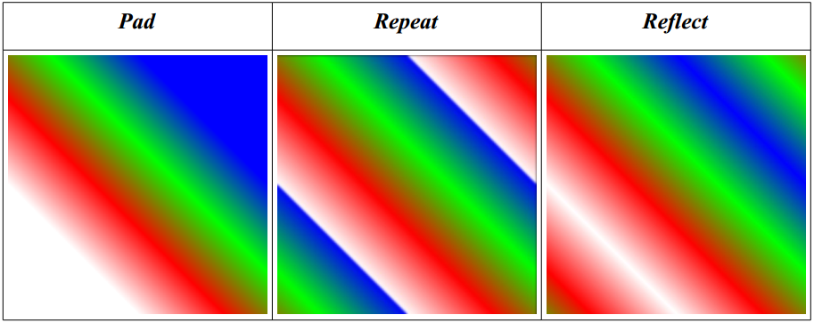

In this section, we define the standard data format for paths that may be used to definesequences of various types of path segments. Extensions may define other path data formats.


#### VG_PATH_FORMAT_STANDARD
<a name="VG_PATH_FORMAT_STANDARD"></a>

The `VG_PATH_FORMAT_STANDARD `macro defines a constant to be used as an argument to **vgCreatePath** to indicate that path data are stored using the standard format. As this API is revised, the lower 16 bits of version number may increase. Each version of OpenVG will accept formats defined in all prior specification versions with which it is backwards-compatible.

Extensions wishing to define additional path formats may register for format identifiers that will differ in their upper 16 bits;the lower 16 bits may be used by the extension vendor for versioning purposes.

```
#define VG_PATH_FORMAT_STANDARD 0;
```

### 8.5.1 Path Segment Command Side Effects
<a name="Path Segment Command Side Effects"></a>

In order to define the semantics of each segment command type, we define three reference points (all are initially (0, 0)):

• *(sx, sy)*: the beginning of the current subpath,*i*.*e*., the position of the last ``MOVE_TO`` segment.

• $(ox, oy)$: the last point of the previous segment.

• $(px, py)$: the last internal control point of the previous segment, if the segment was a (regular or smooth) quadratic or cubic Bézier, or else the last point of the previous segment.

Figure 6 illustrates the locations of these points at the end of a sequence of segment commands ``{ `MOVE_TO`, LINE_TO, CUBIC_TO }``.


*Figure 6: Segment Reference Points*

We define points *(x0, y0)*, *(x1, y1)*, and *(x2, y2)* in the discussion below as absolute coordinates. For segments defined using relative coordinates, *(x0, y0)*, etc., are defined as the incoming coordinate values added to $(ox, oy)$. Ellipse rh, rv, and rot parameters are unaffected by the use of relative coordinates. Each segment (except for `MOVE_TO` segments) begins at the point $(ox, oy)$ defined by the previous segment.

A path consists of a sequence of subpaths. As path segment commands are encountered, each segment is appended to the current subpath. The current subpath is ended by a `MOVE_TO` or `CLOSE_PATH` segment, and a new current subpath is begun. The end of the path data also ends the current subpath.

### 8.5.2 Segment Commands
<a name="Segment Commands"></a>

The following table describes each segment command type along with its prefix, the number of specified coordinates and parameters it requires, the numerical value of the segment command, the formulas for any implicit coordinates, and the side effects of the segment command on the points $(ox, oy)$, *(sx, sy)*, and $(px, py)$ and on the termination of the current subpath.

_**Type**_ | _**VGPathSegment**_ | _**Coordinates**_ | _**Value**_ | _**Implicit Points**_ | _**Side Effects**_
---- | ------------- | ----------- | ----- | --------------- | ------------
Close Path| `CLOSE_PATH` | *none* | 0 | | *(px,py)=(ox,oy)=(sx,sy)* End current subpath
Move|`MOVE_TO`|*x0,y0*|2||*(sx,sy)=(px,py)=(ox,oy)=(x0,y0)* End current subpath
Line|`LINE_TO`|*x0,y0*|4||*(px,py)=(ox,oy)=(x0,y0)*
Horiz Line|`HLINE_TO`|*x0*|6|*y0=oy*|*(px,py)=(x0,oy) ox=x0*
Vertical Line|`VLINE_TO`|*y0*|8|*x0=ox*|*(px,py)=(ox,y0) oy=y0*
Quadratic|`QUAD_TO`|*x0,y0,x1,y1*|10||*(px,py)=(x0,y0) (ox,oy)=(x1,y1)*
Cubic|`CUBIC_TO`|*x0,y0,x1,y1,x2,y2*|12||*(px,py)=(x1,y1) (ox,oy)=(x2,y2)*
G1 Smooth Quad|`SQUAD_TO`|*x1,y1*|14|*(x0,y0)=(2*ox-px,2*oy-py)*|*(px,py)= (2*ox-px, 2*oy-py) (ox,oy)=(x1,y1)*
G1 Smooth Cubic|`SCUBIC_TO`|*x1,y1,x2,y2*|16|*(x0,y0)=(2*ox-px,2*oy-py)*|*(px,py)=(x1,y1) (ox,oy)=(x2,y2)*
Small CCW Arc|`SCCWARC_TO|*rh,rv,rot,x0,y0*|18||*(px,py)=(ox,oy)=(x0,y0)*
Small CW Arc|`SCWARC_TO|*rh,rv,rot,x0,y0*|20||*(px,py)=(ox,oy)=(x0,y0)*
Large CCW|`LCCWARC_TO|*rh,rv,rot,x0,y0*|22||*(px,py)=(ox,oy)=(x0,y0)*
Arc|||||
Large CW Arc|`LCWARC_TO`|*rh,rv,rot,x0,y0*|24||*(px,py)=(ox,oy)=(x0,y0)*
Reserved|Reserved||26,28,30||

*Table 6: Path Segment Commands*

Each segment type may be defined using either absolute or relative coordinates. A relative coordinate $(x, y)$ is added to $(ox, oy)$ to obtain the corresponding absolute coordinate $(ox + x, oy + y)$. Relative coordinates are converted to absolute coordinates immediately as each segment is encountered during rendering.

The `HLINE_TO` and `VLINE_TO` segment types are provided in order to avoid the need for an SVG viewing application (for example) to perform its own relative to absolute conversions when parsing path data.

In SVG, the behavior of smooth quadratic and cubic segments differs slightly from the behavior defined above. If a smooth quadratic segment does not follow a quadratic segment, or a smooth cubic segment does not follow a cubic segment, the initial control point $(x0, y0)$ is placed at $(ox, oy)$ instead of being computed as the reflection of $(px, py)$.This behavior may be emulated by converting an SVG smooth segment into a regular segment with all of its control points specified when the preceding segment is of a different degree.

Note that the coordinates of a path are defined even if the path begins with a segment type other than `MOVE_TO` (including `HLINE_TO`, `VLINE_TO`, or relative segment types) since the coordinates are based on the initial values of $(ox, oy)$, $(sx, sy)$, and *(px, py)* which are each defined as (0, 0).

### 8.5.3 Coordinate Data Formats
<a name="Coordinate Data Formats"></a>

Coordinate and parameter data (henceforth called simply coordinate data) may be expressed in the set of formats shown in Table 7 below. Multi-byte coordinate data (*i*.*e*., `S_16`, `S_32` and F datatypes) are represented in application memory using the native byte order (endianness) of the platform. Implementations may quantize incoming data in the `S_32` and F formats to a lesser number of bits, provided at least 16 bits of precision are maintained.

Judicious use of smooth curve segments and 8- and 16-bit datatypes can result in substantial memory savings for common path data, such as font glyphs. Using smaller datatypes also conserves bus bandwidth when transferring paths from application memory to OpenVG.

_**Datatype**_|`VG_PATH_DATATYPE` _**Suffix**_|_**bytes**_|_**Value**_
--------------|-------------------------------|-----------|-----------
8-bit signed integer|S_8|1|0
16-bit signed integer|S_16|2|1
32-bit signed integer|S_32|4|2
IEEE 754 floating-point|F|4|3

*Table 7: Path Coordinate Datatypes*

#### VGPathDatatype
<a name="VGPathDatatype"></a>

The `VGPathDatatype` enumeration defines values describing the possible numerical datatypes for path coordinate data.

```
typedef enum {
VG_PATH_DATATYPE_S_8 = 0,
VG_PATH_DATATYPE_S_16 = 1,
VG_PATH_DATATYPE_S_32 = 2,
VG_PATH_DATATYPE_F = 3
} VGPathDatatype;
```

###8.5.4 Segment Type Marker Definitions

Segment type markers are defined as 8-bit integers, with the leading 3 bits reserved for future use, the next 4 bits containing the segment command type, and the least significant bit indicating absolute vs. relative coordinates (0 for absolute, 1 for relative). The reserved bits must be set to 0.

For the `CLOSE_PATH` segment command, the value of the Abs/Rel bit is ignored.


*Figure 7: Segment Type Marker Layout*

#### VGPathAbsRel
<a name=" VGPathAbsRel"></a>

The `VGPathAbsRel` enumeration defines values indicating absolute (`VG_ABSOLUTE`) and relative (`VG_RELATIVE`) values.

```
typedef enum {
VG_ABSOLUTE = 0,
VG_RELATIVE = 1
} VGPathAbsRel;
```

#### VGPathSegment
<a name="VGPathSegment"></a>

The `VGPathSegment` enumeration defines values for each segment command type. The values are pre-shifted by 1 bit to allow them to be combined easily with values from `VGPathAbsRel`.

```
typedef enum {
VG_CLOSE_PATH = ( 0 << 1),
VG_MOVE_TO = ( 1 << 1),
VG_LINE_TO = ( 2 << 1),
VG_HLINE_TO = ( 3 << 1),
VG_VLINE_TO = ( 4 << 1),
VG_QUAD_TO = ( 5 << 1),
VG_CUBIC_TO = ( 6 << 1),
VG_SQUAD_TO = ( 7 << 1),
VG_SCUBIC_TO = ( 8 << 1),
VG_SCCWARC_TO = ( 9 << 1),
VG_SCWARC_TO = (10 << 1),
VG_LCCWARC_TO = (11 << 1),
VG_LCWARC_TO = (12 << 1)
} VGPathSegment;
```
#### VGPathCommand
<a name="VGPathCommand"></a>

The `VGPathCommand` enumeration defines combined values for each segment command type and absolute/relative value. The values are shifted left by one bit and ORed bitwise (*i*.*e*., using the C | operator) with the appropriate value from `VGPathAbsRel` to obtain a complete segment command value.

```
typedef enum {
VG_MOVE_TO_ABS = VG_MOVE_TO | VG_ABSOLUTE,
VG_MOVE_TO_REL = VG_MOVE_TO | VG_RELATIVE,
VG_LINE_TO_ABS = VG_LINE_TO | VG_ABSOLUTE,
VG_LINE_TO_REL = VG_LINE_TO | VG_RELATIVE,
VG_HLINE_TO_ABS = VG_HLINE_TO | VG_ABSOLUTE,
VG_HLINE_TO_REL = VG_HLINE_TO | VG_RELATIVE,
VG_VLINE_TO_ABS = VG_VLINE_TO | VG_ABSOLUTE,
VG_VLINE_TO_REL = VG_VLINE_TO | VG_RELATIVE,
VG_QUAD_TO_ABS = VG_QUAD_TO | VG_ABSOLUTE,
VG_QUAD_TO_REL = VG_QUAD_TO | VG_RELATIVE,
VG_CUBIC_TO_ABS = VG_CUBIC_TO | VG_ABSOLUTE,
VG_CUBIC_TO_REL = VG_CUBIC_TO | VG_RELATIVE,
VG_SQUAD_TO_ABS = VG_SQUAD_TO | VG_ABSOLUTE,
VG_SQUAD_TO_REL = VG_SQUAD_TO | VG_RELATIVE,
VG_SCUBIC_TO_ABS = VG_SCUBIC_TO | VG_ABSOLUTE,
VG_SCUBIC_TO_REL = VG_SCUBIC_TO | VG_RELATIVE,
VG_SCCWARC_TO_ABS = VG_SCCWARC_TO | VG_ABSOLUTE,
VG_SCCWARC_TO_REL = VG_SCCWARC_TO | VG_RELATIVE,
VG_SCWARC_TO_ABS = VG_SCWARC_TO | VG_ABSOLUTE,
VG_SCWARC_TO_REL = VG_SCWARC_TO | VG_RELATIVE,
VG_LCCWARC_TO_ABS = VG_LCCWARC_TO | VG_ABSOLUTE,
VG_LCCWARC_TO_REL = VG_LCCWARC_TO | VG_RELATIVE,
VG_LCWARC_TO_ABS = VG_LCWARC_TO | VG_ABSOLUTE,
VG_LCWARC_TO_REL = VG_LCWARC_TO | VG_RELATIVE
} VGPathCommand;

```

### 8.5.5 Path Example
<a name="Path Example"></a>

The following code example shows how to traverse path data stored in application memory using the standard representation. A byte is read containing a segment command, and the segment command type and relative/absolute flag are extracted by application-defined `SEGMENT_COMMAND` and `SEGMENT_ABS_REL` macros. The number of coordinates and number of bytes per coordinate (for the given data format) are also determined using lookup tables. Finally, the relevant portion of the path data stream representing the current segment is copied into a temporary buffer and used as an argument to a user-defined **processSegment** function that may perform further processing.

```
#define PATH_MAX_COORDS 6 /* Maximum number of coordinates/command */
#define PATH_MAX_BYTES 4 /* Bytes in largest data type */
#define SEGMENT_COMMAND(command) /* Extract segment type */ \
((command) & 0x1e)
#define SEGMENT_ABS_REL(command) /* Extract absolute/relative bit */ \
((command) & 0x1)
/* Number of coordinates for each command */
static const VGint numCoords[] = {0,2,2,1,1,4,6,2,4,5,5,5,5};
/* Number of bytes for each datatype */
static const VGint numBytes[] = {1,2,4,4};
/* User-defined function to process a single segment */
extern void
processSegment(VGPathSegment command, VGPathAbsRel absRel,
VGPathDatatype datatype,
void * segmentData);
/* Process a path in the standard format, one segment at a time. */
void
processPath(const VGubyte * pathSegments, const void * pathData,
int numSegments, VGPathDatatype datatype)
{
VGubyte segmentType, segmentData[PATH_MAX_COORDS*PATH_MAX_BYTES];
VGint segIdx = 0, dataIdx = 0;
VGint command, absRel, numBytes;
while (segIdx < numSegments) {
segmentType = pathSegments[segIdx++];
command = SEGMENT_COMMAND(segmentType);
absRel = SEGMENT_ABS_REL(segmentType);
numBytes = numCoords[command]*numBytes[datatype];
/* Copy segment data for further processing */
memcpy(segmentData, &pathData[dataIdx], numBytes);
/* Process command */
processSegment(command, absRel, datatype, (void *) segmentData);
dataIdx += numBytes;
}
}
```

## 8.6 Path Operations
<a name="Path Operations"></a>

In addition to filling or stroking a path, the API allows the following basic operations on paths:

• Create a path with a given set of capabilities (**vgCreatePath**)

• Remove data from a path (**vgClearPath**)

• Deallocate a path (**vgDestroyPath**)

• Query path information (**using vgGetParameter**)

• Query the set of capabilities for a path (**vgGetPathCapabilities**)

• Reduce the set of capabilities for a path (**vgRemovePathCapabilities**)

• Append data from one path onto another (**vgAppendPath**)

• Append data onto a path (**vgAppendPathData**)

• Modify coordinates stored in a path (**vgModifyPathCoords**)

• Transform a path (**vgTransformPath**)

• Interpolate between two paths (**vgInterpolatePath**)

• Determine the geometrical length of a path (**vgPathLength**)

• Get position and tangent information for a point at a given geometric distance
along path (**vgPointAlongPath**)

• Get an axis-aligned bounding box for a path (**vgPathBounds**,
**vgTransformedPathBounds**)

Higher-level geometric primitives are defined in the optional `VGU` utility library (see
Section 17):

• Append a line to a path (**vguLine**)

• Append a polyline (connected sequence of line segments) or polygon to a
path (**vguPolygon**)

• Append a rectangle to a path (**vguRect**)

• Append a round-cornered rectangle to a path (**vguRoundRect**)

• Append an ellipse to a path (**vguEllipse**)

• Append a circular arc to a path (**vguArc**)

### 8.6.1 Storage of Paths
<a name="Storage of Paths"></a>

OpenVG stores path data internally to the implementation. Paths are referenced via opaque VGPath handles. Applications may initialize paths using the memory representation defined above or other representations defined by extensions. It is possible for an implementation to store path data in hardware-accelerated memory. Implementations may also make use of their own internal representation of path segments. The intent is for applications to be able to define a set of paths, for example one for each glyph in the current typeface, and to be able to re-render each previously defined path with maximum efficiency.

#### VGPath
<a name="VGPath"></a>

`VGPath` represents an opaque handle to a path.

```
typedef VGHandle VGPath;
```

### 8.6.2 Creating and Destroying Paths
<a name="Creating and Destroying Paths"></a>

Paths are created and destroyed using the **vgCreatePath** and **vgDestroyPath** functions. During the lifetime of a path, an application may indicate which path operations it plans to perform using path capability flags defined by the `VGPathCapabilities` enumeration.

#### _**VGPathCapabilities**_
<a name="VGPathCapabilities"></a>

The `VGPathCapabilities` enumeration defines a set of constants specifying which operations may be performed on a given path object. At the time a path is defined, the application specifies which operations it wishes to be able to perform on the path. Over time, the application may disable previously enabled capabilities, but it may not reenable capabilities once they have been disabled. This feature allows OpenVG implementations to make use of internal path representations that may not support all path operations, possibly resulting in higher performance on paths where those operations will not be performed.

The capability bits and the functionality they allow are described below:

• `VG_PATH_CAPABILITY_APPEND_FROM` – use path as the 'srcPath' argument to **vgAppendPath**

• `VG_PATH_CAPABILITY_APPEND_TO` – use path as the 'dstPath' argument to **vgAppendPath** and **vgAppendPathData**

• `VG_PATH_CAPABILITY_MODIFY` – use path as the 'dstPath' argument to **vgModifyPathCoords**

•`VG_PATH_CAPABILITY_TRANSFORM_FROM` – use path as the 'srcPath argument to **vgTransformPath**

• `VG_PATH_CAPABILITY_TRANSFORM_TO` – use path as the 'dstPath' argument to **vgTransformPath**

• `VG_PATH_CAPABILITY_INTERPOLATE_FROM` – use path as the `startPath` or `endPath` argument to **vgInterpolatePath**

• `VG_PATH_CAPABILITY_INTERPOLATE_TO` – use path as the `dstPath` argument to **vgInterpolatePath**

• `VG_PATH_CAPABILITY_PATH_LENGTH` – use path as the `path` argument to **vgPathLength**

• `VG_PATH_CAPABILITY_POINT_ALONG_PATH` – use path as the `path` argument to **vgPointAlongPath**

• `VG_PATH_CAPABILITY_TANGENT_ALONG_PATH` – use path as the `path` argument to **vgPointAlongPath** with non-`NULL tangentX` and `tangentY` arguments

• `VG_PATH_CAPABILITY_PATH_BOUNDS` – use path as the `path` argument to **vgPathBounds**

• `VG_PATH_CAPABILITY_PATH_TRANSFORMED_BOUNDS` – use path as the `path` argument to **vgPathTransformedBounds**

• `VG_PATH_CAPABILITY_ALL` – a bitwise OR of all the defined path capabilities

```
typedef enum {
VG_PATH_CAPABILITY_APPEND_FROM = (1 << 0),
VG_PATH_CAPABILITY_APPEND_TO = (1 << 1),
VG_PATH_CAPABILITY_MODIFY = (1 << 2),
VG_PATH_CAPABILITY_TRANSFORM_FROM = (1 << 3),
VG_PATH_CAPABILITY_TRANSFORM_TO = (1 << 4),
VG_PATH_CAPABILITY_INTERPOLATE_FROM = (1 << 5),
VG_PATH_CAPABILITY_INTERPOLATE_TO = (1 << 6),
VG_PATH_CAPABILITY_PATH_LENGTH = (1 << 7),
VG_PATH_CAPABILITY_POINT_ALONG_PATH = (1 << 8),
VG_PATH_CAPABILITY_TANGENT_ALONG_PATH = (1 << 9),
VG_PATH_CAPABILITY_PATH_BOUNDS = (1 << 10),
VG_PATH_CAPABILITY_PATH_TRANSFORMED_BOUNDS = (1 << 11),
VG_PATH_CAPABILITY_ALL = (1 << 12) - 1
} VGPathCapabilities;
```

It is legal to call **vgCreatePath**, **vgClearPath**, and **vgDestroyPath** regardless of the current setting of the path’s capability bits, as these functions discard the existing path definition.

#### vgCreatePath
<a name="vgCreatePath"></a>

**vgCreatePath** creates a new path that is ready to accept segment data and returns a `VGPath` handle to it. The path data will be formatted in the format given by `pathFormat`, typically `VG_PATH_FORMAT_STANDARD`. The `datatype` parameter contains a value from the `VGPathDatatype` enumeration indicating the datatype that will be used for coordinate data. The `capabilities` argument is a bitwise OR of the desired `VGPathCapabilities` values. Bits of `capabilities` that do not correspond to values from `VGPathCapabilities` have no effect. If an error occurs, `VG_INVALID_HANDLE` is returned.


The `scale` and `bias` parameters are used to interpret each coordinate of the path data; an incoming coordinate value *v* will be interpreted as the value *(scale*v* + *bias*). `scale` must not equal 0. The datatype, scale, and bias together define a valid coordinate data range for the path; segment commands that attempt to place a coordinate in the path that is outside this range will overflow silently, resulting in an undefined coordinate value. Functions that query a path containing such values, such as **vgPathLength** and **vgPointAlongPath**, also return undefined results.

The `segmentCapacityHint` parameter provides a hint as to the total number of segments that will eventually be stored in the path. The `coordCapacityHint` parameter provides a hint as to the total number of specified coordinates (as defined in the “Coordinates” column of Table 6) that will eventually be stored in the path. A value less than or equal to 0 for either hint indicates that the capacity is unknown. The path storage space will in any case grow as needed, regardless of the hint values. However, supplying hints may improve performance by reducing the need to allocate additional space as the path grows. Implementations should allow applications to append segments and coordinates up to the stated capacity in small batches without degrading performance due to excessive memory reallocation.

```
VGPath vgCreatePath(VGint pathFormat,
VGPathDatatype datatype,
VGfloat scale, VGfloat bias,
VGint segmentCapacityHint,
VGint coordCapacityHint,
VGbitfield capabilities)
```

> **_ERRORS_**
>
> `VG_UNSUPPORTED_PATH_FORMAT_ERROR`
> * if `pathFormat` is not a supported format `VG_ILLEGAL_ARGUMENT_ERROR`
> * if `datatype` is not a valid value from the `VGPathDatatype` enumeration
> * if `scale` is equal to 0

#### vgClearPath
<a name="vgClearPath"></a>

**vgClearPath** removes all segment command and coordinate data associated with a path. The handle continues to be valid for use in the future, and the path format and datatype retain their existing values. The `capabilities` argument is a bitwise OR of the desired VGPathCapabilities values. Bits of `capabilities` that do not correspond to values from `VGPathCapabilities` have no effect. Using **vgClearPath** may be more efficient than destroying and re-creating a path for short-lived paths.

```
void vgClearPath(VGPath path, VGbitfield capabilities)
```
> **_ERRORS_**
>
>`VG_BAD_HANDLE_ERROR`
> * if `path` is not a valid path handle, or is not shared with the current context

#### vgDestroyPath
<a name=" vgDestroyPath"></a>

**vgDestroyPath** releases any resources associated with `path`, and makes the handle invalid in all contexts that shared it.

```
void vgDestroyPath(VGPath path)
```
> **_ERRORS_**
>
>`VG_BAD_HANDLE_ERROR`
> * if `path` is not a valid path handle, or is not shared with the current context

### 8.6.3 Path Queries
<a name="Path Queries"></a>

#### VGPathParamType
<a name="VGPathParamType"></a>

Values from the `VGPathParamType` enumeration may be used as the `paramType` argument to **vgGetParameter** to query various features of a path. All of the parameters defined by `VGPathParamType` are read-only. Table 8 shows the datatypes for each parameter type.

```
typedef enum {
VG_PATH_FORMAT = 0x1600,
VG_PATH_DATATYPE = 0x1601,
VG_PATH_SCALE = 0x1602,
VG_PATH_BIAS = 0x1603,
VG_PATH_NUM_SEGMENTS = 0x1604,
VG_PATH_NUM_COORDS = 0x1605
} VGPathParamType;
```

_**Parameter**_ | _**Datatype**_
--------------- | --------------
VG_PATH_FORMAT|VGint
VG_PATH_DATATYPE|VGint
VG_PATH_SCALE|VGfloat
VG_PATH_BIAS|VGfloat
VG_PATH_NUM_SEGMENTS|VGint
VG_PATH_NUM_COORDS|VGint

*Table 8: VGPathParamType Datatypes*

#### Path Format
<a name="Path Format"></a>

The command format of a path is queried as an integer value using the `VG_PATH_FORMAT` parameter:

```
VGPath path;
VGint pathFormat = vgGetParameteri(path, VG_PATH_FORMAT);
```


#### Path Datatype
<a name="Path Datatypet"></a>

The coordinate datatype of a path is queried as an integer value using the `VG_PATH_DATATYPE` parameter. The returned integral value should be cast to the `VGPathDatatype` enumeration:

```
GPath path;
VGPathDatatype pathDatatype =
(VGPathDatatype)vgGetParameteri(path, VG_PATH_DATATYPE);
```

#### Path Scale
<a name="Path Scale"></a>

The scale factor of the path is queried as a floating-point value using the `VG_PATH_SCALE` parameter:
```
VGPath path;
VGfloat pathScale = vgGetParameterf(path, VG_PATH_SCALE);
```
#### Path Bias
<a name="Path Bias"></a>

The bias of the path is queried as a floating-point value using the `VG_PATH_BIAS` parameter:

```
VGPath path;
VGfloat pathBias = vgGetParameterf(path, VG_PATH_BIAS);
```

#### Number of Segments
<a name="Number of Segments"></a>

The number of segments stored in the path is queried as an integer value using the `VG_PATH_NUM_SEGMENTS` parameter:
```
VGPath path;
VGint pathNumSegments = vgGetParameteri(path, VG_PATH_NUM_SEGMENTS);
```
#### Number of Coordinates
<a name="Number of Coordinates"></a>

The total number of specified coordinates (*i*.*e*., those defined in the “Coordinates” column of Table 6) stored in the path is queried as an integer value using the `VG_PATH_NUM_COORDS` parameter:
```
VGPath path;
VGint pathNumCoords = vgGetParameteri(path, VG_PATH_NUM_COORDS);
```

### 8.6.4 Querying and Modifying Path Capabilities
<a name="Querying and Modifying Path Capabilities"></a>

#### vgGetPathCapabilities
<a name="vgGetPathCapabilities"></a>

The **vgGetPathCapabilities** function returns the current capabilities of the `path`, as a bitwise OR of `VGPathCapabilities` constants. If an error occurs, 0 is returned.

```
VGbitfield vgGetPathCapabilities(VGPath path)
```

> **_ERRORS_**
>
>`VG_BAD_HANDLE_ERROR`
> * if `path` is not a valid path handle, or is not shared with the current context

#### vgRemovePathCapabilities
<a name="vgRemovePathCapabilities"></a>

The **vgRemovePathCapabilities** function requests the set of capabilities specified in the `capabilities` argument to be disabled for the given `path`. The `capabilities` argument is a bitwise OR of the `VGPathCapabilities` values whose removal is requested. Attempting to remove a capability that is already disabled has no effect. Bits of `capabilities` that do not correspond to values from `VGPathCapabilities` have no effect.


An implementation may choose to ignore the request to remove a particular capability if no significant performance improvement would result. In this case, **vgGetPathCapabilities** will continue to report the capability as enabled.
```
void vgRemovePathCapabilities(VGPath path, VGbitfield capabilities)
```

> **_ERRORS_**
>
>`VG_BAD_HANDLE_ERROR`
> * if `path` is not a valid path handle, or is not shared with the current context

### 8.6.5 Copying Data Between Paths
<a name="Copying Data Between Paths"></a>

#### vgAppendPath
<a name="vgAppendPath"></a>

**vgAppendPath** appends a copy of all path segments from `srcPath` onto the end of the existing data in `dstPath`. It is legal for `srcPath` and `dstPath` to be handles to the same path object, in which case the contents of the path are duplicated. If `srcPath` and `dstPath` are handles to distinct path objects, the contents of srcPath will not be affected by the call.

The `VG_PATH_CAPABILITY_APPEND_FROM` capability must be enabled for `srcPath`, and the `VG_PATH_CAPABILITY_APPEND_TO` capability must be enabled for `dstPath`.


If the scale and bias of `dstPath` define a narrower range than that of `srcPath`, overflow may occur silently.
```
void vgAppendPath(VGPath dstPath, VGPath srcPath)
```
> **_ERRORS_**
>
>`VG_BAD_HANDLE_ERROR`
> * if either `dstPath` or `srcPath` is not a valid path handle, or is not shared with the current context
> `VG_PATH_CAPABILITY_ERROR`
> if `VG_PATH_CAPABILITY_APPEND_FROM` is not enabled for srcPath
> if `VG_PATH_CAPABILITY_APPEND_TO` is not enabled for dstPath

### 8.6.6 Appending Data to a Path
<a name=" Appending Data to a Path"></a>

#### vgAppendPathData
<a name="vgAppendPathData"></a>

**vgAppendPathData** appends data taken from `pathData` to the given path `dstPath`. The data are formatted using the path format of `dstPath` (as returned by querying the path’s `VG_PATH_FORMAT` parameter using **vgGetParameteri**). The `numSegments` parameter gives the total number of entries in the `pathSegments` array, and must be greater than 0. Legal values for the **pathSegments** array are the values from the `VGPathCommand` enumeration as well as `VG_CLOSE_PATH` and (`VG_CLOSE_PATH` | `VG_RELATIVE`) (which are synonymous).

The `pathData` pointer must be aligned on a 1-, 2-, or 4-byte boundary (as defined in the “Bytes” column of Table 7) depending on the size of the coordinate datatype (as returned by querying the path’s `VG_PATH_DATATYPE` parameter using **vgGetParameteri**). The `VG_PATH_CAPABILITY_APPEND_TO` capability must be enabled for `path`.

Each incoming coordinate value, regardless of datatype, is transformed by the scale
factor and bias of the path.

```
void vgAppendPathData(VGPath dstPath,
VGint numSegments,
const VGubyte * pathSegments,
const void * pathData)
```
> **_ERRORS_**
>
>`VG_BAD_HANDLE_ERROR`
> * if `dstPath` is not a valid path handle, or is not shared with the current context
> `VG_PATH_CAPABILITY_ERROR`
> * if `VG_PATH_CAPABILITY_APPEND_TO` is not enabled for dstPath `VG_ILLEGAL_ARGUMENT_ERROR`
> * if `pathSegments` or `pathData` is `NULL`
> * if `pathData` is not properly aligned
> * if `numSegments` is less than or equal to 0
> * if `pathSegments` contains an illegal command

### 8.6.7 Modifying Path Data
<a name=" Modifying Path Data"></a>

Coordinate data in an existing path may be modified, for example to create animation
effects. Implementations should choose an internal representation for paths that have the `VG_PATH_CAPABILITY_MODIFY` capability enabled that allows for efficient modification of the coordinate data.

#### vgModifyPathCoords
<a name="vgModifyPathCoords"></a>

**vgModifyPathCoords** modifies the coordinate data for a contiguous range of segments of `dstPath`, starting at `startIndex` (where 0 is the index of the first path segment) and having length `numSegments`. The data in `pathData` must be formatted in exactly the same manner as the original coordinate data for the given segment range, unless the path has been transformed using **vgTransformPath** or interpolated using **vgInterpolatePath**. In these cases, the path will have been subject to the segment promotion rules specified in those functions.

The `pathData` pointer must be aligned on a 1-, 2-, or 4-byte boundary
depending on the size of the coordinate datatype (as returned by querying the
path’s `VG_PATH_DATATYPE` parameter using **vgGetParameteri**). The
`VG_PATH_CAPABILITY_MODIFY` capability must be enabled for path

Each incoming coordinate value, regardless of datatype, is transformed by the
scale factor and bias of the path.
```
void vgModifyPathCoords(VGPath dstPath,
VGint startIndex, VGint numSegments,
const void * pathData)
```

> **_ERRORS_**
>
>`VG_BAD_HANDLE_ERROR`
> * if `dstPath` is not a valid path handle, or is not shared with the current context
> `VG_PATH_CAPABILITY_ERROR`
> * if `VG_PATH_CAPABILITY_APPEND_TO` is not enabled for dstPath `VG_ILLEGAL_ARGUMENT_ERROR`
> * if `pathData` is `NULL`
> * if `pathData` is not properly aligned
> * if `startIndex` is less than 0
> * if `numSegments` is less than or equal to 0
> * if `startIndex + numSegments` is greater than the number of segments in the path

### 8.6.8 Transforming a Path
<a name="Transforming a Path"></a>

#### vgTransformPath
<a name="vgTransformPath"></a>

**vgTransformPath** appends a transformed copy of `srcPath` to the current contents of
dstPath. The appended path is equivalent to the results of applying the current pathuser-
to-surface transformation (`VG_MATRIX_PATH_USER_TO_
SURFACE`) to `srcPath`.

It is legal for `srcPath` and `dstPath` to be handles to the same path object, in
which case the transformed path will be appended to the existing path. If
`srcPath` and `dstPath` are handles to distinct path objects, the contents of
`srcPath` will not be affected by the call.

All `HLINE_TO_*` and `VLINE_TO_*` segments present in `srcPath` are implicitly
converted to `LINE_TO_*` segments prior to applying the transformation. The original
copies of these segments in `srcPath` remain unchanged.


Any `*ARC_TO` segments are transformed, but the endpoint parametrization of the
resulting arc segments are implementation-dependent. The results of calling
**vgInterpolatePath** on a transformed path that contains such segments are undefined.


The `VG_PATH_CAPABILITY_TRANSFORM_FROM` capability must be enabled for
`srcPath`, and the` VG_PATH_CAPABILITY_TRANSFORM_TO` capability must be
enabled for `dstPath`.

Overflow may occur silently if coordinates are transformed outside the datatype range of
dstPath.
```
void vgTransformPath(VGPath dstPath, VGPath srcPath)
```

> **_ERRORS_**
>
>`VG_BAD_HANDLE_ERROR`
> * if either `dstPath` or `srcPath` is not a valid path handle, or is not shared with the current context
> `VG_PATH_CAPABILITY_ERROR`
> * if `VG_PATH_CAPABILITY_TRANSFORM_FROM` is not enabled for srcPath
> * if `VG_PATH_CAPABILITY_TRANSFORM_TO` is not enabled for dstPath

### 8.6.9 Interpolating Between Paths
<a name="Interpolating Between Paths"></a>

Interpolation takes two compatible paths, in a sense described below, and defines a new
path that interpolates between them by a parameter `amount`. When `amount` is equal to
0, the result is equivalent to the first path; when `amount` is equal to 1, the result is
equivalent to the second path. Values between 0 and 1 produce paths that smoothly
interpolate between the two extremes. Values outside the [0, 1] range produce
extrapolated paths. Conceptually, interpolation occurs as follows. First, the two path
parameters are copied and the copies are normalized by:

• Converting all coordinates to floating-point format, applying the path scale and bias
parameters

• Converting all relative segments to absolute form

• Converting `{H,V}LINE_TO_* `segments to `LINE_TO form`

• Converting `(S)QUAD_TO_*/SCUBIC_TO_*` segments to `CUBIC_TO` form

• Retaining all `*ARC_TO_*` and `CLOSE_PATH` segments

If, following normalization, both paths have the same sequence of segment types
(treating all forms of arc as the same), interpolation proceeds by linearly interpolating
between each corresponding pair of segment parameters in the normalized paths. If the
starting arc type differs from the final arc type, the starting arc type is used for values of
amount less than 0.5, and the final arc type is used for values greater than or equal to
0.5. Finally, the coordinates are converted to the data type of the destination.

#### vgInterpolatePath
<a name="vgInterpolatePath"></a>

The **vgInterpolatePath** function appends a path, defined by interpolation (or
extrapolation) between the paths `startPath` and `endPath` by the given `amount`, to
the path `dstPath`. It returns `VG_TRUE` if interpolation was successful (*i*.*e*., the paths
had compatible segment types after normalization), and `VG_FALSE` otherwise. If
interpolation is unsuccessful, `dstPath` is left unchanged.


It is legal for `dstPath` to be a handle to the same path object as either
`startPath` or `endPath` or both, in which case the contents of the source path
or paths referenced by `dstPath` will have the interpolated path appended. If
`dstPath` is not the a handle to the same path object as either `startPath` or
`endPath`, the contents of `startPath` and `endPath` will not be affected by the
call.

Overflow may occur silently if the datatype of `dstPath` has insufficient range to store
an interpolated coordinate value.

The `VG_PATH_CAPABILITY_INTERPOLATE_FROM` capability must be enabled
for both of `startPath` and `endPath`, and the `INTERPOLATE_TO` capability
must be enabled for `dstPath`.

```
VGboolean vgInterpolatePath(VGPath dstPath,
VGPath startPath,
VGPath endPath,
VGfloat amount)
```

> **_ERRORS_**
>
>`VG_BAD_HANDLE_ERROR`
> * if any of `dstPath`, `startPath`, or `endPath` is not a valid path handle, or is not shared with the current context
> `VG_PATH_CAPABILITY_ERROR`
> * if `VG_PATH_CAPABILITY_PATH_INTERPOLATE_TO` is not enabled for dstPath
> * if `VG_PATH_CAPABILITY_PATH_INTERPOLATE_FROM` is not enabled for `startPath` or `endPath`

### 8.6.10 Length of a Path
<a name="Length of a Path"></a>

An approximation to the geometric length of a portion of a path may be obtained by
calling the **vgPathLength** function. `MOVE_TO` segments and implicit path closures (see
Section 8.7.1) do not contribute to the path length. `CLOSE_PATH` segments have the
same length as a `LINE_TO` segment with the same endpoints.

#### vgPathLength
<a name="vgPathLength"></a>

The **vgPathLength** function returns the length of a given portion of a path in the user
coordinate system (that is, in the path’s own coordinate system, disregarding any matrix
settings). Only the subpath consisting of the `numSegments` path segments beginning
with `startSegment` (where the initial path segment has index 0) is used. If an
error occurs, -1.0f is returned.
The `VG_PATH_CAPABILITY_PATH_LENGTH` capability must be enabled for `path`.

```
VGfloat vgPathLength(VGPath path,
VGint startSegment, VGint numSegments);
```

> **_ERRORS_**
>
>`VG_BAD_HANDLE_ERROR`
> * if `path` is not a valid path handle, or is not shared with the current context `VG_PATH_CAPABILITY_ERROR`
> if `VG_PATH_CAPABILITY_PATH_LENGTH` is not enabled for `path VG_ILLEGAL_ARGUMENT_ERROR`
> * if startSegment is less than 0 or greater than the index of the final path segment
> * if `numSegments` is less than or equal to 0
> * if `(startSegment + numSegments – 1)` is greater than the index of the final path segment

### 8.6.11 Position and Tangent Along a Path
<a name="Position and Tangent Along a Path"></a>

Some path operations, such as the placement and orientation of text along a path, require
the computation of a set of points along a path as well as a normal (perpendicular) vector
at each point. The **vgPointAlongPath** function provides points along the path as well
as normalized tangent vectors (from which normals may easily be derived).

#### The Tangents of a Path Segment
<a name="The Tangents of a Path Segment"></a>

The tangent at a given point along a path is defined as a vector pointing in the same
direction as the path at that point. The tangent at any point of a line segment is parallel to
the line segment; the tangent at any point along a Bézier curve or elliptical arc segment
may be defined using the derivatives of the parametric equations *x(t)* and *y(t)* that define
the curve. The incoming tangent at a point is defined using the direction in which the
curve is “traveling” prior to arriving at the point; the outgoing tangent is defined using
the direction the curve is traveling as it leaves the point. The incoming and outgoing
tangents may differ at a vertex joining different curve segments, or at a sharp “cusp” in a
curve.


If a point along a path segment has no tangent defined, for example where a path
segment has collapsed to a single point, the following algorithm is used to define
incoming and outgoing tangents at the point. Search backwards until a segment is found
with a tangent defined at its end point, or the start of the current path is reached; if a
tangent is found, use it as the incoming tangent. Search forwards until a segment is found
with a tangent defined at its starting point, or the end of the current path is reached; if a
tangent is found, use it as the outgoing tangent. If these searches produce exactly one
defined tangent, that tangent is used as both the incoming and outgoing tangent. If the
searches produced no defined tangent, the incoming and outgoing tangents are both
assigned the value (1, 0). Tangent vectors are normalized to have unit length.

#### vgPointAlongPath
<a name="vgPointAlongPath"></a>

The **vgPointAlongPath** function returns the point lying a given distance along a given
portion of a path and the unit-length tangent vector at that point. Only the subpath
consisting of the `numSegments` path segments beginning with `startSegment`
(where the initial path segment has index 0) is used. For the remainder of this
section we refer only to this subpath when discussing paths.
If `distance` is less than or equal to 0, the starting point of the path is used. If
`distance` is greater than or equal to the path length (*i*.*e*., the value returned by
**vgPathLength** when called with the same `startSegment` and `numSegments`
parameters), the visual ending point of the path is used.
Intermediate values return the $(x, y)$ coordinates and tangent vector of the point at the
given distance along the path. Because it is not possible in general to compute exact
distances along a path, an implementation is not required to use exact
computation even for segments where such computation would be possible. For
example, the path:

`MOVE_TO 0, 0; LINE_TO 10, 0 // draw a line of length 10`

`MOVE_TO 10, 10 // create a discontinuity`

`LINE_TO 10, 20 // draw a line of length 10`

may return either (10, 0) or (10, 10) (or points nearby) as the point at distance
10.0. Implementations are not required to compute distances exactly, as long as
they satisfy the constraint that as `distance` increases monotonically the
returned point and tangent move forward monotonically along the path.

Where the implementation is able to determine that the point being queried
lies exactly at a discontinuity or cusp, the incoming point and tangent should be
returned. In the example above, returning the pre-discontinuity point (10, 0) and
incoming tangent (1, 0) is preferred to returning the post-discontinuity point (10,10) and outgoing tangent (0, 1).

The `VG_PATH_CAPABILITY_POINT_ALONG_PATH` capability must be enabled for
path.

If the reference arguments x and y are both non-`NULL`, and the
`VG_PATH_CAPABILITY_POINT_ALONG_PATH` capability is enabled for `path`, the
point $(x, y)$ is returned in *x* and *y*. Otherwise the variables referenced by *x* and *y* are not
written.

If the reference arguments `tangentX` and `tangentY` are both non-`NULL`, and the
`VG_PATH_CAPABILITY_TANGENT_ALONG_PATH` capability is enabled for `path`,
the geometric tangent vector at the point $(x, y)$ is returned in `tangentX` and
`tangentY`. Otherwise the variables referenced by `tangentX` and `tangentY` are not
written.

Where the incoming tangent is defined, **vgPointAlongPath** returns it. Where only the
outgoing tangent is defined, the outgoing tangent is returned.

The points returned by **vgPointAlongPath** are not guaranteed to match the path as
rendered; some deviation is to be expected.

```
void vgPointAlongPath(VGPath path,
VGint startSegment, VGint numSegments,
VGfloat distance,
VGfloat * x, VGfloat * y,
VGfloat * tangentX, VGfloat * tangentY)
```

> **_ERRORS_**
>
>`VG_BAD_HANDLE_ERROR`
> * if `path` is not a valid path handle, or is not shared with the current context `VG_PATH_CAPABILITY_ERROR`
> * If x and y are both non-`NULL`, and the `VG_PATH_CAPABILITY_POINT_ALONG_PATH` is not enabled for `path`
> * If `tangentX` and `tangentY` are both non-`NULL`, and the `VG_PATH_CAPABILITY_TANGENT_ALONG_PATH` capability is not enabled for `path`
>
> `VG_ILLEGAL_ARGUMENT_ERROR`
> * if startSegment is less than 0 or greater than the index of the final path segment
> * if `numSegments` is less than or equal to 0
> * if (startSegment + numSegments – 1) is less than 0 or greater than the index of the final path segment
> * if x, y, tangentX or tangentY is not properly aligned

### 8.6.12 Querying the Bounding Box of a Path
<a name="Querying the Bounding Box of a Path"></a>

To draw complex scenes efficiently, it is important to avoid drawing objects that do not appear in the region being drawn. A simple way to determine whether an object may be visible is to determine whether its *bounding box* – an axis-aligned rectangle that is guaranteed to contain the entire object – intersects the drawn region. The **vgPathBounds** and **vgPathTransformedBounds** functions provide bounding box information.

Two types of bounding boxes may be obtained for a path. The first, obtained by calling **vgPathBounds**, returns a tight axis-aligned bounding box for the area contained within the path in its own coordinate system. The second, obtained by calling **vgPathTransformedBounds**, returns an axis-aligned bounding box for the path as it will appear when drawn on the drawing surface (*i*.*e*., following application of the current path-user-to-surface transform). The latter function does not guarantee to bound the shape tightly, but still may provide tighter bounds than those obtained by transforming the result of **vgPathBounds**, at a lower cost.


The bounding box of a path is defined to contain all points along the path, including isolated points created by `MOVE_TO` segments. The fill rule has no effect on the determination of the bounding box. If the path is to be stroked, the application must adjust the bounding box to take the stroking parameters into account. Note that Miter joins in particular may extend far outside the bounding box.

#### vgPathBounds
<a name="vgPathBounds"></a>

The **vgPathBounds** function returns an axis-aligned bounding box that tightly bounds the interior of the given path. Stroking parameters are ignored. If path is empty, `minX` and `minY` are set to 0 and `width` and `height` are set to -1. If `path` contains a single point, `minX` and `minY` are set to the coordinates of the point and `width` and `height` are set to 0.

The `VG_PATH_CAPABILITY_PATH_BOUNDS` capability must be enabled for path

```
void vgPathBounds(VGPath path,
VGfloat * minX, VGfloat * minY,
VGfloat * width, VGfloat * height)
```

> **_ERRORS_**
>
>`VG_BAD_HANDLE_ERROR`
> * if `path` is not a valid path handle, or is not shared with the current context `VG_PATH_CAPABILITY_ERROR`
> * if minX, minY, width, or height is `NULL`
> * if minX, minY, width, or height is not properly aligned `VG_PATH_CAPABILITY_ERROR`
> if `VG_PATH_CAPABILITY_PATH_BOUNDS` is not enabled for path


#### vgPathTransformedBounds
<a name="vgPathTransformedBounds"></a>

The **vgPathTransformedBounds** function returns an axis-aligned bounding box that is guaranteed to enclose the geometry of the given `path` following transformation by the current path-user-to-surface transform. The returned bounding box is not guaranteed to fit tightly around the path geometry. If `path` is empty, `minX` and `minY` are set to 0 and `width` and `height` are set to -1. If `path` contains a single point, `minX` and `minY` are set to the coordinates of the point and `width` and `height` are set to 0.

The `VG_PATH_CAPABILITY_PATH_BOUNDS` capability must be enabled for
path.

```
void vgPathBounds(VGPath path,
VGfloat * minX, VGfloat * minY,
VGfloat * width, VGfloat * height)
```

> **_ERRORS_**
>
>`VG_BAD_HANDLE_ERROR`
> * if `path` is not a valid path handle, or is not shared with the current context `VG_PATH_CAPABILITY_ERROR`
> * if minX, minY, width, or height is `NULL`
> * if minX, minY, width, or height is not properly aligned `VG_PATH_CAPABILITY_ERROR`
> if `VG_PATH_CAPABILITY_PATH_TRANSFORMED_BOUNDS` is not enabled for path

## 8.7 Interpretation of Paths
<a name="Interpretation of Paths"></a>

The interpretation of a path, composed of a sequence of one or more subpaths, depends on whether it is to be stroked or filled. For stroked paths, each subpath has stroking parameters applied to it separately, with the dash phase at the end of each subpath used at the beginning of the next subpath. This process results in a set of stroked shapes. The union of these shapes then defines the outline path to be filled. For filled paths, the interior of the path (as defined below) is filled.

### 8.7.1 Filling Paths
<a name="Filling Paths"></a>
A simple, non-self-intersecting closed path divides the plane into two regions, a bounded *inside* region and an unbounded *outside* region. Note that knowing the orientation of the outermost path (*i*.*e*., clockwise or counter-clockwise) is not necessary to differentiate between the inside and outside regions.

A path that self-intersects, or that has multiple overlapping subpaths, requires additional information in order to define the inside region. Two rules that provide different definitions for the area enclosed by such paths, known as the non-zero and even/odd fill rules, are supported by OpenVG. To determine whether any point in the plane is contained in the inside region, imagine drawing a line from that point out to infinity in any direction such that the line does not cross any vertex of the path. For each edge that is crossed by the line, add 1 to the counter if the edge crosses from left to right, as seen by an observer walking along the line towards infinity, and subtract 1 if the edge crosses from right to left. In this way, each region of the plane will receive an integer value.

The non-zero fill rule says that the point is inside the shape if the resulting sum is not equal to 0. The even/odd rule says that the point is inside the shape if the resulting sum is odd, regardless of sign (*e*.*g*., -7 is odd, 0 is even). Consider the star-shaped path shown in Figure 8 below, indicated with solid lines. The orientation of the lines making up the path is indicated with arrows. An imaginary line to infinity starting in the central region of the star is shown as a dashed line pointing to the right. Two edges of the star cross the line to infinity going left to right, indicated by the downward-pointing arrows. The central region therefore has a count of +2. According to the even/odd rule, it is outside the path, whereas according to the non-zero rule it is inside. Implementations must be able to deal with paths having up to 255 crossings along any line. The behavior of more complex paths is undefined.


*Figure 8: Even/Odd Fill Rule*

#### Creating Holes in Paths
<a name="Creating Holes in Paths"></a>

The fill rule is applied with respect to all subpaths simultaneously during filling. Thus, one subpath may be used to create a hole inside an enclosing subpath by defining the two subpaths with opposing orientations (clockwise versus counter-clockwise). Note that the orientation of extremely small paths may depend on the numerical precision of the internal representation of points. Care should be taken to avoid the use of paths that have nearly collapsed to a line or a point.

The relative orientation of subpaths, along with the fill rule, determines whether overlapping subpaths will result in holes, as shown in Figure 9 below.

||_**Even/Old Fil Rule**_|_**Non-Zero Fill Rule**_|
|-|-------|-------|
|_**Same Orientation**_|||
|_**Opposing Orientation**_|||


$$v'_{repeat} = v−|v|$$

In reflect mode, the offset value v is mapped to a new value v´ that is guaranteed to liebetween 0 and 1. Following this mapping, the color is defined as for pad mode:

$$
v'_{reflect} =
\begin{cases}
 & v-|v| \text{, if |v| is even }  \\
 & 1-(v-|v|) \text{, if |v| is odd }
\end{cases}
$$

### 9.3.4 Gradient Examples
<a name="Gradient_Examples"></a>

Figure 20 shows a square from (0, 0) to (400, 400) painted with a set of linear gradientswith (x0, y0) = (100, 100), (x1, y1) = (300, 300).

Figure 21 shows the same square painted with radial gradients with centered and noncentered focal points. The centered gradient, shown in the top row, has its center (cx, cy)and focal point (fx, fy) both at (200, 200). The non-centered gradient, shown in thebottom row, has its center (cx, cy) at (200, 200) and its focal point (fx, fy) at (250, 250).The radius r for both gradients is equal to 100.

All the gradients shown in this section utilize a color ramp with stops at offsets 0.0,0.33, 0.66, and 1.0 colored white, red, green, and blue, respectively, as shown in Figure22.



Figure 20: Linear Gradients


Figure 21: Centered and Non-Centered Radial Gradients


Figure 22: Color Ramp used for Gradient Examples

## 9.4 Pattern Paint
<a name="Pattern_Paint"></a>

Pattern paint defines a rectangular pattern of colors based on the pixel values of an image. Images are described below in Section 10. Each pixel (x, y) of the pattern imagedefines a point of color at the pixel center (x + ½, y + ½).

Filtering may be used to construct an interpolated pattern value at the sample point,based on the pattern image pixel values. The pattern tiling mode is used to define valuesfor pixel centers in the pattern space that lie outside of the bounds of the pattern.

Interpolation may be performed between multiple pixels of the pattern image to producean antialiased pattern value. The image quality setting at the time of drawing (determinedby the `VG_IMAGE_QUALITY` parameter) is used to control the quality of patterninterpolation. If the image quality is set `toVG_IMAGE_QUALITY_NONANTIALIASED`, nearest-neighbor interpolation (pointsampling) is used. If the image quality is set to `VG_IMAGE_QUALITY_FASTER` or `VG_IMAGE_QUALITY_BETTER`, higher-quality interpolation will b...(line truncated)...

#### vgPaintPattern
<a name="vgPaintPattern"></a>

The `vgPaintPattern` function replaces any previous pattern image defined on thegiven paint object for the given set of paint modes with a new pattern image. Avalue of `VG_INVALID_HANDLE` for the pattern parameter removes the currentpattern image from the paint object.

If the current paint object has its `VG_PAINT_TYPE` parameter set to `VG_PAINT_TYPE_PATTERN`, but no pattern image is set, the paint object behaves as if `VG_PAINT_TYPE` were set to `VG_PAINT_TYPE_COLOR`.

While an image is set as the paint pattern for any paint object, it may not be used as arendering target. Conversely, an image that is currently a rendering target may not be setas a paint pattern.

```c
void vgPaintPattern(VGPaint paint, VGImage pattern)
```

> **_ERRORS_**
>
> `VG_BAD_HANDLE_ERROR`
> * if paint is not a valid paint handle, or is not shared with the current context
> * if pattern is neither a valid image handle nor equal to `VG_INVALID_HANDLE`, or is not shared with the current context
>
> `VG_IMAGE_IN_USE_ERROR`
> * if pattern is currently a rendering targe

### 9.4.1 Pattern Tiling
<a name="Pattern_Tiling"></a>

Patterns may be extended (tiled) using one of four possible tiling modes, defined by the `VGTilingMode` enumeration.

#### VGTilingMode
<a name="VGTilingMode"></a>

The `VGTilingMode` enumeration defines possible methods for defining colors forsource pixels that lie outside the bounds of the source image.

The `VG_TILE_FILL` condition specifies that pixels outside the bounds of the sourceimage should be taken as the color `VG_TILE_FILL_COLOR`. The color is expressed asa non-premultiplied sRGBA color and alpha value. Values outside the [0, 1] range areinterpreted as the nearest endpoint of the range.

The `VG_TILE_PAD` condition specifies that pixels outside the bounds of the sourceimage should be taken as having the same color as the closest edge pixel of the sourceimage. That is, a pixel (x, y) has the same value as the image pixel (max(0, min(x, width– 1)), max(0, min(y, height – 1))).

The `VG_TILE_REPEAT` condition specifies that the source image should be repeatedindefinitely in all directions. That is, a pixel (x, y) has the same value as the image pixel(x mod width, y mod height) where the operator ‘a mod b’ returns a value between 0 and(b – 1) such that a = k*b + (a mod b) for some integer k.

The `VG_TILE_REFLECT` condition specifies that the source image should be reflectedindefinitely in all directions. That is, a pixel (x, y) has the same value as the image pixel(x’, y’) where:

$$
x' =
\begin{cases}
  & \text{x mod width, if floor(x/width) is even} \\
  & \text{width - 1 - x mod width, otherwise}
\end{cases}
$$

$$
y' =
\begin{cases}
  & \text{y mod height, if floor(y/height) is even} \\
  & \text{height - 1 - y mod height, otherwise}
\end{cases}
$$

```c
typedef enum {
  VG_TILE_FILL = 0x1D00,
  VG_TILE_PAD = 0x1D01,
  VG_TILE_REPEAT = 0x1D02,
  VG_TILE_REFLECT = 0x1D03,
} VGTilingMode;
```

#### Setting the Pattern Tiling Mode

The pattern tiling mode is set using vgSetParameteri with a paramType argument of `VG_PAINT_PATTERN_TILING_MODE`.

```c
VGPaint myFillPaint, myStrokePaint;
VGImage myFillPaintPatternImage, myStrokePaintPatternImage;
VGTilingMode fill_tilingMode, stroke_tilingMode;
vgSetParameteri(myFillPaint, VG_PAINT_TYPE,
VG_PAINT_TYPE_PATTERN);
vgSetParameteri(myFillPaint, VG_PAINT_PATTERN_TILING_MODE,
fill_tilingMode);
vgPaintPattern(myFillPaint, myFillPaintPatternImage);
vgSetParameteri(myStrokePaint, VG_PAINT_TYPE,
VG_PAINT_TYPE_PATTERN);
vgSetParameteri(myStrokePaint, VG_PAINT_PATTERN_TILING_MODE,
stroke_tilingMode);
vgPaintPattern(myStrokePaint, myStrokePaintPatternImage);
```

# 10 Images
<a name="Chapter10"></a>
<a name="Images"></a>

Images are rectangular collections of pixels. Image data may be inserted or extracted in avariety of formats with varying bit depths, color spaces, and alpha channel types. Theactual storage format of an image is implementation-dependent, and may be optimizedfor a given device, but must allow pixels to be read and written losslessly. Images may bedrawn to a drawing surface, used to define paint patterns, or operated on directly byimage filter operations.

## 10.1 Image Coordinate Systems
<a name="Image_Coordinate_Systems"></a>

An image defines a coordinate system in which pixels are indexed using integercoordinates, with each integer corresponding to a distinct pixel. The lower-left pixel hasa coordinate of (0, 0), the x coordinate increases horizontally from left to right, and the ycoordinate increases vertically from bottom to top. Note that this orientation is consistentwith the other coordinate systems used in the OpenVG API, but differs from the top-tobottom orientation used by many other imaging systems.

The “energy” of a pixel is located at the pixel center; that is, the pixel with coordinate (x,y) has its energy at the point (x + ½, y + ½). The color at a point not located at a pixelcenter may be defined by applying a suitable filter to the colors defined at a set of nearbypixel centers.

## 10.2 Image Formats
<a name="Image_Formats"></a>

#### VGImageFormat
<a name="VGImageFormat"></a>

The VGImageFormat enumeration defines the set of supported pixel formats and colorspaces for images:

```c
typedef enum {
	/* RGB{A,X} channel ordering */
	VG_sRGBX_8888 = 0,
	VG_sRGBA_8888 = 1,
	VG_sRGBA_8888_PRE = 2,
	VG_sRGB_565 = 3,
	VG_sRGBA_5551 = 4,
	VG_sRGBA_4444 = 5,
	VG_sL_8 = 6,
	VG_lRGBX_8888 = 7,
	VG_lRGBA_8888 = 8,
	VG_lRGBA_8888_PRE = 9,
	VG_lL_8 = 10,
	VG_A_8 = 11,
	VG_BW_1 = 12,
	VG_A_1 = 13,
	VG_A_4 = 14,
	/* {A,X}RGB channel ordering */
	VG_sXRGB_8888 = 0 | (1 << 6),
	VG_sARGB_8888 = 1 | (1 << 6),
	VG_sARGB_8888_PRE = 2 | (1 << 6),
	VG_sARGB_1555 = 4 | (1 << 6),
	VG_sARGB_4444 = 5 | (1 << 6),
	VG_lXRGB_8888 = 7 | (1 << 6),
	VG_lARGB_8888 = 8 | (1 << 6),
	VG_lARGB_8888_PRE = 9 | (1 << 6),
	/* BGR{A,X} channel ordering */
	VG_sBGRX_8888 = 0 | (1 << 7),
	VG_sBGRA_8888 = 1 | (1 << 7),
	VG_sBGRA_8888_PRE = 2 | (1 << 7),
	VG_sBGR_565 = 3 | (1 << 7),
	VG_sBGRA_5551 = 4 | (1 << 7),
	VG_sBGRA_4444 = 5 | (1 << 7),
	VG_lBGRX_8888 = 7 | (1 << 7),
	VG_lBGRA_8888 = 8 | (1 << 7),
	VG_lBGRA_8888_PRE = 9 | (1 << 7),
	/* {A,X}BGR channel ordering */
	VG_sXBGR_8888 = 0 | (1 << 6) | (1 << 7),
	VG_sABGR_8888 = 1 | (1 << 6) | (1 << 7),
	VG_sABGR_8888_PRE = 2 | (1 << 6) | (1 << 7),
	VG_sABGR_1555 = 4 | (1 << 6) | (1 << 7),
	VG_sABGR_4444 = 5 | (1 << 6) | (1 << 7),
	VG_lXBGR_8888 = 7 | (1 << 6) | (1 << 7),
	VG_lABGR_8888 = 8 | (1 << 6) | (1 << 7),
	VG_lABGR_8888_PRE = 9 | (1 << 6) | (1 << 7)
} VGImageFormat;
```

The letter A denotes an alpha (α) channel , R denotes red, G denotes green, and Bdenotes blue. X denotes a padding byte that is ignored. L denotes grayscale, and BWdenotes (linear) bi-level grayscale (black-and-white), with 0 representing black and 1representing white in either case. A lower-case letter s represents a non-linear,perceptually-uniform color space, as in sRGB and sL; a lower-case letter l represents alinear color space using the sRGB primaries. Formats with a suffix of _PRE store pixelvalues i...(line truncated)...

Bit 6 of the numeric values of the enumeration indicates the position of the alpha channel(or unused byte for formats that do not include alpha). If bit 6 is disabled, the alpha orunused channel appears as the last channel, otherwise it appears as the first channel. Bit 7indicates the ordering of the RGB color channels. If bit 7 is disabled, the color channelsappear in RGB order, otherwise they appear in BGR order.

The VG_A_8 format is treated as though it were VG_lRGBA_8888, withR=G=B=1. Color information is discarded when placing an RGBA value into aVG_A_8 pixel.

Abbreviated names such as lL or sRGBA_PRE are used in this document where theexact number of bits per channel is not relevant, such as when pixel values areconsidered to have been remapped to a [0, 1] range. Such abbreviated names are not anofficial part of the API.

The bits for each color channel are stored within a machine word representing a singlepixel from left to right (MSB to LSB) in the order indicated by the pixel format name.For example, in a pixel with a format of VG_sRGB_565, the bits representing the redchannel may be obtained by shifting right by 11 bits (to remove 6 bits of green and 5 bitsof blue) and masking with the 5-bit wide mask value 0x1f. Note that this definition isindependent of the endianness of the underlying platform as sub-word memory addre...(line truncated)...

Table 11 summarizes the symbols used in image format names.

Table 12 lists the size of a single pixel for each image format, in terms of bytes and bits.Note that all formats other than VG_BW_1, VG_A_1, and VG_A_4 use a whole numberof bytes per pixel.

Formats having linear-light coding (`VG_lRGBX_8888`, `VG_lRGBA_8888`,`VG_lRGBA_8888_PRE`, and `VG_lL8`) are liable to exhibit banding (or contouring)artifacts when viewed with a contrast ratio greater than about 10:1 [POYN03] and areintended mainly for inputting existing linearly-coded imagery. For high-quality imaging,consider using one of the non-linear, perceptually uniform image formats such asVG_sRGBX_8888, VG_sRGBA_8888, VG_sRGBA_8888_PRE, and VG_sL_8.

|Symbol|Interperetation|
|-----|-----|
|A|Alpha channel|
|R|Red color channel|
|G|Green color channel|
|B|Blue color channel|
|X|Uninterpreted padding byte|
|L|Grayscale|
|BW|1-bit Black and White|
|l|Linear color space|
|s|Non-linear (sRGB) color space|
|PRE|Alpha values are premultiplied|

|Format|Bytes Per Pixel|Bits Per Pixel|
|-----|-----|----|
|VG_sRGBX_8888|4|32|
|VG_sRGBA_8888|4|32|
|VG_sRGBA_8888_PRE|4|32|
|VG_sRGB_565|2|16|
|VG_sRGBA_5551|2|16|
|VG_sRGBA_4444|2|16|
|VG_sL_8|1|8|
|VG_lRGBX_8888|4|32|
|VG_lRGBA_8888|4|32|

|Format|Bytes Per Pixel|Bits Per Pixel|
|-----|-----|-----|
|VG_lRGBA_8888_PRE|4|32|
|VG_lL_8|1|8|
|VG_A_1|n/a|1|
|VG_A_4|n/a|4|
|VG_A_8|1|8|
|VG_BW_1|n/a|1|

## 10.3 Creating and Destroying Images
<a name="Creating_and_Destroying_Images"></a>

#### VGImage
<a name="VGImage"></a>

Images are accessed using opaque handles of type VGImage.

```c
typedef VGHandle VGImage;
```

#### VGImageQuality
<a name="VGImageQuality"></a>

The `VGImageQuality` enumeration defines varying levels of resamplingquality to be used when drawing images.

The `VG_IMAGE_QUALITY_NONANTIALIASED` setting disables resampling;images are drawn using point sampling (also known as nearest-neighborinterpolation) only. `VG_IMAGE_QUALITY_FASTER` enables low-to-mediumquality resampling that does not require extensive additional resource allocation. `VG_IMAGE_QUALITY_BETTER` enables high-quality resampling that may allocateadditional memory for pre-filtering, tables, and the like. Implementations are notrequired to provide three distinct resampling algorithms, but the non...(line truncated)...

```c
typedef enum {
	VG_IMAGE_QUALITY_NONANTIALIASED = (1 << 0),
	VG_IMAGE_QUALITY_FASTER = (1 << 1),
	VG_IMAGE_QUALITY_BETTER = (1 << 2)
} VGImageQuality;
```

Use vgSeti with a parameter type of `VG_IMAGE_QUALITY` to set the filter type to beused for image drawing:

```c
VGImageQuality quality;
vgSeti(VG_IMAGE_QUALITY, quality);
```

#### VG_MAX_IMAGE_WIDTH
<a name="VG_MAX_IMAGE_WIDTH"></a>

The `VG_MAX_IMAGE_WIDTH` read-only parameter contains the largest legal valueof the width parameter to the vgCreateImage and vgCreateMask functions. Allimplementations must define `VG_MAX_IMAGE_WIDTH` to be an integer no smallerthan 256. If there is no implementation-defined limit, a value of `VG_MAXINT` may bereturned. The value may be retrieved by calling vgGeti:

```c
VGint imageMaxWidth = vgGeti(VG_MAX_IMAGE_WIDTH);
```

#### VG_MAX_IMAGE_HEIGHT
<a name="VG_MAX_IMAGE_HEIGHT"></a>

The `VG_MAX_IMAGE_HEIGHT` read-only parameter contains the largest legal valueof the height parameter to the vgCreateImage and vgCreateMask functions. Allimplementations must define `VG_MAX_IMAGE_HEIGHT` to be an integer no smallerthan 256. If there is no implementation-defined limit, a value of `VG_MAXINT` may bereturned. The value may be retrieved by calling vgGeti:

```c
VGint imageMaxHeight = vgGeti(VG_MAX_IMAGE_HEIGHT);
````

#### VG_MAX_IMAGE_PIXELS
<a name="VG_MAX_IMAGE_PIXELS"></a>

The `VG_MAX_IMAGE_PIXELS` read-only parameter contains the largest legal valueof the product of the width and height parameters to the vgCreateImage andvgCreateMask functions. All implementations must define `VG_MAX_IMAGE_PIXELS` to be an integer no smaller than 65536. If there is no implementation-defined limit, avalue of VG_MAXINT may be returned. The value may be retrieved by calling vgGeti:

```c
VGint imageMaxPixels = vgGeti(VG_MAX_IMAGE_PIXELS);
```

#### VG_MAX_IMAGE_BYTES
<a name="VG_MAX_IMAGE_BYTES"></a>

The `VG_MAX_IMAGE_BYTES` read-only parameter contains the largest number of bytes that may make up the image data passed to the vgCreateImage function. Allimplementations must define `VG_MAX_IMAGE_BYTES` to be an integer no smaller than65536. If there is no implementation-defined limit, a value of `VG_MAXINT` may bereturned. The value may be retrieved by calling vgGeti:

```c
VGint imageMaxBytes = vgGeti(VG_MAX_IMAGE_BYTES);
```

#### vgCreateImage
<a name="vgCreateImage"></a>

vgCreateImage creates an image with the given width, height, and pixel formatand returns a `VGImage` handle to it. If an error occurs, `VG_INVALID_HANDLE` isreturned. All color and alpha channel values are initially set to zero. The formatparameter must contain a value from the `VGImageFormat` enumeration.

The allowed Quality parameter is a bitwise OR of values from the `VGImageQuality` enumeration, indicating which levels of resampling quality may beused to draw the image. It is always possible to draw an image using the `VG_IMAGE_QUALITY_NONANTIALIASED` quality setting even if it is not explicitlyspecified.

```c
VGImage vgCreateImage(VGImageFormat format,
      VGint width, VGint height,
      VGbitfield allowedQuality)
```

> **_ERRORS_**
>
> `VG_UNSUPPORTED_IMAGE_FORMAT_ERROR`
> * if format is not a valid value from the `VGImageFormat` enumeration
>
> `VG_ILLEGAL_ARGUMENT_ERROR`
> * if width or height are less than or equal to 0
> * if width is greater than `VG_MAX_IMAGE_WIDTH`
> * if height is greater than `VG_MAX_IMAGE_HEIGHT`
> * if width*height is greater than `VG_MAX_IMAGE_PIXELS`
> * if width\*height\*(pixel size of format) is greater than
>
> `VG_MAX_IMAGE_BYTES`
> * if `allowedQuality` is not a bitwise OR of values from the `VGImageQuality` enumeration

#### vgDestroyImage
<a name="vgDestoryImage"></a>

The resources associated with an image may be deallocated by callin `vgDestroyImage`. Following the call, the image handle is no longer valid in anycontext that shared it. If the image is currently in use as a rendering target, is theancestor of another image (see `vgChildImage`), is set as a paint pattern image ona VGPaint object, or is set as a glyph an a VGFont object, its definition remainsavailable to those consumers as long as they remain valid, but the handle may nolonger be used. When those uses cea...(line truncated)...

```c
void vgDestroyImage(VGImage image);
```

> **_ERRORS_**
>
> `VG_BAD_HANDLE_ERROR`
> * if image is not a valid image handle, or is not shared with the current context

## 10.4 Querying Images
<a name="Querying_Images"></a>

#### VGImageParamType
<a name="VGImageParamType"></a>

Values from the `VGImageParamType` enumeration may be used as the paramTypeargument to `vgGetParameter` to query various features of an image. All of theparameters defined by `VGImageParamType` have integer values and are read-only.

```c
typedef enum {
  VG_IMAGE_FORMAT = 0x1E00,
  VG_IMAGE_WIDTH = 0x1E01,
  VG_IMAGE_HEIGHT = 0x1E02
} VGImageParamType;
```

#### Image Format
<a name="Image_Formats"></a>

The value of the format parameter that was used to define the image may be queriedusing the VG_IMAGE_FORMAT parameter. The returned integral value should becast to the VGImageFormat enumeration:

```c
VGImage image;
VGImageFormat imageFormat =
  (VGImageFormat)vgGetParameteri(image, VG_IMAGE_FORMAT);
```

#### Image Width
<a name="Image_Width"></a>

The value of the width parameter that was used to define the image may be queriedusing the `VG_IMAGE_WIDTH` parameter:

```c
VGImage image;
VGint imageWidth = vgGetParameteri(image, VG_IMAGE_WIDTH);
```

#### Image Height
<a name="Image_Height"></a>

The value of the height parameter that was used to define the image may be queriedusing the `VG_IMAGE_HEIGHT` parameter:

```c
VGImage image;
VGint imageHeight = vgGetParameteri(image, VG_IMAGE_HEIGHT);
```

## 10.5 Reading and Writing Image Pixels
<a name="Reading_and_Writing_Image_Pixels"></a>

#### vgClearImage
<a name="vgClearImage"></a>

The `vgClearImage` function fills a given rectangle of an image with the color specifiedby the `VG_CLEAR_COLOR` parameter. The rectangle to be cleared is given by x, y,width, and height, which must define a positive region. The rectangle isclipped to the bounds of the image.

```c
void vgClearImage(VGImage image,
VGint x, VGint y, VGint width, VGint height)
```

> **_ERRORS_**
>
> `VG_BAD_HANDLE_ERROR`
> * if image is not a valid image handle, or is not shared with the current
>
> context
> `VG_IMAGE_IN_USE_ERROR`
> * if image is currently a rendering target
>
> `VG_ILLEGAL_ARGUMENT_ERROR`
> * if width or height is less than or equal to 0

#### vgImageSubData
<a name="vgImageSubData"></a>

The `vgImageSubData` function reads pixel values from memory, performs formatconversion if necessary, and stores the resulting pixels into a rectangular portion of animage.

Pixel values are read starting at the address given by the pointer data; adjacentscanlines are separated by dataStride bytes. Negative or zero values ofdataStride are allowed. The region to be written is given by x, y, width, andheight, which must define a positive region. Pixels that fall outside the boundsof the image are ignored.

Pixel values in memory are formatted according to the dataFormat parameter, whichmust contain a value from the `VGImageFormat` enumeration. The data pointer mustbe aligned according to the number of bytes of the pixel format specified bydataFormat, unless dataFormat is equal to VG_BW_1, VG_A_1, or VG_A_4, in which case 1 byte alignment is sufficient. Each pixel is converted into the format ofthe destination image as it is written.

If dataFormat is not equal to `VG_BW_1`, `VG_A_1`, or `VG_A_4`, the destination imagepixel (x + i, y + j) for 0 ≤ i < width and 0 ≤ j < height is taken from the N bytes ofmemory starting at data + j*dataStride + i*N, where N is the number of bytes per pixelgiven in Table 12. For multi-byte pixels, the bits are arranged in the same order used tostore native multi-byte primitive datatypes. For example, a 16-bit pixel would be writtento memory in the same format as when writing through a pointer with a native ...(line truncated)...

If dataFormat is equal to VG_BW_1 or VG_A_1, pixel (x + i, y + j) of thedestination image is taken from the bit at position (i % 8) within the byte at data +j *dataStride + floor(i/8) where the least significant bit (LSB) of a byte is considered tobe at position 0 and the most significant bit (MSB) is at position 7. Each scanline mustbe padded to a multiple of 8 bits. Note that dataStride is always given in terms ofbytes, not bits.

If dataFormat is equal to VG_A_4, pixel (x + i, y + j) of the destination image istaken from the 4 bits from position (4*(i % 2)) to (4*(i % 2) + 3) within the byte at data+ j*dataStride + floor(i/2). Each scanline must be padded to a multiple of 8 bits.

If dataFormat specifies a premultiplied format (`VG_sRGBA_8888_PRE` or `VG_lRGBA_8888_PRE`), color channel values of a pixel greater than theircorresponding alpha value are clamped to the range [0, alpha].

```c
void vgImageSubData(VGImage image,
    const void * data, VGint dataStride,
    VGImageFormat dataFormat,
    VGint x, VGint y, VGint width, VGint height)
```

> **_ERRORS_**
>
> `VG_BAD_HANDLE_ERROR`
> * if image is not a valid image handle, or is not shared with the current
> context
>
> `VG_IMAGE_IN_USE_ERROR`
> * if image is currently a rendering target
>
> `VG_UNSUPPORTED_IMAGE_FORMAT_ERROR`
> * if dataFormat is not a valid value from the VGImageFormat enumeration
>
> `VG_ILLEGAL_ARGUMENT_ERROR`
> * if width or height is less than or equal to 0
> * if data is NULL
> * if data is not properly aligned

#### vgGetImageSubData
<a name="vgGetImageSubData"></a>

The `vgGetImageSubData` function reads pixel values from a rectangular portion of animage, performs format conversion if necessary, and stores the resulting pixels intomemory.

Pixel values are written starting at the address given by the pointer data; adjacentscanlines are separated by dataStride bytes. Negative or zero values ofdataStride are allowed. The region to be read is given by x, y, width, andheight, which must define a positive region. Pixels that fall outside the boundsof the image are ignored.

Pixel values in memory are formatted according to the dataFormat parameter, whichmust contain a value from the `VGImageFormat` enumeration. If dataFormatspecifies a premultiplied format (`VG_sRGBA_8888_PRE` or `VG_lRGBA_8888_PRE`),color channel values of a pixel that are greater than their corresponding alpha value areclamped to the range [0, alpha]. The data pointer alignment and the pixel layout inmemory are as described in the **vgImageSubData** section.

```c
void vgGetImageSubData(VGImage image,
    void * data, VGint dataStride,
    VGImageFormat dataFormat,
    VGint x, VGint y, VGint width, VGint height)
```

> **_ERRORS_**
>
> `VG_BAD_HANDLE_ERROR`
> * if image is not a valid image handle, or is not shared with the current
>
> `VG_IMAGE_IN_USE_ERROR`
> * if image is currently a rendering target
>
> `VG_UNSUPPORTED_IMAGE_FORMAT_ERROR`
> * if dataFormat is not a valid value from the VGImageFormat enumeration
>
> `VG_ILLEGAL_ARGUMENT_ERROR`
> * if width or height is less than or equal to 0
> * if data is NULL
> * if data is not properly aligned

## 10.6 Child Images
<a name="Child_Images"></a>

A child image is an image that shares physical storage with a portion of an existingimage, known as its parent. An image may have any number of children, but each imagehas only one parent (that may be itself). An ancestor of an image is defined as the imageitself, its parent, its parent’s parent, etc. By definition, a pair of images are said to be related if and only if they have a common ancestor. Specifically, two images that are children of a common parent are considered to be related even if their respe...(line truncated)...

A child image remains valid even following a call to `vgDestroyImage` on one of its ancestors (other than itself). When the last image of a set of related images is destroyed,the entire storage will be reclaimed. Implementations may use a reference count todetermine when image storage may be reclaimed.

A child image may not be used as a rendering target. A parent image may not be used asa rendering target until all the child images derived from it have been destroyed.


```c
VGImage A = vgCreateImage(...); // Create a new image A
VGImage B = vgChildImage(A, ...); // Make B a child of A
VGImage C = vgChildImage(B, ...); // Make C a child of B
VGImage parentA = vgGetParent(A); // A has no ancestors, parentA == A
VGImage parentB = vgGetParent(B); // A is B's parent, parentB == A
VGImage parentC1 = vgGetParent(C); // B is C's parent, parentC1 == B
vgDestroyImage(B); // Destroy B
VGImage parentC2 = vgGetParent(C); // B is not valid, parentC2 == A
vgDestroyImage(A); // Destroy A
VGImage parentC3 = vgGetParent(C); // A, B are not valid, parentC3 == C
```

```c
VGImage vgGetParent(VGImage image)
```

> **_ERRORS_**
> `VG_BAD_HANDLE_ERROR`
> * if image is not a valid image handle, or is not shared with the current context
>
> `VG_IMAGE_IN_USE_ERROR`
> * if image is currently a rendering target

## 10.7 Copying Pixels Between Images
<a name="Copying_Pixels_Between_Images"></a>

#### vgCopyImage
<a name="vgCopyImage"></a>

Pixels may be copied between images using the `vgCopyImage` function. The sourceimage pixel (sx + i, sy + j) is copied to the destination image pixel(dx + i, dy + j), for 0 ≤ i < width and 0 ≤ j < height. Pixels whose source ordestination lie outside of the bounds of the respective image are ignored. Pixelformat conversion is applied as needed.

If the dither flag is equal to `VG_TRUE`, an implementation-dependent ditheringalgorithm may be applied. This may be useful when copying into a destinationimage with a smaller color bit depth than that of the source image. Implementations should choose an algorithm that will provide good resultswhen the output images are displayed as successive frames in an animation.

If src and dst are the same image, or are related, the copy will occur in aconsistent fashion as though the source pixels were first copied into a temporarybuffer and then copied from the temporary buffer to the destination.

```c
void vgCopyImage(VGImage dst, VGint dx, VGint dy,
    VGImage src, VGint sx, VGint sy,
    VGint width, VGint height,
    VGboolean dither)
```

> **_ERRORS_**
> `VG_BAD_HANDLE_ERROR`
> * if either dst or src is not a valid image handle, or is not shared with the current context
>
> `VG_IMAGE_IN_USE_ERROR`
> * if either dst or src is currently a rendering target
>
> `VG_ILLEGAL_ARGUMENT_ERROR`
> * if width or height is less than or equal to 0

## 10.8 Drawing Images to the Drawing Surface
<a name="Drawing_Images_to_the_Drawing_Surface"></a>

Images may be drawn onto a drawing surface. An affine or projective transformationmay be applied while drawing. The current image and blending modes are used tocontrol how image pixels are combined with the current paint and blended into thedestination. Conversion between the image and destination pixel formats is appliedautomatically.

#### VGImageMode
<a name="VGImageMode"></a>

The `VGImageMode` enumeration is used to select between several styles of imagedrawing, described in the vgDrawImage section below.

```c
typedef enum {
  VG_DRAW_IMAGE_NORMAL = 0x1F00,
  VG_DRAW_IMAGE_MULTIPLY = 0x1F01,
  VG_DRAW_IMAGE_STENCIL = 0x1F02
} VGImageMode;
```

To set the mode, use `vgSeti` with a paramType value of `VG_IMAGE_MODE`:

```c
VGImageMode drawImageMode;
vgSeti(VG_IMAGE_MODE, drawImageMode);
```

#### vgDrawImage
<a name="vgDrawImage"></a>

An image may be drawn to the current drawing surface using the `vgDrawImage` function. The current image-user-to-surface transformation Ti is applied to the image, sothat the image pixel centered at (px + ½, py + ½) is mapped to the point (Ti)(px + ½, py+ ½). In practice, backwards mapping may be used. That is, a sample located at (x, y) inthe surface coordinate system is colored according to an interpolated image pixel valueat the point (Ti)-1(x, y) in the image coordinate system. If Ti is non-invertible (or nearlyso, within the limits of numerical accuracy), no drawing occurs.

Interpolation is done in the color space of the image. Image color values are processed inpremultiplied alpha format during interpolation. Color channel values are clamped to therange [0, alpha] before interpolation.

When a projective transformation is used (i.e., the bottom row of the image-user-tosurface transformation contains values [ w0 w1 w2 ] different from [ 0 0 1 ]), each cornerpoint (x, y) of the image must result in a positive value of d = (x*w0 + y*w1 + w2), or elsenothing is drawn. This rule prevents degeneracies due to transformed image pointspassing through infinity, which occurs when d passes through 0. By requiring d to bepositive at the corners, it is guaranteed to be positive at all interior points as well.

When a projective transformation is used, the value of the `VG_IMAGE_MODE` parameteris ignored and the behavior of `VG_DRAW_IMAGE_NORMAL` is substituted. This avoidsthe need to generate paint pixels in perspective.

The set of pixels affected consists of the quadrilateral with vertices (Ti)(0, 0), (Ti)(w, 0),(Ti)(w, h), and (Ti)(0, h) (where w and h are respectively the width and height of theimage), plus a boundary of up to 1½ pixels for filtering purposes.

Clipping, masking, and scissoring are applied in the same manner as with `vgDrawPath`.To limit drawing to a subregion of the image, create a child image using `vgChildImage`.

The image quality will be the maximum quality allowed by the image (as determined by the allowedQuality parameter to `vgCreateImage`) that is not higher than the currentsetting of `VG_IMAGE_QUALITY`.

```c
void vgDrawImage(VGImage image)
```

> **_ERRORS_**
>
> `VG_BAD_HANDLE_ERROR`
> * if image is not a valid image handle, or is not shared with the current context
>
> `VG_IMAGE_IN_USE_ERROR`
> * if image is currently a rendering target

The effects of `vgDrawImage` depend on the current setting of the `VG_IMAGE_MODE` parameter:

#### VG_DRAW_IMAGE_NORMAL
<a name="VG_DRAW_IMAGE_NORMAL"></a>

When the `VG_IMAGE_MODE` parameter is set to `VG_DRAW_IMAGE_NORMAL`, theimage is drawn. If the image contains an alpha channel, the alpha values associated witheach pixel are used as the source alpha values. Otherwise, the source alpha is taken to be1 at each pixel. No paint generation takes place. When a projective transformation isused, this mode is used regardless of the setting of the `VG_IMAGE_MODE` parameter.

#### VG_DRAW_IMAGE_MULTIPLY
<a name="VG_DRAW_IMAGE_MULTIPLY"></a>

When the `VG_IMAGE_MODE` parameter is set to `VG_DRAW_IMAGE_MULTIPLY`, theimage being drawn is multiplied by the paint color and alpha values. This allows theimage to be drawn translucently (by setting the paint color to R=G=B=1 and A=opacity),or to be modulated in other ways. For example, a gradient paint could be used to create afading effect, or a pattern paint could be used to vary the opacity on a pixel-by-pixelbasis. If the paint color is opaque white (R=G=B=A=1) everywhere, the results areequivalent to those of `VG_DRAW_IMAGE_NORMAL`.

Paint generation (using the `VGPaint` object defined for the `VG_FILL_PATH` paintmode) occurs at each pixel, and the interpolated image and paint color and alpha valuesare multiplied channel-by-channel. The result (considered to be in the same color spaceas the image) is used as the input to the color transform stage, the output of which is usedas the input to the current blend function, and normal blending takes place. Luminanceformats are expanded to RGB using formula (4) of section 3.4.2

Note that the use of a source image having a linear pixel format (e.g., lRGB_888) will result in a brightened output due to the fact that the paint values are not converted froms RGB to linear, yet the results are treated as linear. Therefore the use of a linear sourceimage in this mode is recommended only for special effects.

#### VG_DRAW_IMAGE_STENCIL

When the `VG_IMAGE_MODE` parameter is set to `VG_DRAW_IMAGE_STENCIL`, theimage being drawn acts as a stencil through which the current paint is applied. Thisallows an image to take the place of a geometric path definition in some cases, such asdrawing text glyphs. A special set of blending equations allows the red, green, and bluechannels to be blended using distinct alpha values taken from the image. This featureallows stencils to take advantage of sub-pixel effects on LCD displays.

Paint generation (using the `VGPaint` object defined for the `VG_FILL_PATH` paintmode) occurs at each pixel. The interpolated image and paint color and alpha values arecombined at each pixel as follows. Each image color channel value is multiplied by itscorresponding alpha value (if the image has an alpha channel) and by the paint alphavalue to produce an alpha value associated with that color channel. The current blending equation (see Section 13) is applied separately for each destination color channel, usingthe alpha value computed above as the source alpha value for the blend; the paint colorvalue is used as input to the color transform stage, the output of which is used as thesource color value for blending

In terms of the blending functions α(αsrc, αdst) and c(csrc, cdst, αsrc, αdst) defined inSection 13.2, the stenciled output color and alpha values for an RGB destination are:

$$
a_{tmp} = a*(a_{image}*a_{paint},a_{dst})
$$$$
R_{dst} \leftarrow c*(R_{paint},R_{dst},R_{image}*a_{image}*a_{paint}*a_{dst})/a_{tmp}
$$$$
G_{dst} \leftarrow c*(G_{paint},G_{dst},G_{image}*a_{image}*a_{paint}*a_{dst})/a_{tmp}
$$$$
B_{dst} \leftarrow c*(B_{paint},B_{dst},B_{image}*a_{image}*a_{paint}*a_{dst})/a_{tmp}
$$$$
a_{dst} \leftarrow a_{tmp}
$$

For example, if Porter-Duff “Src **over** Dst” blending is enabled (see Section 13.3), the destination alpha and color values are computed as:

$$
a_{tmp} = a_{image}*a_{paint}+a_{dst}*(1-a_{image}*a_{paint})
$$$$
R_{dst} \leftarrow (a_{image}*a_{paint}*R_{image}*R_{paint}+a_{dst}*R_{dst}*(1-a_{image}*a_{paint}*R_{image}))/a_{tmp}
$$$$
G_{dst} \leftarrow (a_{image}*a_{paint}*G_{image}*G_{paint}+a_{dst}*G_{dst}*(1-a_{image}*a_{paint}*G_{image}))/a_{tmp}
$$$$
B_{dst} \leftarrow (a_{image}*a_{paint}*B_{image}*B_{paint}+a_{dst}*B_{dst}*(1-a_{image}*a_{paint}*B_{image}))/a_{tmp}
$$

If the drawing surface has a luminance-only format, the pixels of the image being drawn are each converted to luminance format using formula (3) of section 3.4.2 prior to applying the stencil equations. In terms of the blending functions α(αsrc, αdst) andc(csrc, cdst, αsrc, αdst) defined in Section 13.2, the stenciled output luminance and alpha values for an luminance-only destination are:

수식

10.9 Reading and Writing Drawing Surface Pixels
<a name="Reading_and_Writing_Drawing_Surface_Pixels"></a>

Several functions are provided to read and write pixels on the drawing surface directly,without applying transformations, masking, or blending. Table 13 below summarizes the `OpenVG` functions that copy between sources and destinations in application memory,`VGImage` handles, and the drawing surface.

When the source of a pixel copy operation is multisampled, and the destination is eithersingle sampled or multisampled with a different sample layout, each source pixel isresolved to a single average value prior to being written to the destination.

If the destination of a pixel copy operation is multisampled, and the source is eithersingle-sampled or multisampled with a different sample layout, the source value is eithercopied to each sample within the destination pixel, or the implementation may performdithering, i.e., write different values to each destination sample in order to ensure that theaverage value within the destination is as close as possible to the incoming value.

|Source/Dest|Memory|VGImage|Surface|
|---|---|---|---|
|Memory|n/a|vgImageSubData|vgWritePixels|
|VGImage|vgGetImageSubData|vgCopyImage|vgSetPixels|
|Surface|vgReadPixels|vgGetPixels|vgCopyPixels|
Table 13: Pixel Copy Functions

### 10.9.1 Writing Drawing Surface Pixels
<a name="Writing_Drawing_Surface_Pixels"></a>

#### vgSetPixels
<a name="vgSetPixels"></a>

The `vgSetPixels` function copies pixel data from the image src onto the drawingsurface. The image pixel (sx + i, sy + j) is copied to the drawing surface pixel (dx + i,dy + j), for 0 ≤ i < width and 0 ≤ j < height. Pixels whose source lies outside ofthe bounds of src or whose destination lies outside the bounds of the drawing surfaceare ignored. Pixel format conversion is applied as needed. Scissoring takes placenormally. Transformations, masking, and blending are not applied.

```c
void vgSetPixels(VGint dx, VGint dy,
    VGImage src, VGint sx, VGint sy,
    VGint width, VGint height)
```

> **_ERRORS_**
> `VG_BAD_HANDLE_ERROR`
> * if src is not a valid image handle, or is not shared with the current context
>
> `VG_IMAGE_IN_USE_ERROR`
> * if src is currently a rendering target
>
> `VG_ILLEGAL_ARGUMENT_ERROR`
> * if width or height is less than or equal to 0

#### vgWritePixels
<a name="vgWritePixels"></a>

The vgWritePixels function allows pixel data to be copied to the drawing surfacewithout the creation of a VGImage object. The pixel values to be drawn are taken fromthe data pointer at the time of the vgWritePixels call, so future changes to the data haveno effect. The effects of changes to the data by another thread at the time of the call tovgWritePixels are undefined.

The dataFormat parameter must contain a value from the `VGImage` Format enumeration. The alignment and layout of pixels is the same as for `vgImageSubData`.

If dataFormat specifies a premultiplied format (VG_sRGBA_8888_PRE orVG_lRGBA_8888_PRE), color channel values of a pixel greater than theircorresponding alpha value are clamped to the range [0, alpha].

Pixels whose destination coordinate lies outside the bounds of the drawingsurface are ignored. Pixel format conversion is applied as needed. Scissoringtakes place normally. Transformations, masking, and blending are not applied.

```c
void vgWritePixels(const void * data, VGint dataStride,
    VGImageFormat dataFormat,
    VGint dx, VGint dy,
    VGint width, VGint height)
```

> **_ERRORS_**
>
> `VG_UNSUPPORTED_IMAGE_FORMAT_ERROR`
> * if dataFormat is not a valid value from the `VGImageFormat` enumeration
>
> `VG_ILLEGAL_ARGUMENT_ERROR`
> * if width or height is less than or equal to 0
> * if data is NULL
> * if data is not properly aligned

The code:

```c
void * data;
VGImageFormat dataFormat;
VGint dataStride;
VGint dx, dy, width, height;
vgWritePixels(data, dataStride, dataFormat, dx, dy, width, height);
```

is equivalent to the code:

```c
VGImage image;
void * data;
VGImageFormat dataFormat;
VGint dataStride;
VGint dx, dy, width, height;

image = vgCreateImage(dataFormat, width, height, 0);
vgImageSubData(image, data, dataStride, dataFormat,
    0, 0, width, height);

vgSetPixels(dx, dy, image, width, height);
vgDestroyImage(image);
```

### 10.9.2 Reading Drawing Surface Pixels
<a name="Reading_Drawing_Surface_Pixels"></a>

#### vgGetPixels
<a name="vgGetPixels"></a>

The vgGetPixels function retrieves pixel data from the drawing surface into the imagedst. The drawing surface pixel (sx + i, sy + j) is copied to pixel (dx + i, dy + j) ofthe image dst, for 0 ≤ i < width and 0 ≤ j < height. Pixels whose source liesoutside of the bounds of the drawing surface or whose destination lies outside the boundsof dst are ignored. Pixel format conversion is applied as needed. The scissoring regiondoes not affect the reading of pixels.

```c
void vgGetPixels(VGImage dst, VGint dx, VGint dy,
VGint sx, VGint sy,
VGint width, VGint height)
```

> **_ERRORS_**
>
> `VG_BAD_HANDLE_ERROR`
> * if dst is not a valid image handle, or is not shared with the current context
>
> `VG_IMAGE_IN_USE_ERROR`
> * if dst is currently a rendering target
>
> `VG_ILLEGAL_ARGUMENT_ERROR`
> * if width or height is less than or equal to 0

#### vgReadPixels
<a name="vgREadPixels"></a>

The `vgReadPixels` function allows pixel data to be copied from the drawing surface without the creation of a `VGImage` object.

Pixel values are written starting at the address given by the pointer data; adjacentscanlines are separated by dataStride bytes. Negative or zero values ofdataStride are allowed. The region to be read is given by x, y, width, andheight, which must define a positive region.

Pixel values in memory are formatted according to the dataFormat parameter, whichmust contain a value from the `VGImageFormat` enumeration. The data pointeralignment and the pixel layout in memory is as described in the vgImageSubDatasection.

Pixels whose source lies outside of the bounds of the drawing surface areignored. Pixel format conversion is applied as needed. The scissoring regiondoes not affect the reading of pixels.

```c
void vgReadPixels(void * data, VGint dataStride,
    VGImageFormat dataFormat,
    VGint sx, VGint sy,
    VGint width, VGint height)
```

> **_ERRORS_**
>
> `VG_UNSUPPORTED_IMAGE_FORMAT_ERROR`
> * if dataFormat is not a valid value from the `VGImageFormat` enumeration
>
> `VG_ILLEGAL_ARGUMENT_ERROR`
> * if width or height is less than or equal to 0
> * if data is NULL
> * if data is not properly aligned

The code:

```c
void * data;
VGImageFormat dataFormat;
VGint dataStride;
VGint sx, sy, width, height;

vgReadPixels(data, dataStride, dataFormat, sx, sy, width, height);
```

is equivalent to the following code, assuming the specified rectangle lies completely
within the drawing surface bounds :

```c
VGImage image;
void * data;
VGint dataStride;
VGImageFormat dataFormat;
VGint sx, sy, width, height;

image = vgCreateImage(dataFormat, width, height, 0);
vgGetPixels(image, 0, 0, sx, sy, width, height);
vgGetImageSubData(image, data, dataStride, dataFormat, width, height);
vgDestroyImage(image);
```

## 10.10 Copying Portions of the Drawing Surface
<a name="Copying_Portions_of_the_Drawing_Surface"></a>

#### vgCopyPixels
<a name="vgCopyPixels"></a>

The `vgCopyPixels` function copies pixels from one region of the drawing surface toanother. Copies between overlapping regions are allowed and always produce consistentresults identical to copying the entire source region to a scratch buffer followed bycopying the scratch buffer into the destination region.

The drawing surface pixel $(sx + i, sy + j)$ is copied to pixel $(dx + i, dy + j)$ for $0 ≤ i < width$ and $0 ≤ j < height$. Pixels whose source or destination lies outside of thebounds of the drawing surface are ignored. Transformations, masking, and blending arenot applied. Scissoring is applied to the destination, but does not affect the reading of pixels.

```c
void vgCopyPixels(VGint dx, VGint dy,
    VGint sx, VGint sy,
    VGint width, VGint height)
```

> **_ERRORS_**
>
> `VG_ILLEGAL_ARGUMENT_ERROR`
> * if width or height is less than or equal to 0


# <a name="Chapter11"></a><a name="Text"></a> 11 Text

Several classes of applications were considered in order to determining the set of features supported by the OpenVG text rendering API. E-book readers, scalable user interfaces with text-driven menus, and SVG viewers used to display textintensive content rely on high-quality text rendering using well-hinted fonts. For these applications, the use of unhinted outlines, or the use of hardwareaccelerated glyph scaling that does not support hints, would be detrimental to application rendering quality. Gaming applications that use special custom fonts, applications where text is rotated or placed along a path, or SVG viewers where unhinted SVG fonts are specified are less sensitive to the use of unhinted fonts for text rendering and may benefit from hardware-accelerated glyph scaling. These application requirements made it clear that OpenVG must provide a fast, low-level hardware-accelerated API that is capable of supporting both hinted and unhinted vector glyph outlines, as well as glyphs represented as bitmaps.

## <a name="Chapter11.1"></a><a name="Text_Rendering"></a> _11.1 Text Rendering_

The process of text rendering involves the following steps:

- selection of a font, font style and size;
- scaling of glyphs used in a text fragment, including hint processing;
- composing the text on a page or within a text box;
- rendering of glyph outlines into bitmap images; and
- blitting of bitmap images to a frame buffer or a screen.

Font and glyph scaling is usually done once for each selected text size; however, the rendering of glyph outlines and blitting of bitmaps is repeated routinely. While caching of rendered bitmaps may improve performance of software rendering solutions, hardware acceleration of routine and repetitive tasks may significantly improve the overall performance of applications.

OpenVG provides a mechanism to allow applications to define a `VGFont` object as a collection of glyphs, where each glyph can be represented as either a `VGPath` representing either an original unhinted outline that can be scaled and rendered, or a scaled and hinted outline; or a `VGImage` representing a scaled, optionally hinted, and rendered image of a glyph. Use of a `VGImage` provides the opportunity to use hardware acceleration with bitmap fonts, or when a font size or rendering quality requirement cannot be satisfied by generic outline rendering. No further hinting is applied to image glyphs.

OpenVG can assist applications in text composition by hardware-accelerating glyph positioning calculations; however, the text layout and positioning are the responsibilities of the application.

## <a name="Chapter11.2"></a><a name="Font_Terminology"></a> _11.2 Font Terminology_

In typesetting literature, and throughout this chapter, the terms _character_ and _glyph_ are sometimes used interchangeably to refer to a single letter, number, punctuation mark, accent, or symbol in a string of text, or in a font or a typeface. In strict terms, the term “character” refers to a computer code representing the unit of text content (_e.g._, a symbol from a particular alphabet – a Latin character, Chinese character, etc.) while the term “glyph” refers to the unit of text display defining an image of a character or group of characters (ligature). Each character may be represented by many different glyphs from multiple typefaces having different styles. In complex scripts, a character can change its appearance depending on its position in a word and on adjacent characters, and can be associated with more than one glyph of the same font.

When fonts are scaled to a small size, there may not be enough pixels to display all the subtleties of the typeface design. Some features of the glyphs may be severely distorted, or may even completely disappear at small sizes. In order to make sure that the original design and legibility of a typeface is preserved, fonts typically contain additional data – a set of special instructions that are executed when a font is scaled to a particular size, known as _hints_. In TrueType and OpenType font formats, the hints are special byte-code instructions that are interpreted and executed by the rasterizer. Hints allow font developers to control the alignment of the outline data points with the pixel grid of the output device to ensure that glyph outlines are always rendered faithfully to the original design.

## <a name="Chapter11.3"></a><a name="Glyph_Positioning_and_Text_Layout"></a> _11.3 Glyph Positioning and Text Layout_

Scalable fonts define glyphs using vector outlines and additional set of data, such as hinting instructions, font and glyph metrics, etc. A typical glyph would be defined as presented in Figure 23 below:


The glyph origin is not always located at the glyph boundary. Glyphs from various custom or script fonts may have swashes and ornamental design with the glyph origin located inside the bounding box, as can be seen (see letter 'p') in the following


The complexity of text rendering and composition depends on language scripts. In many simple scripts (such as western and eastern European languages) text is composed by simply planking glyphs next to each other along the horizontal baseline. Each scaled and rendered glyph is positioned in such a way that the current glyph origin is located at the same point that is defined by the “advance width”, or _escapement_ of the previous character (see Figure 24 below).


The next glyph origin must be calculated using the escapement for the current glyph. Note that vector defined by two points [glyph_origin, escapement] must be subjected to the same matrix transformation that is applied to a glyph outline when the glyph is scaled. This operation is equivalent to calling the function:

```c
vgTranslate(escapement.x, escapement.y);
```

The glyph origin is stored in the `VG_GLYPH_ORIGIN` parameter of the OpenVG state, and is updated after drawing each glyph of sequence of glyphs.

In some cases, the text composition requires that glyph layout and positioning be adjusted along the baseline (using kerning) to account for the difference in appearance of different glyphs and to achieve uniform typographic color (optical density) of the text (see Figure 25 below).


When two or more language scripts are used in the same text fragment, multiple adjustments for glyph positioning may be required. For example, Latin scripts have lowercase characters that have features descending below the text baseline, while Asian scripts typically have glyphs positioned on the baseline. When combining characters from these two scripts the position of the baseline for Asian characters should be adjusted.

Some complex scripts require glyph positioning be adjusted in both directions. Figure 26 below demonstrates text layout in a complex (Arabic) script, involving diagonal writing, ligatures and glyph substitutions. A sequence of characters (right, reading right to left) is combined to form a resulting Urdu word (left) which is displayed in the “Nastaliq” style.


Therefore, when a text composition involves support for complex scripts, the inter-character spacing between each pair of glyphs in a text string may have to be defined using the _escapement_ for the current glyph [i], and the additional _adjustment_ vector for the pair of glyphs [i, i+1]. The new glyph origin calculation for the glyph [i+1] is equivalent to performing the following operation:

```c
vgTranslate((escapement.x[i] + adjustment.x[i]),
            (escapement.y[i] + adjustment.y[i]));
```

## <a name="Chapter11.4"></a><a name="Fonts_in_OpenVG"></a> _11.4 Fonts in OpenVG_

### <a name="Chapter11.4.1"></a><a name="VGFont_Objects_and_Glyph_Mapping"></a> _11.4.1 VGFont Objects and Glyph Mapping_

OpenVG provides `VGFont` objects to assist applications with text rendering. Each VGFont object defines a collection of glyphs. Glyphs in OpenVG can be represented either using `VGPath` or `VGImage` data. `VGFont` objects are created by an application, and can contain either a full set of glyphs or a subset of glyphs of an original font. `VGFont` objects do not contain any metric or layout information; instead, applications are responsible for all text layout operations using the information provided by the original fonts.

#### <a name="VGFont"></a> _VGFont_

A `VGFont` is an opaque handle to a font object.

```c
typedef VGHandle VGFont;
```

#### <a name="Glyph_Mapping"></a> _Glyph Mapping_

Glyphs in a VGFont are identified by a glyph index, which is an arbitrary number assigned to a glyph when it is created. This mapping mechanism is similar to the glyph mapping used in standard font formats, such as TrueType or OpenType fonts, where each glyph is assigned an index that is mapped to a particular character code using a separate mapping table. The semantics of the mapping are application-dependent. Possible mappings include:

- _Unicode character codes_

When a `VGFont` is created as a subset that supports only simple language scripts (_e.g._, Latin, with simple one-to-one character-toglyph mapping), the character code values may be used as glyph indices. This eliminates the need for an additional mapping table and simplifies text rendering – a text string may be passed directly as an argument (as an array of glyph indices) to OpenVG API call
for text rendering.

- _Native font glyph indices_

OpenVG applications may re-use native glyph indices from an original TrueType or OpenType font when `VGFont` object is created – this simplifies text composition and layout decisions by re-using OpenType/TrueType layout and character-to-glyph mapping tables (and any platform-supplied text composition engine).

- _Application-defined (custom) glyph indices_

OpenVG applications may assign arbitrary numbers as glyph indices. This may be beneficial for special purpose fonts that have a limited number of glyphs (_e.g._, SVG fonts).

### <a name="Chapter11.4.2"></a><a name="Managing_VGFont_Objects"></a> _11.4.2 Managing VGFont Objects_

`VGFont` objects are created and destroyed using the **vgCreateFont** and **vgDestroyFont** functions. Font glyphs may be added, deleted, or replaced after the font has been created.

#### <a name="vgCreateFont"></a> _vgCreateFont_

**vgCreateFont** creates a new font object and returns a `VGFont` handle to it. The `glyphCapacityHint` argument provides a hint as to the capacity of a `VGFont`, _i.e._, the total number of glyphs that this `VGFont` object will be required to accept. A value of 0 indicates that the value is unknown. If an error occurs during execution, `VG_INVALID_HANDLE` is returned.

```c
VGFont vgCreateFont (VGint glyphCapacityHint);
```


#### <a name="vgDestroyFont"></a> _vgDestroyFont_

**vgDestroyFont** destroys the VGFont object pointed to by the font argument.

Note that **vgDestroyFont** will not destroy underlying objects that were used to define glyphs in the font. It is the responsibility of an application to destroy all `VGPath` or `VGImage` objects that were used in a VGFont, if they are no longer in use.

```c
void vgDestroyFont (VGFont font);
```


### <a name="Chapter11.4.3"></a><a name="Querying_VGFont_Objects"></a> _11.4.3 Querying VGFont Objects_

#### <a name="VGFontParamType"></a> _VGFontParamType_

Values from the `VGFontParamType` enumeration can be used as the `paramType` argument to **vgGetParameter** to query font features. All of the parameters defined by `VGFontParamType` are read-only. In the current specification, the single value `VG_FONT_NUM_GLYPHS` is defined.

```c
typedef enum {
VG_FONT_NUM_GLYPHS = 0x2F00
} VGFontParamType;
```

Parameter                   | Datatype
----------------------------|-----------------------------
`VG_FONT_NUM_GLYPHS`        | `VGint`
_Table 14: `VGFontParamType` Datatypes_

#### <a name="Number_of_Glyphs"></a> _Number of Glyphs_

The actual number of glyphs in a font (not the hinted capacity) is queried using the `VG_FONT_NUM_GLYPHS` parameter.

```c
VGFont font;
VGint numGlyphs = vgGetParameteri(font, VG_FONT_NUM_GLYPHS);
```

### <a name="Chapter11.4.4"></a><a name="Adding_and_Modifying_Glyphs_in_VGFonts"></a> _11.4.4 Adding and Modifying Glyphs in VGFonts_

`VGFonts` are collections of glyph data and may have glyphs represented using `VGPath` objects (for vector outline fonts) or `VGImage` objects (for bitmap fonts). `VGFont` may be created for a particular target text size, where the glyphs can be defined using either scaled and hinted outlines or embedded bitmaps. The **vgSetGlyphToPath**, **vgSetGlyphToImage**, and **vgClearGlyph** functions are provided to add and/or modify glyphs in a `VGFont`.

A call to **vgSetGlyphToPath** or **vgSetGlyphToImage** increases the reference count of the provided `VGPath` or `VGImage` if the function call completes without producing an error. A call to **vgClearGlyph**, setting an existing glyph to a different `VGPath` or `VGImage`, or destroying the `VGFont` decreases the reference count for the referenced object. When the reference count of an object falls to 0, the resources of the object are released.

Applications are responsible for destroying path or image objects they have assigned as font glyphs. It is recommended that applications destroy the path or image using **vgDestroyPath** or **vgDestroyImage** immediately after setting the object as a glyph. Since path and image objects are reference counted, destroying the object will mark its handle as invalid while leaving the resource available to the `VGFont` object. This usage model will prevent inadvertent modification of path and image objects, and may allow implementations to optimize the storage and rendering of the referenced data. Applications can re-assign a new path object to the same `glyphIndex` in a font by simply calling **vgSetGlyphToPath** with the new path argument, in which case the number of glyphs remains the same.

A `VGFont` may have glyphs defined as a mix of vector outlines and bitmaps. The `VG_MATRIX_GLYPH_USER_TO_SURFACE` matrix controls the mapping from glyph coordinates to drawing surface coordinates.

Implementations may improve the quality of text rendering by applying optional auto-hinting of unhinted glyph outlines. Glyph outlines that are scaled and hinted at very small sizes may exhibit missing pixels (dropouts) when rendered in B/W mode without antialiasing. OpenVG implementations may attempt to improve the quality of B/W glyph rendering at small sizes by identifying and drawing such pixels.

It is recommended that when a path object defines the original unhinted glyph outline, the `scale` parameter of the path object should be set to a value of 1/units-per-EM to achieve the effective size of 1 pixel per EM. This allows path data to be independent of the design unit metrics and original font format, and simplifies affine transformations applied to a glyph. For example, applying an affine transform with the matrix elements $sx = sy = 12$ would result in scaling the glyph to 12 pixels (or 12 units in the surface coordinate system). Both the `glyphOrigin` and `escapement` values are scaled identically.

Original font glyphs that are vector outlines are designed in a deviceindependent coordinate system (design units). The scale of the design coordinates is determined by the EM size (defined as “units-per-EM”) – a number that represents the distance between two adjacent, non-adjusted
baselines of text.

If a path object defines a scaled and hinted glyph outline, its `scale` parameter should be set to 1. Since the process of scaling and hinting of original glyph outlines is based on fitting the outline contour's control points to the pixel grid of the destination surface, applying affine transformations to a path (other than translations mapped to the pixel grid in surface coordinate system) may reduce glyph legibility and should be avoided as much as possible.

#### <a name="vgSetGlyphToPath"></a> _vgSetGlyphToPath_

**vgSetGlyphToPath** creates a new glyph and assigns the given `path` to a glyph associated with the `glyphIndex` in a font object. The `glyphOrigin` argument defines the coordinates of the glyph origin within the path, and the `escapement` parameter determines the advance width for this glyph (see Figure 24). Both `glyphOrigin` and `escapement` coordinates are defined in the same coordinate system as the path. For glyphs that have no visual representation (_e.g._, the <space> character), a value of `VG_INVALID_HANDLE` is used for path. The reference count for the path is incremented.

The `path` object may define either an original glyph outline, or an outline that has been scaled and hinted to a particular size (in surface coordinate units); this is defined by the `isHinted` parameter, which can be used by implementation for text-specific optimizations (_e.g._, heuristic auto-hinting of unhinted outlines). When `isHinted` is equal to `VG_TRUE`, the implementation will never apply auto-hinting; otherwise, auto hinting will be applied at the implementation's discretion.

```c
void vgSetGlyphToPath(VGFont font,
                      VGuint glyphIndex,
                      VGPath path,
                      VGboolean isHinted,
                      const VGfloat glyphOrigin[2],
                      const VGfloat escapement[2]);
```

> ERRORS
>
> `VG_BAD_HANDLE_ERROR`
>
> – if `font` is not a valid font handle, or is not shared with the current context
>
> – if `path` is not a valid font handle or `VG_INVALID_HANDLE`, or is not shared
with the current context
>
> `VG_ILLEGAL_ARGUMENT_ERROR`
>
> – if the pointer to `glyphOrigin` or `escapement` is NULL or is not properly
aligned

#### <a name="vgSetGlyphToImage"></a> _vgSetGlyphToImage_

**vgSetGlyphToImage** creates a new glyph and assigns the given `image` into a glyph associated with the `glyphIndex` in a font object. The `glyphOrigin` argument defines the coordinates of the glyph origin within the image, and the `escapement` parameter determines the advance width for this glyph (see Figure 24). Both `glyphOrigin` and `escapement` coordinates are defined in the image coordinate system. Applying transformations to an image (other than translations mapped to pixel grid in surface coordinate system) should be avoided as much as possible. For glyphs that have no visual representation (_e.g._, the <space> character), a value of `VG_INVALID_HANDLE` is used for image. The reference count for the `image` is incremented.

```c
void vgSetGlyphToImage(VGFont font,
                       VGuint glyphIndex,
                       VGImage image,
                       const VGfloat glyphOrigin[2],
                       const VGfloat escapement[2]);
```

> ERRORS
>
> `VG_BAD_HANDLE_ERROR`
> – if `font` is not a valid font handle, or is not shared with the current context
>
> – if `image` is not a valid font handle or `VG_INVALID_HANDLE`, or is not
shared with the current context
>
> `VG_ILLEGAL_ARGUMENT_ERROR`
> – if the pointer to `glyphOrigin` or `escapement` is NULL or is not properly
aligned
>
> `VG_IMAGE_IN_USE_ERROR`
>
> – if `image` is currently a rendering target

#### <a name="vgClearGlyph"></a> _vgClearGlyph_

**vgClearGlyph** deletes the glyph defined by a `glyphIndex` parameter from a font. The reference count for the `VGPath` or `VGImage` object to which the glyph was previously set is decremented, and the object's resources are released if the count has fallen to 0.

```c
void vgClearGlyph (VGFont font, VGuint glyphIndex);
```

> ERRORS
>
> `VG_BAD_HANDLE_ERROR`
>
> – if `font` is not a valid font handle, or is not shared with the current context
`VG_ILLEGAL_ARGUMENT_ERROR`
>
> – if `glyphIndex` is not defined for the `font`

### <a name="Chapter11.4.5"></a><a name="Font_Sharing"></a> _11.4.5 Font Sharing_

Mobile platforms usually provide a limited number of resident fonts. These fonts are available for use by any application that is running on a device, and the same font could be used by more than one application utilizing OpenVG. The sharing of `VGFont` objects may increase the efficiency of using OpenVG memory and other resources.

In order for `VGFont` objects to be shared, the `VGFont` (and underlying `VGPath` and `VGImage` objects) must be bound to a shared context. In addition, applications that create a font must share the following additional information about the font object:

- the relationship between original fonts and `VGFont` objects
created by the application;
- the character subset for which a particular `VGFont` object was
created (if applicable);
- the point or "pixels per EM" size (if applicable), for which a
`VGFont` object was created; and
- the custom mapping between character codes and glyph indices
in the `VGFont` object.

In order to avoid additional complexity associated with character-to-glyph mapping, it is recommended that shared `VGFont` objects utilize character-toglyph mappings based on either Unicode or native OpenType/TrueType glyph indices., as the use of custom glyph indices requires maintaining a standalone character-to glyph mapping table for each `VGFont` object.

## <a name="Chapter11.5"></a><a name="Text_Layout_and_Rendering"></a> _11.5 Text Layout and Rendering_

OpenVG provides a dedicated glyph rendering API to assist applications in compositing, layout, and rendering of text. Implementations may apply specific optimizations for rendering of glyphs. For example, auto-hinting algorithms that attempt to “snap” glyph outlines to the pixel grid may be used to improve the quality of text rendering for `VGFont` objects that contain unhinted glyph outlines. Autohinting may not be appropriate for animated text or when precise glyph placement is required.

#### <a name="vgDrawGlyph"></a> _vgDrawGlyph_

**vgDrawGlyph** renders a glyph defined by the `glyphIndex` using the given `font` object. The user space position of the glyph (the point where the glyph origin will be placed) is determined by value of `VG_GLYPH_ORIGIN`.

**vgDrawGlyph** calculates the new text origin by translating the glyph origin by the escapement vector of the glyph defined by `glyphIndex`. Following the call, the `VG_GLYPH_ORIGIN` parameter will be updated with the new origin.

The `paintModes` parameter controls how glyphs are rendered. If `paintModes` is 0, neither `VGImage-`based nor `VGPath-`based glyphs are drawn. This mode is useful for determining the metrics of the glyph sequence. If `paintModes` is equal to one of `VG_FILL_PATH`, `VG_STROKE_PATH`, or (`VG_FILL_PATH` | `VG_STROKE_PATH`), path-based glyphs are filled, stroked (outlined), or both, respectively, and image-based glyphs are drawn.

When the `allowAutoHinting` flag is set to `VG_FALSE`, rendering occurs without hinting. If `allowAutoHinting` is equal to `VG_TRUE`, autohinting may be optionally applied to alter the glyph outlines slightly for better rendering quality. In this case, the escapement values will be adjusted to match the effects of hinting. Autohinting is not applied to image-based glyphs or path-based glyphs marked as `isHinted` in **vgSetGlyphToPath**.

```c
void vgDrawGlyph(VGFont font, VGuint glyphIndex,
                 VGbitfield paintModes,
                 VGboolean allowAutoHinting);
```

> ERRORS
>
> `VG_BAD_HANDLE_ERROR`
>
> – if font is not a valid font handle, or is not shared with the current context
`VG_ILLEGAL_ARGUMENT_ERROR`
>
> – if `glyphIndex` has not been defined for a given font object
>
> – if `paintModes` is not a valid bitwise OR of values from the `VGPaintMode`
enumeration, or 0

#### <a name="vgDrawGlyphs"></a> _vgDrawGlyphs_

**vgDrawGlyphs** renders a sequence of glyphs defined by the array pointed to by `glyphIndices` using the given `font` object. The values in the `adjustments_x` and `adjustments_y` arrays define positional adjustment values for each pair of glyphs defined by the `glyphIndices` array. The `glyphCount` parameter defines the number of elements in the `glyphIndices` and `adjustments_x` and `adjustments_y` arrays. The adjustment values defined in these arrays may represent kerning or other positional adjustments required for each pair of glyphs. If no adjustments for glyph positioning in a particular axis are required (all horizontal and/or vertical adjustments are zero), `NULL` pointers may be passed for either or both of `adjustment_x` and `adjustment_y`. The adjustments values should be defined in the same coordinate system as the font glyphs; if the glyphs are defined by path objects with path data scaled (_e.g._, by a factor of 1/units-per-EM), the values in the `adjustment_x` and `adjustment_y` arrays are scaled using the same scale factor.

The user space position of the first glyph (the point where the glyph origin will be placed) is determined by the value of `VG_GLYPH_ORIGIN`.

**vgDrawGlyphs** calculates a new glyph origin for every glyph in the `glyphIndices` array by translating the glyph origin by the `escapement` vector of the current glyph, and applying the necessary positional adjustments (see Section 11.3), taking into account both the escapement values associated with the glyphs as well as the `adjustments_x` and `adjustments_y` parameters. Following the call, the `VG_GLYPH_ORIGIN` parameter will be updated with the new origin.

The `paintModes` parameter controls how glyphs are rendered. If `paintModes` is 0, neither `VGImage-`based nor `VGPath-`based glyphs are drawn. This mode is useful for determining the metrics of the glyph sequence. If `paintModes` equals `VG_FILL_PATH`, `VG_STROKE_PATH`, or `VG_FILL_PATH` | VG_STROKE_PATH, path-based glyphs are filled, stroked (outlined), or both, respectively, and image-based glyphs are drawn.

When the `allowAutoHinting` flag is set to `VG_FALSE`, rendering occurs without hinting. If `allowAutoHinting` is equal to `VG_TRUE`, autohinting may be optionally applied to alter the glyph outlines slightly for better rendering quality. In this case, the escapement values will be adjusted to match the effects of hinting.

```c
void vgDrawGlyphs(VGFont font,
                  VGint glyphCount,
                  const VGuint * glyphIndices,
                  const VGfloat * adjustments_x,
                  const VGfloat * adjustments_y,
                  VGbitfield paintModes,
                  VGboolean allowAutoHinting);
```

> ERRORS
>
> `VG_BAD_HANDLE_ERROR`
>
> – if font is not a valid font handle, or is not shared with the current context
VG_ILLEGAL_ARGUMENT_ERROR
>
> – if glyphCount is zero or a negative value
>
> – if the pointer to the glyphIndices array is NULL or is not properly
aligned
>
> – if a pointer to either of the adjustments_x or adjustments_y arrays are
non-NULL and are not properly aligned
>
> – if any of the glyphIndices has not been defined in a given font object
>
> – if paintModes is not a valid bitwise OR of values from the VGPaintMode
enumeration, or 0

# <a name="Chapter12"></a><a name="Image Filters"></a> 12 Image Filters

Image filters allow images to be modified and/or combined using a variety of imaging operations. Operations are carried out using a bit depth greater than or equal to the largest bit depth of the supplied images. The lower-left corners of all source and destination images are aligned. The destination area to be written is the intersection of the source and destination image areas. The entire source image area is used as the filter input. The source and destination images involved in the filter operation must not overlap (i.e., have any pixels in common within any common ancestor image). Source and destination images may have a common ancestor as long as they occupy disjoint areas within that area.

## <a name="Chapter2.1"></a><a name="Format_hormalization"></a> 12.1 _Format Normalization_

A series of steps are carried out on application-supplied source images in order to produce normalized source images for filtering. In practice, these normalizations may be combined with the filter operations themselves for efficiency.

The source pixels are converted to one of `sRGBA`, `sRGBA_PRE`, `lRGBA`, or `lRGBA_PRE` formats, as determined by the current values of the `VG_FILTER_FORMAT_PREMULTIPLIED` and `VG_FILTER_FORMAT_LINEAR` parameters. The conversions take place in the following order (equivalent to the conversion rules defined in Section 3.4):

1. Source color and alpha values are scaled linearly to lie in a [0, 1] range. The exact precision of the internal representation is implementation-dependent.
2. If the source image has premultiplied alpha, the alpha values are divided out of each source color channel, and stored for later use. If the source image has no alpha channel, an alpha value of 1 is added to each pixel.
3. If the source pixel is in a grayscale format (`lL` or `sL`), it is converted to an RGB format (`lRGB` or `sRGB`, respectively) by replication.
4. If the `VG_FILTER_FORMAT_LINEAR` parameter is set to `VG_TRUE`, and the source pixel is in non-linear format, it is converted into the corresponding linear format (`sRGBA`→`lRGBA`). If the `VG_FILTER_FORMAT_LINEAR` parameter is set to `VG_FALSE`, and the source pixel is in linear format, it is converted into the corresponding non-linear format (`lRGBA`→`sRGBA`).
5. If the `VG_FILTER_FORMAT_PREMULTIPLIED` parameter is equal to `VG_TRUE`, each source color channel is multiplied by the corresponding alpha value. Otherwise, the color channels are left undisturbed.

An implementation may collapse steps algebraically; for example, if no conversion is to take place in step 4, the division and multiplication by alpha in steps 2 and 5 may be implemented as a no-op.

The resulting pixel will be in `sRGBA`, `sRGBA_PRE`, `lRGBA`, or `lRGBA_PRE` format. The image filter then processes each of the four source channels in an identical manner, resulting in a set of filtered pixels in the same pixel format as the incoming pixels.

Finally, the filtered pixels are converted into the destination format using the normal pixel format conversion rules, as described in section 3.4. Premultiplied alpha values are divided out prior to color-space conversion, and restored afterwards if necessary. The destination channels specified by the `VG_FILTER_CHANNEL_MASK` parameter (see below) are written into the destination image.

## <a name="Chapter12.2"></a><a name="Channel_Masks"></a> _12.2 Channel Masks_

#### <a name="VGImageChannel"></a> _VGImageChannel_

All image filter functions make use of the `VG_FILTER_CHANNEL_MASK` parameter that specifies which destination channels are to be written. The parameter is supplied as a bitwise OR of values from the `VGImageChannel` enumeration. If the destination pixel format is one of `VG_sL_8`, `VG_lL_8` or `VG_BW_1` pixel format, the parameter is ignored. If the destination pixel format does not contain an alpha channel, the `VG_ALPHA` bit is ignored. Bits other than those defined by the `VGImageChannel` enumeration are ignored.

`VG_FILTER_CHANNEL_MASK` controls which color channels of the filtered image are written into the destination image. In the case where the destination image is premultiplied, and `VG_FILTER_CHANNEL_MASK` does not specify that all channels are to be written, the following steps are taken to ensure consistency:

1. If `VG_FILTER_FORMAT_PREMULTIPLIED` is enabled, the filtered color channels are clamped to the range [0, alpha], and converted into nonpremultiplied form (as described in Section 3.4)
2. The resulting color is converted into the destination color space
3. The destination is read and converted into non-premultiplied form
4. The destination channels specified by `VG_FILTER_CHANNEL_MASK` are replaced by the corresponding filtered values
5. The results are converted into premultiplied form and written to the destination image

```c
typedef enum {
  VG_RED   = (1 << 3),
  VG_GREEN = (1 << 2),
  VG_BLUE  = (1 << 1),
  VG_ALPHA = (1 << 0)
} VGImageChannel;
```

## <a name="Chapter12.3"></a><a name="Color_Combination"></a> _12.3 Color Combination_

Color channel values may be combined using the **vgColorMatrix** function, which computes output colors as linear combinations of input colors.

#### <a name="vgColorMatrix"></a> _vgColorMatrix_

The **vgColorMatrix** function computes a linear combination of color and alpha values $(R_{src}, G_{src}, B_{src}, \alpha_{src})$ from the normalized source image `src` at each pixel:

or:

$$
\left[
  \begin{matrix}
  R_{dst} \newline
  G_{dst} \newline
  B_{dst} \newline
  \alpha_{dst}
  \end{matrix}
\right] =
\left[
  \begin{matrix}
  m_{00} & m_{01} & m_{02} & m_{03} \newline
  m_{10} & m_{11} & m_{12} & m_{13} \newline
  m_{20} & m_{21} & m_{22} & m_{23} \newline
  m_{30} & m_{31} & m_{32} & m_{33}
  \end{matrix}
\right] \cdot
\left[
  \begin{matrix}
  R_{src} \newline
  G_{src} \newline
  B_{src} \newline
  \alpha_{src}
  \end{matrix}
\right] +
\left[
  \begin{matrix}
  m_{04} \newline
  m_{14} \newline
  m_{24} \newline
  m_{34}
  \end{matrix}
\right]
$$$$
R_{dst} =
m_{00}R_{src} +
m_{01}G_{src} +
m_{02}B_{src} +
m_{03}\alpha_{src} +
m_{04}
$$$$
G_{dst} =
m_{10}R_{src} +
m_{11}G_{src} +
m_{12}B_{src} +
m_{13}\alpha_{src} +
m_{14}
$$$$
B_{dst} =
m_{20}R_{src} +
m_{21}G_{src} +
m_{22}B_{src} +
m_{23}\alpha_{src} +
m_{24}
$$$$
\alpha_{dst} =
m_{30}R_{src} +
m_{31}G_{src} +
m_{32}B_{src} +
m_{33}\alpha_{src} +
m_{34}
$$

The matrix entries are supplied in the `matrix` argument in the order ${ m_{00}, m_{10}, m_{20}, m_{30}, m_{01}, m_{11}, m_{21}, m_{31}, m_{02}, m_{12}, m_{22}, m_{32}, m_{03}, m_{13}, m_{23}, m_{33}, m_{04}, m_{14}, m_{24}, m_{34} }$.

```c
void vgColorMatrix(VGImage dst, VGImage src,
                   const VGfloat * matrix)
```

> ERRORS
>
> `VG_BAD_HANDLE_ERROR`
>
– if either `dst` or `src` is not a valid image handle, or is not shared with the
current context
>
> `VG_IMAGE_IN_USE_ERROR`
>
> – if either dst or src is currently a rendering target
>
> `VG_ILLEGAL_ARGUMENT_ERROR`
>
> – if `src` and `dst` overlap
>
> – if `matrix` is NULL
>
> – if `matrix` is not properly aligned

## <a name="Chapter12.4"></a><a name="Convolution"></a> _12.4 Convolution_

The **vgConvolve**, **vgSeparableConvolve**, and vgGaussianBlur functions define destination pixels based on a weighted average of neighboring source pixels, a process known as `convolution`. The set of weights, along with their relative locations, is known as the `convolution kernel`. In the discussion below, width and `height` refer to the dimensions of the source image.

#### <a name="VG_MAX_KERNEL_SIZE"></a> _VG_MAX_KERNEL_SIZE_

The `VG_MAX_KERNEL_SIZE` parameter contains the largest legal value of the `width` and `height` parameters to the **vgConvolve** function. All implementations must define `VG_MAX_KERNEL_SIZE` to be an integer no smaller than 7. If there is no implementation-defined limit, a value of `VG_MAXINT` may be returned. The value may be retrieved by calling **vgGeti**:

```c
VGint maxKernelSize = vgGeti(VG_MAX_KERNEL_SIZE);
```

#### <a name="VG_MAX_SEPARABLE_KERNEL_SIZE"></a> _VG_MAX_SEPARABLE_KERNEL_SIZE_

The `VG_MAX_SEPARABLE_KERNEL_SIZE` parameter contains the largest legal value of the `size` parameter to the **vgSeparableConvolve** function. All implementations must define `VG_MAX_SEPARABLE_KERNEL_SIZE` to be an integer no smaller than 15. If there is no implementation-defined limit, a value of `VG_MAXINT` may be returned. The value may be retrieved by calling **vgGeti**:

```c
VGint maxSeparableKernelSize = vgGeti(VG_MAX_SEPARABLE_KERNEL_SIZE);
```

#### <a name="VG_MAX_GAUSSIAN_STD_DEVIATION"></a> _VG_MAX_GAUSSIAN_STD_DEVIATION_

The `VG_MAX_GAUSSIAN_STD_DEVIATION` parameter contains the largest legal value of the `stdDeviationX` and `stdDeviationY` parameters to the **vgGaussianBlur** function. All implementations must define `VG_MAX_GAUSSIAN_STD_DEVIATION` to be an integer no smaller than 16. If there is no implementation-defined limit, a value of `VG_MAXINT` may be returned. The value may be retrieved by calling **vgGeti**:

```c
VGint maxGaussianStdDeviation = vgGeti(VG_MAX_GAUSSIAN_STD_DEVIATION);
```

#### <a name="vgConvolve"></a> _vgConvolve_

The **vgConvolve** function applies a user-supplied convolution kernel to a normalized source image `src`. The dimensions of the kernel are given by `kernelWidth` and `kernelHeight`; the kernel values are specified as `kernelWidth*kernelHeight` `VGshorts` in column-major order. That is, the kernel entry $(i, j)$ is located at position $i*kernelHeight + j$ in the input sequence. The `shiftX` and `shiftY` parameters specify a translation between the source and destination images. The result of the convolution is multiplied by a `scale` factor, and a `bias` is added.

The output pixel $(x, y)$ is defined as:

$$
s(\sum_{0\le i\lt w}\sum_{0\le j\lt h} k_{(w-i-1),(h-j-1)}p(x+i-shiftX,y+j-shiftY))+b,
$$

where w = `kernelWidth`, h = `kernelHeight`, ki,j is the kernel element at position $(i, j), s$ is the `scale`, b is the bias, and $p(x, y)$ is the source pixel at $(x, y)$, or the result of source edge extension defined by `tilingMode`, which takes a value from the `VGTilingMode` enumeration (see Section 9.4.1). Note that the use of the kernel index $(w–i–1, h–j–1)$ implies that the kernel is rotated 180 degrees relative to the source image in order to conform to the mathematical definition of convolution when `shiftX` = w – 1 and `shiftY` = h - 1. Figure 27 depicts the flipping of the kernel relative to the image pixels for a 3x3 kernel.

The operation is applied to all channels (color and alpha) independently. Version 1.1

```c
void vgConvolve(VGImage dst, VGImage src,
                VGint kernelWidth, VGint kernelHeight,
                VGint shiftX, VGint shiftY,
                const VGshort * kernel,
                VGfloat scale,
                VGfloat bias,
                VGTilingMode tilingMode)
```


> ERRORS
>
> `VG_BAD_HANDLE_ERROR`
>
> – if either `dst` or `src` is not a valid image handle, or is not shared with the
current context
>
> `VG_IMAGE_IN_USE_ERROR`
>
> – if either `dst` or `src` is currently a rendering target
>
> `VG_ILLEGAL_ARGUMENT_ERROR`
>
> – if `src` and `dst` overlap
>
> – if `kernelWidth` or `kernelHeight` is less than or equal to 0 or greater than
>
> `VG_MAX_KERNEL_SIZE`
>
> – if `kernel` is NULL
>
> – if `kernel` is not properly aligned
>
> – if `tilingMode` is not one of the values from the `VGTilingMode`
enumeration

#### <a name="vgSeparableConvolve"></a> _vgSeparableConvolve_

The **vgSeparableConvolve** function applies a user-supplied separable convolution kernel to a normalized source image `src`. A separable kernel is a two-dimensional kernel in which each entry $kij$ is equal to a product $kxi * kyj$ of elements from two onedimensional kernels, one horizontal and one vertical.

The lengths of the one-dimensional arrays `kernelX` and `kernelY` are given by `kernelWidth` and `kernelHeight`, respectively; the kernel values are specified as arrays of `VGshorts`. The `shiftX` and `shiftY` parameters specify a translation between the source and destination images. The result of the convolution is multiplied by a `scale` factor, and a `bias` is added.

The output pixel $(x, y)$ is defined as:


where w = `kernelWidth`, h = `kernelHeight`, $kxi$ is the one-dimensional horizontal kernel element at position $i$, $kyj$ is the one-dimensional vertical kernel element at position $j$, $s$ is the `scale`, b is the bias, and $p(x, y)$ is the source pixel at $(x, y)$, or the result of source edge extension defined by `tilingMode`, which takes a value from the `VGTilingMode` enumeration (see Section 9.4.1). Note that the use of the kernel indices $(w–i–1)$ and $(h–j–1)$ implies that the kernel is rotated 180 degrees relative to the source image in order to conform to the mathematical definition of convolution.

```c
void vgSeparableConvolve(VGImage dst, VGImage src,
                         VGint kernelWidth, VGint kernelHeight,
                         VGint shiftX, VGint shiftY,
                         const VGshort * kernelX,
                         const VGshort * kernelY,
                         VGfloat scale,
                         VGfloat bias,
                         VGTilingMode tilingMode)
```

> ERRORS
>
> `VG_BAD_HANDLE_ERROR`
>
> – if either `dst` or `src` is not a valid image handle, or is not shared with the
current context
>
> `VG_IMAGE_IN_USE_ERROR`
>
> – if either `dst` or `src` is currently a rendering target
>
> `VG_ILLEGAL_ARGUMENT_ERROR`
>
> – if `src` and `dst` overlap
>
> – if `kernelWidth` or `kernelHeight` is less than or equal to 0 or greater than
>
> `VG_MAX_SEPARABLE_KERNEL_SIZE`
>
> – if `kernelX` or `kernelY` is NULL
>
> – if `kernelX` or `kernelY` is not properly aligned
>
> – if `tilingMode` is not one of the values from the `VGTilingMode`
enumeration

#### <a name="vgGaussianBlur"></a> _vgGaussianBlur_

The **vgGaussianBlur** function computes the convolution of a normalized source image `src` with a separable kernel defined in each dimension by the Gaussian function $G(x, s)$:

$$G(x,s)=\frac{1}{\sqrt{2\pi s^2}}e^{-\frac{x^2}{2s^2}}$$

where $s$ is the _standard deviation_.

The two-dimensional kernel is defined by multiplying together two one-dimensional kernels, one for each axis:

$$k(x,y)=G(x,s_x)*G(y,s_y)=\frac{1}{2\pi s_xs_y}e^{-(\frac{x^2}{2s_x^2}+\frac{y^2}{2s_y^2})}$$

where $sx$ and $sy$ are the (positive) standard deviations in the horizontal and vertical directions, given by the `stdDeviationX` and `stdDeviationY` parameters respectively. This kernel has special properties that allow for very efficient implementation; for example, the implementation may use multiple passes with simple kernels to obtain the same overall result with higher performance than direct convolution. If `stdDeviationX` and `stdDeviationY` are equal, the kernel is rotationally symmetric.

Source pixels outside the source image bounds are defined by `tilingMode`, which takes a value from the `VGTilingMode` enumeration (see Section 9.4.1)

The operation is applied to all channels (color and alpha) independently.

```c
void vgGaussianBlur(VGImage dst, VGImage src,
                    VGfloat stdDeviationX,
                    VGfloat stdDeviationY,
                    VGTilingMode tilingMode)
```

> ERRORS
>
> `VG_BAD_HANDLE_ERROR`
>
> – if either `dst` or `src` is not a valid image handle, or is not shared with the
current context
>
> `VG_IMAGE_IN_USE_ERROR`
>
> – if either `dst` or `src` is currently a rendering target
>
> `VG_ILLEGAL_ARGUMENT_ERROR`
>
> – if `src` and `dst` overlap
>
> – if `stdDeviationX` or `stdDeviationY` is less than or equal to 0 or greater
>
> than `VG_MAX_GAUSSIAN_STD_DEVIATION`
>
> – if `tilingMode` is not one of the values from the `VGTilingMode`
enumeration

## <a name="Chapter12.5"></a><a name="Lookup Tables"></a> _12.5 Lookup Tables_

#### <a name="vgLookup"></a> _vgLookup_

The **vgLookup** function passes each image channel of the normalized source image `src` through a separate lookup table.

Each channel of the normalized source pixel is used as an index into the lookup table for that channel by multiplying the normalized value by 255 and rounding to obtain an 8-bit integral value. Each `LUT` parameter should contain 256 `VGubyte` entries. The outputs of the lookup tables are concatenated to form an `RGBA_8888` pixel value, which is interpreted as `lRGBA_8888`, `lRGBA_8888_PRE`, `sRGBA_8888`, or `sRGBA_8888_PRE`, depending on the values of `outputLinear` and `outputPremultiplied`.

The resulting pixels are converted into the destination format using the normal pixel format conversion rules.

```c
void vgLookup(VGImage dst, VGImage src,
              const VGubyte * redLUT,
              const VGubyte * greenLUT,
              const VGubyte * blueLUT,
              const VGubyte * alphaLUT,
              VGboolean outputLinear,
              VGboolean outputPremultiplied)
```

> ERRORS
>
> `VG_BAD_HANDLE_ERROR`
>
> – if either `dst` or `src` is not a valid image handle, or is not shared with the
current context
>
> `VG_IMAGE_IN_USE_ERROR`
>
> – if either `dst` or `src` is currently a rendering target
>
> `VG_ILLEGAL_ARGUMENT_ERROR`
>
> – if `src` and `dst` overlap
>
> – if any pointer parameter is NULL

#### <a name="vgLookupSingle"></a> _vgLookupSingle_

The **vgLookupSingle** function passes a single image channel of the normalized source image `src`, selected by the `sourceChannel` parameter, through a combined lookup table that produces whole pixel values. Each normalized source channel value is multiplied by 255 and rounded to obtain an 8 bit integral value.

The specified `sourceChannel` of the normalized source pixel is used as an index into the lookup table. If the source image is in a single-channel grayscale (`VG_lL_8`, `VG_sL_8`, or `VG_BW_1`) or alpha-only (`VG_A_1`, `VG_A_4`, or `VG_A_8`) format, the `sourceChannel` parameter is ignored and the single channel is used. The `lookupTable` parameter should contain 256 4-byte aligned entries in an `RGBA_8888` pixel value, which is interpreted as `lRGBA_8888`, `lRGBA_8888_PRE`, `sRGBA_8888`, or `sRGBA_8888_PRE`, depending on the values of `outputLinear` and `outputPremultiplied`.

The resulting pixels are converted into the destination format using the normal pixel format conversion rules.

```c
void vgLookupSingle(VGImage dst, VGImage src,
                    const VGuint * lookupTable,
                    VGImageChannel sourceChannel,
                    VGboolean outputLinear,
                    VGboolean outputPremultiplied)
```

> ERRORS
>
> `VG_BAD_HANDLE_ERROR`
>
> – if either `dst` or `src` is not a valid image handle, or is not shared with the
current context
>
> `VG_IMAGE_IN_USE_ERROR`
>
> – if either `dst` or `src` is currently a rendering target
>
> `VG_ILLEGAL_ARGUMENT_ERROR`
>
> – if `src` and `dst` overlap
>
> – if `src` is in an RGB pixel format and `sourceChannel` is not one of `VG_RED`,
`VG_GREEN`, `VG_BLUE` or `VG_ALPHA` from the `VGImageChannel`
enumeration
>
> – if `lookupTable` is NULL
>
> – if `lookupTable` is not properly aligned

# <a name="13_Color_Transformation_and_Blending"></a> 13 Color Transformation and Blending

In the final pipeline stage, the pixels from the previous pipeline stage (paint generation or image interpolation) are optionally transformed by a color transformation matrix. If image drawing is taking place using the `VG_DRAW_IMAGE_STENCIL` mode, the color transformation is applied to the incoming paint pixels.

The resulting pixels are converted into the destination color space, and blending is performed using a subset of the standard Porter-Duff blending rules [PORT84] along with several additional rules.

## <a name="Chapter13.1"></a><a name="Color_Transformation"></a> _13.1 Color Transformation_

If the `VG_COLOR_TRANSFORM` parameter is enabled, each color from the preceding pipeline stage (or the incoming paint color for the `VG_DRAW_IMAGE_STENCIL` computation) is converted to non-premultiplied form. If the color is in a luminance format, it is converted to a corresponding RGBA format. Each channel is multiplied by a per-channel scale factor, and a per-channel bias is added:

$$A^{'}=A\times S_a+B_a$$$$
R^{'}=R\times S_r+B_r$$$$
G^{'}=A\times S_g+B_g$$$$
B^{'}=A\times S_b+B_b$$


Scale and bias values are input in floating point format but are then modified as follows:

- Scale parameters are clamped to the range [-127.0, +127.0]. The precision may be reduced but it must be at least the equivalent of signed 8.8 fixed point (1 sign bit, 7 integer bits and 8 fractional bits).
- Bias parameters are clamped to the range [-1.0, +1.0]. The precision may be reduced but must be at least the equivalent of 1.8 fixed point (1 sign bit and 8 fractional bits).

The precision of the color transform computations must be at least the equivalent of 8.8 fixed point (1 sign bit, 7 integer bits and 8 fractional bits).

The results for each channel are clamped to the range [0, 1].

#### <a name="Setting_the_Color_Transformation"></a> _Setting the Color Transformation_

The color transformation is set as a vector of 8 floats, consisting of the R, G, B, and A scale factors followed by the R, G, B, and A biases:

```c
/* Sr, Sg, Sb, Sa, Br, Bg, Bb, Ba */
VGfloat values[] = { 1.0, 1.0, 1.0, 1.0, 0.0, 0.0, 0.0, 0.0 };
vgSetfv(VG_COLOR_TRANSFORM_VALUES, 8, values);
vgSeti(VG_COLOR_TRANSFORM, VG_TRUE);
```

## <a name="Chapter13.2"></a><a name="Blending_Equations"></a> _13.2 Blending Equations_

A blending mode defines an alpha blending function $\alpha (\alpha_{src}, \alpha_{dst})$ and a color blending function $c(c_{src}, c_{dst}, \alpha_{src}, \alpha_{dst})$. Given a non-premultiplied source alpha and color tuple $(R_{src}, G_{src}, B_{src}, \alpha_{src})$ and a non-premultiplied destination alpha and color tuple $(R_{dst}, G_{dst}, B_{dst}, \alpha_{dst})$, blending replaces the destination with the blended tuple $(c(R_{src}, R_{dst}, \alpha_{src}, \alpha_{dst}), c(G_{src},G_{dst},\alpha_{src},\alpha_{dst}),c(B_{src},B_{dst},\alpha_{src},\alpha_{dst}),\alpha(\alpha_{src},\alpha_{dst}))$.

If either the source or destination is stored in a premultiplied format (_i.e._, pixels are stored as tuples of the form $(\alpha *R, \alpha *G, \alpha *B, \alpha))$, the alpha value is conceptually divided out prior to applying the blending equations described above. If the destination is premultiplied, the destination color values are clamped to the range [0, alpha] when read, and the destination alpha value is multiplied into each color channel prior to storage. If the destination format does not store alpha values, an alpha value of 1 is used in place of $\alpha_{dst}$.

## <a name="Chapter13.3"></a><a name="Porter-Duff_Blending"></a> _13.3 Porter-Duff Blending_

Porter-Duff blending defines an alpha value $\alpha (\alpha_{src}, \alpha_{dst}) = \alpha_{src} * F_{src} + \alpha_{dst} * F_{dst}$ and color $c^{'}(c_{src}^{'}, c_{dst}^{'}, \alpha_{src}, \alpha_{dst}) = c_{src}^{'} * F_{src} + c_{dst}^{'} * F_{dst}$, where $F_{src}$ and $F_{dst}$ are defined by the blend mode and the source and destination alpha values according to Table 15 below and $c^{'} = \alpha*c$ is a premultiplied color value. For non-premultiplied colors, we define the equivalent formula $c(c_{src}, c_{dst}, \alpha_{src}, \alpha_{dst}) = (\alpha_{src} * c_{src} * F_{src} + \alpha_{dst} * c_{dst} * F_{dst}) / \alpha (\alpha_{src}, \alpha_{dst})$ (taking the value to be 0 where division by 0 would occur).

Porter-Duff blending modes are derived from the assumption that each additional primitive being drawn is uncorrelated with previous ones. That is, if a previously drawn primitive $p$ occupies a fraction $f_p$ of a pixel, and a new primitive $q$ occupies a fraction $f_q$, Porter-Duff blending assumes that a fraction $f_p * f_q$ of the pixel will be occupied by both primitives, a fraction $f_p - f_p * f_q = f_p(1 - f_q)$ will be occupied by $p$ only, and a fraction $f_q - f_p * f_q = f_q(1 - f_p)$ will be occupied by $q$ only. A total fraction of $f_p + f_q - f_p * f_q$ of the pixel is occupied by the union of the primitives.

**_Blend Mode_**    | $F_{src}$          |  $F_{dst}$
  :-------------:   |  :-------------:   |  :-------------:
Src                 | $1$                |  $0$
Src **over** Dst    | $1$                |  $1 - \alpha_{src}$
Dst **over** Src    | $1 - \alpha_{dst}$ |  $1$
Src **in** Dst      | $\alpha_{dst}$     |  $0$
Dst **in** Src      | $0$                |  $\alpha_{src}$
_Table 15: Porter-Duff Blending Modes_

## <a name="Chapter13.4"></a><a name="Additional_Blending_Modes"></a> _13.4 Additional Blending Modes_

A number of additional blending modes are available. These modes are a subset of the SVG image blending modes. Note that the SVG "Normal" blending mode is equivalent to the Porter-Duff "Src **over** Dst" mode described above. The additional blend modes have the following effects:

- `VG_BLEND_MULTIPLY` – Multiply the source and destination colors together, producing the effect of placing a transparent filter over a background. A black source pixel forces the destination to black, while a white source pixel leaves the destination unchanged. If all alpha values are 1, this reduces to multiplying the source and destination color values.
- `VG_BLEND_SCREEN` – The opposite of multiplication, producing the effect of projecting a slide over a background. A black source pixel leaves the destination unchanged, while a white source pixel forces the destination to white. If all alpha values are 1, this reduces to adding the source and destination color values, and subtracting their product.
- `VG_BLEND_DARKEN` – Compute (Src **over** Dst) and (Dst **over** Src) and take the smaller (darker) value for each channel. If all alpha values are 1, this reduces to choosing the smaller value for each color channel.
- `VG_BLEND_LIGHTEN` – Compute (Src **over** Dst) and (Dst **over** Src) and take the larger (lighter) value for each channel. If all alpha values are 1, this reduces to choosing the larger value for each color channel.

The new destination alpha value for the blending modes defined in this section is always equal to $\alpha (\alpha_{src}, \alpha_{dst})=\alpha_{src}+\alpha_{dst}*(1-\alpha_{src})$, as for Porter-Duff "Src **over** Dst" blending. The formulas for each additional blending mode are shown in Table 16. The right-hand column contains the pre-multiplied output values, that is, the products of the new color value $c(c_{src}, c_{dst}, \alpha_{src}, \alpha_{dst})$ and alpha value $\alpha(\alpha_{src}, \alpha_{dst})$. The source and destination color values $c_{src}$ and $c_{dst}$ are given in non-premultiplied form.

**Blend Type**          | $c'(c_{src}, c_{dst}, \alpha_{src}, \alpha_{dst})$
 :--------------------- | :--------------------------------------
 `VG_BLEND_MULTIPLY`    | $\alpha_{src} * c_{src} * (1 -\ alpha_{dst}) + \alpha_{dst} * c_{dst} * (1 - \alpha_{src}) + \alpha_{src} * c_{src} * \alpha_{dst} * c_{dst}$
 `VG_BLEND_SCREEN`      | $\alpha_{src} * c_{src} + \alpha_{dst} * c_{dst} - \alpha_{src} * c_{src} * \alpha_{dst} * c_{dst}$
 `VG_BLEND_DARKEN`      | $min(\alpha_{src} * c_{src} + \alpha_{dst} * c_{dst}  * (1 - \alpha_{src}), \alpha_{dst} * c_{dst} + \alpha_{src} * c_{src} * (1 - \alpha_{dst}))$
 `VG_BLEND_LIGHTEN`      | $max(\alpha_{src} * c_{src} + \alpha_{dst} * c_{dst} * (1 - \alpha_{src}), \alpha_{dst} * c_{dst} + \alpha_{src} * c_{src} * (1 - \alpha_{dst}))$
_Table 16: Additional Blending Equations_

## <a name="Chapter13.5"></a><a name="Additive_Blending"></a> _13.5 Additive Blending_

The Porter-Duff assumption of uncorrelated alpha described above does not hold for primitives that are known to be disjoint (for example, a set of triangles with shared vertices and edges forming a mesh, or a series of text glyphs that have been spaced according to known metrics). In these cases, we expect no portion of the pixel to be occupied by both primitives and a total fraction of $fp + fq$ to be occupied by the union of the primitives. The _additive_ blending rule may be used in this case. It sets the final alpha value of the blended pixel to the clamped sum $\alpha(\alpha_{src},\alpha_{dst})=min(\alpha_{src}+\alpha_{dst},1)$ and the color to $c(c_{src}, c_{dst})=min((\alpha_{src}*c_{src}+\alpha_{dst}*c_{dst})/min(\alpha_{src}+\alpha_{dst},1),1)$. If all alpha values are 1, this reduces to adding the values of each source color channel and clamping the result.

## <a name="Chapter13.6"></a><a name="Setting_the_Blend_Mode"></a> _13.6 Setting the Blend Mode_

#### <a name="VGBlendMode"></a> _VGBlendMode_

The `VGBlendMode` enumeration defines the possible blending modes:

```c
typedef enum {
  VG_BLEND_SRC = 0x2000,
  VG_BLEND_SRC_OVER = 0x2001,
  VG_BLEND_DST_OVER = 0x2002,
  VG_BLEND_SRC_IN = 0x2003,
  VG_BLEND_DST_IN = 0x2004,
  VG_BLEND_MULTIPLY = 0x2005,
  VG_BLEND_SCREEN = 0x2006,
  VG_BLEND_DARKEN = 0x2007,
  VG_BLEND_LIGHTEN = 0x2008,
  VG_BLEND_ADDITIVE = 0x2009
} VGBlendMode;
```
Use **vgSeti** with a parameter type of `VG_BLEND_MODE` to set the blend mode:

```c
VGBlendMode mode;
vgSeti(VG_BLEND_MODE, mode);
```
