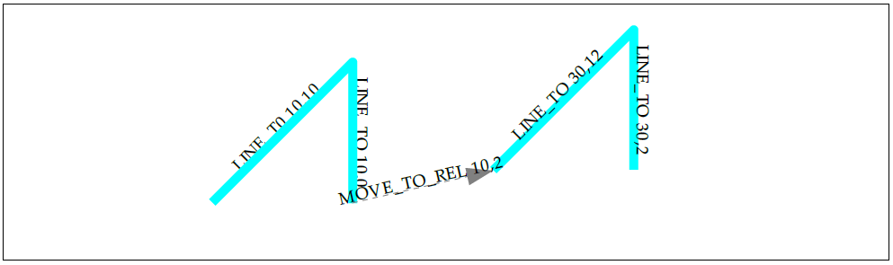
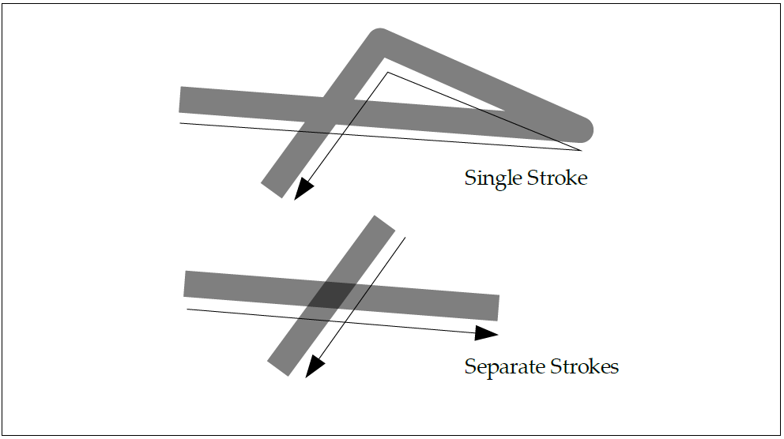
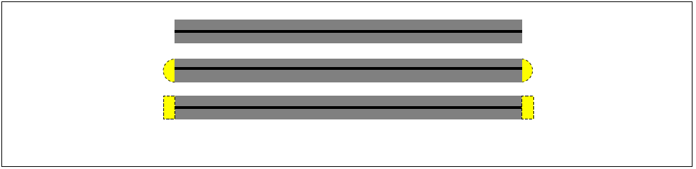
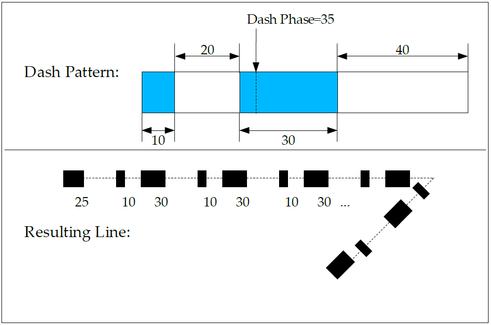

#### _Implicit Closure of Filled Subpaths_
<a name="Implicit_Closure_of_Filled_Subpaths"></a>
When filling a path, any subpaths that do not end with a `CLOSE_PATH` segment command (_i.e_., that are terminated with a `MOVE_TO_ABS` or `MOVE_TO_REL` segment command, or that contain the final segment of the path) are implicitly closed, without affecting the position of any other vertices of the path or the $\left( sx, sy\right)$, $\left( px, py\right)$ or $\left( ox, oy\right)$ variables. For example, consider the sequence of segment commands:

`MOVE_TO_ABS 0, 0`; `LINE_TO_ABS 10, 10`; `LINE_TO_ABS 10, 0`
`MOVE_TO_REL 10, 2`; `LINE_TO_ABS 30, 12`; `LINE_TO_ABS 30, 2`

If filled, this sequence will result in one filled triangle with vertices $\left( 0, 0\right)$, $\left( 10, 10\right)$, and $\left( 10, 0\right)$ and another filled triangle with vertices $\left( 20, 2\right)$, $\left( 30, 12\right)$, and $\left( 30, 2\right)$. Note that the implicit closure of the initial subpath prior to the `MOVE_TO_REL` segment command has no effect on the starting coordinate of the second triangle; it is computed by adding the relative offset $\left( 10, 2\right)$ to the final coordinate of the previous segment $\left( 10, 0\right)$ to obtain $\left( 20, 2\right)$ and is not altered by the (virtual) insertion of the line connecting the first subpath’s final vertex $\left( 10, 0\right)$ to its initial vertex $\left( 0, 0\right)$). Figure 10 illustrates this process, with the resulting filled areas highlighted. When stroking a path, no implicit closure takes place, as shown in Figure 11. Implicit closure affects only the output when filling a path, and does not alter the path data in any way.

_Figure 10: Implicit Closure of Filled Paths_
<a name="Figure10:Implicit_Closure_of_Filled_Paths"></a>


_Figure 11: Stroked Paths Have No Implicit Closure_
<a name="Figure11:Stroked_Paths_Have_No_Implicit_Closure"></a>

### _8.7.2 Stroking Paths_
<a name="Stroking_Paths"></a>
Stroking a path consists of “widening” the edges of the path using a straight-line pen held perpendicularly to the path. At the start and end vertices of the path, an additional end-cap style is applied. At interior vertices of the path, a line join style is applied. At a cusp of a Bézier segment, the pen is rotated smoothly between the incoming and outgoing tangents.

Conceptually, stroking of a path is performed in two steps. First, the stroke parameters are applied in the user coordinate system to form a new shape representing the end result of dashing, widening the path, and applying the end cap and line join styles. Second, a path is created that defines the outline of this stroked shape. This path is transformed using the path-user-to-surface transformation (possibly involving shape distortions due to non-uniform scaling or shearing). Finally, the resulting path is filled with paint in exactly the same manner as when filling a user-defined path using the non-zero fill rule.

Stroking a path applies a single “layer” of paint, regardless of any intersections between portions of the thickened path. Figure 12 illustrates this principle. A single stroke (above) is drawn with a black color and an alpha value of 50%, compared with two separate strokes (below) drawn with the same color and alpha values. The single stroke produces a shape with a uniform color of 50% gray, as if a single layer of translucent paint has been applied, even where portions of the path overlap one another. By contrast, the separate strokes produce two applications of the translucent paint in the area of overlap, resulting in a darkened area.

_Figure 12: Each Stroke Applies a Single Layer of Paint_
<a name="Figure12:_Each_Stroke_Applies_a_Single_Layer_of_Paint"></a>

### _8.7.3 Stroke Parameters_
<a name="Stroke_Parameters"></a>
Stroking a path involves the following parameters, set on a context:
* Line width in user coordinate system units
* End cap style – one of Butt, Round, or Square
* Line join style – one of Miter, Round, or Bevel
* Miter limit – if using Miter join style
* Dash pattern – array of dash on/off lengths in user units
* Dash phase – initial offset into the dash pattern

These parameters are set on the current context using the variants of the **vgSet** function. The values most recently set prior to calling **vgDrawPath** (see Section 8.8) are applied to generate the stroke.

#### _End Cap Styles_
<a name="End_Cap_Styles"></a>
Figure 13 illustrates the Butt (top), Round (center), and Square (bottom) end cap styles applied to a path consisting of a single line segment. Figure 14 highlights the additional geometry created by the end caps. The Butt end cap style terminates each segment with a line perpendicular to the tangent at each endpoint. The Round end cap style appends a semicircle with a diameter equal to the line width centered around each endpoint. The Square end cap style appends a rectangle with two sides of length equal to the line width perpendicular to the tangent, and two sides of length equal to half the line width parallel to the tangent, at each endpoint. The outgoing tangent is used at the left endpoint and the incoming tangent is used at the right endpoint.

_Figure 13: End Cap Styles_
<a name="Figure13:End_Cap_Styles"></a>


_Figure 14: End Cap Styles with Additional Geometry Highlighted_
<a name="Figure14:End_Cap_Styles_with_Additional_Geometry_Highlighted"></a>

#### _Line Join Styles_
<a name="Line_Join_Styles"></a>
Figure 15 illustrates the Bevel (left), Round (center), and Miter (right) line join styles applied to a pair of line segments. Figure 16 highlights the additional geometry created by the line joins. The Bevel join style appends a triangle with two vertices at the outer endpoints of the two “fattened” lines and a third vertex at the intersection point of the two original lines. The Round join style appends a wedge-shaped portion of a circle, centered at the intersection point of the two original lines, having a radius equal to half the line width. The Miter join style appends a trapezoid with one vertex at the intersection point of the two original lines, two adjacent vertices at the outer endpoints of the two “fattened” lines and a fourth vertex at the extrapolated intersection point of the outer perimeters of the two “fattened” lines.

When stroking using the Miter join style, the _miter length_ (_i.e_., the length between the intersection points of the inner and outer perimeters of the two “fattened” lines) is compared to the product of the user-set miter limit and the line width. If the miter length exceeds this product, the Miter join is not drawn and a Bevel join is substituted.

_Figure 15: Line Join Styles_
<a name="Figure15:Line_Join_Styles"></a>


_Figure 16: Line Join Styles with Additional Geometry Highlighted_
<a name="Figure16:Line_Join_Styles_with_Additional_Geometry_Highlighted"></a>

#### _Miter Length_
<a name="Miter_Length"></a>
The ratio of miter length to line width may be computed directly from the angle $\theta$ between the two line segments being joined as ${ 1 }/{ \sin { \left( { \theta  }/{ 2 } \right)}}$. A number of angles with their corresponding miter limits for a line width of 1 are shown in Table 9.

| _Angle (degrees)_ | _Miter Limit_ | _Angle (degrees)_ |  _Miter Limit_ |
| :---: | :---: | :---: | :---: |
| 10 | 11.47 | 45 | 2.61 |
| 11.47 | 10 | 60 | 2 |
| 23 | 5 | 90 | 1.41 |
| 28.95 | 4 | 120 | 1.15 |
| 30 | 3.86 | 150 | 1.03 |
| 38.94 | 3 | 180 | 1 |
_Table 9: Corresponding Angles and Miter_
<a name="Table9:Corresponding_Angles_and_Miter"></a>

#### _Dashing_
<a name="Dashing"></a>
The dash pattern consists of a sequence of lengths of alternating “on” and “off” dash segments. The first value of the dash array defines the length, in user coordinates, of the first “on” dash segment. The second value defines the length of the following “off” segment. Each subsequent pair of values defines one “on” and one “off” segment.

The dash phase defines the starting point in the dash pattern that is associated with the start of the first segment of the path. For example, if the dash pattern is [ 10 20 30 40 ] and the dash phase is 35, the path will be stroked with an “on” segment of length 25 (skipping the first “on” segment of length 10, the following “off” segment of length 20, and the first 5 units of the next “on” segment), followed by an “off” segment of length 40. The pattern will then repeat from the beginning, with an “on” segment of length 10, an “off” segment of length 20, an “on” segment of length 30, etc. Figure 17 illustrates this dash pattern.

Conceptually, dashing is performed by breaking the path into a set of subpaths according to the dash pattern. Each subpath is then drawn independently using the end cap, line join style, and miter limit that were set for the path as a whole.

Dashes of length 0 are drawn only if the end cap style is `VG_CAP_ROUND` or `VG_CAP_SQUARE`. The incoming and outgoing tangents (which may differ if the dash falls at a vertex of the path) are evaluated at the point, using the **vgPointAlongPath** algorithm. The end caps are drawn using the orientation of each tangent, and a join is drawn between them if the tangent directions differ. If the end cap style is `VG_CAP_BUTT`, nothing will be drawn.

A dash, or space between dashes, with length less than 0 is treated as having a length of 0.

A negative dash phase is equivalent to the positive phase obtained by adding a suitable multiple of the dash pattern length.


_Figure 17: Dash Pattern and Phase Example_
<a name="Figure17:Dash_Pattern_and_Phase_Example"></a>

### _8.7.4 Stroke Generation_
<a name="Stroke_Generation"></a>
The algorithm for generating a stroke is as follows. The steps described in this section conceptually take place in user coordinates, on a copy of the path being stroked in which all relative and implicit coordinates have been converted to absolute coordinates. An initial `MOVE_TO 0,0` segment is added if the path does not begin with a `MOVE_TO`.

The path to be stroked is divided into subpaths, each ending with a `MOVE_TO` or `CLOSE_PATH` segment command or with the final path segment. Subpaths consisting of only a single `MOVE_TO` segment are discarded.

A subpath consisting of a single point (_i.e_., a `MOVE_TO` segment followed by a sequence of `LINE_TO`, `QUAD_TO`, `CUBIC_TO`, and/or `ARC_TO` segments with all control points equal to the current point, possibly followed by a `CLOSE_PATH` segment) is collapsed to a lone vertex, which is marked as an END vertex (for later generation of end caps). A tangent vector of (1, 0) is used for Square end caps.

Subpaths that do not consist only of a single point have any zero-length segments removed.

If a subpath does not end with a `CLOSE_PATH` segment command, its first and last vertices are marked as END vertices. All the internal vertices that begin or end path segments within the subpath, as well as the initial/final vertex if the subpath ends with a `CLOSE_PATH` segment, are marked as JOIN vertices (for later generation of line joins).

Each subpath is processed in turn as described below until all subpaths have been stroked.

If dashing is enabled, the dash pattern and phase are used to break the subpath into a series of smaller subpaths representing the “on” portions of the dash pattern. New vertices are created at the endpoints of each dash subpath and marked as END vertices. The old subpath is discarded and replaced with the dash subpaths for the remainder of the stroke processing. The dash phase is advanced for each subsequent segment by the length of the previous segment (where `CLOSE_PATH` segments are treated as `LINE_TO`segments). If `VG_DASH_PHASE_RESET` is disabled (set to `VG_FALSE`), the final dash phase at the end of the subpath is used as the initial dash phase for the next subpath. Otherwise, the original dash phase is used for all subpaths.

For each END vertex, an end cap is created (if Square or Round end caps have been requested) using the orientation given by the tangent vector. The tangent vector is defined in the same manner as for the **vgPointAlongPath** function (see Section 8.6.11).

For each JOIN vertex, a line join is created using the orientations given by the tangent vectors of the two adjacent path segments. If Miter joins are being used, the length of the miter is computed and compared to the product of the line width and miter limit; if the miter would be too long, a Bevel join is substituted.

### _8.7.5 Setting Stroke Parameters_
<a name="Setting_Stroke_Parameters"></a>
Setting the line width of a stroke is performed using **vgSetf** with a `paramType`argument of `VG_STROKE_LINE_WIDTH`. A line width less than or equal to 0 prevents stroking from taking place.
```
VGfloat lineWidth;
vgSetf(VG_STROKE_LINE_WIDTH, lineWidth);
```

#### _VGCapStyle_
<a name="VGCapStyle"></a>
The `VGCapStyle` enumeration defines constants for the Butt, Round, and Square end cap styles:
```
typedef enum {
  VG_CAP_BUTT = 0x1700,
  VG_CAP_ROUND = 0x1701,
  VG_CAP_SQUARE = 0x1702
} VGCapStyle;
```
Setting the end cap style is performed using **vgSeti** with a `paramType` argument of `VG_STROKE_CAP_STYLE` and a value from the `VGCapStyle` enumeration.
```
VGCapStyle capStyle;
vgSeti(VG_STROKE_CAP_STYLE, capStyle);
```
#### _VGJoinStyle_
<a name="VGJoinStyle"></a>
The `VGJoinStyle` enumeration defines constants for the Miter, Round, and Bevel line join styles:
```
typedef enum {
  VG_JOIN_MITER = 0x1800,
  VG_JOIN_ROUND = 0x1801,
  VG_JOIN_BEVEL = 0x1802
} VGJoinStyle;
```
Setting the line join style is performed using **vgSeti** with a `paramType` argument of `VG_STROKE_JOIN_STYLE` and a value from the `VGJoinStyle` enum.
```
VGJoinStyle joinStyle;
vgSeti(VG_STROKE_JOIN_STYLE, joinStyle);
```
Setting the miter limit is performed using **vgSetf** with a `paramType` argument of `VG_STROKE_MITER_LIMIT`:
```
VGfloat miterLimit;
vgSetf(VG_STROKE_MITER_LIMIT, miterLimit);
```
Miter limit values less than 1 are silently clamped to 1.


#### _VG_MAX_DASH_COUNT_
<a name="VG_MAX_DASH_COUNT"></a>
The `VG_MAX_DASH_COUNT` parameter contains the maximum number of dash segments that may be supplied for the `VG_STROKE_DASH_PATTERN` parameter. All implementations must must support at least 16 dash segments (8 on/off pairs). If there is no implementation-defined limit, a value of `VG_MAXINT` may be returned. The value may be retrieved by calling **vgGeti**:
```
VGint maxDashCount = vgGeti(VG_MAX_DASH_COUNT);
```

#### _Setting the Dash Pattern_
<a name="Setting_the_Dash_Pattern"></a>
The dash pattern is set using **vgSetfv** with a `paramType` argument of `VG_STROKE_DASH_PATTERN`:
```
VGfloat dashPattern[DASH_COUNT];
VGint count = DASH_COUNT;
vgSetfv(VG_STROKE_DASH_PATTERN, count, dashPattern);
```
Dashing may be disabled by calling **vgSetfv** with a `count` of 0:
```
vgSetfv(VG_STROKE_DASH_PATTERN, 0, NULL);
```
The dash phase is set using **vgSetf** with a `paramType` argument of `VG_STROKE_DASH_PHASE`. The resetting behavior of the dash phase when advancing to a new subpath is set using **vgSeti** with a `paramType` argument of `VG_STROKE_DASH_PHASE_RESET`:
```
VGfloat dashPhase;
VGboolean dashPhaseReset;
vgSetf(VG_STROKE_DASH_PHASE, dashPhase);
vgSeti(VG_STROKE_DASH_PHASE_RESET, dashPhaseReset);
```
If the dash pattern has length 0, dashing is not performed. If the dash pattern has an odd number of elements, the final element is ignored. Note that this behavior is different from that defined by SVG; the SVG behavior may be implemented by duplicating the oddlength dash pattern to obtain one with even length.

If more than `VG_MAX_DASH_COUNT` dashes are specified, those beyond the first `VG_MAX_DASH_COUNT` are discarded immediately (and will not be returned by **vgGet**).

### _8.7.6 Non-Scaling Strokes_
<a name="Non-Scaling_Strokes"></a>
In some cases, applications may wish stroked geometry to appear with a particular stroke width in the surface coordinate system, independent of the current user-to-surface transformation. For example, a stroke representing a road on a map might stay the same width as the user zooms in and out of the map, since the stroke width is intended to indicate the type of road (_e.g_., one-way street, divided road, interstate highway or Autobahn) rather than its true width on the ground.

OpenVG does not provide direct support for this “non-scaling stroke” behavior. However, the behavior may be obtained relatively simply using a combination of features.

If the current user-to-surface transformation consists only of uniform scaling, rotation, and translation (_i.e_., no shearing or non-uniform scaling), then the stroke width may be set to the desired stroke width in drawing surface coordinates, divided by the scaling factor introduced by the transformation. This scaling factor may be known to the application _a priori_, or else it may be computed as the square root of the absolute value of the determinant $\left( sx\ast sy-shx\ast shy \right)$ of the user-to-surface transformation.

If the user-to-surface transformation includes shearing or non-uniform scaling, the geometry to be stroked must be transformed into surface coordinates prior to stroking. The paint transformation must also be set to the concatenation of the paint-to-user and user-to-surface transformations in order to allow correct painting of the stroked geometry. The following code illustrates this technique:
```
VGPath srcPath; /* Path to be drawn with non-scaling stroke */
VGPath dstPath; /* Path in drawing surface coordinates */
VGfloat strokePaintToUser[9]; /* Paint-to-user transformation */
VGfloat pathUserToSurface[9]; /* User-to-surface transformation */

/* Transform the geometry into surface coordinates. */
vgSeti(VG_MATRIX_MODE, VG_MATRIX_PATH_USER_TO_SURFACE);
vgLoadMatrix(pathUserToSurface);
vgTransformPath(dstPath, srcPath);

/* Use the identity matrix for drawing the stroked path. */
vgLoadIdentity();

/* Set the paint transformation to the concatenation of the
 * paint-to-user and user-to-surface transformations.
 */
vgSeti(VG_MATRIX_MODE, VG_MATRIX_FILL_PAINT_TO_USER);
vgLoadMatrix(pathUserToSurface);
vgMultMatrix(strokePaintToUser);

/* Stroke the transformed path. */
vgDrawPath(dstPath, VG_STROKE_PATH);
```

## _8.8 Filling or Stroking a Path_
<a name="Filling_or_Stroking_a_Path"></a>
#### _VGFillRule_
<a name="VGFillRule"></a>
The `VGFillRule` enumeration defines constants for the even/odd and non-zero fill rules.
```
typedef enum {
  VG_EVEN_ODD = 0x1900,
  VG_NON_ZERO = 0x1901
} VGFillRule;
```
To set the rule for filling, call **vgSeti** with a `type` parameter value of `VG_FILL_RULE` and a `value` parameter defined using a value from the `VGFillRule` enumeration. When the path is filled, the most recent setting of the fill rule on the current context is used. The fill rule setting has no effect on stroking.
```
VGFillRule fillRule;
vgSeti(VG_FILL_RULE, fillRule);
```
#### _VGPaintMode_
<a name="VGPaintMode"></a>
The `VGPaintMode` enumeration defines constants for stroking and filling paths, to be used by the **vgDrawPath**, **vgSetPaint**, and **vgGetPaint** functions.
```
typedef enum {
  VG_STROKE_PATH = (1 << 0),
  VG_FILL_PATH   = (1 << 1)
} VGPaintMode;
```
#### _vgDrawPath_
<a name="vgDrawPath"></a>
Filling and stroking are performed by the **vgDrawPath** function. The `paintModes` argument is a bitwise OR of values from the `VGPaintMode` enumeration, determining whether the path is to be filled (`VG_FILL_PATH`), stroked (`VG_STROKE_PATH`), or both (`VG_FILL_PATH` | `VG_STROKE_PATH`). If both filling and stroking are to be performed, the path is first filled, then stroked.
```
void vgDrawPath(VGPath path, VGbitfield paintModes)
```

> **_ERRORS_**
>
> `VG_BAD_HANDLE_ERROR`
> * if `path` is not a valid path handle, or is not shared with the current context
>
> `VG_ILLEGAL_ARGUMENT_ERROR`
> * if `paintModes` is not a valid bitwise OR of values from the `VGPaintMode` enumeration

#### _Filling a Path_
<a name="Filling_a_Path"></a>
Calling **vgDrawPath** with a `paintModes` argument of `VG_FILL_PATH` causes the given path to be filled, using the paint defined for the `VG_FILL_PATH` paint mode and the current fill rule.

The matrix currently set for the `VG_MATRIX_FILL_PAINT_TO_USER` matrix mode is applied to the paint used to fill the path outline. The matrix currently set for the `VG_MATRIX_PATH_USER_TO_SURFACE` matrix mode is used to transform the outline of the path and the paint into surface coordinates.
```
vgDrawPath(VGPath path, VG_FILL_PATH);
```

#### _Stroking a Path_
<a name="Stroking_a_Path"></a>
Calling **vgDrawPath** with a `paintModes` argument of `VG_STROKE_PATH` causes the given path to be stroked, using the paint defined for the `VG_STROKE_PATH` paint mode and the current set of stroke parameters.

The matrix currently set for the `VG_MATRIX_STROKE_PAINT_TO_USER` matrix mode is applied to the paint used to fill the stroked path outline. The matrix currently set for the `VG_MATRIX_PATH_USER_TO_SURFACE` matrix mode is used to transform the outline of the stroked path and the paint into surface coordinates.
```
vgDrawPath(VGPath path, VG_STROKE_PATH);
```
The following code sample shows how an application might set stroke parameters using variants of **vgSet**, and stroke a path object (defined elsewhere):
```
VGPath path;

/* Set the line width to 2.5 */
vgSetf(VG_STROKE_LINE_WIDTH, 2.5f);
/* Set the miter limit to 10.5 */
vgSetf(VG_STROKE_MITER_LIMIT, 10.5f);
/* Set the cap style to CAP_SQUARE */
vgSeti(VG_STROKE_CAP_STYLE, VG_CAP_SQUARE);
/* Set the join style to JOIN_MITER */
vgSeti(VG_STROKE_JOIN_STYLE, VG_JOIN_MITER);

/* Set the dash pattern */
VGfloat dashes[] = { 1.0f, 2.0f, 2.0f, 2.0f };
vgSetfv(VG_STROKE_DASH_PATTERN, 4, dashes);

/* Set the dash phase to 0.5 and reset it for every subpath */
vgSetf(VG_STROKE_DASH_PHASE, 0.5f);
vgSeti(VG_STROKE_DASH_PHASE_RESET, VG_TRUE);

/* Stroke the path */
vgDrawPath(path, VG_STROKE_PATH);
```

#### _Filling and Stroking a Path_
<a name="Filling_and_Stroking_a_Path"></a>
Calling **vgDrawPath** with a `paintModes` argument of (`VG_FILL_PATH` | `VG_STROKE_PATH`) causes the given path to be first filled, then stroked, exactly as if **vgDrawPath** were called twice in succession, first with a `paintModes` argument of `VG_FILL_PATH` and second with a `paintModes` argument of `VG_STROKE_PATH`.
```
vgDrawPath(VGPath path, VG_FILL_PATH | VG_STROKE_PATH);
```
