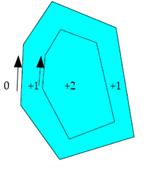

<a name="chapter08"></a><a name="Paths"></a>
# _8 Paths_
Paths are the heart of the OpenVG API. All geometry to be drawn must be defined in terms of one or more paths. Paths are defined by a sequence of _segment commands_ (or _segments_). Each segment command in the standard format may specify a move, a straight line segment, a quadratic or cubic Bézier segment, or an elliptical arc. Extensions may define other segment types.

<a name="Moves"></a>
## _8.1 Moves_
A path segment may consist of a “move to” segment command that causes the path to jump directly to a given point, starting a new subpath without drawing.

<a name="Straight_Line_Segments"></a>
## _8.2 Straight Line Segments_
Paths may contain horizontal, vertical, or arbitrary line segment commands. A special “close path” segment command may be used to generate a straight line segment joining the current vertex of a path to the vertex that began the current portion of the path.

<a name="Bézier_Curves"></a>
## _8.3 Bézier Curves_
Bézier curves are polynomial curves defined using a parametric representation. That is, they are defined as the set of points of the form $(x(t), y(t))$, where $x(t)$ and $y(t)$ are polynomials of t and t varies continuously from 0 to 1. Paths may contain quadratic or cubic Bézier segment commands.

<a name="Quadratic_Bézier_Curves"></a>
### _8.3.1 Quadratic Bézier Curves_
A quadratic Bézier segment is defined by three control points, $(x0, y0)$, $(x1, y1)$, and $(x2, y2)$. The curve starts at $(x0, y0)$ and ends at $(x2, y2)$. The shape of the curve is influenced by the placement of the internal control point $(x1, y1)$, but the curve does not usually pass through that point. Assuming non-coincident control points, the tangent of the curve at the initial point $x_0$ is aligned with and has the same direction as the vector $x_1 – x_0$ and the tangent at the final point $x_2$ is aligned with and has the same direction as the vector $x_2 – x_1$. The curve is defined by the set of points $(x(t), y(t))$ as $t$ varies from 0 to 1, where:

$$x(t)=x_0(1-t)^2+2*x_1*(1-t)*t+x_2*t^2\\
y(t)=y_0(1-t)^2+2*y_1*(1-t)*t+y_2*t^2$$

<a name="Cubic_Bézier_Curves"></a>
### _8.3.2 Cubic Bézier Curves_
Cubic Bézier segments are defined by four control points $(x0, y0)$, $(x1, y1)$, $(x2, y2)$, and $(x3, y3)$. The curve starts at $(x_0, y_0)$ and ends at $(x_3, y_3)$. The shape of the curve is influenced by the placement of the internal control points $(x_1, y_1)$ and $(x_2, y_2)$, but the curve does not usually pass through those points. Assuming non-coincident control points, the tangent of the curve at the initial point $x_0$ is aligned with and has the same direction as the vector $x_1 – x_0$ and the tangent at the final point $x_3$ is aligned with and has the same direction as the vector $x_3 – x_2$. The curve is defined by the set of points $(x(t), y(t))$ as $t$ varies from 0 to 1, where:

$$x(t)=x_0*(1-t)^3+3*x_1*(1-t)^2*t+3*x_2*(1-t)*t^2+x_3*t^3\\
y(t)=y_0*(1-t)^3+3*y_1*(1-t)^2*t+3*y_2*(1-t)*t^2+y_3*t^3$$

<a name="G1_Smooth_Segments"></a>
### _8.3.3 **$G^1$** Smooth Segments_
$G^1$ Smooth quadratic or cubic segments implicitly define their first internal control point in such a manner as to guarantee a continuous tangent direction at the join point when they are joined to a preceding quadratic or cubic segment. Geometrically, this ensures that the two segments meet without a sharp corner. However, the length of the unnormalized tangent vector may experience a discontinuity at the join point.

$G^1$ smoothness at the initial point of a quadratic or cubic segment may be guaranteed by suitable placement of the first internal control point $(x_1, y_1)$ of the following segment. Given a previous quadratic or cubic segment with an internal control point $(px, py)$ and final endpoint $(ox, oy)$, we compute $(x_1, y_1)$ as $(2 * ox – px, 2 * oy – py)$ (_i.e.,_ the reflection of the point $(px, py)$ about the point $(ox, oy)$). For segments of the same type, this will provide $C^1$ smoothness (see the next section).

<a name="figure04"> </a>

_Figure 4: Smooth Curve Construction_

<a name="C1_Smooth_Segments"></a>
### _8.3.4 **$C^1$** Smooth Segments_
_[ Note: this section is informative only. ]_

$C^1$ smooth quadratic or cubic segments define their first internal control point $(x_1, y_1)$ in such a manner as to guarantee a continuous first derivative at the join point when they are joined to a preceding quadratic or cubic segment. Geometrically, this ensures that the two segments meet with continuous parametric velocity at the join point. This is a stronger condition than $G^1$ continuity.

Note that joining a $C^1$ smooth segment to a preceding line segment will not produce a smooth join. To guarantee a smooth join, convert line segments to equivalent quadratic or cubic curves whose internal control points all lie along the line segment.

Given a previous quadratic or cubic segment with an internal control point $(px, py)$ and final endpoint $(ox, oy)$, $(x_1, y_1)$ is computed as follows:

* When joining a previous quadratic or cubic segment to a following segment of the same type (quadratic or cubic):
$$ (x_1,y_1) = (2 * ox-px,2 * oy-py) $$
* When joining a previous quadratic segment to a following cubic segment:
$$ (x_1,y_1) = (5 * ox - 2 * px,5 * oy - 2 * py)/3 $$
* When joining a previous cubic segment to a following quadratic segment:
$$ (x_1,y_1) = (5 * ox- 3 * px, 5 * oy-3 * py)/2 $$

<a name="C2_Smooth_Segments"></a>
### _8.3.5 $C^2$ Smooth Segments_
_[ Note: this section is informative only. ]_
$C^2$ smooth cubic segments implicitly define both of their internal control points $(x_1, y_1)$ and $(x_2, y_2)$ in such a manner as to guarantee continuous first and second derivatives at the join point when they are joined to a preceding quadratic or cubic segment. Geometrically, this ensures that the two segments meet with continuous velocity and acceleration at the join point.

Note that joining a $C^2$ smooth segment to a preceding line segment will not produce a smooth join. To guarantee a smooth join, convert line segments to equivalent quadratic or cubic curves whose internal control points all lie along the line segment.

Given three previous control points $(qx, qy)$, $(px, py)$, and $(ox, oy)$ (for a quadratic segment, $(qx, qy)$ is the initial endpoint, $(px, py)$ is the internal control point and $(ox, oy)$ is the final endpoint; for a cubic segment, $(qx, qy)$, and $(px, py)$ are the first and second internal control points, respectively, and $(ox, oy)$ is the final endpoint), $(x_1, y_1)$ is computed as described in the preceding section, and $(x_2, y_2)$ is computed as follows.

* When joining a previous quadratic segment to a following cubic segment:
$$ (x_2,y_2) = (8 * ox-6 * px+qx, 8 * oy-6 *py+qy)/3 $$
* When joining a previous cubic segment to a following cubic segment:
$$ (x_2,y_2) = (4 * (ox-px)+qx, 4*(oy-py)+qy) $$

<a name="Converting_Segments_From _Qudratic_to_Cubic_Form"></a>
### _8.3.6 Converting Segments From Quadratic to Cubic Form_
_[ Note: This section is informative only. ]_

Given a quadratic Bézier curve with control points $(x_0, y_0)$, $(x_1, y_1)$, and $(x_2, y_2)$, an
identical cubic Bézier curve may be formed using the control points $(x_0, y_0)$, $(x_0 + 2 * x_1, y_0 + 2 * y_1)/3, (x_2 + 2 * x_1, y_2 + 2 * y_1)/3, (x_2, y_2)$.

<a name="Elliptical_Arcs"></a>
## _8.4 Elliptical Arcs_
Elliptical arc segments join a pair of points with a section of an ellipse with given horizontal and vertical axes and a rotation angle (in degrees). Given these parameters,there are four possible arcs distinguished by their direction around the ellipse (clockwise or counter-clockwise) and whether they take the smaller or larger path around the ellipse.

Figure 5 below shows the two possible ellipses with horizontal axis $rh$, vertical axis $rv$, and counter-clockwise rotation angle rot (shown as the angle between the vertical line labeled rot and the line labeled $rv$) passing through the points $(x_0, y_0)$ and $(x_1, y_1)$. The four arcs connecting the points are labeled L and S for large and small, and CW and CCW for clockwise and counter-clockwise.

Negative values of $rh$ and $rv$ are replaced with their absolute values. If exactly one of $rh$ and $rv$ is 0, and the arc endpoints are not coincident, the arc is drawn as if it were projected onto the line containing the endpoints. If both $rh$ and $rv$ are 0, or if the arc endpoints are coincident, the arc is drawn as a line segment between its endpoints. The rot parameter is taken modulo 360 degrees.

If no elliptical arc exists with the given parameters because the endpoints are too far apart (as detailed in the next section), the arc is drawn as if the radii were scaled up uniformly by the smallest factor that permits a solution.

Notes on the mathematics of ellipses are provided in Appendix A (Section 18).

<a name="figure05"> </a>

_Figure 5: Elliptical Arcs_

<a name="The_Standard_Path_Format"></a>
## _8.5 The Standard Path Format_
Complex paths may be constructed in application memory and passed into OpenVG to define a `VGPath` object. Such path data is defined by a sequence of segment commands referencing a separate sequence of geometric coordinates and parameters.

In this section, we define the standard data format for paths that may be used to definesequences of various types of path segments. Extensions may define other path data formats.

<a name="VG_PATH_FORMAT_STANDARD"></a>
#### _VG_PATH_FORMAT_STANDARD_

The `VG_PATH_FORMAT_STANDARD `macro defines a constant to be used as an argument to **vgCreatePath** to indicate that path data are stored using the standard format. As this API is revised, the lower 16 bits of version number may increase. Each version of OpenVG will accept formats defined in all prior specification versions with which it is backwards-compatible.

Extensions wishing to define additional path formats may register for format identifiers that will differ in their upper 16 bits;the lower 16 bits may be used by the extension vendor for versioning purposes.

```c
#define VG_PATH_FORMAT_STANDARD 0;
```

<a name="Path_Segment_Command_Side_Effects"></a>
### _8.5.1 Path Segment Command Side Effects_

In order to define the semantics of each segment command type, we define three reference points (all are initially (0, 0)):

• *(sx, sy)*: the beginning of the current subpath, _i.e_., the position of the last `MOVE_TO` segment.

• *(ox, oy)*: the last point of the previous segment.

• *(px, py)*: the last internal control point of the previous segment, if the segment was a (regular or smooth) quadratic or cubic Bézier, or else the last point of the previous segment.

Figure 6 illustrates the locations of these points at the end of a sequence of segment commands `{ MOVE_TO, LINE_TO, CUBIC_TO }`.

<a name="figure06"> </a>

*Figure 6: Segment Reference Points*

We define points *(x0, y0)*, *(x1, y1)*, and *(x2, y2)* in the discussion below as absolute coordinates. For segments defined using relative coordinates, *(x0, y0)*, etc., are defined as the incoming coordinate values added to $(ox, oy)$. Ellipse rh, rv, and rot parameters are unaffected by the use of relative coordinates. Each segment (except for `MOVE_TO` segments) begins at the point $(ox, oy)$ defined by the previous segment.

A path consists of a sequence of subpaths. As path segment commands are encountered, each segment is appended to the current subpath. The current subpath is ended by a `MOVE_TO` or `CLOSE_PATH` segment, and a new current subpath is begun. The end of the path data also ends the current subpath.

<a name="Segment_Commands"></a>
### _8.5.2 Segment Commands_

The following table describes each segment command type along with its prefix, the number of specified coordinates and parameters it requires, the numerical value of the segment command, the formulas for any implicit coordinates, and the side effects of the segment command on the points $(ox, oy)$, *(sx, sy)*, and $(px, py)$ and on the termination of the current subpath.

<a name="table06"> </a>
_**Type**_ | _**VGPathSegment**_ | _**Coordinates**_ | _**Value**_ | _**Implicit Points**_ | _**Side Effects**_
---- | ------------- | ----------- | ----- | --------------- | ------------
Close Path| `CLOSE_PATH` | *none* | 0 | | *(px,py)=(ox,oy)=(sx,sy)* End current subpath
Move|`MOVE_TO`|*x0,y0*|2||*(sx,sy)=(px,py)=(ox,oy)=(x0,y0)* End current subpath
Line|`LINE_TO`|*x0,y0*|4||*(px,py)=(ox,oy)=(x0,y0)*
Horiz Line|`HLINE_TO`|*x0* |6| *y0=oy*|*(px,py)=(x0,oy) ox=x0*
Vertical Line|`VLINE_TO`|*y0*|8|*x0=ox*|*(px,py)=(ox,y0) oy=y0*
Quadratic|`QUAD_TO`|*x0,y0,x1,y1*|10||*(px,py)=(x0,y0) (ox,oy)=(x1,y1)*
Cubic|`CUBIC_TO`|*x0,y0,x1,y1,x2,y2*|12||*(px,py)=(x1,y1) (ox,oy)=(x2,y2)*
G1 Smooth Quad|`SQUAD_TO`|*x1,y1*|14|*(x0,y0)=(2*ox-px,2*oy-py)*|*(px,py)= (2*ox-px, 2*oy-py) (ox,oy)=(x1,y1)*
G1 Smooth Cubic|`SCUBIC_TO`|*x1,y1,x2,y2*|16|*(x0,y0)=(2*ox-px,2*oy-py)*|*(px,py)=(x1,y1) (ox,oy)=(x2,y2)*
Small CCW Arc|`SCCWARC_TO`|*rh,rv,rot,x0,y0*|18||*(px,py)=(ox,oy)=(x0,y0)*
Small CW Arc|`SCWARC_TO`|*rh,rv,rot,x0,y0*|20||*(px,py)=(ox,oy)=(x0,y0)*
Large CCW Arc |`LCCWARC_TO`|*rh,rv,rot,x0,y0*|22||*(px,py)=(ox,oy)=(x0,y0)*
Large CW Arc|`LCWARC_TO`|*rh,rv,rot,x0,y0*|24||*(px,py)=(ox,oy)=(x0,y0)*
Reserved|Reserved| |26,28,30| |
*Table 6: Path Segment Commands*

Each segment type may be defined using either absolute or relative coordinates. A relative coordinate $(x, y)$ is added to $(ox, oy)$ to obtain the corresponding absolute coordinate $(ox + x, oy + y)$. Relative coordinates are converted to absolute coordinates immediately as each segment is encountered during rendering.

The `HLINE_TO` and `VLINE_TO` segment types are provided in order to avoid the need for an SVG viewing application (for example) to perform its own relative to absolute conversions when parsing path data.

In SVG, the behavior of smooth quadratic and cubic segments differs slightly from the behavior defined above. If a smooth quadratic segment does not follow a quadratic segment, or a smooth cubic segment does not follow a cubic segment, the initial control point $(x0, y0)$ is placed at $(ox, oy)$ instead of being computed as the reflection of $(px, py)$.This behavior may be emulated by converting an SVG smooth segment into a regular segment with all of its control points specified when the preceding segment is of a different degree.

Note that the coordinates of a path are defined even if the path begins with a segment type other than `MOVE_TO` (including `HLINE_TO`, `VLINE_TO`, or relative segment types) since the coordinates are based on the initial values of $(ox, oy)$, $(sx, sy)$, and *(px, py)* which are each defined as (0, 0).

<a name="Coordinate_Data_Formats"></a>
### _8.5.3 Coordinate Data Formats_

Coordinate and parameter data (henceforth called simply coordinate data) may be expressed in the set of formats shown in Table 7 below. Multi-byte coordinate data (*i.e*., `S_16`, `S_32` and F datatypes) are represented in application memory using the native byte order (endianness) of the platform. Implementations may quantize incoming data in the `S_32` and F formats to a lesser number of bits, provided at least 16 bits of precision are maintained.

Judicious use of smooth curve segments and 8- and 16-bit datatypes can result in substantial memory savings for common path data, such as font glyphs. Using smaller datatypes also conserves bus bandwidth when transferring paths from application memory to OpenVG.

<a name="table07"> </a>
_**Datatype**_|`VG_PATH_DATATYPE`\_**Suffix**_|_**bytes**_|_**Value**_
--------------|-------------------------------|-----------|-----------
8-bit signed integer|`S_8`|1|0
16-bit signed integer|`S_16`|2|1
32-bit signed integer|`S_32`|4|2
IEEE 754 floating-point|`F`|4|3

*Table 7: Path Coordinate Datatypes*

<a name="VGPathDatatype"></a>
#### _VGPathDatatype_

The `VGPathDatatype` enumeration defines values describing the possible numerical datatypes for path coordinate data.

```c
typedef enum {
  VG_PATH_DATATYPE_S_8 = 0,
  VG_PATH_DATATYPE_S_16 = 1,
  VG_PATH_DATATYPE_S_32 = 2,
  VG_PATH_DATATYPE_F = 3
} VGPathDatatype;
```

<a name="Segment_Type_Marker_Definitions"></a>
### _8.5.4 Segment Type Marker Definitions_

Segment type markers are defined as 8-bit integers, with the leading 3 bits reserved for future use, the next 4 bits containing the segment command type, and the least significant bit indicating absolute vs. relative coordinates (0 for absolute, 1 for relative). The reserved bits must be set to 0.

For the `CLOSE_PATH` segment command, the value of the Abs/Rel bit is ignored.

<a name="figure07"> </a>

*Figure 7: Segment Type Marker Layout*

<a name=" VGPathAbsRel"></a>
#### _VGPathAbsRel_

The `VGPathAbsRel` enumeration defines values indicating absolute (`VG_ABSOLUTE`) and relative (`VG_RELATIVE`) values.

```c
typedef enum {
  VG_ABSOLUTE = 0,
  VG_RELATIVE = 1
} VGPathAbsRel;
```

<a name="VGPathSegment"></a>
#### _VGPathSegment_

The `VGPathSegment` enumeration defines values for each segment command type. The values are pre-shifted by 1 bit to allow them to be combined easily with values from `VGPathAbsRel`.

```c
typedef enum {
  VG_CLOSE_PATH = ( 0 << 1),
  VG_MOVE_TO = ( 1 << 1),
  VG_LINE_TO = ( 2 << 1),
  VG_HLINE_TO = ( 3 << 1),
  VG_VLINE_TO = ( 4 << 1),
  VG_QUAD_TO = ( 5 << 1),
  VG_CUBIC_TO = ( 6 << 1),
  VG_SQUAD_TO = ( 7 << 1),
  VG_SCUBIC_TO = ( 8 << 1),
  VG_SCCWARC_TO = ( 9 << 1),
  VG_SCWARC_TO = (10 << 1),
  VG_LCCWARC_TO = (11 << 1),
  VG_LCWARC_TO = (12 << 1)
} VGPathSegment;
```

<a name="VGPathCommand"></a>
#### _VGPathCommand_

The `VGPathCommand` enumeration defines combined values for each segment command type and absolute/relative value. The values are shifted left by one bit and ORed bitwise (*i.e*., using the C | operator) with the appropriate value from `VGPathAbsRel` to obtain a complete segment command value.

```c
typedef enum {
  VG_MOVE_TO_ABS = VG_MOVE_TO | VG_ABSOLUTE,
  VG_MOVE_TO_REL = VG_MOVE_TO | VG_RELATIVE,
  VG_LINE_TO_ABS = VG_LINE_TO | VG_ABSOLUTE,
  VG_LINE_TO_REL = VG_LINE_TO | VG_RELATIVE,
  VG_HLINE_TO_ABS = VG_HLINE_TO | VG_ABSOLUTE,
  VG_HLINE_TO_REL = VG_HLINE_TO | VG_RELATIVE,
  VG_VLINE_TO_ABS = VG_VLINE_TO | VG_ABSOLUTE,
  VG_VLINE_TO_REL = VG_VLINE_TO | VG_RELATIVE,
  VG_QUAD_TO_ABS = VG_QUAD_TO | VG_ABSOLUTE,
  VG_QUAD_TO_REL = VG_QUAD_TO | VG_RELATIVE,
  VG_CUBIC_TO_ABS = VG_CUBIC_TO | VG_ABSOLUTE,
  VG_CUBIC_TO_REL = VG_CUBIC_TO | VG_RELATIVE,
  VG_SQUAD_TO_ABS = VG_SQUAD_TO | VG_ABSOLUTE,
  VG_SQUAD_TO_REL = VG_SQUAD_TO | VG_RELATIVE,
  VG_SCUBIC_TO_ABS = VG_SCUBIC_TO | VG_ABSOLUTE,
  VG_SCUBIC_TO_REL = VG_SCUBIC_TO | VG_RELATIVE,
  VG_SCCWARC_TO_ABS = VG_SCCWARC_TO | VG_ABSOLUTE,
  VG_SCCWARC_TO_REL = VG_SCCWARC_TO | VG_RELATIVE,
  VG_SCWARC_TO_ABS = VG_SCWARC_TO | VG_ABSOLUTE,
  VG_SCWARC_TO_REL = VG_SCWARC_TO | VG_RELATIVE,
  VG_LCCWARC_TO_ABS = VG_LCCWARC_TO | VG_ABSOLUTE,
  VG_LCCWARC_TO_REL = VG_LCCWARC_TO | VG_RELATIVE,
  VG_LCWARC_TO_ABS = VG_LCWARC_TO | VG_ABSOLUTE,
  VG_LCWARC_TO_REL = VG_LCWARC_TO | VG_RELATIVE
} VGPathCommand;
```

<a name="Path_Example"></a>
### _8.5.5 Path Example_

The following code example shows how to traverse path data stored in application memory using the standard representation. A byte is read containing a segment command, and the segment command type and relative/absolute flag are extracted by application-defined `SEGMENT_COMMAND` and `SEGMENT_ABS_REL` macros. The number of coordinates and number of bytes per coordinate (for the given data format) are also determined using lookup tables. Finally, the relevant portion of the path data stream representing the current segment is copied into a temporary buffer and used as an argument to a user-defined **processSegment** function that may perform further processing.

```c
#define PATH_MAX_COORDS 6 /* Maximum number of coordinates/command */
#define PATH_MAX_BYTES 4 /* Bytes in largest data type */
#define SEGMENT_COMMAND(command) /* Extract segment type */ \
((command) & 0x1e)
#define SEGMENT_ABS_REL(command) /* Extract absolute/relative bit */ \
((command) & 0x1)
/* Number of coordinates for each command */
static const VGint numCoords[] = {0,2,2,1,1,4,6,2,4,5,5,5,5};
/* Number of bytes for each datatype */
static const VGint numBytes[] = {1,2,4,4};
/* User-defined function to process a single segment */
extern void
processSegment(VGPathSegment command, VGPathAbsRel absRel,
    VGPathDatatype datatype, void * segmentData);
/* Process a path in the standard format, one segment at a time. */
void processPath(const VGubyte * pathSegments, const void * pathData,
    int numSegments, VGPathDatatype datatype)
{
  VGubyte segmentType, segmentData[PATH_MAX_COORDS*PATH_MAX_BYTES];
  VGint segIdx = 0, dataIdx = 0;
  VGint command, absRel, numBytes;
  while (segIdx < numSegments)
  {
    segmentType = pathSegments[segIdx++];
    command = SEGMENT_COMMAND(segmentType);
    absRel = SEGMENT_ABS_REL(segmentType);
    numBytes = numCoords[command]*numBytes[datatype];
    /* Copy segment data for further processing */
    memcpy(segmentData, &pathData[dataIdx], numBytes);
    /* Process command */
    processSegment(command, absRel, datatype, (void *) segmentData);
    dataIdx += numBytes;
  }
}
```

<a name="Path_Operations"></a>
## _8.6 Path Operations_

In addition to filling or stroking a path, the API allows the following basic operations on paths:

• Create a path with a given set of capabilities (**vgCreatePath**)

• Remove data from a path (**vgClearPath**)

• Deallocate a path (**vgDestroyPath**)

• Query path information (**using vgGetParameter**)

• Query the set of capabilities for a path (**vgGetPathCapabilities**)

• Reduce the set of capabilities for a path (**vgRemovePathCapabilities**)

• Append data from one path onto another (**vgAppendPath**)

• Append data onto a path (**vgAppendPathData**)

• Modify coordinates stored in a path (**vgModifyPathCoords**)

• Transform a path (**vgTransformPath**)

• Interpolate between two paths (**vgInterpolatePath**)

• Determine the geometrical length of a path (**vgPathLength**)

• Get position and tangent information for a point at a given geometric distance along path (**vgPointAlongPath**)

• Get an axis-aligned bounding box for a path (**vgPathBounds**,
**vgTransformedPathBounds**)

Higher-level geometric primitives are defined in the optional `VGU` utility library (see Section 17):

• Append a line to a path (**vguLine**)

• Append a polyline (connected sequence of line segments) or polygon to a path (**vguPolygon**)

• Append a rectangle to a path (**vguRect**)

• Append a round-cornered rectangle to a path (**vguRoundRect**)

• Append an ellipse to a path (**vguEllipse**)

• Append a circular arc to a path (**vguArc**)

<a name="Storage_of_Paths"></a>
### _8.6.1 Storage of Paths_

OpenVG stores path data internally to the implementation. Paths are referenced via opaque VGPath handles. Applications may initialize paths using the memory representation defined above or other representations defined by extensions. It is possible for an implementation to store path data in hardware-accelerated memory. Implementations may also make use of their own internal representation of path segments. The intent is for applications to be able to define a set of paths, for example one for each glyph in the current typeface, and to be able to re-render each previously defined path with maximum efficiency.

<a name="VGPath"></a>
#### _VGPath_

`VGPath` represents an opaque handle to a path.

```c
typedef VGHandle VGPath;
```

<a name="Creating_and_Destroying_Paths"></a>
### _8.6.2 Creating and Destroying Paths_

Paths are created and destroyed using the **vgCreatePath** and **vgDestroyPath** functions. During the lifetime of a path, an application may indicate which path operations it plans to perform using path capability flags defined by the `VGPathCapabilities` enumeration.

<a name="VGPathCapabilities"></a>
#### _**VGPathCapabilities**_

The `VGPathCapabilities` enumeration defines a set of constants specifying which operations may be performed on a given path object. At the time a path is defined, the application specifies which operations it wishes to be able to perform on the path. Over time, the application may disable previously enabled capabilities, but it may not reenable capabilities once they have been disabled. This feature allows OpenVG implementations to make use of internal path representations that may not support all path operations, possibly resulting in higher performance on paths where those operations will not be performed.

The capability bits and the functionality they allow are described below:

• `VG_PATH_CAPABILITY_APPEND_FROM` – use path as the 'srcPath' argument to **vgAppendPath**

• `VG_PATH_CAPABILITY_APPEND_TO` – use path as the 'dstPath' argument to **vgAppendPath** and **vgAppendPathData**

• `VG_PATH_CAPABILITY_MODIFY` – use path as the 'dstPath' argument to **vgModifyPathCoords**

•`VG_PATH_CAPABILITY_TRANSFORM_FROM` – use path as the 'srcPath argument to **vgTransformPath**

• `VG_PATH_CAPABILITY_TRANSFORM_TO` – use path as the 'dstPath' argument to **vgTransformPath**

• `VG_PATH_CAPABILITY_INTERPOLATE_FROM` – use path as the `startPath` or `endPath` argument to **vgInterpolatePath**

• `VG_PATH_CAPABILITY_INTERPOLATE_TO` – use path as the `dstPath` argument to **vgInterpolatePath**

• `VG_PATH_CAPABILITY_PATH_LENGTH` – use path as the `path` argument to **vgPathLength**

• `VG_PATH_CAPABILITY_POINT_ALONG_PATH` – use path as the `path` argument to **vgPointAlongPath**

• `VG_PATH_CAPABILITY_TANGENT_ALONG_PATH` – use path as the `path` argument to **vgPointAlongPath** with non-`NULL tangentX` and `tangentY` arguments

• `VG_PATH_CAPABILITY_PATH_BOUNDS` – use path as the `path` argument to **vgPathBounds**

• `VG_PATH_CAPABILITY_PATH_TRANSFORMED_BOUNDS` – use path as the `path` argument to **vgPathTransformedBounds**

• `VG_PATH_CAPABILITY_ALL` – a bitwise OR of all the defined path capabilities

```c
typedef enum {
  VG_PATH_CAPABILITY_APPEND_FROM = (1 << 0),
  VG_PATH_CAPABILITY_APPEND_TO = (1 << 1),
  VG_PATH_CAPABILITY_MODIFY = (1 << 2),
  VG_PATH_CAPABILITY_TRANSFORM_FROM = (1 << 3),
  VG_PATH_CAPABILITY_TRANSFORM_TO = (1 << 4),
  VG_PATH_CAPABILITY_INTERPOLATE_FROM = (1 << 5),
  VG_PATH_CAPABILITY_INTERPOLATE_TO = (1 << 6),
  VG_PATH_CAPABILITY_PATH_LENGTH = (1 << 7),
  VG_PATH_CAPABILITY_POINT_ALONG_PATH = (1 << 8),
  VG_PATH_CAPABILITY_TANGENT_ALONG_PATH = (1 << 9),
  VG_PATH_CAPABILITY_PATH_BOUNDS = (1 << 10),
  VG_PATH_CAPABILITY_PATH_TRANSFORMED_BOUNDS = (1 << 11),
  VG_PATH_CAPABILITY_ALL = (1 << 12) - 1
} VGPathCapabilities;
```

It is legal to call **vgCreatePath**, **vgClearPath**, and **vgDestroyPath** regardless of the current setting of the path’s capability bits, as these functions discard the existing path definition.

<a name="vgCreatePath"></a>
#### _vgCreatePath_

**vgCreatePath** creates a new path that is ready to accept segment data and returns a `VGPath` handle to it. The path data will be formatted in the format given by `pathFormat`, typically `VG_PATH_FORMAT_STANDARD`. The `datatype` parameter contains a value from the `VGPathDatatype` enumeration indicating the datatype that will be used for coordinate data. The `capabilities` argument is a bitwise OR of the desired `VGPathCapabilities` values. Bits of `capabilities` that do not correspond to values from `VGPathCapabilities` have no effect. If an error occurs, `VG_INVALID_HANDLE` is returned.


The `scale` and `bias` parameters are used to interpret each coordinate of the path data; an incoming coordinate value *v* will be interpreted as the value (scale * v + bias). `scale` must not equal 0. The datatype, scale, and bias together define a valid coordinate data range for the path; segment commands that attempt to place a coordinate in the path that is outside this range will overflow silently, resulting in an undefined coordinate value. Functions that query a path containing such values, such as **vgPathLength** and **vgPointAlongPath**, also return undefined results.

The `segmentCapacityHint` parameter provides a hint as to the total number of segments that will eventually be stored in the path. The `coordCapacityHint` parameter provides a hint as to the total number of specified coordinates (as defined in the “Coordinates” column of Table 6) that will eventually be stored in the path. A value less than or equal to 0 for either hint indicates that the capacity is unknown. The path storage space will in any case grow as needed, regardless of the hint values. However, supplying hints may improve performance by reducing the need to allocate additional space as the path grows. Implementations should allow applications to append segments and coordinates up to the stated capacity in small batches without degrading performance due to excessive memory reallocation.

```c
VGPath vgCreatePath(VGint pathFormat,
VGPathDatatype datatype,
VGfloat scale, VGfloat bias,
VGint segmentCapacityHint,
VGint coordCapacityHint,
VGbitfield capabilities)
```

> **_ERRORS_**
>
> `VG_UNSUPPORTED_PATH_FORMAT_ERROR`
> * if `pathFormat` is not a supported format `VG_ILLEGAL_ARGUMENT_ERROR`
> * if `datatype` is not a valid value from the `VGPathDatatype` enumeration
> * if `scale` is equal to 0

<a name="vgClearPath"></a>
#### _vgClearPath_

**vgClearPath** removes all segment command and coordinate data associated with a path. The handle continues to be valid for use in the future, and the path format and datatype retain their existing values. The `capabilities` argument is a bitwise OR of the desired VGPathCapabilities values. Bits of `capabilities` that do not correspond to values from `VGPathCapabilities` have no effect. Using **vgClearPath** may be more efficient than destroying and re-creating a path for short-lived paths.

```c
void vgClearPath(VGPath path, VGbitfield capabilities)
```
> **_ERRORS_**
>
>`VG_BAD_HANDLE_ERROR`
> * if `path` is not a valid path handle, or is not shared with the current context

<a name="vgDestroyPath"></a>
#### _vgDestroyPath_

**vgDestroyPath** releases any resources associated with `path`, and makes the handle invalid in all contexts that shared it.

```c
void vgDestroyPath(VGPath path)
```
> **_ERRORS_**
>
>`VG_BAD_HANDLE_ERROR`
> * if `path` is not a valid path handle, or is not shared with the current context

<a name="Path_Queries"></a>
### _8.6.3 Path Queries_

<a name="VGPathParamType"></a>
#### _VGPathParamType_

Values from the `VGPathParamType` enumeration may be used as the `paramType` argument to **vgGetParameter** to query various features of a path. All of the parameters defined by `VGPathParamType` are read-only. Table 8 shows the datatypes for each parameter type.

```c
typedef enum {
  VG_PATH_FORMAT = 0x1600,
  VG_PATH_DATATYPE = 0x1601,
  VG_PATH_SCALE = 0x1602,
  VG_PATH_BIAS = 0x1603,
  VG_PATH_NUM_SEGMENTS = 0x1604,
  VG_PATH_NUM_COORDS = 0x1605
} VGPathParamType;
```

<a name="table08"> </a>
_**Parameter**_ | _**Datatype**_
--------------- | --------------
`VG_PATH_FORMAT`|VGint
`VG_PATH_DATATYPE`|VGint
`VG_PATH_SCALE`|VGfloat
`VG_PATH_BIAS`|VGfloat
`VG_PATH_NUM_SEGMENTS`|VGint
`VG_PATH_NUM_COORDS`|VGint

*Table 8: VGPathParamType Datatypes*

<a name="Path_Format"></a>
#### _Path Format_

The command format of a path is queried as an integer value using the `VG_PATH_FORMAT` parameter:

```c
VGPath path;
VGint pathFormat = vgGetParameteri(path, VG_PATH_FORMAT);
```

<a name="Path_Datatype"></a>
#### _Path Datatype_

The coordinate datatype of a path is queried as an integer value using the `VG_PATH_DATATYPE` parameter. The returned integral value should be cast to the `VGPathDatatype` enumeration:

```c
GPath path;
VGPathDatatype pathDatatype =
  (VGPathDatatype)vgGetParameteri(path, VG_PATH_DATATYPE);
```

<a name="Path_Scale"></a>
#### _Path Scale_

The scale factor of the path is queried as a floating-point value using the `VG_PATH_SCALE` parameter:

```c
VGPath path;
VGfloat pathScale = vgGetParameterf(path, VG_PATH_SCALE);
```

<a name="Path_Bias"></a>
#### _Path Bias_

The bias of the path is queried as a floating-point value using the `VG_PATH_BIAS` parameter:

```c
VGPath path;
VGfloat pathBias = vgGetParameterf(path, VG_PATH_BIAS);
```

<a name="Number_of_Segments"></a>
#### _Number of Segments_

The number of segments stored in the path is queried as an integer value using the `VG_PATH_NUM_SEGMENTS` parameter:

```c
VGPath path;
VGint pathNumSegments = vgGetParameteri(path, VG_PATH_NUM_SEGMENTS);
```

#### _Number of Coordinates_<a name="Number_of_Coordinates"></a>

The total number of specified coordinates (*i.e*., those defined in the “Coordinates” column of Table 6) stored in the path is queried as an integer value using the `VG_PATH_NUM_COORDS` parameter:

```c
VGPath path;
VGint pathNumCoords = vgGetParameteri(path, VG_PATH_NUM_COORDS);
```

<a name="Querying_and_Modifying_Path _Capabilities"></a>
### _8.6.4 Querying and Modifying Path Capabilities_

<a name="vgGetPathCapabilities"></a>
#### _vgGetPathCapabilities_

The **vgGetPathCapabilities** function returns the current capabilities of the `path`, as a bitwise OR of `VGPathCapabilities` constants. If an error occurs, 0 is returned.

```c
VGbitfield vgGetPathCapabilities(VGPath path)
```

> **_ERRORS_**
>
>`VG_BAD_HANDLE_ERROR`
> * if `path` is not a valid path handle, or is not shared with the current context

<a name="vgRemovePathCapabilities"></a>
#### _vgRemovePathCapabilities_

The **vgRemovePathCapabilities** function requests the set of capabilities specified in the `capabilities` argument to be disabled for the given `path`. The `capabilities` argument is a bitwise OR of the `VGPathCapabilities` values whose removal is requested. Attempting to remove a capability that is already disabled has no effect. Bits of `capabilities` that do not correspond to values from `VGPathCapabilities` have no effect.

An implementation may choose to ignore the request to remove a particular capability if no significant performance improvement would result. In this case, **vgGetPathCapabilities** will continue to report the capability as enabled.

```c
void vgRemovePathCapabilities(VGPath path, VGbitfield capabilities)
```

> **_ERRORS_**
>
>`VG_BAD_HANDLE_ERROR`
> * if `path` is not a valid path handle, or is not shared with the current context

<a name="Copying_Data_Between_Paths"></a>
### _8.6.5 Copying Data Between Paths_

<a name="vgAppendPath"></a>
#### _vgAppendPath_

**vgAppendPath** appends a copy of all path segments from `srcPath` onto the end of the existing data in `dstPath`. It is legal for `srcPath` and `dstPath` to be handles to the same path object, in which case the contents of the path are duplicated. If `srcPath` and `dstPath` are handles to distinct path objects, the contents of srcPath will not be affected by the call.

The `VG_PATH_CAPABILITY_APPEND_FROM` capability must be enabled for `srcPath`, and the `VG_PATH_CAPABILITY_APPEND_TO` capability must be enabled for `dstPath`.

If the scale and bias of `dstPath` define a narrower range than that of `srcPath`, overflow may occur silently.

```c
void vgAppendPath(VGPath dstPath, VGPath srcPath)
```

> **_ERRORS_**
>
>`VG_BAD_HANDLE_ERROR`
> * if either `dstPath` or `srcPath` is not a valid path handle, or is not shared with the current context
> `VG_PATH_CAPABILITY_ERROR`
> if `VG_PATH_CAPABILITY_APPEND_FROM` is not enabled for srcPath
> if `VG_PATH_CAPABILITY_APPEND_TO` is not enabled for dstPath

<a name="Appending_Data_to_a_Path"></a>
### _8.6.6 Appending Data to a Path_

<a name="vgAppendPathData"></a>
#### _vgAppendPathData_

**vgAppendPathData** appends data taken from `pathData` to the given path `dstPath`. The data are formatted using the path format of `dstPath` (as returned by querying the path’s `VG_PATH_FORMAT` parameter using **vgGetParameteri**). The `numSegments` parameter gives the total number of entries in the `pathSegments` array, and must be greater than 0. Legal values for the **pathSegments** array are the values from the `VGPathCommand` enumeration as well as `VG_CLOSE_PATH` and (`VG_CLOSE_PATH` | `VG_RELATIVE`) (which are synonymous).

The `pathData` pointer must be aligned on a 1-, 2-, or 4-byte boundary (as defined in the “Bytes” column of Table 7) depending on the size of the coordinate datatype (as returned by querying the path’s `VG_PATH_DATATYPE` parameter using **vgGetParameteri**). The `VG_PATH_CAPABILITY_APPEND_TO` capability must be enabled for `path`.

Each incoming coordinate value, regardless of datatype, is transformed by the scale factor and bias of the path.

```c
void vgAppendPathData(VGPath dstPath,
VGint numSegments,
const VGubyte * pathSegments,
const void * pathData)
```

> **_ERRORS_**
>
>`VG_BAD_HANDLE_ERROR`
> * if `dstPath` is not a valid path handle, or is not shared with the current context
> `VG_PATH_CAPABILITY_ERROR`
> * if `VG_PATH_CAPABILITY_APPEND_TO` is not enabled for dstPath `VG_ILLEGAL_ARGUMENT_ERROR`
> * if `pathSegments` or `pathData` is `NULL`
> * if `pathData` is not properly aligned
> * if `numSegments` is less than or equal to 0
> * if `pathSegments` contains an illegal command

<a name="Modifying_Path_Data"></a>
### _8.6.7 Modifying Path Data_

Coordinate data in an existing path may be modified, for example to create animation effects. Implementations should choose an internal representation for paths that have the `VG_PATH_CAPABILITY_MODIFY` capability enabled that allows for efficient modification of the coordinate data.

<a name="vgModifyPathCoords"></a>
#### _vgModifyPathCoords_

**vgModifyPathCoords** modifies the coordinate data for a contiguous range of segments of `dstPath`, starting at `startIndex` (where 0 is the index of the first path segment) and having length `numSegments`. The data in `pathData` must be formatted in exactly the same manner as the original coordinate data for the given segment range, unless the path has been transformed using **vgTransformPath** or interpolated using **vgInterpolatePath**. In these cases, the path will have been subject to the segment promotion rules specified in those functions.

The `pathData` pointer must be aligned on a 1-, 2-, or 4-byte boundary depending on the size of the coordinate datatype (as returned by querying the path’s `VG_PATH_DATATYPE` parameter using **vgGetParameteri**). The `VG_PATH_CAPABILITY_MODIFY` capability must be enabled for path

Each incoming coordinate value, regardless of datatype, is transformed by the scale factor and bias of the path.

```c
void vgModifyPathCoords(VGPath dstPath,
VGint startIndex, VGint numSegments,
const void * pathData)
```

> **_ERRORS_**
>
>`VG_BAD_HANDLE_ERROR`
> * if `dstPath` is not a valid path handle, or is not shared with the current context
> `VG_PATH_CAPABILITY_ERROR`
> * if `VG_PATH_CAPABILITY_APPEND_TO` is not enabled for dstPath `VG_ILLEGAL_ARGUMENT_ERROR`
> * if `pathData` is `NULL`
> * if `pathData` is not properly aligned
> * if `startIndex` is less than 0
> * if `numSegments` is less than or equal to 0
> * if `startIndex + numSegments` is greater than the number of segments in the path

<a name="Transforming_a_Path"></a>
### _8.6.8 Transforming a Path_

<a name="vgTransformPath"></a>
#### _vgTransformPath_

**vgTransformPath** appends a transformed copy of `srcPath` to the current contents ofdstPath. The appended path is equivalent to the results of applying the current pathuser-to-surface transformation (`VG_MATRIX_PATH_USER_TO_SURFACE`) to `srcPath`.

It is legal for `srcPath` and `dstPath` to be handles to the same path object, in which case the transformed path will be appended to the existing path. If `srcPath` and `dstPath` are handles to distinct path objects, the contents of `srcPath` will not be affected by the call.

All `HLINE_TO_*` and `VLINE_TO_*` segments present in `srcPath` are implicitlyconverted to `LINE_TO_*` segments prior to applying the transformation. The original copies of these segments in `srcPath` remain unchanged.

Any `*ARC_TO` segments are transformed, but the endpoint parametrization of the resulting arc segments are implementation-dependent. The results of calling **vgInterpolatePath** on a transformed path that contains such segments are undefined.

The `VG_PATH_CAPABILITY_TRANSFORM_FROM` capability must be enabled for `srcPath`, and the` VG_PATH_CAPABILITY_TRANSFORM_TO` capability must be enabled for `dstPath`.

Overflow may occur silently if coordinates are transformed outside the datatype range of dstPath.

```c
void vgTransformPath(VGPath dstPath, VGPath srcPath)
```

> **_ERRORS_**
>
>`VG_BAD_HANDLE_ERROR`
> * if either `dstPath` or `srcPath` is not a valid path handle, or is not shared with the current context
> `VG_PATH_CAPABILITY_ERROR`
> * if `VG_PATH_CAPABILITY_TRANSFORM_FROM` is not enabled for srcPath
> * if `VG_PATH_CAPABILITY_TRANSFORM_TO` is not enabled for dstPath

<a name="Interpolating_Between_Paths"></a>
### _8.6.9 Interpolating Between Paths_

Interpolation takes two compatible paths, in a sense described below, and defines a new path that interpolates between them by a parameter `amount`. When `amount` is equal to 0, the result is equivalent to the first path; when `amount` is equal to 1, the result is equivalent to the second path. Values between 0 and 1 produce paths that smoothly interpolate between the two extremes. Values outside the [0, 1] range produce extrapolated paths. Conceptually, interpolation occurs as follows. First, the two path parameters are copied and the copies are normalized by:

• Converting all coordinates to floating-point format, applying the path scale and bias parameters

• Converting all relative segments to absolute form

• Converting `{H,V}LINE_TO_* `segments to `LINE_TO form`

• Converting `(S)QUAD_TO_* / SCUBIC_TO_*` segments to `CUBIC_TO` form

• Retaining all `*ARC_TO_*` and `CLOSE_PATH` segments

If, following normalization, both paths have the same sequence of segment types (treating all forms of arc as the same), interpolation proceeds by linearly interpolating between each corresponding pair of segment parameters in the normalized paths. If the starting arc type differs from the final arc type, the starting arc type is used for values of amount less than 0.5, and the final arc type is used for values greater than or equal to 0.5. Finally, the coordinates are converted to the data type of the destination.

<a name="vgInterpolatePath"></a>
#### _vgInterpolatePath_

The **vgInterpolatePath** function appends a path, defined by interpolation (or extrapolation) between the paths `startPath` and `endPath` by the given `amount`, to the path `dstPath`. It returns `VG_TRUE` if interpolation was successful (*i.e*., the paths had compatible segment types after normalization), and `VG_FALSE` otherwise. If interpolation is unsuccessful, `dstPath` is left unchanged.

It is legal for `dstPath` to be a handle to the same path object as either `startPath` or `endPath` or both, in which case the contents of the source path or paths referenced by `dstPath` will have the interpolated path appended. If `dstPath` is not the a handle to the same path object as either `startPath` or `endPath`, the contents of `startPath` and `endPath` will not be affected by the call.

Overflow may occur silently if the datatype of `dstPath` has insufficient range to store an interpolated coordinate value.

The `VG_PATH_CAPABILITY_INTERPOLATE_FROM` capability must be enabled for both of `startPath` and `endPath`, and the `INTERPOLATE_TO` capability must be enabled for `dstPath`.

```c
VGboolean vgInterpolatePath(VGPath dstPath,
VGPath startPath,
VGPath endPath,
VGfloat amount)
```

> **_ERRORS_**
>
>`VG_BAD_HANDLE_ERROR`
> * if any of `dstPath`, `startPath`, or `endPath` is not a valid path handle, or is not shared with the current context
> `VG_PATH_CAPABILITY_ERROR`
> * if `VG_PATH_CAPABILITY_PATH_INTERPOLATE_TO` is not enabled for dstPath
> * if `VG_PATH_CAPABILITY_PATH_INTERPOLATE_FROM` is not enabled for `startPath` or `endPath`

<a name="Length_of_a_Path"></a>
### _8.6.10 Length of a Path_

An approximation to the geometric length of a portion of a path may be obtained by calling the **vgPathLength** function. `MOVE_TO` segments and implicit path closures (see Section 8.7.1) do not contribute to the path length. `CLOSE_PATH` segments have the same length as a `LINE_TO` segment with the same endpoints.

<a name="vgPathLength"></a>
#### _vgPathLength_

The **vgPathLength** function returns the length of a given portion of a path in the user coordinate system (that is, in the path’s own coordinate system, disregarding any matrix settings). Only the subpath consisting of the `numSegments` path segments beginning with `startSegment` (where the initial path segment has index 0) is used. If an error occurs, -1.0f is returned. The `VG_PATH_CAPABILITY_PATH_LENGTH` capability must be enabled for `path`.

```c
VGfloat vgPathLength(VGPath path,
VGint startSegment, VGint numSegments);
```

> **_ERRORS_**
>
>`VG_BAD_HANDLE_ERROR`
> * if `path` is not a valid path handle, or is not shared with the current context `VG_PATH_CAPABILITY_ERROR`
> if `VG_PATH_CAPABILITY_PATH_LENGTH` is not enabled for `path VG_ILLEGAL_ARGUMENT_ERROR`
> * if startSegment is less than 0 or greater than the index of the final path segment
> * if `numSegments` is less than or equal to 0
> * if `(startSegment + numSegments – 1)` is greater than the index of the final path segment
*
<a name="Position_and_Tangent_Along_a_Path"></a>
### _8.6.11 Position and Tangent Along a Path_

Some path operations, such as the placement and orientation of text along a path, require the computation of a set of points along a path as well as a normal (perpendicular) vector at each point. The **vgPointAlongPath** function provides points along the path as well as normalized tangent vectors (from which normals may easily be derived).

<a name="The_Tangents_of_a_Path_Segment"></a>
#### _The Tangents of a Path Segment_

The tangent at a given point along a path is defined as a vector pointing in the same direction as the path at that point. The tangent at any point of a line segment is parallel to the line segment; the tangent at any point along a Bézier curve or elliptical arc segment may be defined using the derivatives of the parametric equations *x(t)* and *y(t)* that define the curve. The incoming tangent at a point is defined using the direction in which the curve is “traveling” prior to arriving at the point; the outgoing tangent is defined using the direction the curve is traveling as it leaves the point. The incoming and outgoing tangents may differ at a vertex joining different curve segments, or at a sharp “cusp” in a curve.


If a point along a path segment has no tangent defined, for example where a path segment has collapsed to a single point, the following algorithm is used to define incoming and outgoing tangents at the point. Search backwards until a segment is found with a tangent defined at its end point, or the start of the current path is reached; if a tangent is found, use it as the incoming tangent. Search forwards until a segment is found with a tangent defined at its starting point, or the end of the current path is reached; if a tangent is found, use it as the outgoing tangent. If these searches produce exactly one defined tangent, that tangent is used as both the incoming and outgoing tangent. If the searches produced no defined tangent, the incoming and outgoing tangents are both assigned the value (1, 0). Tangent vectors are normalized to have unit length.

<a name="vgPointAlongPath"></a>
#### _vgPointAlongPath_

The **vgPointAlongPath** function returns the point lying a given distance along a given portion of a path and the unit-length tangent vector at that point. Only the subpath consisting of the `numSegments` path segments beginning with `startSegment` (where the initial path segment has index 0) is used. For the remainder of this section we refer only to this subpath when discussing paths. If `distance` is less than or equal to 0, the starting point of the path is used. If `distance` is greater than or equal to the path length (*i.e*., the value returned by **vgPathLength** when called with the same `startSegment` and `numSegments` parameters), the visual ending point of the path is used. Intermediate values return the $(x, y)$ coordinates and tangent vector of the point at the given distance along the path. Because it is not possible in general to compute exact distances along a path, an implementation is not required to use exact computation even for segments where such computation would be possible. For example, the path:

`MOVE_TO 0, 0;`
`LINE_TO 10, 0 // draw a line of length 10`
`MOVE_TO 10, 10 // create a discontinuity`
`LINE_TO 10, 20 // draw a line of length 10`

may return either (10, 0) or (10, 10) (or points nearby) as the point at distance 10.0. Implementations are not required to compute distances exactly, as long as they satisfy the constraint that as `distance` increases monotonically the returned point and tangent move forward monotonically along the path.

Where the implementation is able to determine that the point being queried lies exactly at a discontinuity or cusp, the incoming point and tangent should be returned. In the example above, returning the pre-discontinuity point (10, 0) and incoming tangent (1, 0) is preferred to returning the post-discontinuity point (10,10) and outgoing tangent (0, 1).

The `VG_PATH_CAPABILITY_POINT_ALONG_PATH` capability must be enabled for path.

If the reference arguments x and y are both non-`NULL`, and the `VG_PATH_CAPABILITY_POINT_ALONG_PATH` capability is enabled for `path`, the point $(x, y)$ is returned in *x* and *y*. Otherwise the variables referenced by *x* and *y* are not written.

If the reference arguments `tangentX` and `tangentY` are both non-`NULL`, and the `VG_PATH_CAPABILITY_TANGENT_ALONG_PATH` capability is enabled for `path`, the geometric tangent vector at the point $(x, y)$ is returned in `tangentX` and `tangentY`. Otherwise the variables referenced by `tangentX` and `tangentY` are not written.

Where the incoming tangent is defined, **vgPointAlongPath** returns it. Where only the outgoing tangent is defined, the outgoing tangent is returned.

The points returned by **vgPointAlongPath** are not guaranteed to match the path as rendered; some deviation is to be expected.

```c
void vgPointAlongPath(VGPath path,
VGint startSegment, VGint numSegments,
VGfloat distance,
VGfloat * x, VGfloat * y,
VGfloat * tangentX, VGfloat * tangentY)
```

> **_ERRORS_**
>
>`VG_BAD_HANDLE_ERROR`
> * if `path` is not a valid path handle, or is not shared with the current context `VG_PATH_CAPABILITY_ERROR`
> * If x and y are both non-`NULL`, and the `VG_PATH_CAPABILITY_POINT_ALONG_PATH` is not enabled for `path`
> * If `tangentX` and `tangentY` are both non-`NULL`, and the `VG_PATH_CAPABILITY_TANGENT_ALONG_PATH` capability is not enabled for `path`
>
> `VG_ILLEGAL_ARGUMENT_ERROR`
> * if startSegment is less than 0 or greater than the index of the final path segment
> * if `numSegments` is less than or equal to 0
> * if (startSegment + numSegments – 1) is less than 0 or greater than the index of the final path segment
> * if x, y, tangentX or tangentY is not properly aligned

<a name="Querying_the_Bounding_Box_of_a_ Path"></a>
### _8.6.12 Querying the Bounding Box of a Path_

To draw complex scenes efficiently, it is important to avoid drawing objects that do not appear in the region being drawn. A simple way to determine whether an object may be visible is to determine whether its *bounding box* – an axis-aligned rectangle that is guaranteed to contain the entire object – intersects the drawn region. The **vgPathBounds** and **vgPathTransformedBounds** functions provide bounding box information.

Two types of bounding boxes may be obtained for a path. The first, obtained by calling **vgPathBounds**, returns a tight axis-aligned bounding box for the area contained within the path in its own coordinate system. The second, obtained by calling **vgPathTransformedBounds**, returns an axis-aligned bounding box for the path as it will appear when drawn on the drawing surface (*i.e*., following application of the current path-user-to-surface transform). The latter function does not guarantee to bound the shape tightly, but still may provide tighter bounds than those obtained by transforming the result of **vgPathBounds**, at a lower cost.

The bounding box of a path is defined to contain all points along the path, including isolated points created by `MOVE_TO` segments. The fill rule has no effect on the determination of the bounding box. If the path is to be stroked, the application must adjust the bounding box to take the stroking parameters into account. Note that Miter joins in particular may extend far outside the bounding box.

#### _vgPathBounds_ <a name="vgPathBounds"></a>

The **vgPathBounds** function returns an axis-aligned bounding box that tightly bounds the interior of the given path. Stroking parameters are ignored. If path is empty, `minX` and `minY` are set to 0 and `width` and `height` are set to -1. If `path` contains a single point, `minX` and `minY` are set to the coordinates of the point and `width` and `height` are set to 0.

The `VG_PATH_CAPABILITY_PATH_BOUNDS` capability must be enabled for path

```c
void vgPathBounds(VGPath path,
VGfloat * minX, VGfloat * minY,
VGfloat * width, VGfloat * height)
```

> **_ERRORS_**
>
>`VG_BAD_HANDLE_ERROR`
> * if `path` is not a valid path handle, or is not shared with the current context `VG_PATH_CAPABILITY_ERROR`
> * if minX, minY, width, or height is `NULL`
> * if minX, minY, width, or height is not properly aligned `VG_PATH_CAPABILITY_ERROR`
> if `VG_PATH_CAPABILITY_PATH_BOUNDS` is not enabled for path


#### _vgPathTransformedBounds_<a name="vgPathTransformedBounds"></a>

The **vgPathTransformedBounds** function returns an axis-aligned bounding box that is guaranteed to enclose the geometry of the given `path` following transformation by the current path-user-to-surface transform. The returned bounding box is not guaranteed to fit tightly around the path geometry. If `path` is empty, `minX` and `minY` are set to 0 and `width` and `height` are set to -1. If `path` contains a single point, `minX` and `minY` are set to the coordinates of the point and `width` and `height` are set to 0.

The `VG_PATH_CAPABILITY_PATH_BOUNDS` capability must be enabled for path.

```c
void vgPathBounds(VGPath path,
VGfloat * minX, VGfloat * minY,
VGfloat * width, VGfloat * height)
```

> **_ERRORS_**
>
>`VG_BAD_HANDLE_ERROR`
> * if `path` is not a valid path handle, or is not shared with the current context `VG_PATH_CAPABILITY_ERROR`
> * if minX, minY, width, or height is `NULL`
> * if minX, minY, width, or height is not properly aligned `VG_PATH_CAPABILITY_ERROR`
> if `VG_PATH_CAPABILITY_PATH_TRANSFORMED_BOUNDS` is not enabled for path

<a name="Interpretation_of_Paths"></a>
## _8.7 Interpretation of Paths_

The interpretation of a path, composed of a sequence of one or more subpaths, depends on whether it is to be stroked or filled. For stroked paths, each subpath has stroking parameters applied to it separately, with the dash phase at the end of each subpath used at the beginning of the next subpath. This process results in a set of stroked shapes. The union of these shapes then defines the outline path to be filled. For filled paths, the interior of the path (as defined below) is filled.

<a name="Filling_Paths"></a>
### _8.7.1 Filling Paths_

A simple, non-self-intersecting closed path divides the plane into two regions, a bounded *inside* region and an unbounded *outside* region. Note that knowing the orientation of the outermost path (*i.e*., clockwise or counter-clockwise) is not necessary to differentiate between the inside and outside regions.

A path that self-intersects, or that has multiple overlapping subpaths, requires additional information in order to define the inside region. Two rules that provide different definitions for the area enclosed by such paths, known as the non-zero and even/odd fill rules, are supported by OpenVG. To determine whether any point in the plane is contained in the inside region, imagine drawing a line from that point out to infinity in any direction such that the line does not cross any vertex of the path. For each edge that is crossed by the line, add 1 to the counter if the edge crosses from left to right, as seen by an observer walking along the line towards infinity, and subtract 1 if the edge crosses from right to left. In this way, each region of the plane will receive an integer value.

The non-zero fill rule says that the point is inside the shape if the resulting sum is not equal to 0. The even/odd rule says that the point is inside the shape if the resulting sum is odd, regardless of sign (*e.g*., -7 is odd, 0 is even). Consider the star-shaped path shown in Figure 8 below, indicated with solid lines. The orientation of the lines making up the path is indicated with arrows. An imaginary line to infinity starting in the central region of the star is shown as a dashed line pointing to the right. Two edges of the star cross the line to infinity going left to right, indicated by the downward-pointing arrows. The central region therefore has a count of +2. According to the even/odd rule, it is outside the path, whereas according to the non-zero rule it is inside. Implementations must be able to deal with paths having up to 255 crossings along any line. The behavior of more complex paths is undefined.

<a name="figure08"> </a>

*Figure 8: Even/Odd Fill Rule*

<a name="Creating_Holes_in_Paths"></a>
#### _Creating Holes in Paths_

The fill rule is applied with respect to all subpaths simultaneously during filling. Thus, one subpath may be used to create a hole inside an enclosing subpath by defining the two subpaths with opposing orientations (clockwise versus counter-clockwise). Note that the orientation of extremely small paths may depend on the numerical precision of the internal representation of points. Care should be taken to avoid the use of paths that have nearly collapsed to a line or a point.

The relative orientation of subpaths, along with the fill rule, determines whether overlapping subpaths will result in holes, as shown in Figure 9 below.

<a name="figure09"> </a>
||_**Even/Old Fil Rule**_|_**Non-Zero Fill Rule**_|
|-|-------|-------|
|_**Same Orientation**_|||
|_**Opposing Orientation**_|||

<a name="Implicit_Closure_of_Filled_Subpaths"></a>
#### _Implicit Closure of Filled Subpaths_

When filling a path, any subpaths that do not end with a `CLOSE_PATH` segment command (_i.e_., that are terminated with a `MOVE_TO_ABS` or `MOVE_TO_REL` segment command, or that contain the final segment of the path) are implicitly closed, without affecting the position of any other vertices of the path or the $\left( sx, sy\right)$, $\left( px, py\right)$ or $\left( ox, oy\right)$ variables. For example, consider the sequence of segment commands:

`MOVE_TO_ABS 0, 0`; `LINE_TO_ABS 10, 10`; `LINE_TO_ABS 10, 0`
`MOVE_TO_REL 10, 2`; `LINE_TO_ABS 30, 12`; `LINE_TO_ABS 30, 2`

If filled, this sequence will result in one filled triangle with vertices $\left( 0, 0\right)$, $\left( 10, 10\right)$, and $\left( 10, 0\right)$ and another filled triangle with vertices $\left( 20, 2\right)$, $\left( 30, 12\right)$, and $\left( 30, 2\right)$. Note that the implicit closure of the initial subpath prior to the `MOVE_TO_REL` segment command has no effect on the starting coordinate of the second triangle; it is computed by adding the relative offset $\left( 10, 2\right)$ to the final coordinate of the previous segment $\left( 10, 0\right)$ to obtain $\left( 20, 2\right)$ and is not altered by the (virtual) insertion of the line connecting the first subpath’s final vertex $\left( 10, 0\right)$ to its initial vertex $\left( 0, 0\right)$). Figure 10 illustrates this process, with the resulting filled areas highlighted. When stroking a path, no implicit closure takes place, as shown in Figure 11. Implicit closure affects only the output when filling a path, and does not alter the path data in any way.

<a name="figure10"> </a>

_Figure 10: Implicit Closure of Filled Paths_


<a name="figure11"> </a>

_Figure 11: Stroked Paths Have No Implicit Closure_

<a name="Stroking_Paths"></a>
### _8.7.2 Stroking Paths_

Stroking a path consists of “widening” the edges of the path using a straight-line pen held perpendicularly to the path. At the start and end vertices of the path, an additional end-cap style is applied. At interior vertices of the path, a line join style is applied. At a cusp of a Bézier segment, the pen is rotated smoothly between the incoming and outgoing tangents.

Conceptually, stroking of a path is performed in two steps. First, the stroke parameters are applied in the user coordinate system to form a new shape representing the end result of dashing, widening the path, and applying the end cap and line join styles. Second, a path is created that defines the outline of this stroked shape. This path is transformed using the path-user-to-surface transformation (possibly involving shape distortions due to non-uniform scaling or shearing). Finally, the resulting path is filled with paint in exactly the same manner as when filling a user-defined path using the non-zero fill rule.

Stroking a path applies a single “layer” of paint, regardless of any intersections between portions of the thickened path. Figure 12 illustrates this principle. A single stroke (above) is drawn with a black color and an alpha value of 50%, compared with two separate strokes (below) drawn with the same color and alpha values. The single stroke produces a shape with a uniform color of 50% gray, as if a single layer of translucent paint has been applied, even where portions of the path overlap one another. By contrast, the separate strokes produce two applications of the translucent paint in the area of overlap, resulting in a darkened area.

<a name="figure12"></a>

_Figure 12: Each Stroke Applies a Single Layer of Paint_

<a name="Stroke_Parameters"></a>
### _8.7.3 Stroke Parameters_

Stroking a path involves the following parameters, set on a context:

* Line width in user coordinate system units
* End cap style – one of Butt, Round, or Square
* Line join style – one of Miter, Round, or Bevel
* Miter limit – if using Miter join style
* Dash pattern – array of dash on/off lengths in user units
* Dash phase – initial offset into the dash pattern

These parameters are set on the current context using the variants of the **vgSet** function. The values most recently set prior to calling **vgDrawPath** (see Section 8.8) are applied to generate the stroke.

<a name="End_Cap_Styles"></a>
#### _End Cap Styles_

Figure 13 illustrates the Butt (top), Round (center), and Square (bottom) end cap styles applied to a path consisting of a single line segment. Figure 14 highlights the additional geometry created by the end caps. The Butt end cap style terminates each segment with a line perpendicular to the tangent at each endpoint. The Round end cap style appends a semicircle with a diameter equal to the line width centered around each endpoint. The Square end cap style appends a rectangle with two sides of length equal to the line width perpendicular to the tangent, and two sides of length equal to half the line width parallel to the tangent, at each endpoint. The outgoing tangent is used at the left endpoint and the incoming tangent is used at the right endpoint.

<a name="figure13"></a>

_Figure 13: End Cap Styles_

<a name="figure14"></a>

_Figure 14: End Cap Styles with Additional Geometry Highlighted_

<a name="Line_Join_Styles"></a>
#### _Line Join Styles_

Figure 15 illustrates the Bevel (left), Round (center), and Miter (right) line join styles applied to a pair of line segments. Figure 16 highlights the additional geometry created by the line joins. The Bevel join style appends a triangle with two vertices at the outer endpoints of the two “fattened” lines and a third vertex at the intersection point of the two original lines. The Round join style appends a wedge-shaped portion of a circle, centered at the intersection point of the two original lines, having a radius equal to half the line width. The Miter join style appends a trapezoid with one vertex at the intersection point of the two original lines, two adjacent vertices at the outer endpoints of the two “fattened” lines and a fourth vertex at the extrapolated intersection point of the outer perimeters of the two “fattened” lines.

When stroking using the Miter join style, the _miter length_ (_i.e_., the length between the intersection points of the inner and outer perimeters of the two “fattened” lines) is compared to the product of the user-set miter limit and the line width. If the miter length exceeds this product, the Miter join is not drawn and a Bevel join is substituted.

<a name="figure15"></a>

_Figure 15: Line Join Styles_


<a name="figure16"></a>

_Figure 16: Line Join Styles with Additional Geometry Highlighted_

<a name="Miter_Length"></a>
#### _Miter Length_

The ratio of miter length to line width may be computed directly from the angle $\theta$ between the two line segments being joined as ${ 1 }/{ \sin { \left( { \theta  }/{ 2 } \right)}}$. A number of angles with their corresponding miter limits for a line width of 1 are shown in Table 9.

<a name="table09"></a>
| _Angle (degrees)_ | _Miter Limit_ | _Angle (degrees)_ |  _Miter Limit_ |
| :---: | :---: | :---: | :---: |
| 10 | 11.47 | 45 | 2.61 |
| 11.47 | 10 | 60 | 2 |
| 23 | 5 | 90 | 1.41 |
| 28.95 | 4 | 120 | 1.15 |
| 30 | 3.86 | 150 | 1.03 |
| 38.94 | 3 | 180 | 1 |
_Table 9: Corresponding Angles and Miter_

<a name="Dashing"></a>
#### _Dashing_
The dash pattern consists of a sequence of lengths of alternating “on” and “off” dash segments. The first value of the dash array defines the length, in user coordinates, of the first “on” dash segment. The second value defines the length of the following “off” segment. Each subsequent pair of values defines one “on” and one “off” segment.

The dash phase defines the starting point in the dash pattern that is associated with the start of the first segment of the path. For example, if the dash pattern is [ 10 20 30 40 ] and the dash phase is 35, the path will be stroked with an “on” segment of length 25 (skipping the first “on” segment of length 10, the following “off” segment of length 20, and the first 5 units of the next “on” segment), followed by an “off” segment of length 40. The pattern will then repeat from the beginning, with an “on” segment of length 10, an “off” segment of length 20, an “on” segment of length 30, etc. Figure 17 illustrates this dash pattern.

Conceptually, dashing is performed by breaking the path into a set of subpaths according to the dash pattern. Each subpath is then drawn independently using the end cap, line join style, and miter limit that were set for the path as a whole.

Dashes of length 0 are drawn only if the end cap style is `VG_CAP_ROUND` or `VG_CAP_SQUARE`. The incoming and outgoing tangents (which may differ if the dash falls at a vertex of the path) are evaluated at the point, using the **vgPointAlongPath** algorithm. The end caps are drawn using the orientation of each tangent, and a join is drawn between them if the tangent directions differ. If the end cap style is `VG_CAP_BUTT`, nothing will be drawn.

A dash, or space between dashes, with length less than 0 is treated as having a length of 0.

A negative dash phase is equivalent to the positive phase obtained by adding a suitable multiple of the dash pattern length.

<a name="figure17"></a>

_Figure 17: Dash Pattern and Phase Example_

<a name="Stroke_Generation"></a>
### _8.7.4 Stroke Generation_

The algorithm for generating a stroke is as follows. The steps described in this section conceptually take place in user coordinates, on a copy of the path being stroked in which all relative and implicit coordinates have been converted to absolute coordinates. An initial `MOVE_TO 0,0` segment is added if the path does not begin with a `MOVE_TO`.

The path to be stroked is divided into subpaths, each ending with a `MOVE_TO` or `CLOSE_PATH` segment command or with the final path segment. Subpaths consisting of only a single `MOVE_TO` segment are discarded.

A subpath consisting of a single point (_i.e_., a `MOVE_TO` segment followed by a sequence of `LINE_TO`, `QUAD_TO`, `CUBIC_TO`, and/or `ARC_TO` segments with all control points equal to the current point, possibly followed by a `CLOSE_PATH` segment) is collapsed to a lone vertex, which is marked as an END vertex (for later generation of end caps). A tangent vector of (1, 0) is used for Square end caps.

Subpaths that do not consist only of a single point have any zero-length segments removed.

If a subpath does not end with a `CLOSE_PATH` segment command, its first and last vertices are marked as END vertices. All the internal vertices that begin or end path segments within the subpath, as well as the initial/final vertex if the subpath ends with a `CLOSE_PATH` segment, are marked as JOIN vertices (for later generation of line joins).

Each subpath is processed in turn as described below until all subpaths have been stroked.

If dashing is enabled, the dash pattern and phase are used to break the subpath into a series of smaller subpaths representing the “on” portions of the dash pattern. New vertices are created at the endpoints of each dash subpath and marked as END vertices. The old subpath is discarded and replaced with the dash subpaths for the remainder of the stroke processing. The dash phase is advanced for each subsequent segment by the length of the previous segment (where `CLOSE_PATH` segments are treated as `LINE_TO`segments). If `VG_DASH_PHASE_RESET` is disabled (set to `VG_FALSE`), the final dash phase at the end of the subpath is used as the initial dash phase for the next subpath. Otherwise, the original dash phase is used for all subpaths.

For each END vertex, an end cap is created (if Square or Round end caps have been requested) using the orientation given by the tangent vector. The tangent vector is defined in the same manner as for the **vgPointAlongPath** function (see Section 8.6.11).

For each JOIN vertex, a line join is created using the orientations given by the tangent vectors of the two adjacent path segments. If Miter joins are being used, the length of the miter is computed and compared to the product of the line width and miter limit; if the miter would be too long, a Bevel join is substituted.

<a name="Setting_Stroke_Parameters"></a>
### _8.7.5 Setting Stroke Parameters_

Setting the line width of a stroke is performed using **vgSetf** with a `paramType`argument of `VG_STROKE_LINE_WIDTH`. A line width less than or equal to 0 prevents stroking from taking place.

```c
VGfloat lineWidth;
vgSetf(VG_STROKE_LINE_WIDTH, lineWidth);
```

<a name="VGCapStyle"></a>
#### _VGCapStyle_

The `VGCapStyle` enumeration defines constants for the Butt, Round, and Square end cap styles:

```c
typedef enum {
  VG_CAP_BUTT = 0x1700,
  VG_CAP_ROUND = 0x1701,
  VG_CAP_SQUARE = 0x1702
} VGCapStyle;
```

Setting the end cap style is performed using **vgSeti** with a `paramType` argument of `VG_STROKE_CAP_STYLE` and a value from the `VGCapStyle` enumeration.

```c
VGCapStyle capStyle;
vgSeti(VG_STROKE_CAP_STYLE, capStyle);
```

<a name="VGJoinStyle"></a>
#### _VGJoinStyle_

The `VGJoinStyle` enumeration defines constants for the Miter, Round, and Bevel line join styles:

```c
typedef enum {
  VG_JOIN_MITER = 0x1800,
  VG_JOIN_ROUND = 0x1801,
  VG_JOIN_BEVEL = 0x1802
} VGJoinStyle;
```

Setting the line join style is performed using **vgSeti** with a `paramType` argument of `VG_STROKE_JOIN_STYLE` and a value from the `VGJoinStyle` enum.

```c
VGJoinStyle joinStyle;
vgSeti(VG_STROKE_JOIN_STYLE, joinStyle);
```

Setting the miter limit is performed using **vgSetf** with a `paramType` argument of `VG_STROKE_MITER_LIMIT`:

```c
VGfloat miterLimit;
vgSetf(VG_STROKE_MITER_LIMIT, miterLimit);
```
Miter limit values less than 1 are silently clamped to 1.

<a name="VG_MAX_DASH_COUNT"></a>
#### _VG_MAX_DASH_COUNT_

The `VG_MAX_DASH_COUNT` parameter contains the maximum number of dash segments that may be supplied for the `VG_STROKE_DASH_PATTERN` parameter. All implementations must must support at least 16 dash segments (8 on/off pairs). If there is no implementation-defined limit, a value of `VG_MAXINT` may be returned. The value may be retrieved by calling **vgGeti**:

```c
VGint maxDashCount = vgGeti(VG_MAX_DASH_COUNT);
```

<a name="Setting_the_Dash_Pattern"></a>
#### _Setting the Dash Pattern_

The dash pattern is set using **vgSetfv** with a `paramType` argument of `VG_STROKE_DASH_PATTERN`:

```c
VGfloat dashPattern[DASH_COUNT];
VGint count = DASH_COUNT;
vgSetfv(VG_STROKE_DASH_PATTERN, count, dashPattern);
```

Dashing may be disabled by calling **vgSetfv** with a `count` of 0:

```c
vgSetfv(VG_STROKE_DASH_PATTERN, 0, NULL);
```

The dash phase is set using **vgSetf** with a `paramType` argument of `VG_STROKE_DASH_PHASE`. The resetting behavior of the dash phase when advancing to a new subpath is set using **vgSeti** with a `paramType` argument of `VG_STROKE_DASH_PHASE_RESET`:

```c
VGfloat dashPhase;
VGboolean dashPhaseReset;
vgSetf(VG_STROKE_DASH_PHASE, dashPhase);
vgSeti(VG_STROKE_DASH_PHASE_RESET, dashPhaseReset);
```

If the dash pattern has length 0, dashing is not performed. If the dash pattern has an odd number of elements, the final element is ignored. Note that this behavior is different from that defined by SVG; the SVG behavior may be implemented by duplicating the oddlength dash pattern to obtain one with even length.

If more than `VG_MAX_DASH_COUNT` dashes are specified, those beyond the first `VG_MAX_DASH_COUNT` are discarded immediately (and will not be returned by **vgGet**).

<a name="Non-Scaling_Strokes"></a>
### _8.7.6 Non-Scaling Strokes_

In some cases, applications may wish stroked geometry to appear with a particular stroke width in the surface coordinate system, independent of the current user-to-surface transformation. For example, a stroke representing a road on a map might stay the same width as the user zooms in and out of the map, since the stroke width is intended to indicate the type of road (_e.g_., one-way street, divided road, interstate highway or Autobahn) rather than its true width on the ground.

OpenVG does not provide direct support for this “non-scaling stroke” behavior. However, the behavior may be obtained relatively simply using a combination of features.

If the current user-to-surface transformation consists only of uniform scaling, rotation, and translation (_i.e_., no shearing or non-uniform scaling), then the stroke width may be set to the desired stroke width in drawing surface coordinates, divided by the scaling factor introduced by the transformation. This scaling factor may be known to the application _a priori_, or else it may be computed as the square root of the absolute value of the determinant $\left( sx\ast sy-shx\ast shy \right)$ of the user-to-surface transformation.

If the user-to-surface transformation includes shearing or non-uniform scaling, the geometry to be stroked must be transformed into surface coordinates prior to stroking. The paint transformation must also be set to the concatenation of the paint-to-user and user-to-surface transformations in order to allow correct painting of the stroked geometry. The following code illustrates this technique:

```c
VGPath srcPath; /* Path to be drawn with non-scaling stroke */
VGPath dstPath; /* Path in drawing surface coordinates */
VGfloat strokePaintToUser[9]; /* Paint-to-user transformation */
VGfloat pathUserToSurface[9]; /* User-to-surface transformation */

/* Transform the geometry into surface coordinates. */
vgSeti(VG_MATRIX_MODE, VG_MATRIX_PATH_USER_TO_SURFACE);
vgLoadMatrix(pathUserToSurface);
vgTransformPath(dstPath, srcPath);

/* Use the identity matrix for drawing the stroked path. */
vgLoadIdentity();

/* Set the paint transformation to the concatenation of the
 * paint-to-user and user-to-surface transformations.
 */
vgSeti(VG_MATRIX_MODE, VG_MATRIX_FILL_PAINT_TO_USER);
vgLoadMatrix(pathUserToSurface);
vgMultMatrix(strokePaintToUser);

/* Stroke the transformed path. */
vgDrawPath(dstPath, VG_STROKE_PATH);
```

<a name="Filling_or_Stroking_a_Path"></a>
## _8.8 Filling or Stroking a Path_

<a name="VGFillRule"></a>
#### _VGFillRule_

The `VGFillRule` enumeration defines constants for the even/odd and non-zero fill rules.

```c
typedef enum {
  VG_EVEN_ODD = 0x1900,
  VG_NON_ZERO = 0x1901
} VGFillRule;
```

To set the rule for filling, call **vgSeti** with a `type` parameter value of `VG_FILL_RULE` and a `value` parameter defined using a value from the `VGFillRule` enumeration. When the path is filled, the most recent setting of the fill rule on the current context is used. The fill rule setting has no effect on stroking.

```c
VGFillRule fillRule;
vgSeti(VG_FILL_RULE, fillRule);
```

<a name="VGPaintMode"></a>
#### _VGPaintMode_

The `VGPaintMode` enumeration defines constants for stroking and filling paths, to be used by the **vgDrawPath**, **vgSetPaint**, and **vgGetPaint** functions.

```c
typedef enum {
  VG_STROKE_PATH = (1 << 0),
  VG_FILL_PATH   = (1 << 1)
} VGPaintMode;
```

<a name="vgDrawPath"></a>
#### _vgDrawPath_

Filling and stroking are performed by the **vgDrawPath** function. The `paintModes` argument is a bitwise OR of values from the `VGPaintMode` enumeration, determining whether the path is to be filled (`VG_FILL_PATH`), stroked (`VG_STROKE_PATH`), or both (`VG_FILL_PATH` | `VG_STROKE_PATH`). If both filling and stroking are to be performed, the path is first filled, then stroked.

```c
void vgDrawPath(VGPath path, VGbitfield paintModes)
```

> **_ERRORS_**
>
> `VG_BAD_HANDLE_ERROR`
> * if `path` is not a valid path handle, or is not shared with the current context
>
> `VG_ILLEGAL_ARGUMENT_ERROR`
> * if `paintModes` is not a valid bitwise OR of values from the `VGPaintMode` enumeration

<a name="Filling_a_Path"></a>
#### _Filling a Path_

Calling **vgDrawPath** with a `paintModes` argument of `VG_FILL_PATH` causes the given path to be filled, using the paint defined for the `VG_FILL_PATH` paint mode and the current fill rule.

The matrix currently set for the `VG_MATRIX_FILL_PAINT_TO_USER` matrix mode is applied to the paint used to fill the path outline. The matrix currently set for the `VG_MATRIX_PATH_USER_TO_SURFACE` matrix mode is used to transform the outline of the path and the paint into surface coordinates.

```c
vgDrawPath(VGPath path, VG_FILL_PATH);
```

#### _Stroking a Path_ <a name="Stroking_a_Path"></a>

Calling **vgDrawPath** with a `paintModes` argument of `VG_STROKE_PATH` causes the given path to be stroked, using the paint defined for the `VG_STROKE_PATH` paint mode and the current set of stroke parameters.

The matrix currently set for the `VG_MATRIX_STROKE_PAINT_TO_USER` matrix mode is applied to the paint used to fill the stroked path outline. The matrix currently set for the `VG_MATRIX_PATH_USER_TO_SURFACE` matrix mode is used to transform the outline of the stroked path and the paint into surface coordinates.

```c
vgDrawPath(VGPath path, VG_STROKE_PATH);
```

The following code sample shows how an application might set stroke parameters using variants of **vgSet**, and stroke a path object (defined elsewhere):

```c
VGPath path;

/* Set the line width to 2.5 */
vgSetf(VG_STROKE_LINE_WIDTH, 2.5f);
/* Set the miter limit to 10.5 */
vgSetf(VG_STROKE_MITER_LIMIT, 10.5f);
/* Set the cap style to CAP_SQUARE */
vgSeti(VG_STROKE_CAP_STYLE, VG_CAP_SQUARE);
/* Set the join style to JOIN_MITER */
vgSeti(VG_STROKE_JOIN_STYLE, VG_JOIN_MITER);

/* Set the dash pattern */
VGfloat dashes[] = { 1.0f, 2.0f, 2.0f, 2.0f };
vgSetfv(VG_STROKE_DASH_PATTERN, 4, dashes);

/* Set the dash phase to 0.5 and reset it for every subpath */
vgSetf(VG_STROKE_DASH_PHASE, 0.5f);
vgSeti(VG_STROKE_DASH_PHASE_RESET, VG_TRUE);

/* Stroke the path */
vgDrawPath(path, VG_STROKE_PATH);
```

<a name="Filling_and_Stroking_a_Path"></a>
#### _Filling and Stroking a Path_

Calling **vgDrawPath** with a `paintModes` argument of (`VG_FILL_PATH` | `VG_STROKE_PATH`) causes the given path to be first filled, then stroked, exactly as if **vgDrawPath** were called twice in succession, first with a `paintModes` argument of `VG_FILL_PATH` and second with a `paintModes` argument of `VG_STROKE_PATH`.
```
vgDrawPath(VGPath path, VG_FILL_PATH | VG_STROKE_PATH);
```

<div style="page-break-after: always;"></div>
