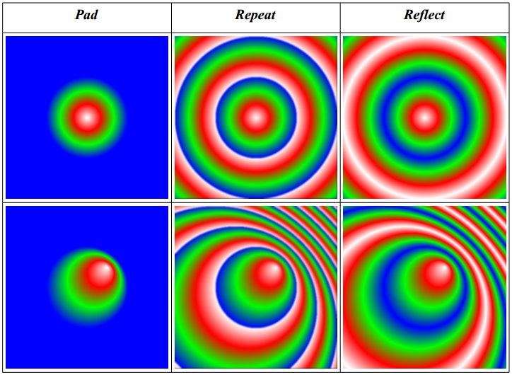
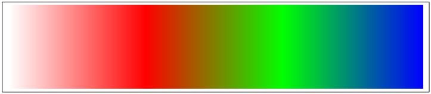

# 9 Paint
<a name="chapter09"></a> <a name="Paint"></a>
Paint defines a color and an alpha value for each pixel being drawn. _Color paint_ defines a constant color for all pixels; _gradient paint_ defines a linear or radial pattern of smoothly varying colors; and _pattern paint_ defines a possibly repeating rectangular pattern of colors based on a source image. It is possible to define new types of paint as extensions.

Paint is defined in its own coordinate system, which is transformed into user coordinates by means of the fill-paint-to-user and stroke-paint-to-user transformations (set using the `VG_MATRIX_FILL_PAINT_TO_USER` and `VG_MATRIX_STROKE_PAINT_TO_USER` matrix modes) depending on whether the current geometry is being filled or stroked.

Given a (fill or stroke) paint-to-user transformation $T_p$ and user-to-surface transformation $T_u$, the paint color and alpha of a pixel to be drawn with surface coordinates $\left( x,y \right)$ is defined by mapping its center point $\left( x+½,y+½\right)$ through the inverse transformation ${ \left( T_u\circ T_p \right)  }^{ -1 }$, resulting in a sample point in the paint coordinate space. This transformation must be evaluated with sufficient accuracy to ensure a deviation from the ideal of no more than 1/8 of a pixel along either axis. The paint value nearest that point may be used (point sampling), or paint values from multiple points surrounding the central sample point may be combined to produce an interpolated paint value. Paint color values are processed in premultiplied alpha format during interpolation. The user-to-surface transformation $T_u$ is taken from the path-user-to-surface transformation when fulfilling a **vgDrawPath** call, from the image-user-to-surface transformation when fulfilling a **vgDrawImage** call, or from the glyph-user-to-surface transformation when fulfilling a **vgDrawGlyph** or **vgDrawGlyphs** call.

If the inverse transformation cannot be computed due to a (near-)singularity, no drawing occurs.

## _9.1 Paint Definitions_
<a name="Paint_Definitions"></a>
The OpenVG context stores two paint definitions at a time, one to be applied to stroked shapes and one for filled shapes. This allows the interior of a path to be filled using one type of paint and its outline to be stroked with another kind of paint in a single **vgDrawPath** operation. Initially, default values are used.

#### _VGPaint_
<a name="VGPaint"></a>
`VGPaint` represents an opaque handle to a paint object. A `VGPaint` object is _live_; changes to a `VGPaint` object (using `vgSetParameter`, or by altering an attached pattern image) attached to a context will immediately affect drawing calls on that context. If a `VGPaint` object is accessed from multiple threads, the application must ensure (using **vgFinish** along with application-level synchronization primitives) that the paint definition is not altered from one context while another context may still be using it for drawing.
```
typedef VGHandle VGPaint;
```

### _9.1.1 Creating and Destroying Paint Objects_
<a name="Creating_and_Destroying_Paint_Objects"></a>

#### _vgCreatePaint_
<a name="vgCreatePaint"></a>
**vgCreatePaint** creates a new paint object that is initialized to a set of default values and returns a `VGPaint` handle to it. If insufficient memory is available to allocate a
new object, `VG_INVALID_HANDLE` is returned.
```
VGPaint vgCreatePaint(void)
```

#### _vgDestroyPaint_
<a name="vgDestroyPaint"></a>
The resources associated with a paint object may be deallocated by calling **vgDestroyPaint**. Following the call, the `paint` handle is no longer valid in any of the contexts that shared it. If the paint object is currently active in a drawing context, the context continues to access it until it is replaced or the context is destroyed.
```
void vgDestroyPaint(VGPaint paint)
```

> **_ERRORS_**
>
> `VG_BAD_HANDLE_ERROR`
> * if `paint` is not a valid paint handle, or is not shared with the current context

### _9.1.2 Setting the Current Paint_
<a name="Setting_the_Current_Paint"></a>

#### _vgSetPaint_
<a name="vgSetPaint"></a>
Paint definitions are set on the current context using the **vgSetPaint** function. The `paintModes` argument is a bitwise OR of values from the `VGPaintMode` enumeration, determining whether the paint object is to be used for filling (`VG_FILL_PATH`), stroking (`VG_STROKE_PATH`), or both (`VG_FILL_PATH` | `VG_STROKE_PATH`). The current `paint` replaces the previously set paint object, if any, for the given paint mode or modes. If `paint` is equal to `VG_INVALID_HANDLE`, the previously set paint object for the given mode (if present) is removed and the paint settings are restored to their default values.
```
void vgSetPaint(VGPaint paint, VGbitfield paintModes)
```

> **_ERRORS_**
>
> `VG_BAD_HANDLE_ERROR`
> * if `paint` is neither a valid paint handle nor equal to `VG_INVALID_HANDLE`, or is not shared with the current context
>
> `VG_ILLEGAL_ARGUMENT_ERROR`
>* if `paintModes` is not a valid bitwise OR of values from the `VGPaintMode` enumeration

#### _vgGetPaint_
<a name="vgGetPaint"></a>
The **vgGetPaint** function returns the paint object currently set for the given `paintMode`, or `VG_INVALID_HANDLE` if an error occurs or if no paint object is set (_i.e_., the default paint is present) on the given context with the given `paintMode`.
```
VGPaint vgGetPaint(VGPaintMode paintMode)
```

> **_ERRORS_**
>
> `VG_ILLEGAL_ARGUMENT_ERROR`
> * if `paintMode` is not a valid value from the `VGPaintMode` enumeration

### _9.1.3 Setting Paint Parameters_
<a name="Setting_Paint_Parameters"></a>
Paint functionality is controlled by a number of paint parameters that are stored in each paint object.

#### _VGPaintParamType_
<a name="VGPaintParamType"></a>
Values from the `VGPaintParamType` enumeration may be used as the `paramType` argument to **vgSetParameter** and **vgGetParameter** to set and query various features of a paint object:

```
typedef enum {
  /* Color paint parameters */
  VG_PAINT_TYPE = 0x1A00,
  VG_PAINT_COLOR = 0x1A01,
  VG_PAINT_COLOR_RAMP_SPREAD_MODE = 0x1A02,
  VG_PAINT_COLOR_RAMP_STOPS = 0x1A03,
  VG_PAINT_COLOR_RAMP_PREMULTIPLIED = 0x1A07,

  /* Linear gradient paint parameters */
  VG_PAINT_LINEAR_GRADIENT = 0x1A04,

  /* Radial gradient paint parameters */
  VG_PAINT_RADIAL_GRADIENT = 0x1A05,

  /* Pattern paint parameters */
  VG_PAINT_PATTERN_TILING_MODE = 0x1A06
} VGPaintParamType;
```

The default values that are used when no paint object is present (_i.e_., in a newly-created context or following a call to **vgSetPaint** with a `paint` value of `VG_INVALID_HANDLE`) are shown in Table 10. These values are also used as the initial parameter value for a newly created paint object.

| **_Parameter_** | **_Datatype_** | **_Default Value_** |
| :--- | :--- | :--- |
| `VG_PAINT_TYPE` | `VGPaintType` | `VG_PAINT_TYPE_COLOR` |
| `VG_PAINT_COLOR` | `VGfloat`[4] | { 0.0f, 0.0f, 0.0f, 1.0f } |
| `VG_PAINT_COLOR_RAMP_SPREAD_MODE` | `VGColorRampSpreadMode` | `VG_COLOR_RAMP_SPREAD_PAD` |
| `VG_PAINT_COLOR_RAMP_STOPS` | `VGfloat *` | Array of Length 0 |
| `VG_PAINT_COLOR_RAMP_PREMULTIPLIED` | `VGboolean` | `VG_TRUE` |
| `VG_PAINT_LINEAR_GRADIENT` | `VGfloat`[4] | { 0.0f, 0.0f, 1.0f, 0.0f } |
| `VG_PAINT_RADIAL_GRADIENT` | `VGfloat`[5] | { 0.0f, 0.0f, 0.0f, 0.0f, 1.0f } |
| `VG_PAINT_PATTERN_TILING_MODE` | `VGTilingMode` | `VG_TILE_FILL` |
_Table 10: VGPaintParamType Defaults_

#### _VGPaintType_
<a name="VGPaintType"></a>
The `VGPaintType` enumeration is used to supply values for the `VG_PAINT_TYPE` paint parameter to determine the type of paint to be applied.
```
typedef enum {
  VG_PAINT_TYPE_COLOR = 0x1B00,
  VG_PAINT_TYPE_LINEAR_GRADIENT = 0x1B01,
  VG_PAINT_TYPE_RADIAL_GRADIENT = 0x1B02,
  VG_PAINT_TYPE_PATTERN = 0x1B03
} VGPaintType;
```

## _9.2 Color Paint_
<a name="Color_Paint"></a>
Color paint uses a fixed color and alpha for all pixels. An alpha value of 1 produces a fully opaque color. Colors are specified in non-premultiplied sRGBA format.

#### _Setting Color Paint Parameters_
<a name="Setting_Color_Paint_Parameters"></a>
To enable color paint, use **vgSetParameteri** to set the paint type to `VG_PAINT_TYPE_COLOR`.

The **vgSetParameterfv** function allows the color and alpha values to be set using the `VG_PAINT_COLOR` paint parameter to values between 0 and 1. Values outside this range are interpreted as the nearest endpoint of the range.
```
VGfloat fill_red, fill_green, fill_blue, fill_alpha;
VGfloat stroke_red, stroke_green, stroke_blue, stroke_alpha;
VGPaint myFillPaint, myStrokePaint;

VGfloat * fill_RGBA = {
  fill_red, fill_green, fill_blue, fill_alpha
};
VGfloat * stroke_RGBA = {
  stroke_red, stroke_green, stroke_blue, stroke_alpha
};

/* Fill with color paint */
vgSetParameteri(myFillPaint, VG_PAINT_TYPE, VG_PAINT_TYPE_COLOR);
vgSetParameterfv(myFillPaint, VG_PAINT_COLOR, 4, fill_RGBA);

/* Stroke with color paint */
vgSetParameteri(myStrokePaint, VG_PAINT_TYPE, VG_PAINT_TYPE_COLOR);
vgSetParameterfv(myStrokePaint, VG_PAINT_COLOR, 4, stroke_RGBA);
```
#### _vgSetColor_
<a name="vgSetColor"></a>
As a shorthand, the **vgSetColor** function allows the `VG_PAINT_COLOR` parameter of a given `paint` object to be set using a 32-bit non-premultiplied `sRGBA_8888` representation (see Section 10.210.2). The `rgba` parameter is a `VGuint` with 8 bits of red starting at the most significant bit, followed by 8 bits each of green, blue, and alpha. Each color or alpha channel value is conceptually divided by 255.0f to obtain a value between 0 and 1.
```
void vgSetColor(VGPaint paint, VGuint rgba)
```
> **_ERRORS_**
>
> `VG_BAD_HANDLE_ERROR`
> * if `paint` is not a valid paint handle, or is not shared with the current context

The code:
```
VGPaint paint;
VGuint rgba;
vgSetColor(paint, rgba)
```
is equivalent to the code:
```
VGfloat rgba_f[4];
rgba_f[0] = ((rgba >> 24) & 0xff)/255.0f;
rgba_f[1] = ((rgba >> 16) & 0xff)/255.0f;
rgba_f[2] = ((rgba >> 8)  & 0xff)/255.0f;
rgba_f[3] = ( rgba        & 0xff)/255.0f;
vgSetParameterfv(paint, VG_PAINT_COLOR, 4, rgba_f);
```

#### _vgGetColor_
<a name="vgGetColor"></a>
The current setting of the `VG_PAINT_COLOR` parameter on a given `paint` object may be queried as a 32-bit non-premultiplied `sRGBA_8888` value. Each color channel or alpha value is clamped to the range [0, 1] , multiplied by 255, and rounded to obtain an 8-bit integer; the resulting values are packed into a 32-bit value in the same format as for **vgSetColor**.
```
VGuint vgGetColor(VGPaint paint)
```

> **_ERRORS_**
>
> `VG_BAD_HANDLE_ERROR`
> * if `paint` is not a valid paint handle, or is not shared with the current context

The code:
```
VGPaint paint;
VGuint rgba;
rgba = vgGetColor(paint);
```
is equivalent to the code:
```
#define CLAMP(x) ((x) < 0.0f ? 0.0f : ((x) > 1.0f ? 1.0f : (x)))

VGfloat rgba_f[4];
int red, green, blue, alpha;

vgGetParameterfv(paint, VG_PAINT_COLOR, 4, rgba_f);

/*
* Clamp color and alpha values from vgGetParameterfv to the
* [0, 1] range, scale to 8 bits, and round to integer.
*/
red = (int)(CLAMP(rgba_f[0])*255.0f + 0.5f);
green = (int)(CLAMP(rgba_f[1])*255.0f + 0.5f);
blue = (int)(CLAMP(rgba_f[2])*255.0f + 0.5f);
alpha = (int)(CLAMP(rgba_f[3])*255.0f + 0.5f);
rgba = (red << 24) | (green << 16) | (blue << 8) | alpha;
```

## _9.3 Gradient Paint_
<a name="Gradient_Paint"></a>
Gradients are patterns used for filling or stroking. They are defined mathematically in two parts; a scalar-valued _gradient function_ defined at every point in the two-dimensional plane (in paint coordinates), followed by a _color ramp_ mapping.

### _9.3.1 Linear Gradients_
<a name="Linear_Gradients"></a>
Linear gradients define a scalar-valued gradient function based on two points $\left( x0,y0 \right)$ and $\left( x1,y1 \right)$ (in the paint coordinate system) with the following properties:
* It is equal to 0 at $\left( x0,y0 \right)$
* It is equal to 1 at $\left( x1,y1 \right)$
* It increases linearly along the line from $\left( x0,y0 \right)$ to $\left( x1,y1 \right)$
* It is constant along lines perpendicular to the line from $\left( x0,y0 \right)$ to $\left( x1,y1 \right)$

An expression for the gradient function is:
$$g\left( x,y \right) =\frac { \Delta x\left( x-x0 \right) +\Delta y\left( y-y0 \right)  }{ \Delta { x }^{ 2 }+\Delta { y }^{ 2 } }$$
where $\Delta x=x1-x0$ and $\Delta y=y1-y0$. If the points $\left( x0,y0 \right)$ and $\left( x1,y1 \right)$ are coincident (and thus $\Delta { x }^{ 2 }+\Delta { y }^{ 2 }=0$), the function is given the value 1 everywhere.

#### _Setting Linear Gradient Parameters_
<a name="Setting_Linear_Gradient_Parameters"></a>
To enable linear gradient paint, use **vgSetParameteri** to set the paint type to `VG_PAINT_TYPE_LINEAR_GRADIENT`.
The linear gradient parameters are set using **vgSetParameterfv** with a `paramType` argument of `VG_PAINT_LINEAR_GRADIENT`. The gradient values are supplied as a vector of 4 floats in the order { $x0,y0,x1,y1$ }.
```
VGfloat fill_x0, fill_y0, fill_x1, fill_y1;
VGfloat stroke_x0, stroke_y0, stroke_x1, stroke_y1;
VGPaint myFillPaint, myStrokePaint;
VGfloat * fill_linear_gradient = {
  fill_x0, fill_y0, fill_x1, fill_y1
};
VGfloat * stroke_linear_gradient = {
  stroke_x0, stroke_y0, stroke_x1, stroke_y1
};

/* Fill with linear gradient paint */
vgSetParameteri(myFillPaint, VG_PAINT_TYPE,
                VG_PAINT_TYPE_LINEAR_GRADIENT);
vgSetParameterfv(myFillPaint, VG_PAINT_LINEAR_GRADIENT,
                4, fill_linear_gradient);
/* Stroke with linear gradient paint */
vgSetParameteri(myStrokePaint, VG_PAINT_TYPE,
                VG_PAINT_TYPE_LINEAR_GRADIENT);
vgSetParameterfv(myStrokePaint, VG_PAINT_LINEAR_GRADIENT,
                4, stroke_linear_gradient);
```

### _9.3.2 Radial Gradients_
<a name="Radial_Gradients"></a>
Radial gradients define a scalar-valued gradient function based on a _gradient circle_ defined by a _center point_ $\left( cx,cy \right)$, a radius $r$, and a _focal point_ $\left( fx,fy \right)$ that is forced to lie within the circle. All parameters are given in the paint coordinate system.

The computation of the radial gradient function is illustrated in Figure 18. The function is equal to 0 at the focal point and 1 along the circumference of the gradient circle.

Elsewhere, it is equal to the distance between $\left( x,y \right)$ and $\left( fx,fy \right)$ (shown as $d_1$) divided by the length of the line segment starting at $\left( fx,fy \right)$, passing through $\left( x,y \right)$, and ending on the circumference of the gradient circle (shown as $d_2$). If the radius is less than or equal to 0, the function is given the value 1 everywhere.

An expression for the gradient function may be derived by defining the line between $\left( fx,fy \right)$ and $\left( x,y \right)$ by the parametric expression $\left( fx,fy \right)  + t\ast \left( x-fx,y-fy \right)$ and determining the positive value of $t$ at which the line intersects the circle ${ \left( x-cx \right)  }^{ 2 }+{ \left( y-cy \right)  }^{ 2 }={ r }^{ 2 }$. Figure 18 illustrates the construction. The gradient value $g\left( x,y \right)$ is then given by $1/t$. The resulting expression is:
$$g\left( x,y \right) =\frac { { dx }^{ 2 }+{ dy }^{ 2 }\quad  }{ \sqrt { { r }^{ 2 }\left( d{ x }^{ 2 }+d{ y }^{ 2 } \right) -{ \left( dx fy' -dy fx'  \right)  }^{ 2 } } -\left( dx fx' +dy fy' \right)}$$
where $fx' =fx-cx, fy' =fy-cy, dx=x-fx$ and $dy = y – fy$.
This may be rearranged and simplified to obtain a formula that does not require per-pixel division:
$$g\left( x,y \right) =\frac { \left( dx fx' +dy fy'  \right) +\sqrt { { { r }^{ 2 }\left( d{ x }^{ 2 }+d{ y }^{ 2 } \right) -\left( dx fy' -dy fx'  \right)  }^{ 2 } }  }{ { r }^{ 2 }-\left( { fx'  }^{ 2 }+{ fy'  }^{ 2 } \right)  }$$
One way to evaluate the gradient function efficiently is to rewrite it in the form:
$${ g }_{ y }\left( x \right) =\left( Ax+B \right) +\sqrt { C{ x }^{ 2 }+Dx+E }$$
and to use forward differencing of $Ax+B$ and $C{ x }^{ 2 }+Dx+E$ to evaluate it incrementally along a scanline with several additions and a single square root per pixel.


_Figure 18: Radial Gradient Function_

#### _Setting Radial Gradient Parameters_
<a name="Setting_Radial_Gradient_Parameters"></a>
To enable radial gradient paint, use **vgSetParameteri** to set the paint type to `VG_PAINT_TYPE_RADIAL_GRADIENT`. The radial gradient parameters are set using **vgSetParameterfv** with a `paramType` argument of `VG_PAINT_RADIAL_GRADIENT`. The gradient values are supplied as a vector of 5 floats in the order { $cx,cy,fx,fy,r$ }.

If $\left(fx,fy\right)$ lies outside the circumference of the circle, the intersection of the line from the center to the focal point with the circumference of the circle is used as the focal point in place of the specified point. To avoid a division by 0, the implementation may move the focal point along the line towards the center of the circle by an amount sufficient to avoid numerical instability, provided the new location lies at a distance of at least .99r from the circle center. The following code illustrates the setting of radial gradient parameters:

```
VGPaint myFillPaint, myStrokePaint;
VGfloat fill_cx, fill_cy, fill_fx, fill_fy, fill_r;
VGfloat stroke_cx, stroke_cy, stroke_fx, stroke_fy, stroke_r;
VGfloat * fill_radial_gradient = { fill_cx, fill_cy,
  fill_fx, fill_fy, fill_r };
VGfloat * stroke_radial_gradient = { stroke_cx, stroke_cy,
  stroke_fx, stroke_fy, stroke_r };
vgSetParameteri(myFillPaint, VG_PAINT_TYPE, /* Fill */
                VG_PAINT_TYPE_RADIAL_GRADIENT);
vgSetParameterfv(myFillPaint, VG_PAINT_RADIAL_GRADIENT,
                5, fill_radial_gradient);
vgSetParameteri(myStrokePaint, VG_PAINT_TYPE, /* Stroke */
                VG_PAINT_TYPE_RADIAL_GRADIENT);
vgSetParameterfv(myStrokePaint, VG_PAINT_RADIAL_GRADIENT,
                5, stroke_radial_gradient);
```

### _9.3.3 Color Ramps_
<a name="Color_Ramps"></a>
Color ramps map the scalar values produced by gradient functions to colors. The application defines the non-premultiplied sRGBA color and alpha value associated with each of a number of values, called _stops_. A stop is defined by an _offset_ between 0 and 1, inclusive, and a color value. Stops must be specified in increasing order; if they are not, the entire sequence is ignored. It is legal to have multiple stops with the same offset value, which will result in a discontinuity in the color ramp, with the first stop with a given offset value defining the right endpoint of one interval and the last stop with the same offset value defining the left endpoint of the next interval. At an offset value equal to that of a stop, the color value is that of the last stop with the given offset. Intermediate stops with the same offset value have no effect. Stops with offsets less than 0 or greater than 1 are ignored.

If no valid stops have been specified (_e.g_., due to an empty input array, out-of-range, or out-of-order stops), a stop at 0 with $\left( R,G,B,\alpha \right)$ color $(0.0, 0.0, 0.0, 1.0)$ (opaque black) and a stop at 1 with color $(1.0, 1.0, 1.0, 1.0)$ (opaque white) are implicitly defined. If at least one valid stop has been specified, but none has been defined with an offset of 0, an implicit stop is added with an offset of 0 and the same color as the first user-defined stop. If at least one valid stop has been specified, but none has been defined with an offset of 1, an implicit stop is added with an offset of 1 and the same color as the last user-defined stop.

If a color or alpha value of a given stop falls outside of the range [0, 1], the closest endpoint of the range is used instead.

If the paint’s `VG_PAINT_COLOR_RAMP_PREMULTIPLIED` flag is set to `VG_TRUE`, color and alpha values at each gradient stop are multiplied together to form premultiplied sRGBA values prior to interpolation. Otherwise, color and alpha values are processed independently.

Color and alpha values at offset values between the stops are defined by means of linear interpolation between the premultiplied or non-premultiplied color values defined at the nearest stops above and below the given offset value.

#### _VG_MAX_COLOR_RAMP_STOPS_
<a name="VG_MAX_COLOR_RAMP_STOPS"></a>
The `VG_MAX_COLOR_RAMP_STOPS` parameter contains the maximum number of gradient stops supported by the OpenVG implementation. All implementations must support at least 32 stops. If there is no implementation-defined limit, a value of `VG_MAXINT` may be returned. Implicitly defined stops at offsets 0 and 1 are not counted against this maximum. The value may be retrieved by calling **vgGeti**:
```
VGint maxStops = vgGeti(VG_MAX_COLOR_RAMP_STOPS);
```

#### _VGColorRampSpreadMode_
<a name="VGColorRampSpreadMode"></a>
The application may only define stops with offsets between 0 and 1. Spread modes define how the given set of stops are repeated or extended in order to define interpolated color values for arbitrary input values outside the [0,1] range. The `VGColorRampSpreadMode` enumeration defines three modes:
* `VG_COLOR_RAMP_SPREAD_PAD` – extend stops
* `VG_COLOR_RAMP_SPREAD_REPEAT` – repeat stops
* `VG_COLOR_RAMP_SPREAD_REFLECT` – repeat stops in reflected order

```
typedef enum {
  VG_COLOR_RAMP_SPREAD_PAD = 0x1C00,
  VG_COLOR_RAMP_SPREAD_REPEAT = 0x1C01,
  VG_COLOR_RAMP_SPREAD_REFLECT = 0x1C02
} VGColorRampSpreadMode;
```

In pad mode, the colors defined at 0 and 1 are used for all stop values less than 0 or greater than 1, respectively.

In repeat mode, the color values defined between 0 and 1 are repeated indefinitely in both directions. Gradient values outside the [0, 1] range are shifted by an integer amount to place them into that range. For example, a gradient value of 5.6 will receive the same color as a gradient value of 0.6. A gradient value of -5.6 will receive the same color as a gradient value of 0.4 (since 0.4 = -5.6 + 6).

In reflect mode, the color values defined between 0 and 1 are repeated indefinitely in both directions, but with alternate copies of the range reversed. A gradient value of 1.2 will receive the same color as a gradient value of 0.8, since 0.8 = 1.0 – 0.2 and 1.2 = 1.0 + 0.2. A gradient value of 2.4 will receive the same color as a gradient value of 0.4.

The color ramp pad modes are illustrated schematically in Figure 19.

_Figure 19: Color Ramp Pad Modes_

#### _Setting Color Ramp Parameters_
<a name="Setting_Color_Ramp_Parameters"></a>
Color ramp parameters are set using **vgSetParameter**. The `VG_PAINT_COLOR_RAMP_SPREAD_MODE` parameter controls the spread mode using a value from the `VGColorRampSpreadMode` enumeration. The `VG_PAINT_COLOR_RAMP_PREMULTIPLIED` parameter takes a `VGboolean` value and controls whether color and alpha values are interpolated in premultiplied or non-premultiplied form. The `VG_PAINT_COLOR_RAMP_STOPS` parameter takes an array of floating-point values giving the offsets and colors of the stops, in order. Each stop is defined by a floating-point offset value and four floating-point values containing the sRGBA color and alpha value associated with each stop, in the form of a non-premultiplied $\left( R,G,B,\alpha \right)$ quad. The **vgSetParameter** function will generate an error if the number of values submitted is not a multiple of 5 (zero is acceptable). Up to `VG_MAX_COLOR_RAMP_STOPS` 5-tuples may be set. If more than `VG_MAX_COLOR_RAMP_STOPS` 5-tuples are specified, those beyond the first `VG_MAX_COLOR_RAMP_STOPS` are discarded immediately (and will not be returned by **vgGetParameter**).
```
VGPaint myFillPaint, myStrokePaint;

VGColorRampSpreadMode fill_spreadMode;
VGboolean fill_premultiplied;
VGfloat fill_stops[5*FILL_NUM_STOPS];

VGColorRampSpreadMode stroke_spreadMode;
VGboolean stroke_premultiplied;
VGfloat stroke_stops[5*STROKE_NUM_STOPS];

vgSetParameteri(myFillPaint, VG_PAINT_COLOR_RAMP_SPREAD_MODE,
fill_spreadMode);
vgSetParameteri(myFillPaint, VG_PAINT_COLOR_RAMP_PREMULTIPLIED,
fill_premultiplied);
vgSetParameterfv(myFillPaint, VG_PAINT_COLOR_RAMP_STOPS,
5*FILL_NUM_STOPS, fill_stops);

vgSetParameteri(myStrokePaint, VG_PAINT_COLOR_RAMP_SPREAD_MODE,
stroke_spreadMode);
vgSetParameteri(myStrokePaint, VG_PAINT_COLOR_RAMP_PREMULTIPLIED,
stroke_premultiplied);
vgSetParameterfv(myStrokePaint, VG_PAINT_COLOR_RAMP_STOPS,
5*STROKE_NUM_STOPS, stroke_stops);
```
A common set of color ramp settings are used for both linear and radial gradients defined on a given paint object.


#### _Formal Definition of Spread Modes_
<a name="Formal_Definition_of_Spread_Modes"></a>
This section provides a formal definition of the color ramp spread modes.

In the following, assume that a sequence of stops { $S_0,S_1, ... , S_{ N-1 }$ } have been defined by the application, and/or by default or implicit values. The stop $S_i$ is defined to have offset $x_i$ and color $c_i$. The stops are assumed to be ordered by offset but may have duplicate offsets; that is, for all $i<j$, ${ x }_{ i }\le{ x }_{ j }$. To determine the interpolated color value at a given offset value v, determine the smallest $i$ such that ${ x }_{ i+1 }>v$. If $x_i = v$, use the color $c_i$, otherwise perform linear interpolation between the stops $S_i$ and $S_{i+1}$ to produce the color $c_{ i }+\left( c_{ i+1 }-c_{ i } \right) \left( v-x_{ i } \right) /\left( x_{ i+1 }-x_{ i } \right) $.

In pad mode, values smaller than 0 are assigned the color $c_0$ and values greater than or equal to 1 are assigned the color ${ c }_{ N-1 }$.

In repeat mode, the offset value v is mapped to a new value $v'$ that is guaranteed to lie between 0 and 1. Following this mapping, the color is defined as for pad mode:


$$v'_{repeat} = v−|v|$$

In reflect mode, the offset value v is mapped to a new value v´ that is guaranteed to liebetween 0 and 1. Following this mapping, the color is defined as for pad mode:

$$
v'_{reflect} =
\begin{cases}
 & v-|v| \text{, if |v| is even }  \\
 & 1-(v-|v|) \text{, if |v| is odd }
\end{cases}
$$

### 9.3.4 Gradient Examples
<a name="Gradient_Examples"></a>

Figure 20 shows a square from (0, 0) to (400, 400) painted with a set of linear gradientswith (x0, y0) = (100, 100), (x1, y1) = (300, 300).

Figure 21 shows the same square painted with radial gradients with centered and noncentered focal points. The centered gradient, shown in the top row, has its center (cx, cy)and focal point (fx, fy) both at (200, 200). The non-centered gradient, shown in thebottom row, has its center (cx, cy) at (200, 200) and its focal point (fx, fy) at (250, 250).The radius r for both gradients is equal to 100.

All the gradients shown in this section utilize a color ramp with stops at offsets 0.0,0.33, 0.66, and 1.0 colored white, red, green, and blue, respectively, as shown in Figure22.


Figure 20: Linear Gradients



Figure 21: Centered and Non-Centered Radial Gradients



Figure 22: Color Ramp used for Gradient Examples

## 9.4 Pattern Paint
<a name="Pattern_Paint"></a>

Pattern paint defines a rectangular pattern of colors based on the pixel values of an image. Images are described below in Section 10. Each pixel (x, y) of the pattern imagedefines a point of color at the pixel center (x + 1/2, y + 1/2).

Filtering may be used to construct an interpolated pattern value at the sample point,based on the pattern image pixel values. The pattern tiling mode is used to define valuesfor pixel centers in the pattern space that lie outside of the bounds of the pattern.

Interpolation may be performed between multiple pixels of the pattern image to producean antialiased pattern value. The image quality setting at the time of drawing (determinedby the `VG_IMAGE_QUALITY` parameter) is used to control the quality of patterninterpolation. If the image quality is set `toVG_IMAGE_QUALITY_NONANTIALIASED`, nearest-neighbor interpolation (pointsampling) is used. If the image quality is set to `VG_IMAGE_QUALITY_FASTER` or `VG_IMAGE_QUALITY_BETTER`, higher-quality interpolation will be used if available. Interpolation is done in the color space of the image using a premultiplied representation.

#### vgPaintPattern
<a name="vgPaintPattern"></a>

The `vgPaintPattern` function replaces any previous pattern image defined on thegiven paint object for the given set of paint modes with a new pattern image. Avalue of `VG_INVALID_HANDLE` for the pattern parameter removes the currentpattern image from the paint object.

If the current paint object has its `VG_PAINT_TYPE` parameter set to `VG_PAINT_TYPE_PATTERN`, but no pattern image is set, the paint object behaves as if `VG_PAINT_TYPE` were set to `VG_PAINT_TYPE_COLOR`.

While an image is set as the paint pattern for any paint object, it may not be used as arendering target. Conversely, an image that is currently a rendering target may not be setas a paint pattern.

```c
void vgPaintPattern(VGPaint paint, VGImage pattern)
```

> **_ERRORS_**
>
> `VG_BAD_HANDLE_ERROR`
> * if paint is not a valid paint handle, or is not shared with the current context
> * if pattern is neither a valid image handle nor equal to `VG_INVALID_HANDLE`, or is not shared with the current context
>
> `VG_IMAGE_IN_USE_ERROR`
> * if pattern is currently a rendering targe

### 9.4.1 Pattern Tiling
<a name="Pattern_Tiling"></a>

Patterns may be extended (tiled) using one of four possible tiling modes, defined by the `VGTilingMode` enumeration.

#### VGTilingMode
<a name="VGTilingMode"></a>

The `VGTilingMode` enumeration defines possible methods for defining colors forsource pixels that lie outside the bounds of the source image.

The `VG_TILE_FILL` condition specifies that pixels outside the bounds of the sourceimage should be taken as the color `VG_TILE_FILL_COLOR`. The color is expressed asa non-premultiplied sRGBA color and alpha value. Values outside the [0, 1] range areinterpreted as the nearest endpoint of the range.

The `VG_TILE_PAD` condition specifies that pixels outside the bounds of the sourceimage should be taken as having the same color as the closest edge pixel of the sourceimage. That is, a pixel (x, y) has the same value as the image pixel (max(0, min(x, width - 1)), max(0, min(y, height - 1))).

The `VG_TILE_REPEAT` condition specifies that the source image should be repeatedindefinitely in all directions. That is, a pixel (x, y) has the same value as the image pixel(x mod width, y mod height) where the operator ''a mod b'' returns a value between 0 and(b - 1) such that a = k*b + (a mod b) for some integer k.

The `VG_TILE_REFLECT` condition specifies that the source image should be reflectedindefinitely in all directions. That is, a pixel (x, y) has the same value as the image pixel(x'', y'') where:

$$
x' =
\begin{cases}
  & \text{x mod width, if floor(x/width) is even} \\
  & \text{width - 1 - x mod width, otherwise}
\end{cases}
$$

$$
y' =
\begin{cases}
  & \text{y mod height, if floor(y/height) is even} \\
  & \text{height - 1 - y mod height, otherwise}
\end{cases}
$$

```c
typedef enum {
  VG_TILE_FILL = 0x1D00,
  VG_TILE_PAD = 0x1D01,
  VG_TILE_REPEAT = 0x1D02,
  VG_TILE_REFLECT = 0x1D03,
} VGTilingMode;
```

#### Setting the Pattern Tiling Mode

The pattern tiling mode is set using vgSetParameteri with a paramType argument of `VG_PAINT_PATTERN_TILING_MODE`.

```c
VGPaint myFillPaint, myStrokePaint;
VGImage myFillPaintPatternImage, myStrokePaintPatternImage;
VGTilingMode fill_tilingMode, stroke_tilingMode;
vgSetParameteri(myFillPaint, VG_PAINT_TYPE,
VG_PAINT_TYPE_PATTERN);
vgSetParameteri(myFillPaint, VG_PAINT_PATTERN_TILING_MODE,
fill_tilingMode);
vgPaintPattern(myFillPaint, myFillPaintPatternImage);
vgSetParameteri(myStrokePaint, VG_PAINT_TYPE,
VG_PAINT_TYPE_PATTERN);
vgSetParameteri(myStrokePaint, VG_PAINT_PATTERN_TILING_MODE,
stroke_tilingMode);
vgPaintPattern(myStrokePaint, myStrokePaintPatternImage);
```

<div style="page-break-after: always;"> </div>
