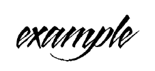
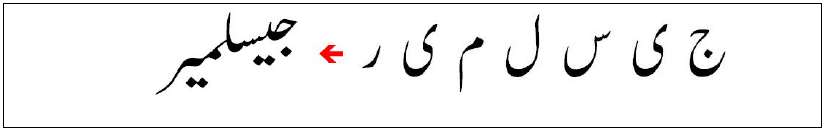

# <a name="chapter11"></a><a name="Text"></a> 11 Text

Several classes of applications were considered in order to determining the set of features supported by the OpenVG text rendering API. E-book readers, scalable user interfaces with text-driven menus, and SVG viewers used to display textintensive content rely on high-quality text rendering using well-hinted fonts. For these applications, the use of unhinted outlines, or the use of hardwareaccelerated glyph scaling that does not support hints, would be detrimental to application rendering quality. Gaming applications that use special custom fonts, applications where text is rotated or placed along a path, or SVG viewers where unhinted SVG fonts are specified are less sensitive to the use of unhinted fonts for text rendering and may benefit from hardware-accelerated glyph scaling. These application requirements made it clear that OpenVG must provide a fast, low-level hardware-accelerated API that is capable of supporting both hinted and unhinted vector glyph outlines, as well as glyphs represented as bitmaps.

## <a name="Text_Rendering"></a> _11.1 Text Rendering_

The process of text rendering involves the following steps:

- selection of a font, font style and size;
- scaling of glyphs used in a text fragment, including hint processing;
- composing the text on a page or within a text box;
- rendering of glyph outlines into bitmap images; and
- blitting of bitmap images to a frame buffer or a screen.

Font and glyph scaling is usually done once for each selected text size; however, the rendering of glyph outlines and blitting of bitmaps is repeated routinely. While caching of rendered bitmaps may improve performance of software rendering solutions, hardware acceleration of routine and repetitive tasks may significantly improve the overall performance of applications.

OpenVG provides a mechanism to allow applications to define a `VGFont` object as a collection of glyphs, where each glyph can be represented as either a `VGPath` representing either an original unhinted outline that can be scaled and rendered, or a scaled and hinted outline; or a `VGImage` representing a scaled, optionally hinted, and rendered image of a glyph. Use of a `VGImage` provides the opportunity to use hardware acceleration with bitmap fonts, or when a font size or rendering quality requirement cannot be satisfied by generic outline rendering. No further hinting is applied to image glyphs.

OpenVG can assist applications in text composition by hardware-accelerating glyph positioning calculations; however, the text layout and positioning are the responsibilities of the application.

## <a name="Font_Terminology"></a> _11.2 Font Terminology_

In typesetting literature, and throughout this chapter, the terms _character_ and _glyph_ are sometimes used interchangeably to refer to a single letter, number, punctuation mark, accent, or symbol in a string of text, or in a font or a typeface. In strict terms, the term “character” refers to a computer code representing the unit of text content (_e.g._, a symbol from a particular alphabet – a Latin character, Chinese character, etc.) while the term “glyph” refers to the unit of text display defining an image of a character or group of characters (ligature). Each character may be represented by many different glyphs from multiple typefaces having different styles. In complex scripts, a character can change its appearance depending on its position in a word and on adjacent characters, and can be associated with more than one glyph of the same font.

When fonts are scaled to a small size, there may not be enough pixels to display all the subtleties of the typeface design. Some features of the glyphs may be severely distorted, or may even completely disappear at small sizes. In order to make sure that the original design and legibility of a typeface is preserved, fonts typically contain additional data – a set of special instructions that are executed when a font is scaled to a particular size, known as _hints_. In TrueType and OpenType font formats, the hints are special byte-code instructions that are interpreted and executed by the rasterizer. Hints allow font developers to control the alignment of the outline data points with the pixel grid of the output device to ensure that glyph outlines are always rendered faithfully to the original design.

## <a name="Glyph_Positioning_and_Text_Layout"></a> _11.3 Glyph Positioning and Text Layout_

Scalable fonts define glyphs using vector outlines and additional set of data, such as hinting instructions, font and glyph metrics, etc. A typical glyph would be defined as presented in Figure 23 below:


The glyph origin is not always located at the glyph boundary. Glyphs from various custom or script fonts may have swashes and ornamental design with the glyph origin located inside the bounding box, as can be seen (see letter 'p') in the following



The complexity of text rendering and composition depends on language scripts. In many simple scripts (such as western and eastern European languages) text is composed by simply planking glyphs next to each other along the horizontal baseline. Each scaled and rendered glyph is positioned in such a way that the current glyph origin is located at the same point that is defined by the “advance width”, or _escapement_ of the previous character (see Figure 24 below).


The next glyph origin must be calculated using the escapement for the current glyph. Note that vector defined by two points [glyph_origin, escapement] must be subjected to the same matrix transformation that is applied to a glyph outline when the glyph is scaled. This operation is equivalent to calling the function:

```c
vgTranslate(escapement.x, escapement.y);
```

The glyph origin is stored in the `VG_GLYPH_ORIGIN` parameter of the OpenVG state, and is updated after drawing each glyph of sequence of glyphs.

In some cases, the text composition requires that glyph layout and positioning be adjusted along the baseline (using kerning) to account for the difference in appearance of different glyphs and to achieve uniform typographic color (optical density) of the text (see Figure 25 below).


When two or more language scripts are used in the same text fragment, multiple adjustments for glyph positioning may be required. For example, Latin scripts have lowercase characters that have features descending below the text baseline, while Asian scripts typically have glyphs positioned on the baseline. When combining characters from these two scripts the position of the baseline for Asian characters should be adjusted.

Some complex scripts require glyph positioning be adjusted in both directions. Figure 26 below demonstrates text layout in a complex (Arabic) script, involving diagonal writing, ligatures and glyph substitutions. A sequence of characters (right, reading right to left) is combined to form a resulting Urdu word (left) which is displayed in the “Nastaliq” style.



Therefore, when a text composition involves support for complex scripts, the inter-character spacing between each pair of glyphs in a text string may have to be defined using the _escapement_ for the current glyph [i], and the additional _adjustment_ vector for the pair of glyphs [i, i+1]. The new glyph origin calculation for the glyph [i+1] is equivalent to performing the following operation:

```c
vgTranslate((escapement.x[i] + adjustment.x[i]),
            (escapement.y[i] + adjustment.y[i]));
```

## <a name="Fonts_in_OpenVG"></a> _11.4 Fonts in OpenVG_

### <a name="VGFont_Objects_and_Glyph_Mapping"></a> _11.4.1 VGFont Objects and Glyph Mapping_

OpenVG provides `VGFont` objects to assist applications with text rendering. Each VGFont object defines a collection of glyphs. Glyphs in OpenVG can be represented either using `VGPath` or `VGImage` data. `VGFont` objects are created by an application, and can contain either a full set of glyphs or a subset of glyphs of an original font. `VGFont` objects do not contain any metric or layout information; instead, applications are responsible for all text layout operations using the information provided by the original fonts.

#### <a name="VGFont"></a> _VGFont_

A `VGFont` is an opaque handle to a font object.

```c
typedef VGHandle VGFont;
```

#### <a name="Glyph_Mapping"></a> _Glyph Mapping_

Glyphs in a VGFont are identified by a glyph index, which is an arbitrary number assigned to a glyph when it is created. This mapping mechanism is similar to the glyph mapping used in standard font formats, such as TrueType or OpenType fonts, where each glyph is assigned an index that is mapped to a particular character code using a separate mapping table. The semantics of the mapping are application-dependent. Possible mappings include:

- _Unicode character codes_

When a `VGFont` is created as a subset that supports only simple language scripts (_e.g._, Latin, with simple one-to-one character-toglyph mapping), the character code values may be used as glyph indices. This eliminates the need for an additional mapping table and simplifies text rendering – a text string may be passed directly as an argument (as an array of glyph indices) to OpenVG API call
for text rendering.

- _Native font glyph indices_

OpenVG applications may re-use native glyph indices from an original TrueType or OpenType font when `VGFont` object is created – this simplifies text composition and layout decisions by re-using OpenType/TrueType layout and character-to-glyph mapping tables (and any platform-supplied text composition engine).

- _Application-defined (custom) glyph indices_

OpenVG applications may assign arbitrary numbers as glyph indices. This may be beneficial for special purpose fonts that have a limited number of glyphs (_e.g._, SVG fonts).

### <a name="Managing_VGFont_Objects"></a> _11.4.2 Managing VGFont Objects_

`VGFont` objects are created and destroyed using the **vgCreateFont** and **vgDestroyFont** functions. Font glyphs may be added, deleted, or replaced after the font has been created.

#### <a name="vgCreateFont"></a> _vgCreateFont_

**vgCreateFont** creates a new font object and returns a `VGFont` handle to it. The `glyphCapacityHint` argument provides a hint as to the capacity of a `VGFont`, _i.e._, the total number of glyphs that this `VGFont` object will be required to accept. A value of 0 indicates that the value is unknown. If an error occurs during execution, `VG_INVALID_HANDLE` is returned.

```c
VGFont vgCreateFont (VGint glyphCapacityHint);
```


#### <a name="vgDestroyFont"></a> _vgDestroyFont_

**vgDestroyFont** destroys the VGFont object pointed to by the font argument.

Note that **vgDestroyFont** will not destroy underlying objects that were used to define glyphs in the font. It is the responsibility of an application to destroy all `VGPath` or `VGImage` objects that were used in a VGFont, if they are no longer in use.

```c
void vgDestroyFont (VGFont font);
```


### <a name="Querying_VGFont_Objects"></a> _11.4.3 Querying VGFont Objects_

#### <a name="VGFontParamType"></a> _VGFontParamType_

Values from the `VGFontParamType` enumeration can be used as the `paramType` argument to **vgGetParameter** to query font features. All of the parameters defined by `VGFontParamType` are read-only. In the current specification, the single value `VG_FONT_NUM_GLYPHS` is defined.

```c
typedef enum {
VG_FONT_NUM_GLYPHS = 0x2F00
} VGFontParamType;
```

Parameter                   | Datatype
----------------------------|-----------------------------
`VG_FONT_NUM_GLYPHS`        | `VGint`
_Table 14: `VGFontParamType` Datatypes_

#### <a name="Number_of_Glyphs"></a> _Number of Glyphs_

The actual number of glyphs in a font (not the hinted capacity) is queried using the `VG_FONT_NUM_GLYPHS` parameter.

```c
VGFont font;
VGint numGlyphs = vgGetParameteri(font, VG_FONT_NUM_GLYPHS);
```

### <a name="Adding_and_Modifying_Glyphs_in_VGFonts"></a> _11.4.4 Adding and Modifying Glyphs in VGFonts_

`VGFonts` are collections of glyph data and may have glyphs represented using `VGPath` objects (for vector outline fonts) or `VGImage` objects (for bitmap fonts). `VGFont` may be created for a particular target text size, where the glyphs can be defined using either scaled and hinted outlines or embedded bitmaps. The **vgSetGlyphToPath**, **vgSetGlyphToImage**, and **vgClearGlyph** functions are provided to add and/or modify glyphs in a `VGFont`.

A call to **vgSetGlyphToPath** or **vgSetGlyphToImage** increases the reference count of the provided `VGPath` or `VGImage` if the function call completes without producing an error. A call to **vgClearGlyph**, setting an existing glyph to a different `VGPath` or `VGImage`, or destroying the `VGFont` decreases the reference count for the referenced object. When the reference count of an object falls to 0, the resources of the object are released.

Applications are responsible for destroying path or image objects they have assigned as font glyphs. It is recommended that applications destroy the path or image using **vgDestroyPath** or **vgDestroyImage** immediately after setting the object as a glyph. Since path and image objects are reference counted, destroying the object will mark its handle as invalid while leaving the resource available to the `VGFont` object. This usage model will prevent inadvertent modification of path and image objects, and may allow implementations to optimize the storage and rendering of the referenced data. Applications can re-assign a new path object to the same `glyphIndex` in a font by simply calling **vgSetGlyphToPath** with the new path argument, in which case the number of glyphs remains the same.

A `VGFont` may have glyphs defined as a mix of vector outlines and bitmaps. The `VG_MATRIX_GLYPH_USER_TO_SURFACE` matrix controls the mapping from glyph coordinates to drawing surface coordinates.

Implementations may improve the quality of text rendering by applying optional auto-hinting of unhinted glyph outlines. Glyph outlines that are scaled and hinted at very small sizes may exhibit missing pixels (dropouts) when rendered in B/W mode without antialiasing. OpenVG implementations may attempt to improve the quality of B/W glyph rendering at small sizes by identifying and drawing such pixels.

It is recommended that when a path object defines the original unhinted glyph outline, the `scale` parameter of the path object should be set to a value of 1/units-per-EM to achieve the effective size of 1 pixel per EM. This allows path data to be independent of the design unit metrics and original font format, and simplifies affine transformations applied to a glyph. For example, applying an affine transform with the matrix elements $sx = sy = 12$ would result in scaling the glyph to 12 pixels (or 12 units in the surface coordinate system). Both the `glyphOrigin` and `escapement` values are scaled identically.

Original font glyphs that are vector outlines are designed in a deviceindependent coordinate system (design units). The scale of the design coordinates is determined by the EM size (defined as “units-per-EM”) – a number that represents the distance between two adjacent, non-adjusted
baselines of text.

If a path object defines a scaled and hinted glyph outline, its `scale` parameter should be set to 1. Since the process of scaling and hinting of original glyph outlines is based on fitting the outline contour's control points to the pixel grid of the destination surface, applying affine transformations to a path (other than translations mapped to the pixel grid in surface coordinate system) may reduce glyph legibility and should be avoided as much as possible.

#### <a name="vgSetGlyphToPath"></a> _vgSetGlyphToPath_

**vgSetGlyphToPath** creates a new glyph and assigns the given `path` to a glyph associated with the `glyphIndex` in a font object. The `glyphOrigin` argument defines the coordinates of the glyph origin within the path, and the `escapement` parameter determines the advance width for this glyph (see Figure 24). Both `glyphOrigin` and `escapement` coordinates are defined in the same coordinate system as the path. For glyphs that have no visual representation (_e.g._, the <space> character), a value of `VG_INVALID_HANDLE` is used for path. The reference count for the path is incremented.

The `path` object may define either an original glyph outline, or an outline that has been scaled and hinted to a particular size (in surface coordinate units); this is defined by the `isHinted` parameter, which can be used by implementation for text-specific optimizations (_e.g._, heuristic auto-hinting of unhinted outlines). When `isHinted` is equal to `VG_TRUE`, the implementation will never apply auto-hinting; otherwise, auto hinting will be applied at the implementation's discretion.

```c
void vgSetGlyphToPath(VGFont font,
                      VGuint glyphIndex,
                      VGPath path,
                      VGboolean isHinted,
                      const VGfloat glyphOrigin[2],
                      const VGfloat escapement[2]);
```

> ERRORS
>
> `VG_BAD_HANDLE_ERROR`
>
> – if `font` is not a valid font handle, or is not shared with the current context
>
> – if `path` is not a valid font handle or `VG_INVALID_HANDLE`, or is not shared
with the current context
>
> `VG_ILLEGAL_ARGUMENT_ERROR`
>
> – if the pointer to `glyphOrigin` or `escapement` is NULL or is not properly
aligned

#### <a name="vgSetGlyphToImage"></a> _vgSetGlyphToImage_

**vgSetGlyphToImage** creates a new glyph and assigns the given `image` into a glyph associated with the `glyphIndex` in a font object. The `glyphOrigin` argument defines the coordinates of the glyph origin within the image, and the `escapement` parameter determines the advance width for this glyph (see Figure 24). Both `glyphOrigin` and `escapement` coordinates are defined in the image coordinate system. Applying transformations to an image (other than translations mapped to pixel grid in surface coordinate system) should be avoided as much as possible. For glyphs that have no visual representation (_e.g._, the <space> character), a value of `VG_INVALID_HANDLE` is used for image. The reference count for the `image` is incremented.

```c
void vgSetGlyphToImage(VGFont font,
                       VGuint glyphIndex,
                       VGImage image,
                       const VGfloat glyphOrigin[2],
                       const VGfloat escapement[2]);
```

> ERRORS
>
> `VG_BAD_HANDLE_ERROR`
> – if `font` is not a valid font handle, or is not shared with the current context
>
> – if `image` is not a valid font handle or `VG_INVALID_HANDLE`, or is not
shared with the current context
>
> `VG_ILLEGAL_ARGUMENT_ERROR`
> – if the pointer to `glyphOrigin` or `escapement` is NULL or is not properly
aligned
>
> `VG_IMAGE_IN_USE_ERROR`
>
> – if `image` is currently a rendering target

#### <a name="vgClearGlyph"></a> _vgClearGlyph_

**vgClearGlyph** deletes the glyph defined by a `glyphIndex` parameter from a font. The reference count for the `VGPath` or `VGImage` object to which the glyph was previously set is decremented, and the object's resources are released if the count has fallen to 0.

```c
void vgClearGlyph (VGFont font, VGuint glyphIndex);
```

> ERRORS
>
> `VG_BAD_HANDLE_ERROR`
>
> – if `font` is not a valid font handle, or is not shared with the current context
`VG_ILLEGAL_ARGUMENT_ERROR`
>
> – if `glyphIndex` is not defined for the `font`

### <a name="Font_Sharing"></a> _11.4.5 Font Sharing_

Mobile platforms usually provide a limited number of resident fonts. These fonts are available for use by any application that is running on a device, and the same font could be used by more than one application utilizing OpenVG. The sharing of `VGFont` objects may increase the efficiency of using OpenVG memory and other resources.

In order for `VGFont` objects to be shared, the `VGFont` (and underlying `VGPath` and `VGImage` objects) must be bound to a shared context. In addition, applications that create a font must share the following additional information about the font object:

- the relationship between original fonts and `VGFont` objects
created by the application;
- the character subset for which a particular `VGFont` object was
created (if applicable);
- the point or "pixels per EM" size (if applicable), for which a
`VGFont` object was created; and
- the custom mapping between character codes and glyph indices
in the `VGFont` object.

In order to avoid additional complexity associated with character-to-glyph mapping, it is recommended that shared `VGFont` objects utilize character-toglyph mappings based on either Unicode or native OpenType/TrueType glyph indices., as the use of custom glyph indices requires maintaining a standalone character-to glyph mapping table for each `VGFont` object.

## <a name="Text_Layout_and_Rendering"></a> _11.5 Text Layout and Rendering_

OpenVG provides a dedicated glyph rendering API to assist applications in compositing, layout, and rendering of text. Implementations may apply specific optimizations for rendering of glyphs. For example, auto-hinting algorithms that attempt to “snap” glyph outlines to the pixel grid may be used to improve the quality of text rendering for `VGFont` objects that contain unhinted glyph outlines. Autohinting may not be appropriate for animated text or when precise glyph placement is required.

#### <a name="vgDrawGlyph"></a> _vgDrawGlyph_

**vgDrawGlyph** renders a glyph defined by the `glyphIndex` using the given `font` object. The user space position of the glyph (the point where the glyph origin will be placed) is determined by value of `VG_GLYPH_ORIGIN`.

**vgDrawGlyph** calculates the new text origin by translating the glyph origin by the escapement vector of the glyph defined by `glyphIndex`. Following the call, the `VG_GLYPH_ORIGIN` parameter will be updated with the new origin.

The `paintModes` parameter controls how glyphs are rendered. If `paintModes` is 0, neither `VGImage-`based nor `VGPath-`based glyphs are drawn. This mode is useful for determining the metrics of the glyph sequence. If `paintModes` is equal to one of `VG_FILL_PATH`, `VG_STROKE_PATH`, or (`VG_FILL_PATH` | `VG_STROKE_PATH`), path-based glyphs are filled, stroked (outlined), or both, respectively, and image-based glyphs are drawn.

When the `allowAutoHinting` flag is set to `VG_FALSE`, rendering occurs without hinting. If `allowAutoHinting` is equal to `VG_TRUE`, autohinting may be optionally applied to alter the glyph outlines slightly for better rendering quality. In this case, the escapement values will be adjusted to match the effects of hinting. Autohinting is not applied to image-based glyphs or path-based glyphs marked as `isHinted` in **vgSetGlyphToPath**.

```c
void vgDrawGlyph(VGFont font, VGuint glyphIndex,
                 VGbitfield paintModes,
                 VGboolean allowAutoHinting);
```

> ERRORS
>
> `VG_BAD_HANDLE_ERROR`
>
> – if font is not a valid font handle, or is not shared with the current context
`VG_ILLEGAL_ARGUMENT_ERROR`
>
> – if `glyphIndex` has not been defined for a given font object
>
> – if `paintModes` is not a valid bitwise OR of values from the `VGPaintMode`
enumeration, or 0

#### <a name="vgDrawGlyphs"></a> _vgDrawGlyphs_

**vgDrawGlyphs** renders a sequence of glyphs defined by the array pointed to by `glyphIndices` using the given `font` object. The values in the `adjustments_x` and `adjustments_y` arrays define positional adjustment values for each pair of glyphs defined by the `glyphIndices` array. The `glyphCount` parameter defines the number of elements in the `glyphIndices` and `adjustments_x` and `adjustments_y` arrays. The adjustment values defined in these arrays may represent kerning or other positional adjustments required for each pair of glyphs. If no adjustments for glyph positioning in a particular axis are required (all horizontal and/or vertical adjustments are zero), `NULL` pointers may be passed for either or both of `adjustment_x` and `adjustment_y`. The adjustments values should be defined in the same coordinate system as the font glyphs; if the glyphs are defined by path objects with path data scaled (_e.g._, by a factor of 1/units-per-EM), the values in the `adjustment_x` and `adjustment_y` arrays are scaled using the same scale factor.

The user space position of the first glyph (the point where the glyph origin will be placed) is determined by the value of `VG_GLYPH_ORIGIN`.

**vgDrawGlyphs** calculates a new glyph origin for every glyph in the `glyphIndices` array by translating the glyph origin by the `escapement` vector of the current glyph, and applying the necessary positional adjustments (see Section 11.3), taking into account both the escapement values associated with the glyphs as well as the `adjustments_x` and `adjustments_y` parameters. Following the call, the `VG_GLYPH_ORIGIN` parameter will be updated with the new origin.

The `paintModes` parameter controls how glyphs are rendered. If `paintModes` is 0, neither `VGImage-`based nor `VGPath-`based glyphs are drawn. This mode is useful for determining the metrics of the glyph sequence. If `paintModes` equals `VG_FILL_PATH`, `VG_STROKE_PATH`, or `VG_FILL_PATH` | VG_STROKE_PATH, path-based glyphs are filled, stroked (outlined), or both, respectively, and image-based glyphs are drawn.

When the `allowAutoHinting` flag is set to `VG_FALSE`, rendering occurs without hinting. If `allowAutoHinting` is equal to `VG_TRUE`, autohinting may be optionally applied to alter the glyph outlines slightly for better rendering quality. In this case, the escapement values will be adjusted to match the effects of hinting.

```c
void vgDrawGlyphs(VGFont font,
                  VGint glyphCount,
                  const VGuint * glyphIndices,
                  const VGfloat * adjustments_x,
                  const VGfloat * adjustments_y,
                  VGbitfield paintModes,
                  VGboolean allowAutoHinting);
```

> ERRORS
>
> `VG_BAD_HANDLE_ERROR`
>
> – if font is not a valid font handle, or is not shared with the current context
VG_ILLEGAL_ARGUMENT_ERROR
>
> – if glyphCount is zero or a negative value
>
> – if the pointer to the glyphIndices array is NULL or is not properly
aligned
>
> – if a pointer to either of the adjustments_x or adjustments_y arrays are
non-NULL and are not properly aligned
>
> – if any of the glyphIndices has not been defined in a given font object
>
> – if paintModes is not a valid bitwise OR of values from the VGPaintMode
enumeration, or 0

<div style="page-break-after: always;"> </div>


