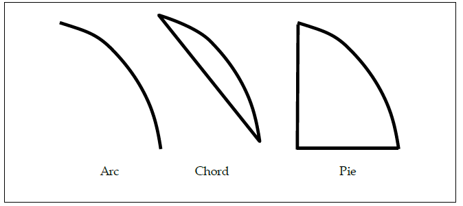

# 17 The VGU Utility Library<a name="chapter17"></a> <a name="The_VGU_Utility_Library"> </a>
For convenience, OpenVG provides an optional utility library known as VGU. Applications may choose whether to link to VGU at compile time; the library is not guaranteed to be present on the run-time platform. VGU is designed so it may be implemented in a portable manner using only the public functionality provided by the OpenVG library. VGU functions may alter the error state of the OpenVG context in which they run (i.e., the value returned by **vgGetError**), but do not otherwise alter the OpenVG state when they complete without generating a `VGU_OUT_OF_MEMORY_ERROR`. VGU functions are defined in a `vgu.h` header file.

#### VGU_VERSION_1_1<a name="VGU_VERSION_1_1"> </a>
Each version of the VGU library will define constants indicating the set of supported library versions. For the current version, the constant `VGU_VERSION_1_1` is defined. The older version `VGU_VERSION_1_0` continues to be defined for backwards compatibility. Future versions will continue to define the constants for all previous versions with which they are backward compatible.

```C
#define VGU_VERSION_1_0 1
#define VGU_VERSION_1_1 2
```

#### VGUErrorCode<a name="VGUErrorCode"> </a>
The `VGUErrorCode` enumeration contains constants specifying possible errors
generated by VGU functions. Any VGU function may return
`VGU_OUT_OF_MEMORY_ERROR`, in which case the function may have caused
changes to the state of OpenVG or to drawing surface pixels prior to failure.

```C
typedef enum {
  VGU_NO_ERROR                = 0,
  VGU_BAD_HANDLE_ERROR        = 0xF000,
  VGU_ILLEGAL_ARGUMENT_ERROR  = 0xF001,
  VGU_OUT_OF_MEMORY_ERROR     = 0xF002,
  VGU_PATH_CAPABILITY_ERROR   = 0xF003,
  VGU_BAD_WARP_ERROR          = 0xF004
} VGUErrorCode;
```

## 17.1 Higher-level Geometric Primitives<a name="Higher-level_Geometric_Primitives"> </a>

The `VGU` library contains functions that allow applications to specify a number of higherlevel geometric primitives to be appended to a path. Each primitive is immediately reduced to a series of line segments, BAⓒzier curves, and arcs. Input coordinates are mapped to input values for the **vgAppendPathData** command by subtracting the path's bias and dividing by its scale value. Coordinates may overflow silently if the resulting values fall outside the range defined by the path datatype.

### 17.1.1 Lines<a name="Lines"> </a>

#### vguLine<a name="vguLine"> </a>
**vguLine** appends a line segment to a path. This is equivalent to the following pseudocode:

```C
LINE(x0, y0, x1, y1):

MOVE_TO_ABS x0, y0
LINE_TO_ABS x1, y1
```

```C
VGUErrorCode vguLine(VGPath path,
    VGfloat x0, VGfloat y0,
    VGfloat x1, VGfloat y1)
```

> _**ERRORS**_
> `VGU_BAD_HANDLE_ERROR`
> - if `path` is not a valid path handle, or is not shared with the current context
>
> `VGU_PATH_CAPABILITY_ERROR`
> - if `VG_PATH_CAPABILITY_APPEND_TO` is not enabled for `path`

### 17.1.2 Polylines and Polygons<a name="Polylines_and_Polygons"> </a>

#### vguPolygon<a name="vguPolygon"> </a>
vguPolygon appends a polyline (connected sequence of line segments) or polygon to a path. This is equivalent to the following pseudo-code:

```C
POLYGON(points, count):
MOVE_TO_ABS points[0], points[1]
for (i = 1; i < count; i++) {
	LINE_TO_ABS points[2*i], points[2*i + 1]
}
if (closed) CLOSE_PATH
```

There are `2*count` coordinates in `points`.

```C
VGUErrorCode vguPolygon(VGPath path,
	const VGfloat * points, VGint count, VGboolean closed)
```

> **ERRORS**
> `VGU_BAD_HANDLE_ERROR`
> - if path is not a valid path handle, or is not shared with the current context
>
> `VGU_PATH_CAPABILITY_ERROR`
> - if `VG_PATH_CAPABILITY_APPEND_TO` is not enabled for `path`
>
> `VGU_ILLEGAL_ARGUMENT_ERROR`
> - if `points` is `NULL`
> - if points is not properly aligned
> - if `count` is less than or equal to 0

### 17.1.3 Rectangles<a name="Rectangles"> </a>

#### vguRect<a name="vguRect"> </a>
The **vguRect** function appends an axis-aligned rectangle with its lower-left corner at `(x, y)` and a given `width` and `height` to a path. This is equivalent to the following pseudo-code:

```C
RECT(x, y, width, height):

MOVE_TO_ABS x, y
HLINE_TO_REL width
VLINE_TO_REL height
HLINE_TO_REL -width
CLOSE_PATH
```

```C
VGUErrorCode vguRect(VGPath path, VGfloat x, VGfloat y,
	VGfloat width, VGfloat height)
```

> **ERRORS**
> `VGU_BAD_HANDLE_ERROR`
> - if path is not a valid path handle, or is not shared with the current context
>
> `VGU_PATH_CAPABILITY_ERROR`
> - if VG_PATH_CAPABILITY_APPEND_TO is not enabled for path
>
> `VGU_ILLEGAL_ARGUMENT_ERROR`
> - if width or height are less than or equal to 0

### 17.1.4 Round-Cornered Rectangles<a name="Round-Cornered_Rectangles"> </a>

#### vguRoundRect<a name="vguRoundRect"> </a>

The **vguRoundRect** function appends an axis-aligned round-cornered rectangle with the lower-left corner of its rectangular bounding box at `(x, y)` and a given `width`, `height`, `arcWidth`, and `arcHeight` to a path. This is equivalent to the following pseudo-code:

```C
ROUNDRECT(x, y, w, h, arcWidth, arcHeight):

MOVE_TO_ABS (x + arcWidth/2), y
HLINE_TO_REL width a€“ arcWidth
SCCWARC_TO_REL arcWidth/2, arcHeight/2, 0, arcWidth/2, arcHeight/2
VLINE_TO_REL height a€“ arcHeight
SCCWARC_TO_REL arcWidth/2, arcHeight/2, 0, -arcWidth/2, arcHeight/2
HLINE_TO_REL -(width a€“ arcWidth)
SCCWARC_TO_REL arcWidth/2, arcHeight/2, 0, -arcWidth/2, -arcHeight/2
VLINE_TO_REL -(height a€“ arcHeight)
SCCWARC_TO_REL arcWidth/2, arcHeight/2, 0, arcWidth/2, -arcHeight/2
CLOSE_PATH
```

If `arcWidth` is less than 0, it is clamped to 0. If `arcWidth` is greater than width, its value is clamped to that of `width`. Similarly, `arcHeight` is clamped to a value between 0 and `height`. The arcs are included even when `arcWidth` and/or `arcHeight` is 0.

> **ERRORS**
> `VGU_BAD_HANDLE_ERROR`
> * if `path` is not a valid path handle, or is not shared with the current context
>
> `VGU_PATH_CAPABILITY_ERROR`
> * if `VG_PATH_CAPABILITY_APPEND_TO` is not enabled for `path`
>
> `VGU_ILLEGAL_ARGUMENT_ERROR`
> * if `width` or `height` is less than or equal to 0


_Figure 28: Round Rectangle parameters_

### 17.1.5 Ellipses<a name="Ellipses"> </a>

#### vguEllipse<a name="vguEllipse"> </a>

**vguEllipse** appends an axis-aligned ellipse to a path. The center of the ellipse is given by `(cx, cy)` and the dimensions of the axis-aligned rectangle enclosing the ellipse are given by width and height. The ellipse begins at `(cx + width/2, cy)` and is stroked as two equal counter-clockwise arcs. This is equivalent to the following pseudo-code:

```
ELLIPSE(cx, cy, width, height):

MOVE_TO_ABS cx + width/2, cy
SCCWARC_TO_REL width/2, height/2, 0, -width, 0
SCCWARC_TO_REL width/2, height/2, 0, width, 0
CLOSE_PATH
```

```C
VGUErrorCode vguEllipse(VGPath path, VGfloat cx, VGfloat cy,
        VGfloat width, VGfloat height)
```

> **ERRORS**
> `VGU_BAD_HANDLE_ERROR`
> * if `path` is not a valid path handle, or is not shared with the current context
>
> `VGU_PATH_CAPABILITY_ERROR`
> * if `VG_PATH_CAPABILITY_APPEND_TO` is not enabled for `path`
>
> `VGU_ILLEGAL_ARGUMENT_ERROR`
> * if `width` or `height` is less than or equal to 0

### 17.1.6 Arcs<a name="Arcs"> </a>

#### VGUArcType<a name="VGUArcType"> </a>

The `VGUArcType` enumeration defines three values to control the style of arcs drawn by the **vguArc** function:
`VGU_ARC_OPEN` - arc segment only
`VGU_ARC_CHORD` - arc, plus line between arc endpoints
`VGU_ARC_PIE`  - arc, plus lines from each endpoint to the ellipse center.


_Figure 29: `VGUArcType` Value_

#### vguArc<a name="vguArc"> </a>
**vguArc** appends an elliptical arc to a path, possibly along with one or two line segments, according to the `arcType` parameter. The `startAngle` and `angleExtent` parameters are given in degrees, proceeding counter-clockwise from the positive X axis. The arc is defined on the unit circle, then scaled by the width and height of the ellipse; thus, the starting point of the arc has coordinates `(x + cos(startAngle)*w/2, y + sin(startAngle)*h/2)` and the ending point has coordinates `(x + cos(startAngle + angleExtent)*w/2, y + sin(startAngle + angleExtent)*h/2)`.
If `angleExtent` is negative, the arc will proceed clockwise; if it is larger than 360 or smaller than -360, the arc will wrap around itself. The following pseudocode illustrates the arc path generation:

```C
ARC(x, y, w, h, startAngle, angleExtent, arcType):

last = startAngle + angleExtent
MOVE_TO_ABS x+cos(startAngle)*w/2, y+sin(startAngle)*h/2
if (angleExtent > 0) {
  angle = startAngle + 180
  while (angle < last) {
    SCCWARC_TO_ABS w/2, h/2, 0, x+cos(angle)*w/2, y+sin(angle)*h/2
    angle += 180
    }
  SCCWARC_TO_ABS w/2, h/2, 0, x+cos(last)*w/2, y+sin(last)*h/2
}
else {
  angle = startAngle a€“ 180
  while (angle > last) {
    SCWARC_TO_ABS w/2, h/2, 0, x+cos(angle)*w/2, y+sin(angle)*h/2
    angle -= 180
  }
  SCWARC_TO_ABS w/2, h/2, 0, x+cos(last)*w/2, y+sin(last)*h/2
}
if arcType == VGU_ARC_PIE
  LINE_TO_ABS x, y
if arcType == VGU_ARC_PIE || arcType == VGU_ARC_CHORD
  CLOSE_PATH
```

```
VGUErrorCode vguArc(VGPath path, VGfloat x, VGfloat y, VGfloat width, VGfloat height,
    VGfloat startAngle, VGfloat angleExtent, VGUArcType arcType)
```

> **ERRORS**
> `VGU_BAD_HANDLE_ERROR`
> * if `path` is not a valid path handle, or is not shared with the current context
>
> `VGU_PATH_CAPABILITY_ERROR`
> * if `VG_PATH_CAPABILITY_APPEND_TO` is not enabled for `path`
>
> `VGU_ILLEGAL_ARGUMENT_ERROR`
> * if `width` or `height` is less than or equal to 0
> * if `arcType` is not one of the values from the `VGUArcType` enumeration


_Figure 30: **VGUArcType** Paramters_

## 17.2 Image Warping<a name="Image_Warping"> </a>
VGU provides three utility functions to compute 3x3 projective transform matrices. The first two compute the transformation from an arbitrary quadrilateral onto the unit square, and vice versa. The third computes the transformation from an arbitrary quadrilateral to an arbitrary quadrilateral. The output transformation is stored into `matrix` as 9 elements in the order _{ sx, shy, w0, shx, sy, w1, tx, ty, w2 }_ (using the nomenclature of Section 6.3).
In all cases, if there is no projective mapping that satisfies the given constraints, or the mapping would be degenerate (i.e., non-invertible), `VGU_BAD_WARP_ERROR` is returned and `matrix` is unchanged.
Formulas for computing projective warps may be found in [HECK89] and [WOLB90].

#### vguComputeWarpQuadToSquare<a name="vguComputeWarpQuadToSquare"> </a>

The **vguComputeWarpQuadToSquare** function sets the entries of matrix to a
projective transformation that maps the point _(sx0, sy0)_ to _(0, 0)_; _(sx1, sy1)_ to _(1, 0)_;
_(sx2, sy2)_ to _(0, 1)_; and _(sx3, sy3)_ to _(1, 1)_. If no non-degenerate matrix satisfies the
constraints, `VGU_BAD_WARP_ERROR` is returned and `matrix` is unchanged.

```C
VGUErrorCode vguComputeWarpQuadToSquare(VGfloat sx0, VGfloat sy0,
      VGfloat sx1, VGfloat sy1,
      VGfloat sx2, VGfloat sy2,
      VGfloat sx3, VGfloat sy3,
      VGfloat * matrix)
```

> **ERRORS**
> `VGU_ILLEGAL_ARGUMENT_ERROR`
> * if `matrix` is NULL
> * if `matrix` is not properly aligned
>
> `VGU_BAD_WARP_ERROR`
> * if no non-degenerate transformation satisfies the constraints
>

#### vguComputeWarpSquareToQuad<a name="vguComputeWarpSquareToQuad"> </a>

The **vguComputeWarpSquareToQuad** function sets the entries of matrix to a projective transformation that maps the point _(0, 0)_ to _(dx0, dy0)_; _(1, 0)_ to _(dx1, dy1)_; _(0, 1)_ to _(dx2, dy2)_; and _(1, 1)_ to _(dx3, dy3)_. If no non-degenerate matrix satisfies the constraints, VGU_BAD_WARP_ERROR is returned and `matrix` is unchanged.

```C
VGUErrorCode vguComputeWarpSquareToQuad(VGfloat dx0, VGfloat dy0,
        VGfloat dx1, VGfloat dy1,
        VGfloat dx2, VGfloat dy2,
        VGfloat dx3, VGfloat dy3,
        VGfloat * matrix)
```

#### vguComputeWarpQuadToQuad<a name="vguComputeWarpQuadToQuad"> </a>
The vguComputeWarpQuadToQuad function sets the entries of matrix to a projective transformation that maps the point _(sx0, sy0)_ to _(dx0, dy0)_; _(sx1, sy1)_ to _(dx1, dy1)_; _(sx2, sy2)_ to _(dx2, dy2)_; and _(sx3, sy3)_ to _(dx3, dy3)_. If no non-degenerate matrix satisfies the constraints, VGU_BAD_WARP_ERROR is returned and matrix is unchanged.

```C
VGUErrorCode vguComputeWarpQuadToQuad(VGfloat dx0, VGfloat dy0,
        VGfloat dx1, VGfloat dy1,
        VGfloat dx2, VGfloat dy2,
        VGfloat dx3, VGfloat dy3,
        VGfloat sx0, VGfloat sy0,
        VGfloat sx1, VGfloat sy1,
        VGfloat sx2, VGfloat sy2,
        VGfloat sx3, VGfloat sy3,
        VGfloat * matrix)
```

> **ERRORS**
>
> `VGU_ILLEGAL_ARGUMENT_ERROR`
> - if `matrix` is NULL
> - if `matrix` is not properly aligned
>
> `VGU_BAD_WARP_ERROR`
> - if no non-degenerate transformation satisfies the constraints

<div style="page-break-after: always;"> </div>


